

    <h3>Universidad Peruana de Ciencias Aplicadas</h3>
    </img> 
    <strong>Ingeniería de Software - 7mo Ciclo</strong> 
    <strong>Diseño de experimentos de Ingeniería de Software</strong> 
    <strong>1ASI0732-4438</strong> 
    <strong>Profesor: Julio Manuel Noriega Melendez</strong> 
     <strong>Report</strong> 
     <strong>AventuraPE</strong> 
    <!--<strong>name startup</strong>-->

<h3> Team Members: </h3>

| Member                              |    Code    |
| :---------------------------------- | :--------: |
| Cama Salvatierra, Jimena Tamara     | u202221518 |
| Castillo Castillo, Jair Alexander   | u202210778 |
| Gutierrez Garcia, Jose Eduardo      | u202211390 |
| Jaque Peña, Estefano Oscar          | u202225466 |
| Quezada Portalatino, Barbara Susana | u202211800 |

<h3 align="center">Abril, 2025</h3>

  

# Registro de Versiones del Informe

El objetivo de esta sección es resumir las modificaciones relevantes que se realizan al informe durante el ciclo de vida del proyecto. Esta sección inicia en una página nueva e incluye un cuadro con la siguiente estructura:

<table>
  <thead>
    <tr>
      <th>Versión</th>
      <th>Fecha</th>
      <th>Autor</th>
      <th>Descripción de modificación</th>
    </tr>
  </thead>
  <tbody>
    <tr>
      <td>0.1</td>
      <td>-</td>
      <td>-</td>
      <td>-</td>
    </tr>
    
  </tbody>
</table>

# Contenido
- [**Student Outcome**](#student-outcome)

## [Capítulo I: Introducción](#capítulo-i-introducción)
- [1.1. Startup Profile](#11-startup-profile)
  - [1.1.1. Descripción de la Startup](#111-descripción-de-la-startup)
  - [1.1.2. Perfiles de integrantes del equipo](#112-perfiles-de-integrantes-del-equipo)
- [1.2. Solution Profile](#12-solution-profile)
  - [1.2.1. Antecedentes y problemática](#121-antecedentes-y-problemática)
  - [1.2.2. Lean UX Process](#122-lean-ux-process)
    - [1.2.2.1. Lean UX Problem Statements](#1221-lean-ux-problem-statements)
    - [1.2.2.2. Lean UX Assumptions](#1222-lean-ux-assumptions)
    - [1.2.2.3. Lean UX Hypothesis Statements](#1223-lean-ux-hypothesis-statements)
    - [1.2.2.4. Lean UX Canvas](#1224-lean-ux-canvas)
- [1.3. Segmentos objetivo](#13-segmentos-objetivo)

## [Capítulo II: Requirements Elicitation & Analysis](#capítulo-ii-requirements-elicitation--analysis)
- [2.1. Competidores](#21-competidores)
  - [2.1.1. Análisis competitivo](#211-análisis-competitivo)
  - [2.1.2. Estrategias y tácticas frente a competidores](#212-estrategias-y-tácticas-frente-a-competidores)
- [2.2. Entrevistas](#22-entrevistas)
  - [2.2.1. Diseño de entrevistas](#221-diseño-de-entrevistas)
  - [2.2.2. Registro de entrevistas](#222-registro-de-entrevistas)
  - [2.2.3. Análisis de entrevistas](#223-análisis-de-entrevistas)
- [2.3. Needfinding](#23-needfinding)
  - [2.3.1. User Personas](#231-user-personas)
  - [2.3.2. User Task Matrix](#232-user-task-matrix)
  - [2.3.3. User Journey Mapping](#233-user-journey-mapping)
  - [2.3.4. Empathy Mapping](#234-empathy-mapping)
  - [2.3.5. As-is Scenario Mapping](#235-as-is-scenario-mapping)
- [2.4. Ubiquitous Language](#24-ubiquitous-language)

## [Capítulo III: Requirements Specification](#capítulo-iii-requirements-specification)
- [3.1. To-Be Scenario Mapping](#31-to-be-scenario-mapping)
- [3.2. User Stories](#32-user-stories)
- [3.3. Product Backlog](#33-product-backlog)
- [3.4. Impact Mapping](#34-impact-mapping)

## [Capítulo IV: Product Design](#capítulo-iv-product-design)
- [4.1. Style Guidelines](#41-style-guidelines)
  - [4.1.1. General Style Guidelines](#411-general-style-guidelines)
  - [4.1.2. Web Style Guidelines](#412-web-style-guidelines)
  - [4.1.3. Mobile Style Guidelines](#413-mobile-style-guidelines)
    - [4.1.3.1. iOS Mobile Style Guidelines](#4131-ios-mobile-style-guidelines)
    - [4.1.3.2. Android Mobile Style Guidelines](#4132-android-mobile-style-guidelines)
- [4.2. Information Architecture](#42-information-architecture)
  - [4.2.1. Organization Systems](#421-organization-systems)
  - [4.2.2. Labeling Systems](#422-labeling-systems)
  - [4.2.3. SEO Tags and Meta Tags](#423-seo-tags-and-meta-tags)
  - [4.2.4. Searching Systems](#424-searching-systems)
  - [4.2.5. Navigation Systems](#425-navigation-systems)
- [4.3. Landing Page UI Design](#43-landing-page-ui-design)
  - [4.3.1. Landing Page Wireframe](#431-landing-page-wireframe)
  - [4.3.2. Landing Page Mock-up](#432-landing-page-mock-up)
- [4.4. Mobile Applications UX/UI Design](#44-mobile-applications-uxui-design)
  - [4.4.1. Mobile Applications Wireframes](#441-mobile-applications-wireframes)
  - [4.4.2. Mobile Applications Wireflow Diagrams](#442-mobile-applications-wireflow-diagrams)
  - [4.4.3. Mobile Applications Mock-ups](#443-mobile-applications-mock-ups)
  - [4.4.4. Mobile Applications User Flow Diagrams](#444-mobile-applications-user-flow-diagrams)
- [4.5. Mobile Applications Prototyping](#45-mobile-applications-prototyping)
  - [4.5.1. Android Mobile Applications Prototyping](#451-android-mobile-applications-prototyping)
  - [4.5.2. iOS Mobile Applications Prototyping](#452-ios-mobile-applications-prototyping)
- [4.6. Web Applications UX/UI Design](#46-web-applications-uxui-design)
  - [4.6.1. Web Applications Wireframes](#461-web-applications-wireframes)
  - [4.6.2. Web Applications Wireflow Diagrams](#462-web-applications-wireflow-diagrams)
  - [4.6.3. Web Applications Mock-ups](#463-web-applications-mock-ups)
  - [4.6.4. Web Applications User Flow Diagrams](#464-web-applications-user-flow-diagrams)
- [4.7. Web Applications Prototyping](#47-web-applications-prototyping)
- [4.8. Domain-Driven Software Architecture](#48-domain-driven-software-architecture)
  - [4.8.1. Software Architecture Context Diagram](#481-software-architecture-context-diagram)
  - [4.8.2. Software Architecture Container Diagrams](#482-software-architecture-container-diagrams)
  - [4.8.3. Software Architecture Components Diagrams](#483-software-architecture-components-diagrams)
- [4.9. Software Object-Oriented Design](#49-software-object-oriented-design)
  - [4.9.1. Class Diagrams](#491-class-diagrams)
  - [4.9.2. Class Dictionary](#492-class-dictionary)
- [4.10. Database Design](#410-database-design)
  - [4.10.1. Relational/Non-Relational Database Diagram](#4101-relationalnon-relational-database-diagram)

## [Capítulo V: Product Implementation](#capítulo-v-product-implementation)
- [5.1. Software Configuration Management](#51-software-configuration-management)
  - [5.1.1. Software Development Environment Configuration](#511-software-development-environment-configuration)
  - [5.1.2. Source Code Management](#512-source-code-management)
  - [5.1.3. Source Code Style Guide & Conventions](#513-source-code-style-guide--conventions)
  - [5.1.4. Software Deployment Configuration](#514-software-deployment-configuration)
- [5.2. Product Implementation & Deployment](#52-product-implementation--deployment)
  - [5.2.1. Sprint Backlogs](#521-sprint-backlogs)
  - [5.2.2. Implemented Landing Page Evidence](#522-implemented-landing-page-evidence)
  - [5.2.3. Implemented Frontend-Web Application Evidence](#523-implemented-frontend-web-application-evidence)
  - [5.2.4. Implemented Native-Mobile Application Evidence](#524-implemented-native-mobile-application-evidence)
  - [5.2.5. Implemented RESTful API and/or Serverless Backend Evidence](#525-implemented-restful-api-andor-serverless-backend-evidence)
  - [5.2.6. RESTful API documentation](#526-restful-api-documentation)
  - [5.2.7. Team Collaboration Insights](#527-team-collaboration-insights)
- [5.3. Video About-the-Product](#53-video-about-the-product)

## [Part II: Verification, Validation & Pipeline](#part-ii-verification-validation--pipeline)

## [Capítulo VI: Product Verification & Validation](#capítulo-vi-product-verification--validation)
- [6.1. Testing Suites & Validation](#61-testing-suites--validation)
  - [6.1.1. Core Entities Unit Tests](#611-core-entities-unit-tests)
  - [6.1.2. Core Integration Tests](#612-core-integration-tests)
  - [6.1.3. Core Behavior-Driven Development](#613-core-behavior-driven-development)
  - [6.1.4. Core System Tests](#614-core-system-tests)
- [6.2. Static testing & Verification](#62-static-testing--verification)
  - [6.2.1. Static Code Analysis](#621-static-code-analysis)
    - [6.2.1.1. Coding standard & Code conventions](#6211-coding-standard--code-conventions)
    - [6.2.1.2. Code Quality & Code Security](#6212-code-quality--code-security)
  - [6.2.2. Reviews](#622-reviews)
- [6.3. Validation Interviews](#63-validation-interviews)
  - [6.3.1. Diseño de Entrevistas](#631-diseño-de-entrevistas)
  - [6.3.2. Registro de Entrevistas](#632-registro-de-entrevistas)
  - [6.3.3. Evaluaciones según heurísticas](#633-evaluaciones-según-heurísticas)
- [6.4. Auditoría de Experiencias de Usuario](#64-auditoría-de-experiencias-de-usuario)
  - [6.4.1. Auditoría realizada](#641-auditoría-realizada)
    - [6.4.1.1. Información del grupo auditado](#6411-información-del-grupo-auditado)
    - [6.4.1.2. Cronograma de auditoría realizada](#6412-cronograma-de-auditoría-realizada)
    - [6.4.1.3. Contenido de auditoría realizada](#6413-contenido-de-auditoría-realizada)
  - [6.4.2. Auditoría recibida](#642-auditoría-recibida)
    - [6.4.2.1. Información del grupo auditor](#6421-información-del-grupo-auditor)
    - [6.4.2.2. Cronograma de auditoría recibida](#6422-cronograma-de-auditoría-recibida)
    - [6.4.2.3. Contenido de auditoría recibida](#6423-contenido-de-auditoría-recibida)
    - [6.4.2.4. Resumen de modificaciones para subsanar hallazgos](#6424-resumen-de-modificaciones-para-subsanar-hallazgos)

## [Capítulo VII: DevOps Practices](#capítulo-vii-devops-practices)
- [7.1. Continuous Integration](#71-continuous-integration)
  - [7.1.1. Tools and Practices](#711-tools-and-practices)
  - [7.1.2. Build & Test Suite Pipeline Components](#712-build--test-suite-pipeline-components)
- [7.2. Continuous Delivery](#72-continuous-delivery)
  - [7.2.1. Tools and Practices](#721-tools-and-practices)
  - [7.2.2. Stages Deployment Pipeline Components](#722-stages-deployment-pipeline-components)
- [7.3. Continuous Deployment](#73-continuous-deployment)
  - [7.3.1. Tools and Practices](#731-tools-and-practices)
  - [7.3.2. Production Deployment Pipeline Components](#732-production-deployment-pipeline-components)
- [7.4. Continuous Monitoring](#74-continuous-monitoring)
  - [7.4.1. Tools and Practices](#741-tools-and-practices)
  - [7.4.2. Monitoring Pipeline Components](#742-monitoring-pipeline-components)
  - [7.4.3. Alerting Pipeline Components](#743-alerting-pipeline-components)
  - [7.4.4. Notification Pipeline Components](#744-notification-pipeline-components)

## [Part III: Experiment-Driven Lifecycle](#part-iii-experiment-driven-lifecycle)

## [Capítulo VIII: Experiment-Driven Development](#capítulo-viii-experiment-driven-development)
- [8.1. Experiment Planning](#81-experiment-planning)
  - [8.1.1. As-Is Summary](#811-as-is-summary)
  - [8.1.2. Raw Material](#812-raw-material-assumptions-knowledge-gaps-ideas-claims)
  - [8.1.3. Experiment-Ready Questions](#813-experiment-ready-questions)
  - [8.1.4. Question Backlog](#814-question-backlog)
  - [8.1.5. Experiment Cards](#815-experiment-cards)
- [8.2. Experiment Design](#82-experiment-design)
  - [8.2.1. Hypotheses](#821-hypotheses)
  - [8.2.2. Measures](#822-measures)
  - [8.2.3. Conditions](#823-conditions)
  - [8.2.4. Scale Calculations and Decisions](#824-scale-calculations-and-decisions)
  - [8.2.5. Methods Selection](#825-methods-selection)
  - [8.2.6. Data Analytics](#826-data-analytics-goals-kpis-and-metrics-selection)
  - [8.2.7. Web and Mobile Tracking Plan](#827-web-and-mobile-tracking-plan)
- [8.3. Experimentation](#83-experimentation)
  - [8.3.1. To-Be User Stories](#831-to-be-user-stories)
  - [8.3.2. To-Be Product Backlog](#832-to-be-product-backlog)
  - [8.3.3. Pipeline-supported Lifecycle](#833-pipeline-supported-experiment-driven-to-be-software-platform-lifecycle)
    - [8.3.3.1. To-Be Sprint Backlogs](#8331-to-be-sprint-backlogs)
    - [8.3.3.2. Landing Page Evidence](#8332-implemented-to-be-landing-page-evidence)
    - [8.3.3.3. Frontend-Web Application Evidence](#8333-implemented-to-be-frontend-web-application-evidence)
    - [8.3.3.4. Native-Mobile Application Evidence](#8334-implemented-to-be-native-mobile-application-evidence)
    - [8.3.3.5. RESTful API Evidence](#8335-implemented-to-be-restful-api-andor-serverless-backend-evidence)
    - [8.3.3.6. Team Collaboration Insights](#8336-team-collaboration-insights)
  - [8.3.4. To-Be Validation Interviews](#834-to-be-validation-interviews)
    - [8.3.4.1. Diseño de Entrevistas](#8341-diseño-de-entrevistas)
    - [8.3.4.2. Registro de Entrevistas](#8342-registro-de-entrevistas)
- [8.4. Experiment Aftermath & Analysis](#84-experiment-aftermath--analysis)
  - [8.4.1. Analysis and Interpretation of Results](#841-analysis-and-interpretation-of-results)
  - [8.4.2. Re-scored and Re-prioritized Question Backlog](#842-re-scored-and-re-prioritized-question-backlog)
- [8.5. Continuous Learning](#85-continuous-learning)
  - [8.5.1. Shareback Session Artifacts](#851-shareback-session-artifacts-learning-workflow)
- [8.6. To-Be Software Platform Pre-launch](#86-to-be-software-platform-pre-launch)
  - [8.6.1. About-the-Product Intro Video](#861-about-the-product-intro-video)

## [Conclusiones y recomendaciones](#conclusiones-y-recomendaciones)
## [Video About-the-Team](#video-about-the-team)
## [Bibliografía](#bibliografía)
## [Anexos](#anexos)

# Student Outcome

| Criterio específico | Acciones realizadas | Conclusiones |
|----|----|----|
|4.c.1 Reconoce responsabilidad ética y profesional en situaciones de ingeniería de software.| **Cama Salvatierra, Jimena Tamara** *TB1*: Reconoció su responsabilidad ética y profesional al diseñar experiencias de usuario tanto móviles como web, asegurando una interfaz accesible, intuitiva y centrada en el usuario final. Su compromiso se evidenció en el desarrollo funcional de la página web y la aplicación móvil, respetando buenas prácticas de diseño y programación. **Castillo Castillo, Jair Alexander** *TB1*:Demostró responsabilidad ética y profesional al implementar la arquitectura del backend y al liderar el despliegue de la solución, priorizando la seguridad, la eficiencia y la escalabilidad. Además, su trabajo en el desarrollo de la web y app móvil se llevó a cabo respetando estándares técnicos y buenas prácticas del software.  **Gutierrez Garcia, Jose Eduardo** *TB1*:Asumió su responsabilidad profesional en la redacción de la introducción, descripción de la startup y el desarrollo web, garantizando que la documentación reflejara claramente la visión, objetivos y valores éticos del proyecto. Su trabajo permitió establecer una base sólida para las decisiones de ingeniería tomadas posteriormente.  **Jaque Peña, Estefano Oscar** *TB1*:Actuó con responsabilidad ética al analizar a los competidores y realizar el needfinding, asegurando que la solución respondiera a necesidades reales de los usuarios. En el desarrollo web, se mantuvo alineado con buenas prácticas técnicas y con una visión orientada al usuario.    **Quezada Portalatino, Barbara Susana** *TB1*:Evidenció responsabilidad ética y profesional en la definición de user stories y el product backlog, priorizando funcionalidades con base en valor para el usuario y viabilidad técnica. Además, su rol en el diseño UX/UI y en el desarrollo de la app móvil se alineó con principios de diseño centrado en el usuario.| TB1:  Como equipo, hemos demostrado un compromiso constante con la responsabilidad ética y profesional a lo largo del desarrollo del proyecto. Cada integrante asumió con seriedad su rol, aplicando buenas prácticas de diseño, desarrollo e investigación en todo momento. Desde la creación de interfaces accesibles hasta la implementación del backend y el despliegue de la solución, nos guiamos por principios de calidad, integridad técnica y respeto hacia los usuarios finales. Esta responsabilidad compartida permitió construir una propuesta coherente, funcional y con propósito, alineada con los estándares de la ingeniería de software..|

| Criterio específico | Acciones realizadas | Conclusiones |
|----|----|----|
|4.c.2 Emite juicios informados considerando el impacto de las soluciones de ingeniería de software en contextos globales, económicos, ambientales y sociales| **Cama Salvatierra, Jimena Tamara** *TB1*: Emitió juicios informados al considerar cómo el diseño UX/UI de la plataforma impactaría a nivel social, promoviendo una interacción amigable y accesible. Su enfoque de diseño tuvo en cuenta la diversidad de usuarios, contribuyendo a una solución inclusiva en un contexto digital cada vez más relevante globalmente. **Castillo Castillo, Jair Alexander** *TB1*: Emitió juicios informados al utilizar impact mapping para evaluar escenarios futuros, considerando cómo las decisiones técnicas afectarían al entorno social y económico del proyecto. Su enfoque integral permitió al equipo alinear los objetivos técnicos con el impacto real en la comunidad objetivo. **Gutierrez Garcia, Jose Eduardo** *TB1*: Emitió juicios informados al plasmar el enfoque Lean UX dentro del documento, mostrando cómo las decisiones centradas en el usuario impactan positivamente en el ámbito social y económico. Su contribución ayudó a guiar el desarrollo con una mirada estratégica y empática. **Jaque Peña, Estefano Oscar** *TB1*: Emitió juicios informados al identificar oportunidades de diferenciación basadas en el análisis del mercado y las necesidades detectadas, lo cual permitió diseñar una solución con impacto social positivo. Su enfoque estratégico buscó maximizar la utilidad y sostenibilidad del producto.  **Quezada Portalatino, Barbara Susana** *TB1*: Emitió juicios informados al estructurar las funcionalidades considerando el contexto social del proyecto y su accesibilidad, contribuyendo a una solución inclusiva y orientada a mejorar la experiencia del usuario. Su visión de diseño equilibró impacto social y eficiencia técnica.| TB1:  Durante el desarrollo del proyecto, tomamos decisiones basadas en un análisis consciente del entorno y del impacto que nuestra solución podría generar. Consideramos cómo nuestras decisiones de diseño y desarrollo podían influir en los usuarios a nivel social y económico, priorizando la accesibilidad, inclusión y usabilidad de la plataforma. Herramientas como el impact mapping y el enfoque Lean UX nos ayudaron a alinear la tecnología con las necesidades reales del contexto. Esto nos permitió emitir juicios informados que equilibran la viabilidad técnica con la responsabilidad social, promoviendo una solución sostenible y con impacto positivo.|

# Capítulo I: Introducción

## 1.1. Startup Profile
### 1.1.1. Descripción de la Startup  

"AventuraPe" es una innovadora aplicación móvil diseñada para revolucionar la forma en que las personas descubren y disfrutan experiencias únicas y emocionantes en su entorno cotidiano. Nuestra aplicación móvil ofrece micro aventuras personalizadas que se adaptan a las preferencias individuales y grupales, eliminando la necesidad de una planificación exhaustiva o inversiones significativas de tiempo y recursos. En un mundo donde la rutina y la monotonía pueden opacar el sentido de exploración y diversión, AventuraPe surge como una solución integral que conecta a los usuarios con actividades y experiencias locales únicas. Utilizando tecnología avanzada de geolocalización y un diseño centrado en el usuario, facilitamos el acceso a una amplia gama de opciones de entretenimiento que fomentan la espontaneidad y el descubrimiento constante.

Nuestro enfoque se fundamenta en tres pilares esenciales: Optimización de tiempo, comodidad y conexión con la comunidad local. A través de AventuraPe, redefinimos la experiencia de entretenimiento y exploración, brindando a las personas la oportunidad de enriquecer sus vidas cotidianas con momentos memorables y significativos, mientras impulsamos el crecimiento y la visibilidad de negocios locales que ofrecen propuestas únicas y valiosas.

- **Misión:** Empoderar a las personas para que descubran y vivan experiencias únicas y enriquecedoras en su entorno cotidiano, facilitando el acceso a micro aventuras personalizadas que fomenten la exploración, la diversión y la conexión con la comunidad local. Buscamos ser el puente que une a los usuarios con oportunidades de entretenimiento auténticas, promoviendo la espontaneidad y la alegría en la vida diaria.

- **Visión:** Aspiramos a ser la aplicación móvil líder a nivel nacional en la promoción y facilitación de experiencias locales únicas, transformando la manera en que las personas interactúan con su entorno y contribuyendo al desarrollo sostenible de comunidades vibrantes y conectadas.

### 1.1.2. Perfiles de integrantes del equipo  

|Photo|Description|
|:------------------------------------------------: | :-------------------------: |
|  |  Mi Nombre es Jimena Cama, soy estudiante de la carrera de Ingeniería de Software en la UPC y actualmente estoy cursando el 7mo ciclo. Me considero una persona curiosa, determinada y organizada. Con la experiencia en proyectos de startup y trabajos en equipo, trabajaré junto a mis compañeros para lograr un óptimo resultado del proyecto..  |
|   | Mi nombre es Jair Castillo, soy estudiante de la carrera de Ingeniería de Software en la UPC y me encuentro en el 7to ciclo. Me considero una persona dedicada, comprensiva y metódica. Con mis habilidades de liderazgo y mi capacidad para trabajar en equipo en un ambiente de respeto, estoy segura de que podré dirigir la implementación de la startup de nuestro proyecto de manera exitosa.                                                                      |
|   | Mi nombre es Jose Gutierrez, tengo 20 años, actualmente me encuentro cruzando mi 7mo ciclo de la carrera de ingeniería de software en la UPC. Me gusta jugar videojuegos y practicar natación, soy un gran aficionado de la tecnología y del ensamblaje de computadoras. Me considero una persona dispuesta siempre a aprender tecnologías nuevas, creativa y responsable. |
|    |  Soy Estefano Oscar Jaque Peña, tengo 23 años y soy estudiante de la carrera de Ingeniería de Software, una disciplina enfocada en el diseño, desarrollo y gestión de software para solucionar problemas complejos. Desde temprana edad, he sentido fascinación por la tecnología y he buscado aprender constantemente sobre las últimas tendencias en programación. He ampliado mis conocimientos a través de cursos en Python, SQL, y C++, así como también explorando otros lenguajes de programación por mi cuenta. Además, tengo habilidades en el uso avanzado de Excel para análisis de datos y gestión de información. Mi experiencia trabajando en equipos me ha brindado habilidades de comunicación y colaboración que considero fundamentales para contribuir de manera efectiva a proyectos innovadores en el área de la Ingeniería de Software. 
| | Barbara Susana Quezada Portalatino, cursando el séptimo ciclo de la carrera de software, trabajo mayormente bajo un rol de líder que me ayuda a poder organizar no solo la ideas de mi grupo sino que las ideas aterricen en la ejecución. Soy una persona muy disciplinada y detallista. 
|    |

## 1.2. Solution Profile

### 1.2.1. Antecedentes y problemática

Antecedentes: En la era actual, las personas buscan constantemente nuevas formas de entretenimiento que no requieran una planificación extensa ni grandes inversiones de tiempo. Las aplicaciones móviles han facilitado la exploración de experiencias locales, pero a menudo están orientadas hacia un público que prefiere planificar con antelación o que busca actividades más tradicionales.
Problemática: Existe un vacío en el mercado para aquellos usuarios que desean experiencias espontáneas y únicas, ajustadas a su disponibilidad de tiempo. Muchas aplicaciones actuales no ofrecen suficiente personalización o sorpresas en sus recomendaciones, lo que lleva a una experiencia monótona y predecible. Además, los negocios locales no siempre tienen una plataforma eficiente para atraer a estos usuarios espontáneos y promocionar sus servicios de manera innovadora y atractiva.

#### Uso de la técnica The 5'W's w Y 2'H's

| LAS 5W y 2H | Pregunta   | Descripción    |
| ----------- | ------------------------------------------------------- | ----------------------------------------------------------------------------- |
| What?        | ¿Cuál es el problema?                                     | Muchas personas desean vivir experiencias nuevas y emocionantes sin necesidad de planear mucho, pero actualmente no existen aplicaciones que ofrezcan micro aventuras espontáneas, personalizadas y accesibles en su entorno local. Las plataformas disponibles son rígidas, repetitivas y no fomentan la sorpresa ni el descubrimiento. Además, los negocios locales no tienen canales efectivos para atraer a este tipo de público espontáneo.                                                                                                                  |
| When?       | ¿Cuándo sucede el problema?                                   | El problema ocurre en momentos libres no planificados, como fines de semana, tardes libres, pausas del trabajo o incluso durante viajes cortos, cuando las personas desean hacer algo diferente pero no saben qué ni dónde.                                                                                                                                                                                                            |
| Where?       | ¿Dónde sucede el problema?                             | En áreas urbanas y semiurbanas, especialmente en ciudades donde hay muchas opciones de entretenimiento, pero poca visibilidad sobre experiencias originales, poco convencionales o fuera del circuito turístico/comercial habitual.                                                                                                                                            |
| Why?      | ¿Por qué sucede el problema?                               | Porque las aplicaciones actuales están orientadas a planes estructurados, no aprovechan la espontaneidad ni se adaptan de forma dinámica al tiempo libre real de las personas. Tampoco brindan una experiencia gamificada o personalizada que invite a explorar lo inesperado en el entorno cercano.                                                                                                                                                                                        |
| Who?        | ¿Qué llevara a las personas a usar nuestro producto?                         | Personas jóvenes, adultos y grupos de amigos que buscan aventuras rápidas, originales y sin complicaciones. También empresas locales que quieren atraer a este tipo de público con propuestas únicas y divertidas. Los usuarios valorarán la personalización, la facilidad de uso, la sorpresa y la posibilidad de compartir sus aventuras. 
| How?        | ¿En qué condiciones los clientes usaran nuestro producto?     | Los usuarios abrirán la app cuando tengan tiempo libre y quieran hacer algo diferente, sin necesidad de investigar o planear. Usarán AventuraPe para descubrir en tiempo real qué pueden hacer cerca según sus preferencias, el clima, su presupuesto o el tiempo disponible. 
| How Much?   | ¿Con qué frecuencia o en qué cantidad se utilizará nuestro producto? |  La app puede ser usada varias veces por semana, especialmente en momentos de ocio o fines de semana. La frecuencia dependerá de la variedad y frescura de las recomendaciones. Se espera una alta recurrencia si se incluye un sistema de recompensas, gamificación o retos por zonas exploradas.
|

### 1.2.2. Lean UX Process  
#### 1.2.2.1. Lean UX Problem Statements 

En la vida moderna, muchas personas se sienten atrapadas en la rutina diaria y buscan activamente experiencias nuevas y emocionantes para revitalizar su día a día. Sin embargo, a menudo se encuentran con el obstáculo de la falta de tiempo, energía, o motivación para planificar actividades que requieren organización previa. Al mismo tiempo, las empresas locales, especialmente las pequeñas y medianas, enfrentan una fuerte competencia en un mercado saturado y luchan por atraer nuevos clientes, así como por diferenciarse de otras ofertas disponibles en su área.

Como resultado de estas barreras, muchas personas permanecen ajenas a las numerosas oportunidades de aventura y experiencias únicas que existen en su propio entorno, perdiéndose la posibilidad de disfrutar de lo que está a su alcance sin una planificación extensa. Paralelamente, las empresas locales, que podrían beneficiarse significativamente de atraer a estos usuarios, no logran conectar de manera efectiva con ellos, lo que limita su capacidad de destacarse y crecer en un mercado altamente competitivo.

Nuestra app, AventuraPe, surge como una solución integral que facilita tanto el descubrimiento como la participación en micro aventuras cercanas, personalizadas y accesibles para los usuarios. Además, proporciona a las empresas locales una plataforma eficiente para ofrecer experiencias únicas, promociones exclusivas, y atraer a clientes que buscan actividades novedosas y diferentes en su entorno inmediato. A través de una interfaz amigable y herramientas de geolocalización, AventuraPe conecta a las personas con las aventuras disponibles cerca de ellos, al mismo tiempo que permite a las empresas locales destacar y captar nuevos clientes.
¿Cómo podemos crear una aplicación móvil que, mediante una integración eficaz de funcionalidades y un enfoque centrado en la experiencia del usuario, permita a las personas descubrir y disfrutar fácilmente de micro aventuras personalizadas en su entorno, al mismo tiempo que ayuda a las empresas locales a atraer nuevos clientes, diferenciarse en el mercado, y ofrecer experiencias auténticas y diferenciadas?

#### 1.2.2.2. Lean UX Assumptions  

 <u>**Business Assumptions:**</u>
1.	Creo que nuestros clientes tienen la necesidad de descubrir y participar en microaventuras locales espontáneas.
2.	Estas necesidades se pueden resolver con una aplicación móvil que ofrezca sugerencias de actividades personalizadas basadas en la ubicación y otros filtros.
3.	Nuestros clientes iniciales son adultos jóvenes y grupos de amigos que buscan experiencias divertidas.
4.	El valor n.° 1 que un cliente quiere obtener de nuestro servicio es un acceso fácil a experiencias locales únicas sin una planificación extensa.
5.	El cliente también puede obtener estos beneficios adicionales: conexiones sociales, promociones especiales, descubrimiento de negocios locales y espontaneidad en su rutina.
6.	Adquiriremos la mayoría de nuestros clientes a través del marketing en redes sociales y asociaciones con empresas locales.
7.	Ganaremos dinero cobrando por comisión de 
8.	Nuestra principal competencia en el mercado serán las aplicaciones de aventuras tradicionales y las plataformas de listados de eventos locales.
9.	Los superaremos gracias a nuestro enfoque único en micro aventuras y descuentos por colaboración.
10.	El mayor riesgo de nuestro servicio es que los usuarios no confíen en las sugerencias de aventuras aleatorias o las utilicen.
11.	Resolveremos esto mediante un sistema de calificación sólido, agregando comentarios y rating que los mismos usuarios pueden hacer en la aplicación.
12.	¿Qué otras suposiciones tenemos que, si se demuestra que son falsas, harán que nuestro negocio/proyecto fracase? Si las empresas locales no interactúan con la plataforma para ofrecer experiencias, o, si los usuarios o comentan/califican las aventuras de cada local.

 <u>**User assumptions:**</u>
1.	¿Quién es el usuario? Adultos jóvenes y grupos de amigos de entre 18 y 45 años que buscan nuevas experiencias.
2.	¿Dónde encaja nuestro producto en su trabajo o vida? Como herramienta para la toma de decisiones espontáneas y para romper con la rutina.
3.	¿Qué problemas resuelve nuestro producto? La falta de ideas para actividades, la planificación que requiere mucho tiempo y el deseo de vivir nuevas experiencias.
4.	¿Cuándo y cómo se utiliza nuestro producto? En movimiento, cuando los usuarios tienen tiempo libre y buscan algo que hacer.
5.	¿Qué características son importantes? Filtros personalizados, sugerencias basadas en la geolocalización y el botón "Sorpréndeme".
6.	¿Cómo debería verse y comportarse nuestro producto? Intuitivo, visualmente atractivo, con acceso rápido a sugerencias de aventuras.

#### 1.2.2.3. Lean UX Hypothesis Statements  

Creemos que los usuarios desean microaventuras locales espontáneas sin una planificación exhaustiva. Sabremos que tenemos razón cuando veamos una tasa de participación del 40 % con la función "Sorpréndeme" dentro del primer mes de lanzamiento o comentarios positivos de los usuarios que citen la facilidad para encontrar actividades como un beneficio clave.
Creemos que las empresas locales participarán activamente en la publicación de actividades en nuestra plataforma. Sabremos que tenemos razón cuando veamos que al menos 100 empresas se registran y publican actividades dentro de los primeros tres meses.
Creemos que las sugerencias de actividades personalizadas basadas en la ubicación generarán una mayor satisfacción del usuario. Sabremos que tenemos razón cuando veamos una calificación promedio de los usuarios de 4,5/5 estrellas para las actividades sugeridas.
Creemos que nuestra aplicación ayudará a las empresas locales a aumentar su base de clientes. Sabremos que estamos en lo cierto cuando veamos que las empresas participantes informan un aumento del 15 % en nuevos clientes atribuidos a nuestra aplicación en los primeros seis meses o testimonios positivos de los propietarios de empresas sobre el impacto de nuestra plataforma.

#### 1.2.2.4. Lean UX Canvas  

<table border="1" cellpadding="10" cellspacing="0">
    <tr>
        <td><strong>Lean UX Canvas</strong></td>
        <td><strong>Fecha:</strong> 14/04/2025</td>
        <td><strong>Primera Iteración</strong></td>
    </tr>
    <tr>
        <td>
            <strong>Business Problem</strong> 
             - A las personas les cuesta encontrar y participar en actividades locales espontáneas. 
             - Las empresas locales tienen dificultades para atraer nuevos clientes. 
             - Las soluciones existentes no se adaptan a las microaventuras ni a la planificación espontánea.
        </td>
        <td>
            <strong>Solutions</strong> 
            - Aplicación móvil con sugerencias de actividades basadas en la geolocalización. 
            - Filtros personalizados (tipo, duración, costo). 
            - Botón "Sorpréndeme" para aventuras aleatorias. 
            - Plataforma para que las empresas publiquen actividades. 
            - Sistema de calificación y comentarios de usuarios.
        </td>
        <td>
            <strong>Business Outcomes</strong> 
            - Aumentar la participación de los usuarios en las actividades locales. 
            - Impulsar la visibilidad de las empresas locales y la base de clientes. 
            - Lograr altos índices de retención y satisfacción de los usuarios.
        </td>
    </tr>
    <tr>
        <td>
            <strong>Users</strong> 
            - Adultos jóvenes (18-45) que buscan nuevas experiencias. 
            - Grupos de amigos que buscan actividades compartidas. 
            - Empresas locales que ofrecen actividades o experiencias. 
        </td>
        <td>
            <strong>Hypotheses</strong> 
            - Los usuarios desean microaventuras locales espontáneas sin una planificación extensa. 
            - Las empresas locales participarán activamente en la publicación de actividades.  
            - Las sugerencias personalizadas basadas en la ubicación generarán una mayor satisfacción del usuario  
        </td>
        <td>
            <strong>User Outcomes & Benefits</strong> 
            - Mayor espontaneidad y novedad en la vida diaria.  
            - Conexión social a través de experiencias compartidas.
        </td>
    </tr>
    <tr>
        <td>
            <strong>What's the most important thing we need to learn first?</strong> 
            - Validar la demanda de microaventuras locales espontáneas. 
            - Confirmar la voluntad de las empresas locales de participar.
        </td>
        <td colspan="2">
            <strong>What's the least amount of work we need to do to learn the next most important?</strong> 
            - Realizar entrevistas y encuestas a usuarios potenciales y empresas locales.  
            - Desarrollar un prototipo de baja fidelidad para pruebas de usuario.
        </td>
    </tr>
</table>

## 1.3. Segmentos objetivo 

Para realizar un análisis concreto sobre los segmentos objetivo de AventuraPe, es importante profundizar en las características de cada grupo:

1.	**Empresas Locales**  

a.	*Descripción:*   Las empresas locales son negocios que buscan atraer a una audiencia más amplia y diversa mediante la promoción de sus servicios y la oferta de experiencias únicas a través de la aplicación móvil AventuraPe. Estas empresas se benefician de la visibilidad que les proporciona la app, ayudándolas a destacar frente a la competencia y a conectar con una comunidad más amplia.    
b.	*Características demográficas:*  
Principalmente ubicadas en áreas urbanas, suburbanas y zonas turísticas que reciben un flujo constante de residentes y visitantes. Entre ellas pueden ser los cafés, restaurantes, tiendas de artesanía y centros de entretenimiento.   

2.	**Usuarios**  

a.	*Descripción:*   Los usuarios de AventuraPe son personas y grupos que buscan enriquecer su tiempo libre con experiencias diferentes y emocionantes, sin la necesidad de una planificación compleja. Son individuos interesados en explorar su entorno de manera espontánea y descubrir nuevas actividades que se ajusten a sus intereses y horarios.   
b.	*Características demográficas:*   Principalmente jóvenes adultos entre 18 y 35 años, aunque también incluye a adultos de mediana edad que buscan nuevas formas de entretenimiento.  

  
# Capítulo II: Requirements Elicitation & Analysis

## 2.1. Competidores  
### 2.1.1. Análisis competitivo  
Este análisis proporciona una visión detallada del panorama competitivo, destacando las áreas clave donde AventuraPe puede diferenciarse y ofrecer un valor único a sus clientes. 

|**Competitive analysis Landscape** |||||||
| - | :- | :- | :- | :- | :- |:-|
|¿Por qué llevar a cabo este análisis? |Permite a AventuraPe entender mejor el mercado en el que opera, identificar las fortalezas y debilidades de sus competidores, y desarrollar estrategias que permitan diferenciarse y ofrecer un valor superior a los clientes. |||||
|||
 AventuraPe 

|
Eventbrite 

|
All Events in City 

|
TickPick 

|
Meetup 

||
|Perfil |Overview |App de microaventuras espontáneas y personalizadas, conectando usuarios con experiencias locales únicas.|Una plataform a global que permite a los organizad ores de eventos planificar, promocionar y vender entradas para sus eventos, así como gestionar la asistencia. |Una plataforma que ayuda a los usuarios a descubrir eventos en su ciudad, ofreciendo una amplia lista de actividades que incluyen conciertos, talleres, festivales y más.|
Un mercado en línea para la compra y venta de entradas a eventos deportivos, conciertos y otros espectáculos. TickPick se distingue por no cobrar tarifas adicionales a los comprador es.
|Una plataform a que conecta a personas con intereses similares a través de eventos y reuniones en persona. |
||Ventaja competitiva

 ¿Qué valor ofrece a los clientes? |Enfoque en espontaneidad, gamificación, y conexión con negocios locales mediante experiencias personalizadas.|Amplia cobertura de eventos, herramien tas robustas para organizad ores, y una plataform a global reconocid a que facilita la promoció n y venta de entradas.|Proporciona una guía completa de eventos locales, permitiendo a los usuarios explorar y participar en actividades cerca de ellos sin necesidad de una planificación extensa. |Ofrece una experiencia de compra transparent e sin tarifas ocultas, lo que atrae a comprador es de entradas que buscan evitar costos adicionales. |Facilita la creación y participac ión en comunida des locales basadas en intereses comunes, fomentan do la interacció n y las conexion es personale s. </td></tr>
|Perfil de marketing|Mercado Objetivo |Jóvenes adultos (18-45 años) y grupos que buscan experiencias rápidas, únicas y sin planificación.|Organizadores de eventos de todos los tamaños, desde pequeñas reuniones hasta grandes conferencias y festivales.|Residentes urbanos y turistas que desean descubrir y participar en eventos y actividades locales.|Aficionados a los deportes, la música y el entretenimiento en vivo que buscan entradas a eventos sin cargos adicionales.|Personas que buscan conectar con otros que comparten intereses similares.|
||Estrategias de marketing|Alianzas con negocios locales, marketing en redes sociales (ej. TikTok/Instagram) y gamificación (recompensas por explorar).Alianzas con negocios locales, marketing en redes sociales (ej. TikTok/Instagram) y gamificación (recompensas por explorar).|Enfocada en la colaboración con organizadores de eventos y asociaciones con plataformas de redes sociales|Utiliza SEO local (Optimización para Motores de Búsqueda) y publicidad en redes sociales para atraer a usuarios que buscan actividades en su área.|Se apoya en campañas de marketing digital dirigidas a fanáticos de eventos en vivo.|Se basa en la creación de contenido generado por usuarios y el boca a boca, aprovechando la viralidad de las comunidades.|
|Perfil del producto	|Productos & Servicios	|Microaventuras personalizadas, filtros por tiempo/presupuesto, botón "Sorpréndeme", y sistema de rating para negocios.|Venta de entradas y herramientas de marketing.| 	Listado de eventos locales, recomendaciones personalizadas, y herramientas para descubrir nuevas actividades.|	Plataforma de compra y venta de entradas con precios transparentes, comparaciones de precios.|	Gestión de eventos y comunidad online.|
|| Canales de distribución  (Web y/o Móvil)                   |Web y app móvil (iOS y Android).| Web y app móvil (iOS y Android).|Web y app móvil (iOS y Android).|Web y app móvil (iOS y Android).|Web y app móvil (iOS y Android).|
| Análisis SWOT| Fortalezas|Diferenciación con experiencias espontáneas, gamificación y apoyo a negocios locales.|Amplia presencia global, herramientas completas para organizadores.	|Enfoque local, cobertura amplia de eventos.	|Precios transparentes, sin cargos adicionales.|	Red activa de comunidades, alta interacción entre usuarios.|
|| Debilidades|Dependencia de la participación activa de negocios locales y adopción inicial de usuarios.| Dependencia de grandes eventos para ingresos significativos.|	Limitada capacidad de atracción para eventos masivos.|	Menor visibilidad frente a competidores más grandes.|	Competencia con redes sociales para la creación de comunidades.|
|| Oportunidades|Crecimiento de la demanda por experiencias "quick & unique" y alianzas con municipios para promoción.| Expansión a nuevos mercados, colaboración con grandes eventos| Mayor enfoque en el turismo local y las experiencias personalizadas.| Aumento de la demanda para eventos en vivo post-pandemia.| Crecimiento en eventos virtuales.|
|| Amenazas| Competencia de apps de planificación tradicionales (ej. Google Things to Do).|Competencia de plataformas de redes sociales y eventos gratuitos.| Competencia de nuevas plataformas locales con enfoques similares. | Competencia de revendedores de entradas y plataformas de tickets oficiales.  | Cambios en las tendencias de consumo de eventos. |               

### 2.1.2. Estrategias y tácticas frente a competidores  
Fortalezas de la App:  
•	Personalización en tiempo real basada en la ubicación y preferencias.  
•	Sorpresa y novedad como valor diferencial.  
•	Colaboración con negocios locales para ofertas y descuentos exclusivos.  
Debilidades a Superar:  
•	Dependencia de la participación activa de empresas locales.  
•	Necesidad de construir una base de usuarios que confíen en la app para experiencias espontáneas.  
Oportunidades:  
•	Aumento en la demanda de experiencias locales y únicas.  
•	Creciente interés en actividades que no requieren planificación.  
Amenazas:  
•	Competencia de otras apps que ofrecen servicios similares pero con un enfoque diferente.  
•	Cambios en las restricciones locales que pueden afectar la disponibilidad de ciertas actividades.  
Tácticas:  
1.	Alianzas estratégicas: Establecer relaciones con empresas locales para asegurar contenido exclusivo y descuentos.  
2.	Marketing dirigido: Enfocar campañas en redes sociales y anuncios en áreas urbanas con alta densidad de usuarios.  
3.	Diferenciación: Resaltar la capacidad de sorprender y ofrecer experiencias únicas, a diferencia de otras apps que solo listan actividades estándar.  
  
## 2.2. Entrevistas  

### 2.2.1. Diseño de entrevistas  
Para el segmento de Usuarios:  
1. Sobre la experiencia del usuario:  
   - ¿Cómo decides qué actividades realizar en tu tiempo libre?  
   - ¿Qué factores son más importantes al elegir una actividad espontánea?  
   - ¿Cómo influye la cercanía geográfica en tus decisiones de actividades?  
   - ¿Cómo prefieres recibir sugerencias para actividades? (Filtros, recomendaciones, etc.)  
   - ¿Qué tan seguido utilizas aplicaciones móviles para descubrir nuevas experiencias?  
2. Sobre la interacción con la app:  
   - ¿Qué funcionalidades te gustaría encontrar en una aplicación que sugiere actividades?  
   - ¿Cómo influye la personalización en tu decisión de usar una aplicación para explorar actividades?  
   - ¿Qué tan importante es para ti la simplicidad y facilidad de uso en una aplicación móvil? 
   - ¿Cuáles son las principales dificultades que enfrentas al utilizar apps para planificar actividades?  
   - ¿Qué tipo de notificaciones o recordatorios consideramos útiles para mejorar tu experiencia?  
 3. Sobre la disposición a pagar:  
   - ¿Qué características consideras valiosas para pagar por una suscripción en la app?  
   - ¿Qué tipo de beneficios adicionales te incentivarán a pagar por experiencias en una app de aventuras?  
   - ¿Cuánto estarías dispuesto a pagar por acceder a actividades personalizadas o exclusivas?  
     
Para el segmento de Empresas Locales:  
1. Sobre la promoción del negocio:  
   - ¿Qué estrategias utilizas actualmente para promocionar tu negocio a nivel local?  
   - ¿Qué tan efectivas consideramos las redes sociales para atraer nuevos clientes?  
   - ¿Qué factores te motivarían a utilizar una aplicación para promocionar actividades o eventos de tu negocio?  
   - ¿Cómo evalúas la efectividad de las promociones y descuentos en tu negocio?  
2. Sobre la participación en la app:  
   - ¿Qué tipo de actividades o promociones te gustaría ofrecer a través de una aplicación de micro aventuras?  
   - ¿Qué esperas de una plataforma que conecte a usuarios con negocios locales?  
   - ¿Qué tan importante es la posibilidad de recibir feedback de los usuarios sobre tus actividades?  
   - ¿Cómo influiría en tu negocio poder ofrecer descuentos o promociones exclusivas a través de una app?  
 3. Sobre la satisfacción del cliente:  
   - ¿Qué tipo de experiencias te gustaría brindar para atraer a más clientes?   
   - ¿Cómo crees que una plataforma digital podría mejorar la interacción con tus clientes?  
   - ¿Qué tipo de recompensas o programas de lealtad estarías dispuesto a implementar para retener a clientes?

### 2.2.2. Registro de entrevistas  

**Segmento de aventureros**  

1. 
- **Entrevistado**: Salvador Diaz Aguirre
- **Duración**: 2.50
- **Resumen**: El entrevistado indicó que suele buscar actividades para realizar a través de redes sociales como Instagram y TikTok, especialmente cuando planea salir con amigos, lo cual ocurre al menos una vez por semana. Señaló que la simplicidad de la plataforma es un aspecto clave, ya que prefiere no invertir demasiado tiempo en planear qué hacer. Además, destacó la importancia de los comentarios y calificaciones de otros usuarios, ya que estos le permiten obtener diferentes perspectivas y tomar decisiones más informadas sobre las experiencias disponibles.
- **Link**: 
[https://drive.google.com/file/d/1ce04nBqyOjyxaB6vpfY9SCI-2bd2Y6M8/view?usp=sharing](https://drive.google.com/file/d/1ce04nBqyOjyxaB6vpfY9SCI-2bd2Y6M8/view?usp=sharing)
  

2.  
- **Entrevistado**: Diego Salinas
- **Duración**: 3.03
- **Resumen**: El entrevistado, un joven de 20 años de Callao, opina sobre la startup Aventura P, una plataforma donde empresas y emprendedores pueden crear y compartir actividades. Él la describe como un tipo de "Facebook de aventuras" donde los usuarios podrían buscar planes . En cuanto a sus propios intereses para encontrar nuevas actividades, menciona que le gustaría algo cercano, vinculado a la actividad física y los deportes extremos que le generen adrenalina, valorando especialmente la proximidad del lugar.

- **Link**: 
[https://drive.google.com/file/d/1ce04nBqyOjyxaB6vpfY9SCI-2bd2Y6M8/view?usp=sharing](https://drive.google.com/file/d/10eVCj7I82mNq8Ye0QHmL6lae7SKMdXty/view?usp=sharing)
  

3. 
- **Entrevistado**: Sebastian Cachis
- **Duración**: 4.24
- **Resumen**: El entrevistado, Sebastián Nicolás Cachi González, de 20 años y residente del distrito de San Miguel, compartió que en su tiempo libre disfruta principalmente de salir, ya sea a caminar, pasear o realizar actividades como ir de compras, consumir servicios de entretenimiento o reunirse con amigos. Señaló que estaría abierto a hacer cosas nuevas si recibe una invitación o si se le presenta la oportunidad.
- **Link**: 
[https://drive.google.com/file/d/1ce04nBqyOjyxaB6vpfY9SCI-2bd2Y6M8/view?usp=sharing](https://drive.google.com/file/d/1auAbtxfxbmQmkZEBzCa8vFG4sR9X2c8P/view?usp=sharing)
  

4. 
- **Entrevistado**: Pamela Vela
- **Duración**: 4.30
- **Resumen**: Pamela Vela, estudiante universitaria de 22 años, valora actividades en su tiempo libre que ofrezcan exclusividad, innovación o beneficios como promociones y lanzamientos de productos. Prefiere recomendaciones personalizadas y usa apps móviles con frecuencia para descubrir eventos, destacando la importancia de filtros como "muestras gratis" o "solo con invitación". Busca en una app funcionalidades como alertas, mapas interactivos y secciones de tendencias, priorizando la simplicidad y personalización. Estaría dispuesta a pagar una suscripción (5−15 dolares mensuales) por acceso anticipado a eventos exclusivos, descuentos o experiencias VIP, siempre que el valor sea claro. La cercanía geográfica es relevante, pero no determinante si la actividad lo merece.
- **Link**: 
[https://drive.google.com/file/d/1TlYYeQKX9zZIUYuLcDEvXlYT-2N0NyCB/view?usp=sharing](https://drive.google.com/file/d/1TlYYeQKX9zZIUYuLcDEvXlYT-2N0NyCB/view?usp=sharing)
  

**Segmento de emprendedores**

1.
- **Entrevistado**: Fabián Castro Lujan-Ripoll
- **Duración**: 4.16
- **Resumen**: El entrevistado indicó que actualmente utiliza anuncios en Facebook e Instagram como parte de su estrategia de marketing, destacando que las redes sociales son fundamentales para la visibilidad de su emprendimiento. Además, expresó interés en contar con una plataforma que le permita ajustar su estrategia de marketing mediante la realización de eventos. Finalmente, mencionó que los comentarios y calificaciones de los usuarios generarían mayor confianza en las personas para asistir a los eventos que organiza.
- **Link**: [https://drive.google.com/file/d/1V4XJTtJC00TLO5Z74WxukIkKkQ_FcBZR/view?usp=sharing](https://drive.google.com/file/d/1V4XJTtJC00TLO5Z74WxukIkKkQ_FcBZR/view?usp=sharing)
  

2.
- **Entrevistado**: Nasthya del Carpio
- **Duración**: 5:12
- **Resumen**: Nasthya, una joven emprendedora de 21 años que vende tote bags personalizadas por Instagram, destacó la importancia de las redes sociales como su principal canal de promoción, valorando especialmente las colaboraciones, sorteos y el contenido visual. Señaló que las promociones y descuentos son clave para atraer clientes, y mostró interés en una app que le permita lanzar ofertas exclusivas y conectar con personas cercanas. Además, considera fundamental recibir feedback para mejorar sus productos y brindarle a sus clientes una experiencia personalizada. También está dispuesta a implementar recompensas para fomentar la lealtad de sus compradores frecuentes.
- **Link**: [https://upcedupe-my.sharepoint.com/:v:/g/personal/u202221518_upc_edu_pe/EVVoDl4UX-lHsCPtgnwimCABTTajWY3l4MOvmrS-xxjqwQ?nav=eyJyZWZlcnJhbEluZm8iOnsicmVmZXJyYWxBcHAiOiJTdHJlYW1XZWJBcHAiLCJyZWZlcnJhbFZpZXciOiJTaGFyZURpYWxvZy1MaW5rIiwicmVmZXJyYWxBcHBQbGF0Zm9ybSI6IldlYiIsInJlZmVycmFsTW9kZSI6InZpZXcifX0%3D&e=pbkvnw](https://upcedupe-my.sharepoint.com/:v:/g/personal/u202221518_upc_edu_pe/EVVoDl4UX-lHsCPtgnwimCABTTajWY3l4MOvmrS-xxjqwQ?nav=eyJyZWZlcnJhbEluZm8iOnsicmVmZXJyYWxBcHAiOiJTdHJlYW1XZWJBcHAiLCJyZWZlcnJhbFZpZXciOiJTaGFyZURpYWxvZy1MaW5rIiwicmVmZXJyYWxBcHBQbGF0Zm9ybSI6IldlYiIsInJlZmVycmFsTW9kZSI6InZpZXcifX0%3D&e=pbkvnw) 
  

3.

- **Entrevistado**:
- **Duración**:
- **Resumen**:
- **Link**:

### 2.2.3. Análisis de entrevistas 

**Segmento aventureros** 
En este grupo hemos identificado a jóvenes con una actitud activa y curiosa frente a su tiempo libre, quienes valoran la simplicidad, la espontaneidad y las recomendaciones sociales al momento de decidir qué hacer. A través de sus testimonios, entendemos mejor sus comportamientos y expectativas hacia una plataforma como AventuraPe.

- Observamos que las redes sociales como Instagram y TikTok son su principal fuente de inspiración para actividades, ya que priorizan contenido visual, rápido y accesible.

- Coincidimos en que la simplicidad de uso es esencial: prefieren apps intuitivas que no requieran una planificación extensa.

- La validación social es clave: los comentarios y calificaciones influyen directamente en sus decisiones. Buscan seguridad y confianza en las experiencias que eligen.

- Valoramos la cercanía geográfica, aunque hay apertura a trasladarse si la experiencia lo amerita, especialmente si hay un componente innovador o exclusivo.

- Existe un interés por actividades físicas, deportivas o que generen adrenalina, especialmente entre los varones entrevistados.

- La posibilidad de recibir recomendaciones personalizadas, filtros por tipo de actividad, y funcionalidades como mapas interactivos o alertas, elevan el atractivo de una app como AventuraPe.

**Segmento emprendedores** 

En este segmento encontramos a jóvenes con iniciativas comerciales, interesados en potenciar su visibilidad y conectar con nuevos clientes a través de canales digitales. Vemos una gran oportunidad de valor si les brindamos herramientas para mejorar su estrategia de marketing y su relación con la comunidad.

- Todos los entrevistados utilizan activamente redes sociales, en especial Instagram y Facebook, como sus principales canales de venta.

- Coincidimos en que las colaboraciones, los sorteos y las promociones son esenciales para captar atención y fidelizar clientes.

- Vemos interés en una plataforma que les permita organizar eventos o actividades promocionales como parte de su estrategia de posicionamiento.

- Consideramos crucial el poder lanzar promociones para captar clientes cercanos y generar experiencias más personalizadas.

- El feedback del cliente es sumamente valorado, tanto para mejorar productos como para construir confianza.

## 2.3. Needfinding  
### 2.3.1. User Personas  

Para el desarrollo de AventuraPe, es esencial entender a nuestros usuarios y clientes, y así crear una experiencia que realmente cubra sus necesidades. Hemos identificado dos grupos clave: los usuarios que buscan aventuras espontáneas y las empresas locales que desean atraer a estos usuarios. A continuación, presentamos un perfil detallado de un ***user persona*** para cada grupo, describiendo sus datos demográficos, motivaciones, frustraciones y objetivos. Estos perfiles nos ayudarán a tomar decisiones informadas en el diseño y desarrollo de la aplicación, garantizando que AventuraPe cumpla con las expectativas y deseos de nuestros usuarios y clientes. 

User persona de los clientes:** 

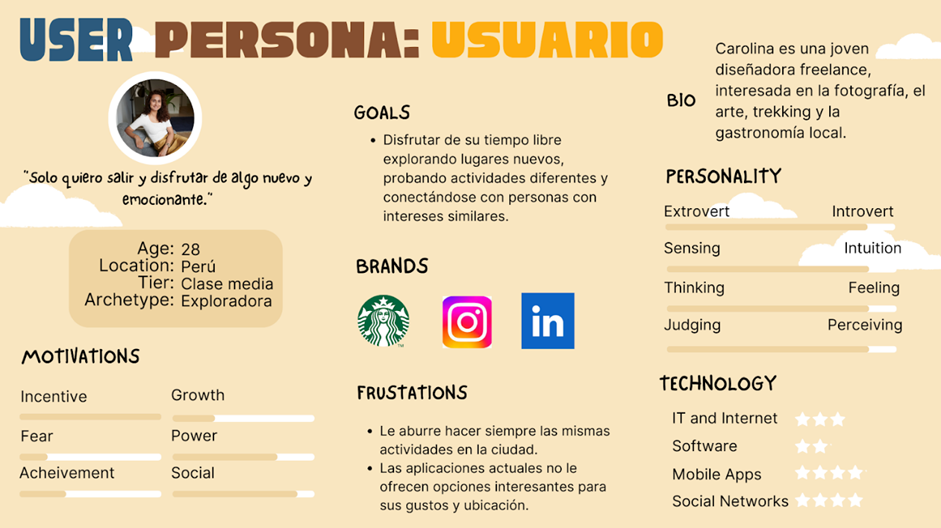

User persona de los dueños de pequeños emprendimientos: 

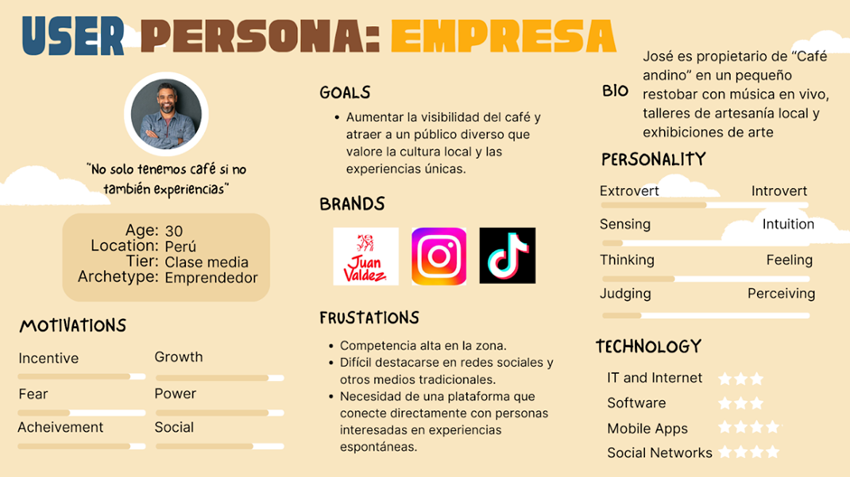  

### 2.3.2. User Task Matrix  

Segmento Usuarios: 

|Tarea |Frecuencia |Severidad |
| - | - | - |
|Buscar microaventuras cerca de su ubicación |Alta |Media |
|Usar la función "Sorpréndeme" para actividades aleatorias |Media |Media |
|Filtrar actividades por tipo, duración, o costo |Alta |Alta |
|Guardar actividades como favoritas para futuras referencias |Media |Media |
|Compartir experiencias en redes sociales |Media |Alta |
|Calificar y comentar sobre las aventuras realizadas |Baja |Media |
|Recibir notificaciones de nuevas actividades disponibles |Media |Alta |

Segmento Empresas Locales: 

|Tarea |Frecuencia |Severidad |
| - | - | - |
|Publicar nuevas experiencias o actividades en la aplicación |Alta |Alta |
|Actualizar la información de sus actividades |Media |Media |
|Revisar estadísticas de participación y feedback de usuarios |Media |Alta |
|Ofrecer promociones exclusivas a través de la aplicación |Media |Alta |
|Interactuar con usuarios a través de comentarios y mensajes |Media |Alta |
|Recibir notificaciones sobre interacciones de usuarios |Baja |Media |

### 2.3.3. User Journey Mapping  

**Segmento Usuarios:** 

**ANEXO C:**  [https://imgur.com/a/7i1hv10 ](https://imgur.com/a/7i1hv10)

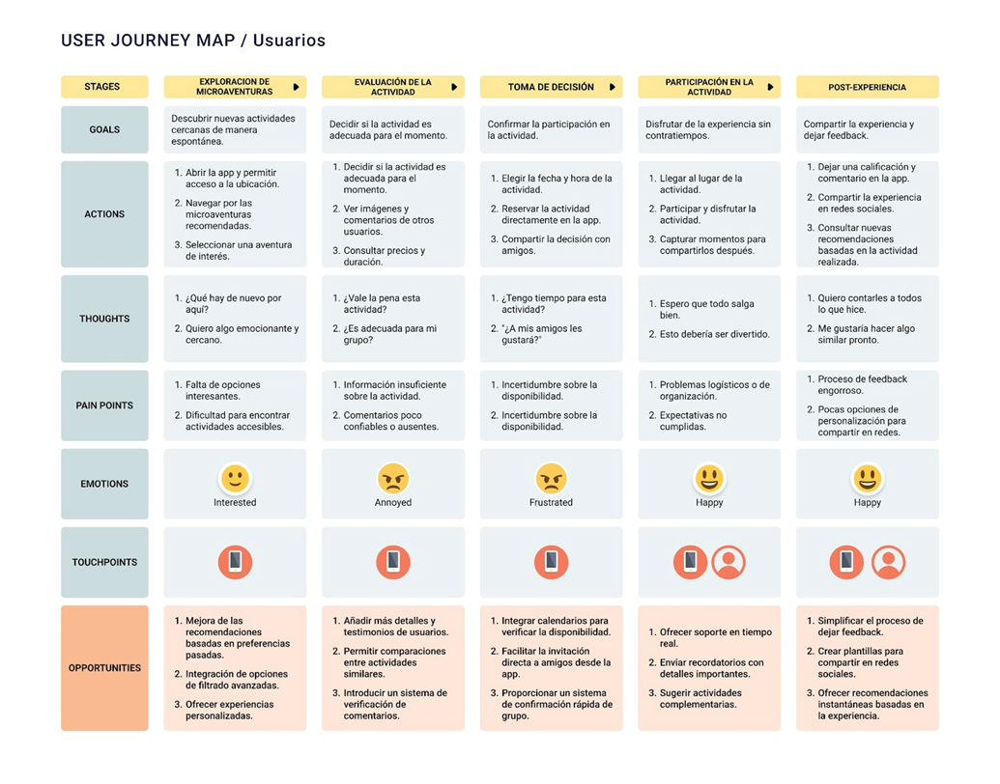  

**Segmento Empresas Locales:**

**ANEXO D:**  [https://imgur.com/a/FZnhbLQ ](https://imgur.com/a/FZnhbLQ) 

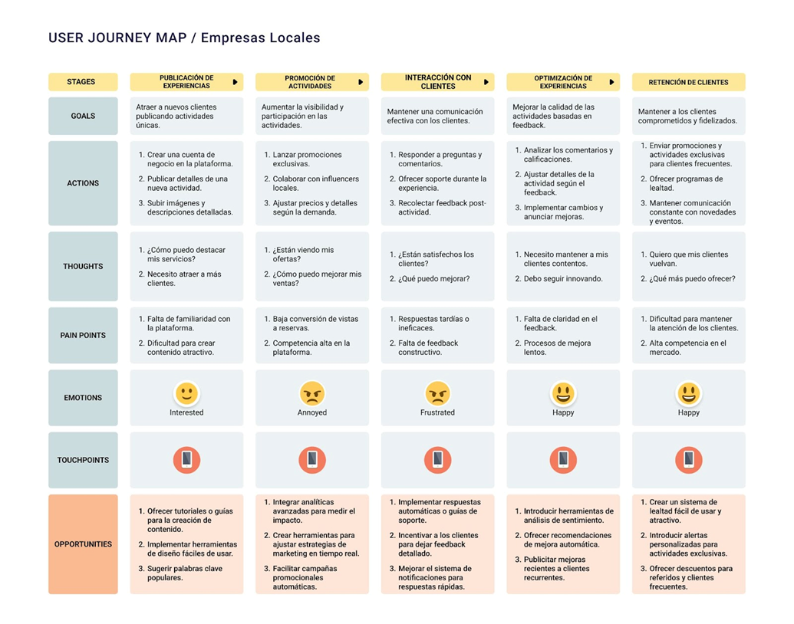  

### 2.3.4. Empathy Mapping  

**Segmento Usuarios:**

**ANEXO E:**  [https://imgur.com/a/rOEsUvd ](https://imgur.com/a/rOEsUvd) 

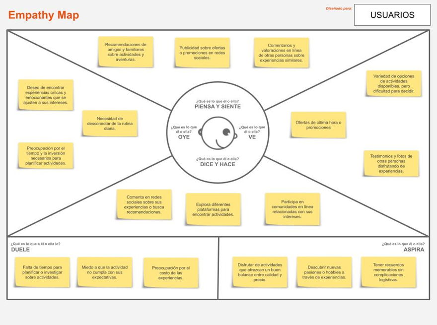  

 
**Segmento Empresas Locales:** 

**ANEXO F:** [https://imgur.com/a/YgYs5Qp ](https://imgur.com/a/YgYs5Qp)

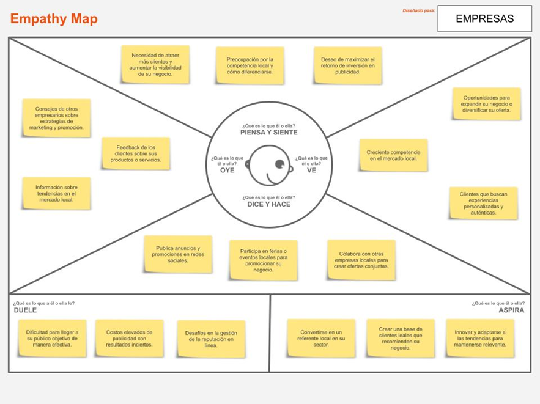  

  

### 2.3.5. As-is Scenario Mapping  

|What is the Local Entrepreneur…|||||
|:-|:-|:-|:-|:-|
|Phases	|Búsqueda de un lugar publicitario	|Registro de los servicios del local|	Publicación de actividades|	Análisis del acogimiento del local|
|Doing|	•	Encontró un puesto de periodico cercano.

•	Escoger alguna red social donde publicitar el local.|	•	Llenó un formulario sobre los datos de su local: Nombre, tipo de local, servicios y ubicación.	|•	Imprimió un afiche de las actividades para hacer en su local. 

•	Pagó por la estadía de esa publicidad en el puesto de periodico.

•	Realizó un afiche para postear en su red social.	|•	Visualizó el flujo de clientes que hay en su local después de la publicación de su local.

•	Analizó las estadísticas en la configuración de la red social.|
|Thinking	|•	“Espero encontrar algún puesto donde pegar los afiches.”

•	“Ojalá esta red social sea la mejor opción para publicitar negocios.”	|•	“Qué trabajoso es colocar todos los datos de mi local.”|	•	“Ojala lo que pagué por la estadía de esta  publicación de esta actividad en el periódico valga la pena.”

•	“Quizás esta publicación sea lo suficientemente buena como para que tenga alcance en la red social.”	|•	“No creo que todos hayan visto mi publicación.”

•	“Según esta sección, mi publicación no alcanzó tanta acogida.”|
|Feeling|	•	Angustia

•	Ansiedad|	•	Estresado	|•	Abrumado

•	Enojado	|•	Ansiedad|

|What is the user…|||||
|:-|:-|:-|:-|:-|
|Phases	|Descubrimiento de aplicaciones	|Registro de datos personales|	Exploración de opciones|Realización de reseña|
|Doing	|•	Buscar referencias de buenas aplicaciones en Google.

•	Preguntar a allegados sobre alguna página web.|	•	Entré a alguna aplicación web.

•	Registrar tus datos en la app.|	•	Filtré en la búsqueda de google.

•	Entré a la aplicación que descargué y busqué lugares cercanos que visitar.|	•	Conversé con mis allegados sobre los mejores y peores lugares que encontré|
|Thinking|	•	“Ojalá alguien de mis amigos conozca una aplicación para buscar microaventuras.”

•	“Que cansado es buscar recomendaciones en google”	|•	“Espero que esta app me ayude, porque el proceso de autenticación es muy tedioso.”

•	“Que bueno que pueda ingresar con cuenta de Google o Outlook.”|	•	“Que bueno, que estas aplicaciones tengan filtro de búsqueda.”|	•	“Que mal que solo pueda dar el feedback de mi experiencia por boca.”|
|Feeling|	•	Angustiado	|•	Ansioso

•	Abrumado|	•	Tranquilo	|•	Estresado|

## 2.4. Ubiquitous Language  

El ubiquitous language es un vocabulario común compartido por todos los miembros del equipo y stakeholders para describir los conceptos clave del dominio de AventuraPe. Aquí presentamos los términos fundamentales:

|Término|	Definición|
|:-|:-|
|Microaventura|	Experiencia única y breve (de 1-4 horas) que los usuarios pueden realizar en su entorno local|
|Botón "Sorpréndeme"	|Función que recomienda aleatoriamente una actividad basada en preferencias del usuario|
|Geolocalización	|Tecnología que identifica la ubicación del usuario para sugerir actividades cercanas|
|Gamificación	|Sistema de recompensas (puntos, insignias) por participar en aventuras|
|Perfil de usuario|	Datos personales e intereses del usuario para personalizar recomendaciones|
|Negocio asociado	|Establecimiento local registrado que ofrece experiencias en la plataforma|
|Sistema de rating|	Valoración (1-5 estrellas) y comentarios que los usuarios dan a las experiencias|
|Filtros inteligentes|	Opciones para ajustar búsquedas por tiempo, presupuesto o tipo de actividad|
|Experiencia premium|	Aventura exclusiva disponible mediante suscripción o pago único|
|Panel de negocio	|Interfaz donde los locales gestionan sus publicaciones y ven estadísticas|
# Capítulo III: Requirements Specification

## 3.1. To-Be Scenario Mapping  
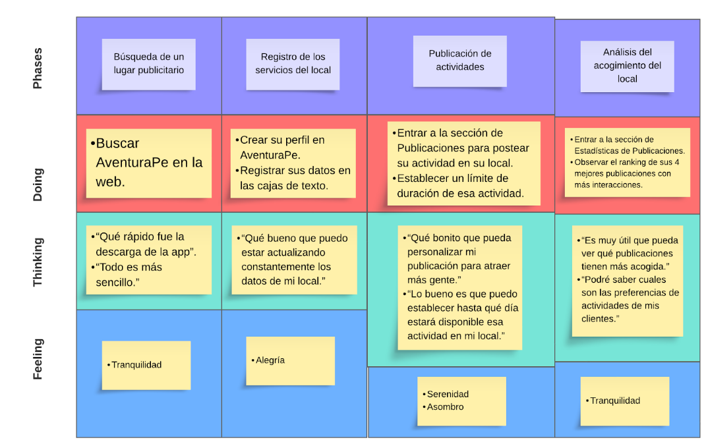

## 3.2. User Stories

#### Navegación y Acceso (EP01)

Voy a reorganizar las User Stories manteniendo todo el contenido original, incluyendo criterios de aceptación, agrupándolas por Epic ID.

### Tabla de Epics para AventuraPe

| Epic ID | Nombre | Descripción | Usuario Principal | Funcionalidades Clave |
|---------|--------|-------------|------------------|----------------------|
| EP01 | Navegación y Acceso | Funcionalidades relacionadas con la navegación de visitantes en la plataforma web | Visitante | Secciones informativas, hipervínculos, preguntas frecuentes |
| EP02 | Usuario Aventurero (Web/Móvil) | Gestión de cuenta y funcionalidades para usuarios aventureros | Aventurero | Registro, inicio de sesión, perfil, visualización de actividades |
| EP03 | Usuario Empresario (Web/Móvil) | Gestión de cuenta y funcionalidades para empresarios | Empresario | Registro, inicio de sesión, perfil, publicación de actividades |
| EP05 | Experiencia Aventurero | Interacción con actividades y funcionalidades específicas para aventureros | Aventurero | Consulta de detalles, calificaciones, reseñas, navegación del home |
| EP06 | Gestión de Actividades | Administración de actividades por parte de los empresarios | Empresario | Publicación, edición y eliminación de actividades |
 

### Epic: Navegación y Acceso (EP01)

| Story ID | Título | Descripción | Epic ID | Usuario | Criterios de aceptación |
|----------|--------|-------------|---------|---------|-------------------------|
| US01 | Interacción con hipervínculos (Web) | Como visitante, quiero interactuar con los enlaces de navegación para ir a las diferentes secciones de la plataforma web. | EP01 | Visitante | **Escenario 1: Búsqueda de Aventurape** Dado que el visitante quiere saber sobre los servicios de AventuraPe Cuando el visitante busca en Internet AventuraPe Entonces el sistema le muestra la landing page de AventuraPe  **Escenario 2: Navegación exitosa** Dado que el visitante se encuentra en la plataforma web de AventuraPe Cuando el visitante hace clic en una sección de la barra de navegación Entonces el sistema muestra la sección correspondiente |
| US02 | Sección Servicios | Como visitante, quiero ver la sección "Servicios" para entender qué servicios ofrece AventuraPe. | EP01 | Visitante | **Escenario 1: Acceso a la sección Servicios** Dado que el visitante está en la página principal de AventuraPe Cuando el visitante navega hasta la sección de Servicios Entonces el sistema muestra un resumen claro de las funcionalidades clave de AventuraPe  **Escenario 2: Visualización de detalles de servicios** Dado que el visitante está en la sección de Servicios Cuando el visitante hace clic en un servicio específico Entonces el sistema muestra información detallada sobre ese servicio |
| US03 | Sección preguntas frecuentes (Web) | Como visitante, quiero consultar la sección "Preguntas frecuentes" para resolver mis dudas sobre la plataforma. | EP01 | Visitante | **Escenario 1: Acceso a la sección FAQ** Dado que el visitante está navegando en la plataforma Cuando el visitante hace clic en la sección "Preguntas Frecuentes" Entonces el sistema muestra una lista de preguntas comunes organizadas por categorías  **Escenario 2: Consulta de respuestas específicas** Dado que el visitante está en la sección de "Preguntas Frecuentes" Cuando el visitante hace clic en una pregunta específica Entonces el sistema expande esa pregunta y muestra la respuesta detallada |
| US04 | Sección Sobre Nosotros | Como visitante, quiero ver la sección "Sobre Nosotros" para conocer más sobre el propósito y valores de AventuraPe. | EP01 | Visitante | **Escenario 1: Exploración inicial** Dado que el visitante quiere saber más sobre AventuraPe Cuando el visitante accede a la página principal y navega hacia la sección "Sobre Nosotros" Entonces el sistema una breve desripción sobre el equipo de AventuraPe  **Escenario 2: Contenido accesible y claro** Dado que el visitante está viendo la sección "Sobre Nosotros" Cuando el visitante revisa el contenido Entonces el sistema le presenta información en un formato visualmente atractivo y fácil de leer |
| US05 | Sección Testimonios | Como visitante, quiero leer testimonios de otros usuarios para confiar en los servicios de AventuraPe. | EP01 | Visitante | **Escenario 1: Acceso a testimonios** Dado que el visitante quiere conocer experiencias de otros usuarios Cuando el visitante navega hacia la sección de Testimonios Entonces el sistema muestra una serie de opiniones o experiencias compartidas por usuarios reales  **Escenario 2: Presentación dinámica** Dado que el visitante está en la sección de Testimonios Cuando el visitante revisa los distintos comentarios Entonces el sistema presenta los testimonios en un formato atractivo con nombre, foto y experiencia destacada |
| US06 | Sección Contacto | Como visitante, quiero acceder a la sección de contacto para comunicarme con el equipo de AventuraPe. | EP01 | Visitante | **Escenario 1: Visualización del formulario de contacto** Dado que el visitante necesita hacer una consulta Cuando el visitante accede a la sección "Contacto" Entonces el sistema muestra un formulario con campos como nombre, correo y mensaje  **Escenario 2: Envío exitoso de mensaje** Dado que el visitante ha llenado correctamente el formulario Cuando el visitante hace clic en "Enviar" Entonces el sistema muestra un mensaje "Gracias por tu mensaje. Nos pondremos en contacto pronto." |

## Epic: Usuario Aventurero (EP02 / EP05)

| Story ID | Título | Descripción | Epic ID | Usuario | Criterios de aceptación |
|----------|--------|-------------|---------|---------|-------------------------|
| US04 | Iniciar sesión (Web/Móvil) | Como usuario aventurero registrado, quiero iniciar sesión con mis credenciales para acceder a mi cuenta y funcionalidades personalizadas. | EP02 | Aventurero | **Escenario 1: Inicio de sesión exitoso** Dado que el aventurero registrado se encuentra en la página de inicio de sesión Cuando el aventurero ingresa su usuario y contraseña correctos  Y hace clic en el botón 'Iniciar Sesión' Entonces el sistema valida las credenciales  Y redirige al aventurero a su home personalizado  **Escenario 2: Inicio de sesión fallido** Dado que el aventurero registrado se encuentra en la página de inicio de sesión Cuando el aventurero ingresa un usuario o contraseña incorrectos  Y hace clic en el botón 'Iniciar Sesión' Entonces el sistema muestra un mensaje de error  Y permanece en la página de inicio de sesión |
| US06 | Creación de cuenta (Web/Móvil) | Como nuevo usuario aventurero, quiero crear una cuenta para usar las funciones personalizadas de la plataforma. | EP02 | Aventurero | **Escenario 1: Registro exitoso** Dado que el visitante se encuentra en la página de registro para aventureros Cuando el visitante completa los campos obligatorios como usuairo y contraseña Y hace clic en el botón 'Registrar' Entonces el sistema crea la nueva cuenta de aventurero  Y lo dirige a la sección de Iniciar Sesión  **Escenario 2: Validación de datos obligatorios** Dado que el visitante está en la página de registro para aventureros Cuando el visitante intenta registrarse sin completar todos los campos obligatorios: usuario y contraseña Entonces el sistema le muestra un mensaje de error Y el sistema no registra la cuenta |
| US07 | Configuración del perfil de aventurero (Móvil) | Como usuario aventurero registrado, quiero completar mi perfil personal para personalizar mi experiencia. | EP02 | Aventurero | **Escenario 1: Actualización exitosa del perfil**  Dado que el aventurero ha iniciado sesión en su cuenta Cuando accede a la sección "Mi cuenta" y completa campos adicionales como dirección y género Y hace clic en el botón "Guardar cambios" Entonces el sistema actualiza la información del perfil  **Escenario 2: Validación de campos del perfil** Dado que el aventurero está en la sección "Mi cuenta" completando su perfil Cuando ingresa información incompleta Entonces el sistema resalta los campos a rellenar Y no guarda los cambios hasta que se corrijan los errores |
| US12 | Ver detalles de actividad (Web) | Como aventurero, quiero seleccionar una publicación para ver todos sus detalles como: Nombre de la actividad, cantidad de personas, duración y precio.| EP02 | Aventurero | **Escenario 1: Navegación a la sección de búsqueda** Dado que el aventurero se encuentra en la página de inicio Cuando el aventurero hace clic a la sección Buscar Entonces el sistema le muestra una galería de actividades de diferentes emprendedores  **Escenario 2: Acceso a detalles** Dado que el aventurero está viendo la galería de actividades Cuando el aventurero hace clic en la tarjeta de una actividad específica Entonces el sistema carga  Y muestra una página dedicada con toda la información detallada de esa actividad |
| US12 | Ver detalles de actividad (Aventurero - Móvil) | Como aventurero, quiero seleccionar una publicación para ver todos sus detalles en mi dispositivo móvil. | EP02 | Aventurero | **Escenario 1: Navegación a la sección de búsqueda** Dado que el aventurero se encuentra en la sección de inicio Cuando el aventurero hace clic al icono de la lupa Entonces el sistema le muestra una lista de actividades  **Escenario 2: Acceso a detalles** Dado que el aventurero está viendo la lista de actividades Cuando el aventurero hace clic en la tarjeta de una actividad específica Entonces el sistema carga Y muestra una página dedicada con toda la información detallada como: Título, descripción, imagen, costo, precio, cantidad de personas, comentarios y calificación de esa actividad|
| US14 | Calificación de publicación (Aventurero - Web/Móvil) | Como aventurero, quiero asignar una calificación a una actividad en la que participé para compartir mi valoración general. | EP02 | Aventurero | **Escenario 1: Acceso a detalles de la actividad** Dado que el aventurero se encuentra en la sección de buscar Cuando el aventurero selecciona una actividad específica Entonces el sistema le muestra los detalles de esa actividad  **Escenario 2: Registrar calificación** Dado que el aventurero está viendo la página de detalles de una actividad Cuando el aventurero selecciona un número de estrellas en el control de calificación Entonces el sistema pinta las estrellas dependiendo de lo que el usuario eligió  Y registra la calificación para esa actividad |
| US15 | Publicar reseña/comentario (Aventurero - Web/Móvil) | Como aventurero, quiero escribir y publicar una reseña/comentario sobre una actividad en la que participé para compartir mi experiencia detallada. | EP02 | Aventurero | **Escenario 1: Acceso a detalles de la actividad** Dado que el aventurero se encuentra en la sección de buscar Cuando el aventurero selecciona una actividad específica Entonces el sistema le muestra los detalles de esa actividad  **Escenario 2: Publicar comentario exitoso** Dado que el aventurero está en la página de detalles de una actividad en la que participó Cuando el aventurero escribe un texto en el campo de reseña  Y hace clic en el botón 'Publicar' Entonces el sistema guarda el comentario  Y lo muestra en la lista de comentarios visibles para otros usuarios |
| US21 | Navegar interfaz home (Aventurero - Móvil) | Como aventurero, quiero ver una pantalla principal (home) con una lista o resumen de actividades para tener una vista general al ingresar a la plataforma. | EP02 | Aventurero | **Escenario 1: Vista del Home** Dado que el aventurero ha iniciado sesión Cuando accede a la página principal (home) de la plataforma Entonces el sistema le presenta una pantalla que muestra una galería de emprendedores y publicaciones de actividades  **Escenario 2: Interacción con la galería** Dado que el aventurero está viendo la pantalla de inicio Cuando el aventurero desliza la pantalla para explorar más contenido Entonces el sistema carga más elementos en la galería de forma dinámica |
| US21 | Navegar interfaz home (Aventurero - Web) | Como aventurero, quiero ver una pantalla principal (home) con opciones claras para navegar por la plataforma desde mi computadora. | EP02 | Aventurero | **Escenario 1: Vista del Home** Dado que el aventurero ha iniciado sesión Cuando accede a la página principal (home) de la plataforma Entonces el sistema le presenta una pantalla con dos botones donde puede ver emprendedores y publicaciones  **Escenario 2: Navegación por categorías** Dado que el aventurero está en la página principal Cuando el aventurero hace clic en uno de los botones disponibles Entonces el sistema le muestra el contenido correspondiente a la opción seleccionada |

## Epic: Usuario Empresario (EP03 / EP06)

| Story ID | Título | Descripción | Epic ID | Usuario | Criterios de aceptación |
|----------|--------|-------------|---------|---------|-------------------------|
| US05 | Iniciar sesión (Web/Móvil) | Como usuario empresario registrado, quiero iniciar sesión con mis credenciales para acceder al panel de gestión de mi negocio. | EP03 | Empresario | **Escenario 1: Inicio de sesión exitoso** Dado que el empresario registrado se encuentra en la página de inicio de sesión Cuando el empresario ingresa su email y contraseña correctos  Y hace clic en el botón 'Iniciar Sesión' Entonces el sistema valida las credenciales  Y redirige al empresario a su sección de inicio  **Escenario 2: Inicio de sesión fallido** Dado que el empresario registrado se encuentra en la página de inicio de sesión Cuando el empresario ingresa un email o contraseña incorrectos  Y hace clic en el botón 'Iniciar Sesión' Entonces el sistema muestra un mensaje de error indicando "Credenciales inválidas"  Y permanece en la página de inicio de sesión |
| US07 | Configuración del perfil de empresario (Móvil) | Como usuario empresario registrado, quiero completar mi perfil personal para personalizar mi experiencia. | EP03 | Empresario | **Escenario 1: Actualización exitosa del perfil**  Dado que el empresario ha iniciado sesión en su cuenta Cuando accede a la sección "Mi cuenta" y completa campos adicionales como dirección y género Y hace clic en el botón "Guardar cambios" Entonces el sistema actualiza la información del perfil  **Escenario 2: Validación de campos del perfil** Dado que el empresario está en la sección "Mi cuenta" completando su perfil Cuando ingresa información incompleta Entonces el sistema resalta los campos a rellenar Y no guarda los cambios hasta que se corrijan los errores |
| US07 | Creación de cuenta (Web/Móvil) | Como nuevo usuario empresario, quiero crear una cuenta de negocio para publicar actividades y gestionar mi presencia en la plataforma. | EP03 | Empresario |**Escenario 1: Registro exitoso** Dado que el visitante se encuentra en la página de registro para empresarios Cuando el visitante completa los campos obligatorios como usuario y contraseña, Y hace clic en el botón 'Registrar' Entonces el sistema crea la nueva cuenta de empresario, inicia sesión automáticamente Y redirige al usuario a su página de inicio **Escenario 2: Validación de datos del negocio** Dado que el visitante está completando el formulario de registro para empresarios Cuando el visitante ingresa información incompleta o inválida Entonces el sistema le muestra un mensaje de "Error de registro, vuelve a intentar"|
| US08 | Publicar actividad (Web/Móvil) | Como empresario, quiero publicar los detalles de una nueva actividad o experiencia que ofrezco para atraer clientes aventureros. | EP03 | Empresario | **Escenario 1: Publicación exitosa** Dado que el empresario ha iniciado sesión Y se encuentra en la sección de home Cuando el empresario navega a la opción 'Agregar Actividad', completa todos los campos requeridos del formulario como: título de la actividad, imagen (URL o desde la galería), descripción, cantidad de personas, precio y hora Y hace clic en 'Publicar' Entonces el sistema guarda la nueva actividad Y esta se vuelve visible en la plataforma para los aventureros  **Escenario 2: Validación de campos obligatorios** Dado que el empresario está completando el formulario para publicar una actividad Cuando el empresario intenta publicar sin completar todos los campos obligatorios Entonces el sistema no registra la publicación hasta que estén completos  |
| US09 | Edición de actividad (Web/Móvil) | Como empresario, quiero editar los detalles de una actividad ya publicada para corregir información o actualizarla. | EP03 | Empresario | **Escenario 1: Edición exitosa** Dado que el empresario ha iniciado sesión y está viendo la lista de sus actividades publicadas Cuando el empresario selecciona una actividad, hace clic en 'Editar', modifica uno o más campos Y hace clic en 'Guardar Cambios' Entonces el sistema guarda los cambios Y la información actualizada de la actividad se refleja en la plataforma |
| US10 | Borrar actividad (Móvil) | Como empresario, quiero borrar una actividad publicada que ya no está disponible o fue un error para mantener mi oferta actualizada. | EP03 | Empresario |**Escenario 1: Borrado exitoso** Dado que el empresario ha iniciado sesión y está viendo la lista de sus actividades publicadas Cuando el empresario selecciona una actividad, hace clic en 'Eliminar' Entonces el sistema elimina la actividad de la plataforma Y de la lista de actividades activas del empresario |

## 3.3. Product Backlog  
## 3.4. Impact Mapping  

 

# Capítulo IV: Product Design

## 4.1. Style Guidelines
En AventuraPe, el sistema de diseño visual ha sido construido a partir de los insights obtenidos en entrevistas con nuestros principales usuarios, especialmente los perfiles aventurero espontáneo y emprendedor visualmente orientado. Detectamos que estos usuarios valoran una interfaz dinámica, energética y fácil de explorar, por lo que desarrollamos un sistema visual que combina:
<li>Paletas de colores vibrantes que refuerzan la acción y la aventura.
<li>Tipografía sans serif moderna que mejora la legibilidad en distintos dispositivos.
<li>Íconos ilustrativos simples que permiten escanear funcionalidades rápidamente.
<li>Contraste alto y uso consistente de layouts responsivos para mejorar la accesibilidad. 
 En particular, adoptamos un tono comunicacional versátil, que puede adaptarse a diferentes segmentos: lúdico para el aventurero casual, y profesional para el emprendedor. Estas decisiones están respaldadas por los principios de diseño universal (WCAG), Mobile First, y las guías de estilo de Material Design (Android) y Human Interface Guidelines (iOS). Las siguientes subsecciones presentan el desglose visual aplicado a los distintos entornos (web y móviles), con capturas de los componentes base del sistema visual. 

### 4.1.1. General Style Guidelines  
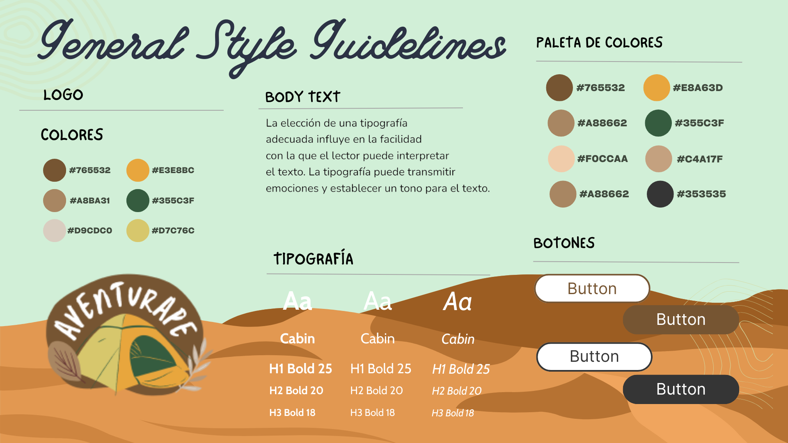

### 4.1.2. Web Style Guidelines 
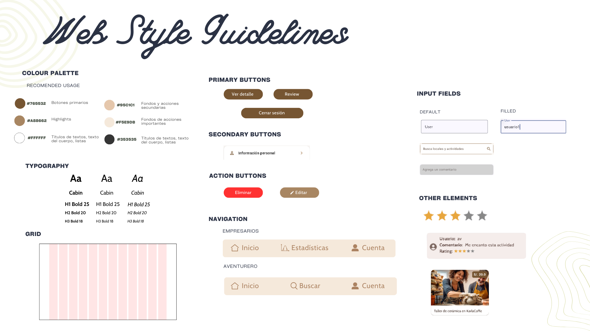

### 4.1.3. Mobile Style Guidelines
#### 4.1.3.1. iOS Mobile Style Guidelines

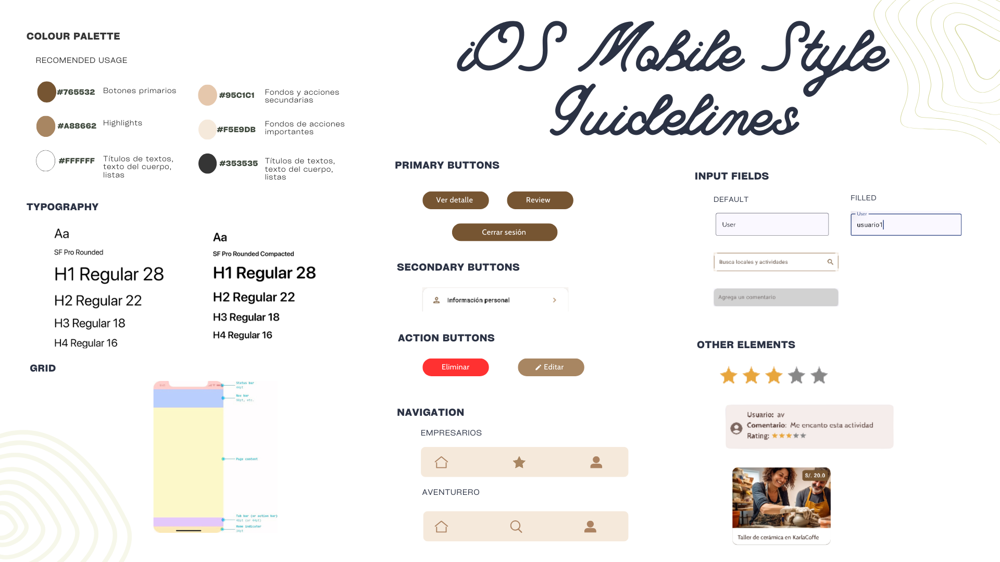

#### 4.1.3.2. Android Mobile Style Guidelines  
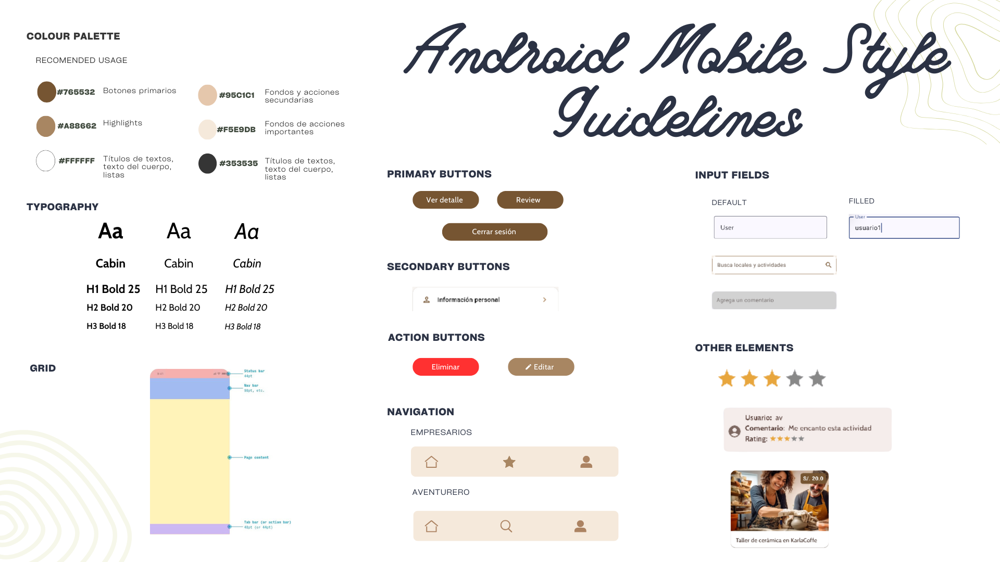

## 4.2. Information Architecture
### 4.2.1. Organization Systems

**Aventurero** 
En primer lugar el aventurero o emprendedor se encontrará en la landing, la cual lo redirija a la tienda de aplicación de su preferencia. Una vez descargada la aplicación. Se registrará o iniciará sesión, según el tipo de usuario que elija.
 
En el panel de aventurero la primera vista será la pantalla principal en donde podrá ver una lista de locales, posts recientes, y los posts más populares, aquí se encontrará el botón “Sorpréndeme”. En la siguiente vista tendrá el buscador y los posts. Finalmente, en el panel de cuenta, se encuentra la información del usuario.

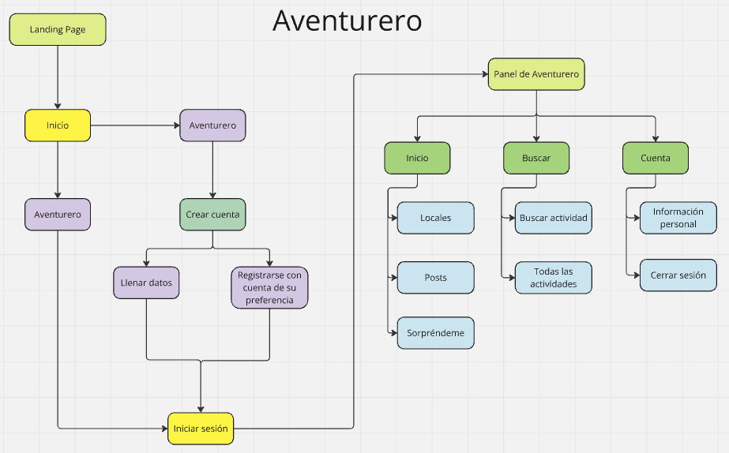

 

**Emprendedor** 
En el panel del emprendedor la primera vista será la página principal con sus posts anteriormente publicados y un botón que le permita agregar un nuevo post. En el apartado de estadísticas podrá filtrar los posts con mejor calificación o con más comentarios. Finalmente, en el perfil del emprendedor se encontrará información del emprendimiento o empresa.

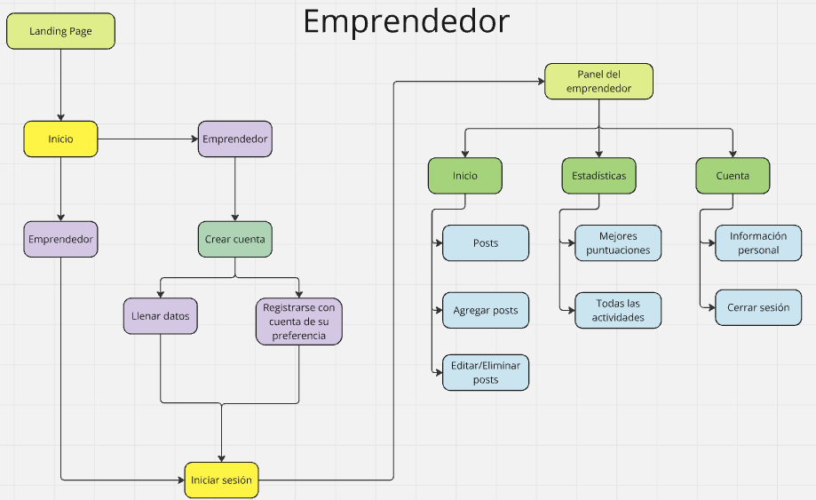

### 4.2.2. Labeling Systems  
 Este sistema de etiquetado se integró en nuestro tablero de gestión de tareas (Trello/Jira) y permite identificar rápidamente el tipo de trabajo pendiente ([FEAT], [FIX]), su prioridad ([P1], [P2]) y el módulo involucrado ([UI], [DB]). Por ejemplo, la tarea [FEAT][P1][UI][TODO] Crear pantalla de inicio indica que es una nueva funcionalidad prioritaria de interfaz aún pendiente de desarrollo. 
| **Etiqueta**            | **Descripción**               |
|---------------------|---------------------------|
| **Tipo de tarea**       |                           |
| [FEAT]              | Nueva característica      |
| [FIX]               | Corrección de errores     |
| [REFACTOR]          | Refactorización de código |
| [DOCS]              | Documentación             |
| [TEST]              | Pruebas                   |
| **Prioridad**           |                           |
| [P1]                | Alta prioridad            |
| [P2]                | Prioridad media           |
| [P3]                | Baja prioridad            |
| **Módulo o componente** |                           |
| [UI]                | Interfaz de usuario       |
| [API]               | Lógica de la API          |
| [DB]                | Base de datos             |
| [AUTH]              | Autenticación             |
| [PERF]              | Rendimiento               |
| **Estado**              |                           |
| [TODO]              | Por hacer                 |
| [WIP]               | En progreso               |
| [REVIEW]            | En revisión               |
| [DONE]              | Completado                |

### 4.2.3. SEO Tags and Meta Tags

La implementación de estas etiquetas ayudan al posicionamiento de la página en los motores de búsqueda.
Título
Indica el tema de la página, debe ser corto y descriptivo, debe mantenerse entre los 55 y 60 caracteres.

    <title>AventuraPe</title>

**Descripción**  
Es una breve descripción  de la página.

	<meta name= “description” content= “No lo planees, explora y atrévete”/>

Robots
Indican a los motores de búsqueda de lo que deben hacer con la página.
index/noindex: Indica al motor de búsqueda si debe mostrar la página en el SERP o no.
follow/nofollow: Les dice a los motores qué hacer con los enlaces en ese objetivo.
Tipo de contenido
Es útil para que los motores de búsqueda identifiquen el idioma de la página.

    <meta http-equiv= “tipo de contenido” content= “text/html charset-utf-8” />
    <meta http-equiv= “tipo de contenido” content= “text/html charset-ISO-6059-1” />

Searchbox de enlaces
Se utiliza para controlar el cuadro de búsqueda de enlaces del sitio de Google

    <meta name= “google” content = “nositelinkssearchbox”/>

Viewport Meta Tag 
Es crucial para asegurar que el contenido se vea bien en dispositivos móviles.

    <meta name="viewport" content="width=device-width, initial-scale=1.0">

### 4.2.4. Searching Systems

El sistema de búsqueda propuesto para AventuraPe permitirá a los usuarios personalizar su experiencia de aventurera de acuerdo a sus preferencias. Este sistema facilitará la personalización de duración, cantidad de personas, lugar, mejores puntuados, etc. Los filtros disponibles serán:

| Nombre del filtro    | Descripción                                                                                                              |
|----------------------|--------------------------------------------------------------------------------------------------------------------------|
| Más comentados       | Permitirá ordenar los posts que tienen más comentarios de manera descendente.                                            |
| Mejor puntuación     | Permitirá ordenar de mejor a peor puntuación.                                                                            |
| Costo                | Permitirá ordenar de menor a mayor costo o viceversa.                                                                    |
| Duración             | El usuario puede seleccionar el tiempo aproximado que le tomará realizar la actividad.                                   |
| Cantidad de personas | El usuario podrá filtrar de acuerdo al tipo de actividad que desee de acuerdo a la cantidad de personas que se requiera. |

### 4.2.5. Navigation Systems  
En la app móvil se optó por el patrón de navegación tipo bottom tab bar, alineado con las guías de Human Interface (iOS) y Material Design (Android), facilitando el acceso a secciones críticas con el pulgar. En la web, se emplea una barra superior fija, siguiendo principios de navegación persistente, para evitar pérdida de contexto. Este diseño prioriza las tareas más frecuentes: explorar, buscar y gestionar cuenta, con énfasis visual en los íconos y retroalimentación activa al seleccionar secciones.

**Aventurero**
| Nombre | Descripción                                                                                                              |
|--------|--------------------------------------------------------------------------------------------------------------------------|
| Inicio | Le muestra los posts más recientes, los locales más populares al entrar a la aplicación.|
| Buscar | El usuario podrá buscar por palabra clave, nombre de local, etc.                                                         |
| Cuenta | Este apartado permite que el usuario gestione su cuenta.                                                                 |
 

**Emprendedor**
| Nombre       | Descripción                                                                                          |
|--------------|------------------------------------------------------------------------------------------------------|
| Inicio       | Le muestra los posts publicados, asimismo podrá gestionar estps, como eliminar, editar.              |
| Estadísticas | El emprendedor podrá filtrar sus posts por, más comentados, mejores puntuados y ver todos sus posts. |
| Cuenta       | Este apartado permite que el usuario gestione su cuenta.                                             |

## 4.3. Landing Page UI Design
El diseño de la landing page de AventuraPe fue construido bajo un enfoque centrado en el usuario, basado en los principales User Personas identificados: el aventurero espontáneo y el emprendedor en búsqueda de visibilidad. El diseño prioriza una arquitectura jerárquica de información que guía al usuario desde un mensaje de valor claro, hacia funcionalidades clave y mecanismos de confianza como testimonios. Para lograr una navegación fluida, se aplicó el **patrón visual en forma de “Z”**, optimizando la disposición de títulos, botones de acción y contenido visual.
  
En cuanto a accesibilidad, se respetaron las pautas WCAG 2.1: uso de alto contraste (mínimo 4.5:1), tipografías legibles en distintos tamaños, estructura **semántica clara y botones suficientemente grandes para interacción táctil** . El diseño es totalmente responsive, asegurando adaptabilidad desde desktop hasta smartphones.
  
Este diseño se evaluó con usuarios potenciales mediante **entrevistas cortas y pruebas de clics en prototipos de Figma**. Las observaciones nos permitieron reorganizar la sección de Testimonios más arriba en la jerarquía visual, al notar que generaba mayor confianza antes del registro. Este tipo de iteraciones nos permitió alinear la estructura visual con las expectativas del usuario real.

### 4.3.1. Landing Page Wireframe
Los wireframes desarrollados para la landing page de AventuraPe contemplan versiones para navegadores de escritorio y dispositivos móviles, asegurando una experiencia responsive que se adapta a diferentes tamaños de pantalla. La estructura se organiza de la siguiente manera:

- Encabezado (Header): Se implementa un menú de navegación fijo en la parte superior que incluye enlaces a secciones clave como "Servicios", "Sobre nosotros", "Testimonios", "Preguntas frecuentes" y "Contacto". Este diseño sigue el principio de consistencia, facilitando la navegación del usuario y permitiendo un acceso rápido a la información relevante.

- Sección Principal: Presenta un mensaje de bienvenida y un llamado a la acción destacado, utilizando una jerarquía visual clara que guía la atención del usuario hacia las acciones deseadas. Se aplica el patrón de diseño en forma de "Z", que dirige la mirada del usuario a través de los elementos más importantes de la página.

- Secciones Informativas: Detallan las funcionalidades de la plataforma, como calificar actividades, descubrir nuevas aventuras y publicar eventos si se es emprendedor. En cada sección se aplicó el principio de proximidad para agrupar información relacionada en secciones y facilitar así su comprensión.

- Testimonios y Preguntas Frecuentes: Proporcionan evidencia social y resuelven dudas comunes, respectivamente, aumentando la confianza del usuario en la plataforma. Se utiliza el principio de retroalimentación para mostrar que las opiniones de otros usuarios son valoradas y consideradas.

- Pie de Página (Footer): Contiene información de contacto y enlaces a nuestras redes sociales como Twitter, Facebook e Instagram, facilitando la comunicación y conexión con los usuarios.

En cuanto al diseño inclusivo, se han considerado aspectos como el contraste adecuado entre texto y fondo para garantizar la legibilidad, el uso de tipografías claras y tamaños de fuente apropiados para diferentes dispositivos, y la disposición de elementos interactivos con suficiente espacio para facilitar su uso por personas con diversas capacidades. Además, la estructura de la información sigue una arquitectura jerárquica que prioriza el contenido más relevante, permitiendo una navegación intuitiva. 
 ANEXO A: https://www.figma.com/design/XnZ4CmnkLFbmhpGQej7d7W/AventuraPe?node-id=151-2&t=jrNC7V95qrZFGvXF-1 

### 4.3.2. Landing Page Mock-up
Los mock-ups representan visualmente el resultado final del diseño propuesto y consolidan las decisiones tomadas en cuanto a estética, funcionalidad y usabilidad. En ambas versiones, se mantiene una coherencia visual que refuerza la identidad de la marca, respetando el Design System definido para el proyecto. 

 Se aplicaron principios clave de diseño como **contraste y jerarquía visual**, evidenciados en el uso de colores llamativos para los botones de acción y en la organización textual que dirige la atención desde el título hasta el botón "Explora ahora". La consistencia visual se mantiene en íconos, estilos y márgenes, lo cual genera una experiencia fluida. En cuanto a la **arquitectura de información**, el contenido se organiza de forma secuencial y lógica: inicia con una presentación de valor clara, continúa con las funcionalidades de la plataforma, testimonios y preguntas frecuentes, y finaliza con un llamado a la acción. Esta estructura guía de manera progresiva al usuario hacia el objetivo del sitio. 
 
**ANEXO B:**   [https://www.figma.com/design/XnZ4CmnkLFbmhpGQej7d7W/AventuraPe?node-id=151-2&t=jrNC7V95qrZFGvXF-1](https://www.figma.com/design/XnZ4CmnkLFbmhpGQej7d7W/AventuraPe?node-id=151-2&t=jrNC7V95qrZFGvXF-1)  

## 4.4. Mobile Applications UX/UI Design
El diseño UX/UI de las aplicaciones móviles de AventuraPe se desarrolló siguiendo un enfoque **User-Centered Design**, partiendo de **entrevistas y mapas de empatía** realizados en fases previas. Se identificaron dos flujos principales: aventurero explorador y emprendedor gestor, cuyas prioridades divergentes guiaron la estructuración de funcionalidades y jerarquía visual.
El proceso de diseño incluyó:
<li>Sketches rápidos en papel para idear flujos iniciales.
<li>Wireframes en Figma que permitieron validar la disposición de componentes clave (buscador, filtros, perfil).
<li>Wireflows detallados que reflejan los caminos más usados por cada tipo de usuario. 
### 4.4.1. Mobile Applications Wireframes

**ANEXO G:** [https://www.figma.com/design/XnZ4CmnkLFbmhpGQej7d7W/AventuraPe?node-id=47-1888&t=8uKwyhtfkQTKMvj6-1](https://www.figma.com/design/XnZ4CmnkLFbmhpGQej7d7W/AventuraPe?node-id=47-1888&t=8uKwyhtfkQTKMvj6-1)

**Sección Aventurero** 
A través de estos wireframes, se presentan las pantallas que guiarán a los usuarios en su travesía, destacando la importancia de la navegabilidad, el diseño centrado en el usuario y las funcionalidades que les permiten interactuar de manera fluida y natural con la aplicación.

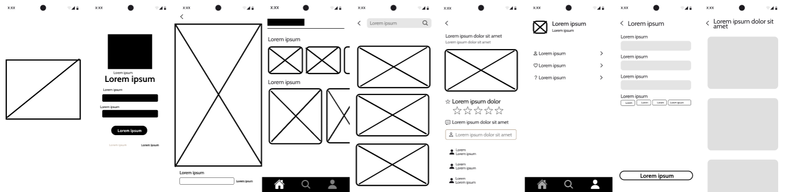 

**Sección Emprendedor** 
Esta sección está diseñada para aquellos usuarios con un espíritu innovador y emprendedor, interesados en gestionar y desarrollar sus propios proyectos a través de la aplicación móvil.

### 4.4.2. Mobile Applications Wireflow Diagrams

 

**ANEXO H:** [https://lucid.app/lucidchart/4ca0657e-5e53-4b71-8dcd-e84862e13c3f/edit?viewport_loc=-5149%2C-2964%2C15846%2C6519%2CVuP_hvOzbZtf&invitationId=inv_9f16f8d8-1ba4-4fb5-9bd6-670978bd7794](https://lucid.app/lucidchart/4ca0657e-5e53-4b71-8dcd-e84862e13c3f/edit?viewport_loc=-5149%2C-2964%2C15846%2C6519%2CVuP_hvOzbZtf&invitationId=inv_9f16f8d8-1ba4-4fb5-9bd6-670978bd7794)

## Seccion de aventurero
**User Goal:** Como aventurero, quiero ingresar a mi cuenta en AventuraPe.  
 

**User Goal:** Como aventurero, navegar en la sección Home.  
 

**User Goal:** Como aventurero, quiero buscar alguna actividad de mi interés.  
 

**User Goal:** Como aventurero, quiero tener una aventura espontánea.  
 

**User Goal:** Como aventurero, quiero filtrar mi búsqueda.  
 

**User Goal:** Como aventurero, quiero calificar la actividad que realicé.  
 

**User Goal:** Como aventurero, quiero actualizar mis datos personales de mi cuenta.  
 

## Seccion de empresario
**User Goal:** Como emprendedor, quiero ingresar a mi cuenta en AventuraPe.  
 

**User Goal:** Como emprendedor, quiero publicar una actividad para mi local.  
 

**User Goal:** Como emprendedor, quiero ver las mejores publicaciones que tuve.  
 

**User Goal:** Como emprendedor, quiero actualizar los datos de mi local.  
 

### 4.4.3. Mobile Applications Mock-ups
**ANEXO E:**  [https://www.figma.com/design/XnZ4CmnkLFbmhpGQej7d7W/AventuraPe?node-id=0-1&t=cwavRBbaqEngEViE-1](https://www.figma.com/design/XnZ4CmnkLFbmhpGQej7d7W/AventuraPe?node-id=0-1&t=cwavRBbaqEngEViE-1)

**Sección aventurero**
- **Registro e inicio de sesión:** Esta pantalla permite al usuario aventurero registrarse en la aplicación con su nombre completo, correo electrónico y una contraseña. El diseño sigue siendo simple, con campos de entrada claros y un botón destacado de "Sign Up" en la parte inferior para completar el proceso de registro. 
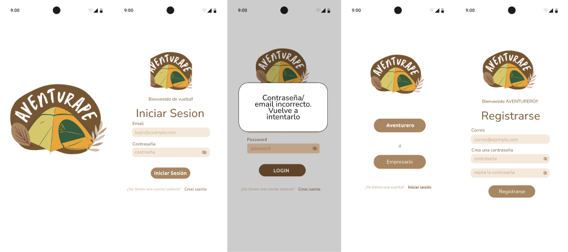

- **Inicio:** Esta pantalla principal muestra una vista general de los locales disponibles y las publicaciones o actividades más populares. La interfaz es visualmente clara y organizada, con espacios amplios para mostrar imágenes o tarjetas de locales y actividades que el aventurero puede explorar. 
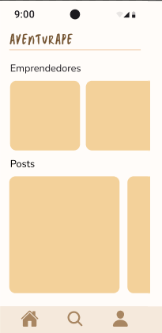

- **Búsqueda de actividades:** En esta sección, se encuentra la barra de búsqueda. Una vez seleccione una actividad, el aventurero puede ver el nombre de la publicación o actividad, el nombre de la empresa o usuario emprendedor, y una imagen destacada. También se permite al usuario calificar y comentar sobre la actividad, lo que fomenta la interacción y retroalimentación. 
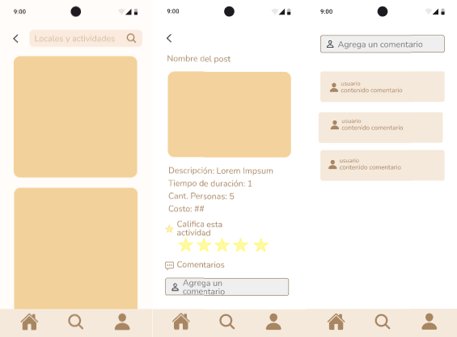

- **Mi cuenta:** En esta sección, el aventurero puede gestionar su perfil personal. La interfaz incluye un botón de "Guardar" para confirmar cualquier actualización de la información personal. 
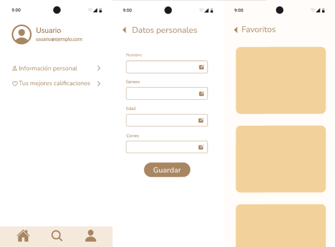

 

**Sección emprendedor**
- **Registro e inicio de sesión:** Esta pantalla permite al usuario emprendedor registrarse en la aplicación. La interfaz es simple y clara, con un botón de "Registro" destacado en la parte inferior para completar el proceso de registro. Y si ya tiene una cuenta el botón de "Iniciar sesión". 
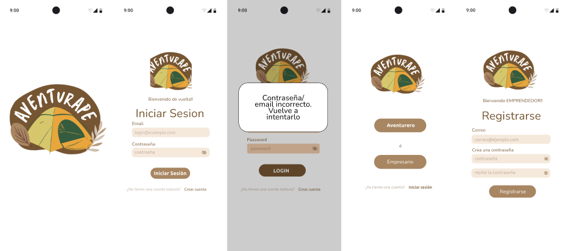

- **Registro de comprobante:** Esta pantalla muestra la sección para que el emprendedor pueda subir el comprobante de pago de su suscripción. 
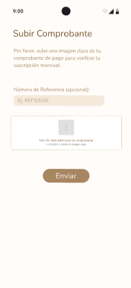

- **Inicio:** Una vez registrado, el usuario es llevado a la pantalla principal donde puede ver sus publicaciones o agregar una nueva actividad mediante un botón "Agregar actividad". 
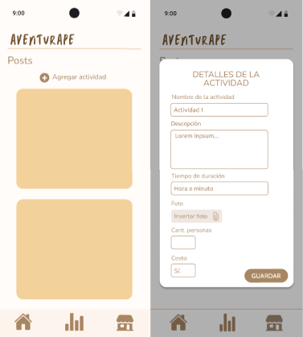

- **Estadísticas:** Esta pantalla muestra las estadísticas de las publicaciones más exitosas del usuario emprendedor. Se presentan en un formato visual sencillo con espacio para gráficos o datos relevantes sobre el rendimiento de las actividades publicadas. 
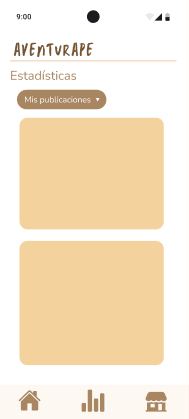

- **Mi cuenta:** En esta sección, el emprendedor puede gestionar su perfil personal y los detalles de su negocio, como el nombre del local, la localización, sector y correo electrónico. La interfaz incluye un botón de "Guardar" para confirmar cualquier actualización de la información personal. Además puede visualizar los beneficios de su plan de suscripción. 
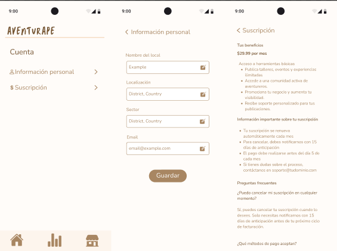

### 4.4.4. Mobile Applications User Flow Diagrams
**ANEXO I**: [https://lucid.app/lucidchart/4ca0657e-5e53-4b71-8dcd-e84862e13c3f/edit?view_items=m-N_lZ8pzENG&invitationId=inv_9f16f8d8-1ba4-4fb5-9bd6-670978bd7794](https://lucid.app/lucidchart/4ca0657e-5e53-4b71-8dcd-e84862e13c3f/edit?view_items=m-N_lZ8pzENG&invitationId=inv_9f16f8d8-1ba4-4fb5-9bd6-670978bd7794)
 
### Segmento de Aventurero
**USER GOAL: Como aventurero, quiero ingresar a mi cuenta en AventuraPe:**
Este objetivo se refiere a la necesidad del usuario de acceder a su perfil personal en la plataforma AventuraPe. Incluye el proceso de autenticación mediante credenciales (usuario/contraseña). 

**USER GOAL: Como aventurero, navegar en la sección Home:**
Este objetivo abarca la experiencia del usuario al explorar la página principal de la plataforma. El aventurero busca una interfaz intuitiva que le muestre contenido relevante como actividades destacadas y emprendedores 

**USER GOAL: Como aventurero, quiero buscar alguna actividad de mi interés:**
Este objetivo refleja la necesidad del usuario de encontrar actividades específicas que se alineen con sus preferencias. Implica la utilización de la sección de Publicaciones, donde ve una galería de actividades.

**USER GOAL: Como aventurero, quiero filtrar mi búsqueda:**
Este objetivo complementa al anterior, permitiendo al usuario refinar sus resultados de búsqueda mediante criterios específicos como el nombre de las actividades. Los filtros ayudan al aventurero a encontrar exactamente el tipo de experiencia que está buscando. 

**USER GOAL: Como aventurero, quiero calificar/comentar la actividad que realicé:**
Este objetivo responde a la necesidad del usuario de compartir su experiencia después de participar en una actividad. Incluye la posibilidad de asignar una puntuación y redactar una reseña detallando aspectos positivos y negativos. 

**USER GOAL: Como aventurero, quiero actualizar mis datos personales de mi cuenta:**
Este objetivo se relaciona con la gestión del perfil personal, permitiendo al usuario modificar información como datos de contacto. Es importante para mantener la cuenta actualizada y personalizada según las necesidades cambiantes del usuario. 

**USER GOAL: Como aventurero, quiero guardar en favoritos publicaciones que me gustaron:**
Este objetivo refleja la necesidad de crear una lista personalizada de actividades que han llamado la atención del usuario. La función de favoritos permite al aventurero marcar experiencias interesantes para considerarlas posteriormente, facilitando la planificación de futuras aventuras. 

### Segmento de Empresario
**USER GOAL: Como emprendedor, quiero ingresar a mi cuenta en AventuraPe:**
Este objetivo se refiere a la necesidad del emprendedor de acceder a su cuenta profesional en la plataforma. Implica un proceso de autenticación específico para usuarios de tipo negocio, que les da acceso a un panel de control o dashboard con funcionalidades especializadas para la gestión de su oferta de actividades. 

**USER GOAL: Como emprendedor, quiero publicar una actividad para mi local:**
Este objetivo representa la función principal que busca un emprendedor en la plataforma: dar visibilidad a las experiencias o actividades que ofrece su negocio. Incluye el proceso de creación de anuncios con detalles como descripción, imágenes, precios, horarios y ubicación. Esta funcionalidad es esencial para que el emprendedor pueda comercializar sus servicios de aventura a los usuarios de la plataforma. 

**USER GOAL: Como emprendedor, quiero ver las mejores publicaciones que tuve:**
Este objetivo refleja la necesidad del emprendedor de analizar el rendimiento de sus publicaciones para identificar cuáles han sido más exitosas. Esto implica acceder a métricas como número de los más comentados o valoraciones. Esta información es crucial para que el emprendedor pueda entender las preferencias de los clientes y optimizar su oferta de actividades. 

**USER GOAL: Como emprendedor, quiero actualizar los datos de mi local:**
Este objetivo se relaciona con la gestión del perfil comercial, permitiendo al emprendedor mantener actualizada la información de su negocio, como ubicación, horarios de atención, métodos de pago aceptados, servicios adicionales, etc. La actualización periódica de esta información es crucial para mantener una presencia profesional y confiable en la plataforma. 

## 4.5. Mobile Applications Prototyping
### 4.5.1. Android Mobile Applications Prototyping

**Inicio - Emprendedor:** La pantalla de inicio para el usuario emprendedor ofrece una vista rápida de sus publicaciones actuales y un botón destacado "Agregar actividad". 
**Inicio - Aventurero:** La página de inicio del aventurero es visualmente atractiva y funcional, presentando una lista de actividades recomendadas y populares basadas en la ubicación del usuario.

### **Funcionalidades**

**Sección Emprendedor**

- **Ver Publicaciones:** Permite al emprendedor revisar todas las actividades que ha creado en la aplicación.
- **Agregar Actividad:** Un botón claro y accesible para que los emprendedores añadan nuevas actividades o promociones.
- **Editar/Eliminar Actividades:** Funcionalidades que permiten la edición rápida o eliminación de publicaciones ya creadas.
- **Estadísticas de Actividades:** El emprendedor puede filtrar sus publicaciones por, más comentadas y mejor calificadas.

**Sección Aventurero**

- **Explorar Actividades:** Muestra una lista o tarjetas con actividades cercanas, destacando las más populares.
- **Buscar Actividades:** El aventurero puede utilizar una barra de búsqueda para encontrar actividades específicas.
- **Comentar y calificar:** El aventurero puede comentar en las actividades que desee y calificarlas.

**Video de explicación del flujo:** 
**ANEXO J:**  [https://drive.google.com/file/d/1HK6GOXkf34y08Jlw23Pg49A2nIlxzWvP/view?usp=sharing](https://drive.google.com/file/d/1HK6GOXkf34y08Jlw23Pg49A2nIlxzWvP/view?usp=sharing)
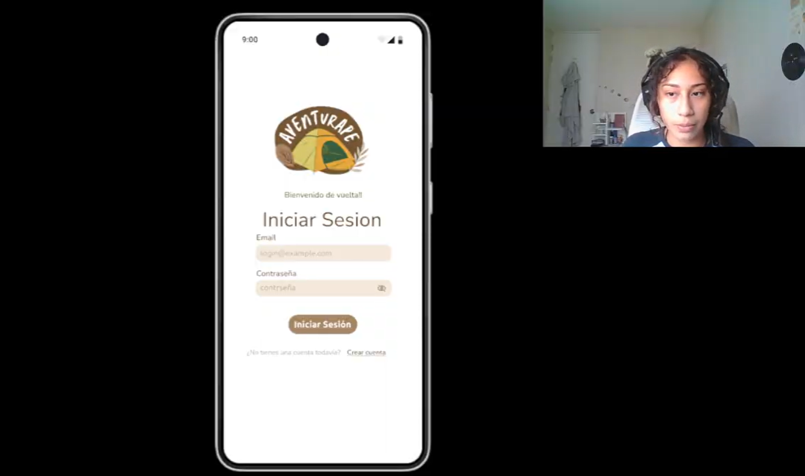

### 4.5.2. iOS Mobile Applications Prototyping

**Inicio - Emprendedor:** La pantalla de inicio para el usuario emprendedor ofrece una vista rápida de sus publicaciones actuales y un botón destacado "Agregar actividad". 
**Inicio - Aventurero:** La página de inicio del aventurero es visualmente atractiva y funcional, presentando una lista de actividades recomendadas y populares basadas en la ubicación del usuario.

### **Funcionalidades**

**Sección Emprendedor**

- **Ver Publicaciones:** Permite al emprendedor revisar todas las actividades que ha creado en la aplicación.
- **Agregar Actividad:** Un botón claro y accesible para que los emprendedores añadan nuevas actividades o promociones.
- **Editar/Eliminar Actividades:** Funcionalidades que permiten la edición rápida o eliminación de publicaciones ya creadas.
- **Estadísticas de Actividades:** El emprendedor puede filtrar sus publicaciones por, más comentadas y mejor calificadas.

**Sección Aventurero**

- **Explorar Actividades:** Muestra una lista o tarjetas con actividades cercanas, destacando las más populares.
- **Buscar Actividades:** El aventurero puede utilizar una barra de búsqueda para encontrar actividades específicas.
- **Comentar y calificar:** El aventurero puede comentar en las actividades que desee y calificarlas.

**Video de explicación del flujo:**  
**ANEXO K:**
[https://drive.google.com/file/d/1uggz0v3AH3j-hx7pL0xatOB6yl6AihsS/view?usp=sharing](https://drive.google.com/file/d/1uggz0v3AH3j-hx7pL0xatOB6yl6AihsS/view?usp=sharing)
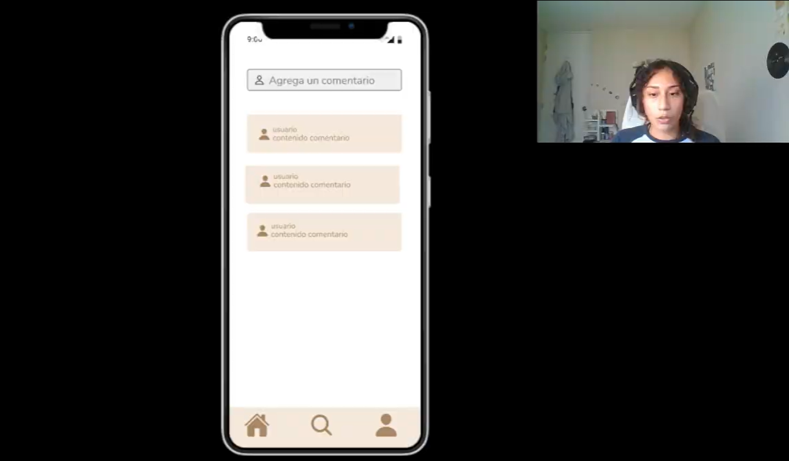
Los prototipos resultaron esenciales para anticipar problemas de usabilidad antes del desarrollo, permitiendo realizar iteraciones tempranas basadas en observación y comentarios reales. La consistencia entre plataformas y la claridad en las rutas de navegación facilitaron **la validación de las funcionalidades clave** para cada tipo de usuario.

## 4.6. Web Applications UX/UI Design

La experiencia de usuario (UX) y el diseño de interfaz (UI) para la plataforma web de *AventuraPe* han sido pensados para ofrecer una navegación sencilla, visualmente coherente y adaptada a las necesidades de sus dos tipos principales de usuarios: aventureros y empresarios. 

A lo largo de esta sección, se presentan los wireframes y wireflows que muestran cómo los usuarios interactúan con la plataforma en distintos escenarios clave. El objetivo es asegurar que cada pantalla y cada paso dentro del flujo de navegación sean intuitivos, accesibles y útiles, promoviendo una experiencia digital fluida desde el inicio de sesión hasta la ejecución de acciones específicas como publicar actividades, buscar aventuras o actualizar información personal.

### 4.6.1. Web Applications Wireframes

En esta sección se presentan los wireframes de la versión web de *AventuraPe*, organizados en función de los dos perfiles principales de usuario: **empresario** y **aventurero**. Cada diseño busca ofrecer una experiencia clara, coherente y centrada en las necesidades del usuario, asegurando una navegación intuitiva y fluida a lo largo de la plataforma.

## Sección de Empresario

**Inicio de sesión del empresario**  
Interfaz diseñada para facilitar el acceso rápido y seguro al panel del emprendedor.  
 

**Mi cuenta – Información personal del empresario**  
Permite al usuario gestionar sus datos personales y mantener su perfil actualizado.  
 

**Estadísticas de publicaciones**  
Vista con métricas sobre el rendimiento de las actividades publicadas, para facilitar la toma de decisiones.  
 

**Formulario para publicar una nueva actividad**  
Pantalla diseñada para que los empresarios puedan registrar y promocionar nuevas experiencias.  
 

**Galería principal del empresario**  
Sección visual destacada en la página de inicio del empresario, que muestra contenido clave.  
 

## Sección de Aventurero

**Pantalla de selección de tipo de cuenta**  
El usuario puede elegir entre crear una cuenta como aventurero o como empresario.  
 

**Inicio de sesión del aventurero**  
Diseño centrado en facilitar el acceso a la cuenta personal del usuario aventurero.  
 

**Pantalla principal tras inicio de sesión**  
Vista general del contenido destacado e información relevante para el usuario.  
 

**Sección de favoritos del aventurero**  
Muestra actividades guardadas por el usuario para una consulta rápida posterior.  
 

**Exploración y búsqueda de actividades**  
Diseño que permite filtrar, ordenar y explorar aventuras disponibles en la plataforma.  
 

**Detalle de publicación de una actividad**  
Pantalla donde el usuario puede conocer más información sobre una actividad específica.  
 

**Mi cuenta – Información personal del aventurero**  
Permite al usuario gestionar sus datos y modificar configuraciones de su cuenta.  
 

### 4.6.2. Web Applications Wireflow Diagrams
Esta sección presenta los diagramas de wireflow correspondientes a la versión web de *AventuraPe*, diseñados tanto para usuarios aventureros como para emprendedores. Cada flujo de navegación representa una necesidad específica del usuario, permitiéndole lograr sus objetivos de manera clara, eficiente y centrada en una experiencia digital intuitiva.

#### Sección de Aventurero

**User Goal:** Como aventurero, quiero ingresar a mi cuenta en AventuraPe,  
**para** acceder a todas las funcionalidades personalizadas dentro de la plataforma.  
 

**User Goal:** Como aventurero, navegar en la sección Home,  
**para** explorar de forma general las actividades disponibles y novedades destacadas.  
 

**User Goal:** Como aventurero, quiero buscar alguna actividad de mi interés,  
**para** encontrar experiencias que se alineen con mis preferencias y ubicación.  
 

**User Goal:** Como aventurero, quiero filtrar mi búsqueda,  
**para** refinar los resultados y encontrar exactamente lo que deseo realizar.  
 

**User Goal:** Como aventurero, quiero calificar la actividad que realicé,  
**para** compartir mi experiencia con otros usuarios y contribuir al sistema de reputación.  
 

**User Goal:** Como aventurero, quiero actualizar mis datos personales de mi cuenta,  
**para** mantener mi perfil actualizado y seguro.  
 

#### Sección de Empresario

**User Goal:** Como emprendedor, quiero ingresar a mi cuenta en AventuraPe,  
**para** gestionar mis actividades y acceder al panel de administración de mi negocio.  
 

**User Goal:** Como emprendedor, quiero publicar una actividad para mi local,  
**para** promocionar nuevas experiencias o eventos a través de la plataforma.  
 

**User Goal:** Como emprendedor, quiero ver las mejores publicaciones que tuve,  
**para** analizar el rendimiento y popularidad de mis ofertas anteriores.  
 

**User Goal:** Como emprendedor, quiero actualizar los datos de mi local,  
**para** asegurarme de que la información mostrada a los usuarios sea precisa y actualizada.  
 

### 4.6.3. Web Applications Mock-ups
En esta sección se presentan los mock-ups de alta fidelidad desarrollados para la plataforma *AventuraPe*. Estas vistas permiten visualizar cómo lucirá la interfaz web tanto para usuarios aventureros como para emprendedores, simulando su interacción real con la plataforma. El diseño se enfoca en ofrecer una experiencia fluida, accesible y visualmente atractiva.

#### Elección de rol
**Pantalla de selección de tipo de cuenta (Aventurero o Emprendedor)**  
 

#### Mock-ups para Usuario Emprendedor
**Registro del empresario**  
 

**Suscripción a un plan**  
 

**Subida de comprobante de validación del negocio**  
 

**Pantalla de inicio del empresario**  
 

**Agregar nueva actividad**  
 

**Mi cuenta - perfil del empresario**  
 

**Estadísticas de publicaciones**  
 

#### Mock-ups para Usuario Aventurero

**Registro del aventurero**  
 

**Inicio de sesión del aventurero**  
 

**Inicio de la interfaz del aventurero**  
 

**Búsqueda de actividades**  
 

**Favoritos - Mejores aventuras guardadas**  
 

**Detalle de actividad**  
 

**Mi cuenta del aventurero**  
 

### 4.6.4. Web Applications User Flow Diagrams
A continuación, se presentan los diagramas de flujo de usuario (User Flow) para la plataforma web de *AventuraPe*, diferenciados según el tipo de usuario: **Aventurero** y **Emprendedor**. Estos flujos reflejan los pasos que cada usuario debe seguir para lograr objetivos clave dentro de la plataforma, asegurando una navegación clara, eficiente y alineada con sus necesidades.

#### Usuario Aventurero
**User Goal:** Como aventurero, quiero ingresar a mi cuenta en *AventuraPe* para acceder a las funcionalidades personalizadas de la plataforma.  
 

**User Goal:** Como aventurero, quiero navegar en la sección *Home* para descubrir actividades destacadas y novedades.  
 

**User Goal:** Como aventurero, quiero buscar alguna actividad de mi interés para planificar mi próxima experiencia.  
 

**User Goal:** Como aventurero, quiero filtrar mi búsqueda para encontrar opciones que se ajusten a mis preferencias.  
 

**User Goal:** Como aventurero, quiero calificar y comentar la actividad que realicé para aportar retroalimentación a otros usuarios.  
 

**User Goal:** Como aventurero, quiero actualizar mis datos personales de mi cuenta para mantener mi perfil al día.  
 

**User Goal:** Como aventurero, quiero guardar en favoritos las publicaciones que me gustaron para acceder a ellas rápidamente en el futuro.  
 

#### Usuario Emprendedor

**User Goal:** Como emprendedor, quiero ingresar a mi cuenta en *AventuraPe* para gestionar mi perfil y mis actividades publicadas.  
 

**User Goal:** Como emprendedor, quiero publicar una actividad para mi local para atraer a nuevos aventureros.  
 

**User Goal:** Como emprendedor, quiero ver las mejores publicaciones que tuve para analizar su rendimiento y mejorar mi oferta.  
 

**User Goal:** Como emprendedor, quiero actualizar los datos de mi local para que la información mostrada esté siempre actualizada.  
 

**User Goal:** Como emprendedor, quiero crear mi cuenta en *AventuraPe* para comenzar a publicar y gestionar mis actividades.  
 

## 4.7. Web Applications Prototyping

**Inicio - Emprendedor:** La pantalla de inicio para el usuario emprendedor ofrece una vista rápida de sus publicaciones actuales y un botón destacado "Agregar actividad". 
**Inicio - Aventurero:** La página de inicio del aventurero es visualmente atractiva y funcional, presentando una lista de actividades recomendadas y populares basadas en la ubicación del usuario.

### **Funcionalidades**

**Sección Emprendedor**

- **Ver Publicaciones:** Permite al emprendedor revisar todas las actividades que ha creado en la aplicación.
- **Agregar Actividad:** Un botón claro y accesible para que los emprendedores añadan nuevas actividades o promociones.
- **Editar/Eliminar Actividades:** Funcionalidades que permiten la edición rápida o eliminación de publicaciones ya creadas.
- **Estadísticas de Actividades:** El emprendedor puede filtrar sus publicaciones por, más comentadas y mejor calificadas.

**Sección Aventurero**

- **Explorar Actividades:** Muestra una lista o tarjetas con actividades cercanas, destacando las más populares.
- **Buscar Actividades:** El aventurero puede utilizar una barra de búsqueda para encontrar actividades específicas.
- **Comentar y calificar:** El aventurero puede comentar en las actividades que desee y calificarlas.

**Video de explicación del flujo:** 
**ANEXO L:**
[https://drive.google.com/file/d/12urYf_hGV8UgoOGzn-Dvs7sSAo41HFxj/view?usp=sharing](https://drive.google.com/file/d/12urYf_hGV8UgoOGzn-Dvs7sSAo41HFxj/view?usp=sharing)
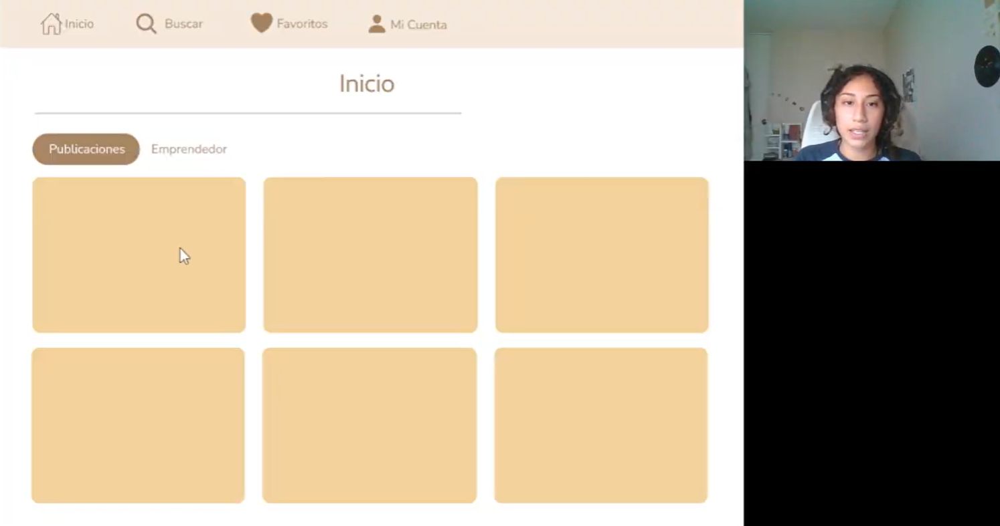

## 4.8. Domain-Driven Software Architecture  
### 4.8.1. Software Architecture Context Diagram  
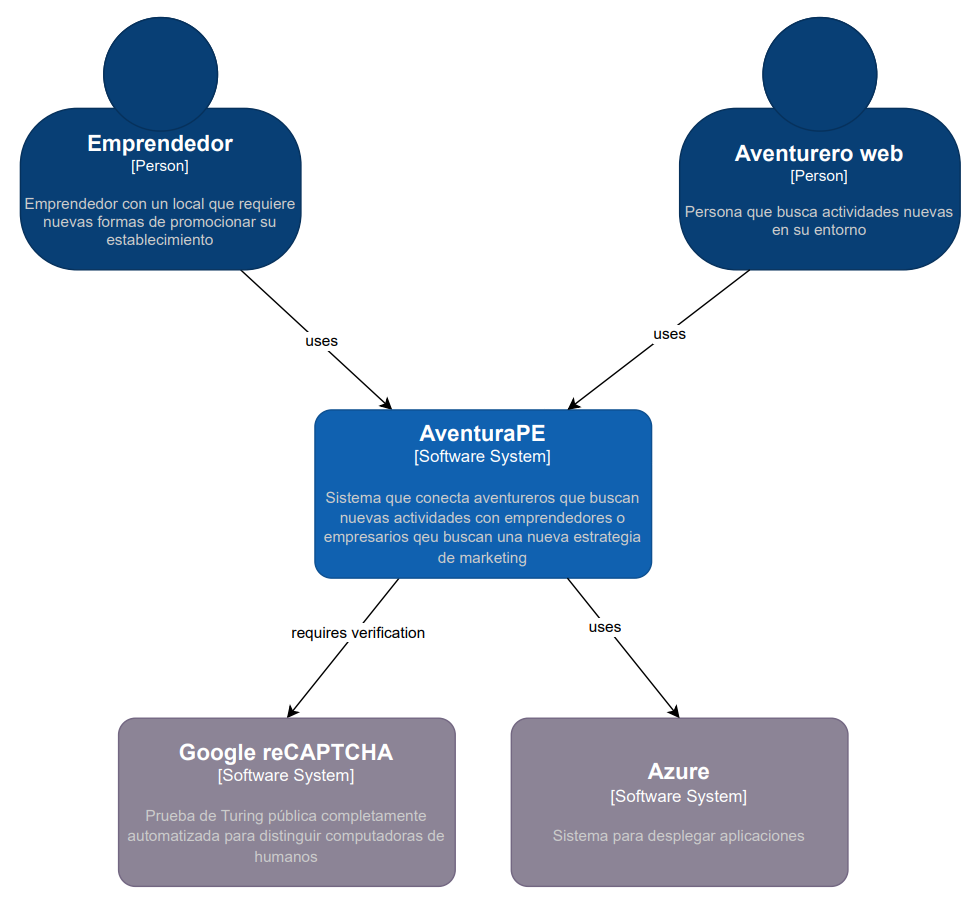

### 4.8.2. Software Architecture Container Diagrams
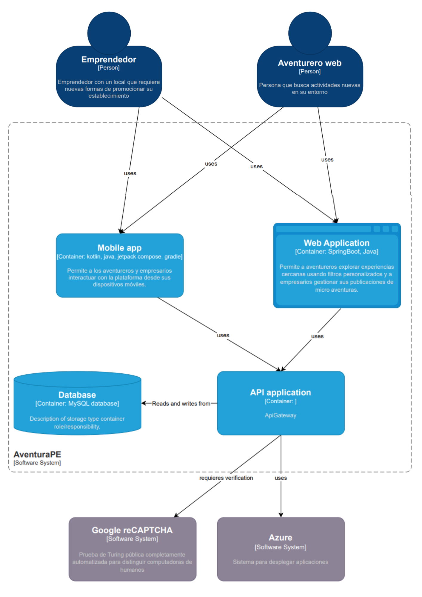

### 4.8.3. Software Architecture Components Diagrams  
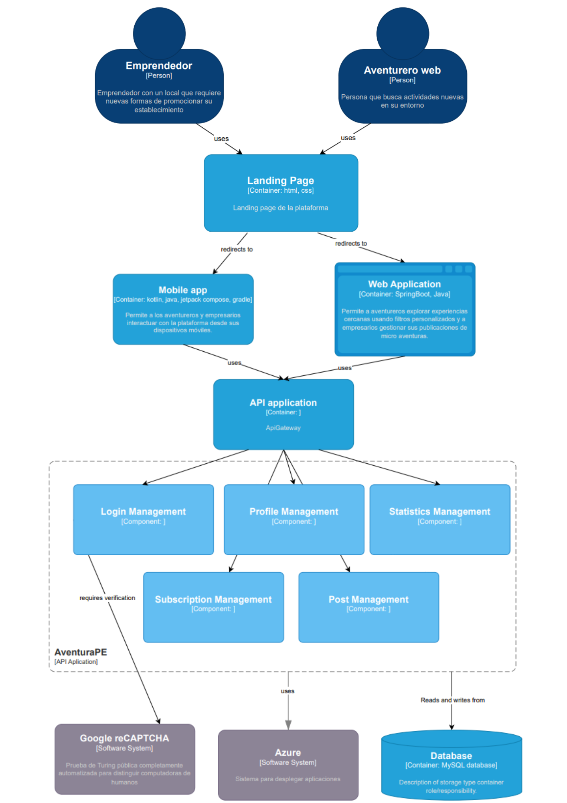

## 4.9. Software Object-Oriented Design  
### 4.9.1. Class Diagrams

### 4.9.2. Class Dictionary

#### User
Representa un usuario del sistema con credenciales de acceso.
- **id**: Identificador único del usuario
- **username**: Nombre de usuario para acceder al sistema
- **password**: Contraseña para autenticación
- **role**: Rol asignado al usuario (puede ser empresario o aventurero)
- **Operaciones**:
  - **register()**: Registra un nuevo usuario en el sistema
  - **login()**: Inicia sesión en el sistema
  - **logout()**: Cierra la sesión del usuario
  - **manageProfile()**: Gestiona la información del perfil

#### Role
Define los roles disponibles en el sistema.
- **id**: Identificador único del rol
- **roleName**: Nombre del rol (ej. administrador, empresario, aventurero)
- **Operaciones**:
  - **assignToUser()**: Asigna un rol a un usuario
  - **removeFromUser()**: Elimina un rol de un usuario

#### Company
Representa un negocio o emprendimiento registrado en la plataforma.
- **id**: Identificador único de la empresa
- **name**: Nombre de la empresa
- **userId**: Identificador del usuario asociado (dueño o administrador)
- **Operaciones**:
  - **registerCompany()**: Registra una nueva empresa
  - **updateProfile()**: Actualiza la información del perfil empresarial
  - **viewStatistics()**: Visualiza estadísticas de actividades y reseñas

#### Adventurous
Representa un usuario consumidor que busca actividades locales.
- **id**: Identificador único del aventurero
- **name**: Nombre del usuario aventurero
- **lastName**: Apellido del usuario aventurero
- **birthday**: Fecha de nacimiento
- **userId**: Identificador del usuario asociado
- **Operaciones**:
  - **updateProfile()**: Actualiza la información personal
  - **viewFavorites()**: Visualiza actividades guardadas como favoritas
  - **rateActivity()**: Califica una actividad

#### Activity
Representa una actividad o evento publicado por una empresa.
- **id**: Identificador único de la actividad
- **name**: Nombre de la actividad
- **description**: Descripción detallada
- **duration**: Duración aproximada
- **quantityPerson**: Capacidad de personas
- **price**: Precio de la actividad
- **companyId**: Identificador de la empresa que publica
- **addressId**: Identificador de la ubicación
- **Operaciones**:
  - **createActivity()**: Crea una nueva actividad
  - **updateActivity()**: Actualiza información de la actividad
  - **deleteActivity()**: Elimina una actividad
  - **viewStatistics()**: Visualiza estadísticas de la actividad

#### Review
Representa una reseña o comentario sobre una actividad.
- **id**: Identificador único de la reseña
- **adventurousId**: Identificador del aventurero que escribe
- **activityId**: Identificador de la actividad reseñada
- **rating**: Calificación numérica
- **description**: Comentario descriptivo
- **Operaciones**:
  - **createReview()**: Crea una nueva reseña
  - **updateReview()**: Actualiza una reseña existente
  - **deleteReview()**: Elimina una reseña

#### Photo
Representa imágenes asociadas a una actividad.
- **id**: Identificador único de la foto
- **photoLink**: Enlace a la imagen almacenada
- **activityId**: Identificador de la actividad relacionada
- **Operaciones**:
  - **uploadPhoto()**: Sube una nueva foto
  - **deletePhoto()**: Elimina una foto

#### Address
Representa la ubicación física de una actividad.
- **id**: Identificador único de la dirección
- **streetDescription**: Descripción de calle y número
- **cityId**: Identificador de la ciudad
- **Operaciones**:
  - **createAddress()**: Crea una nueva dirección
  - **updateAddress()**: Actualiza una dirección existente

#### City
Representa una ciudad donde se ubican las actividades.
- **id**: Identificador único de la ciudad
- **cityName**: Nombre de la ciudad
- **countryId**: Identificador del país

#### Country
Representa un país en el sistema.
- **id**: Identificador único del país
- **countryName**: Nombre del país

#### Favorite
Representa una actividad marcada como favorita por un usuario.
- **adventurousId**: Identificador del aventurero
- **activityId**: Identificador de la actividad favorita
- **Operaciones**:
  - **addFavorite()**: Añade una actividad a favoritos
  - **removeFavorite()**: Elimina una actividad de favoritos

#### SubscriptionPlan
Define los planes de suscripción disponibles para empresas.
- **id**: Identificador único del plan
- **name**: Nombre del plan
- **priceMonthly**: Precio mensual
- **features**: Características incluidas
- **Operaciones**:
  - **createPlan()**: Crea un nuevo plan
  - **updatePlan()**: Actualiza un plan existente
  - **deletePlan()**: Elimina un plan

#### CompanySubscription
Representa la suscripción de una empresa a un plan.
- **id**: Identificador único de la suscripción
- **companyId**: Identificador de la empresa
- **startDate**: Fecha de inicio
- **endDate**: Fecha de finalización
- **trialEndDate**: Fecha de finalización del período de prueba
- **subscriptionPlanId**: Identificador del plan suscrito
- **Operaciones**:
  - **subscribe()**: Suscribe una empresa a un plan
  - **renewSubscription()**: Renueva una suscripción
  - **cancelSubscription()**: Cancela una suscripción

#### PaymentReceipt
Representa un comprobante de pago por una suscripción.
- **id**: Identificador único del recibo
- **companySubscriptionId**: Identificador de la suscripción
- **amount**: Monto pagado
- **paymentDate**: Fecha del pago
- **receiptFilePath**: Ruta al archivo del comprobante
- **verificationStatus**: Estado de verificación del pago
- **verificationDate**: Fecha de verificación
- **Operaciones**:
  - **generateReceipt()**: Genera un nuevo recibo
  - **verifyPayment()**: Verifica el estado del pago

#### Statistics
Representa un informe estadístico generado para una empresa.
- **id**: Identificador único del informe estadístico.
- **companyId**: Identificador de la empresa propietaria del informe.
- **reportType**: Tipo de informe estadístico
- **parameters**: Parámetros utilizados para generar el informe.
- Operaciones:
  - **filterByTopRated**: Filtra los posts de la empresa por calificación y devuelve los mejor calificados.
  - **filterByMostCommented**: Filtra los posts de la empresa por número de comentarios.

#### PostStatistics
Representa la relación entre un informe estadístico y los posts incluidos en él.

- **id**: Identificador único de la estadística de post.
- **statisticsId**: Identificador del informe estadístico al que pertenece.
- **postId**: Identificador del post incluido en las estadísticas.
- **ranking**: Posición del post en el ranking generado.
- **metricValue**: Valor numérico de la métrica utilizada
- **Operaciones**:
  - **getPostDetails**: Obtiene información detallada del post asociado.

## 4.10. Database Design  
### 4.10.1. Relational/Non-Relational Database Diagram
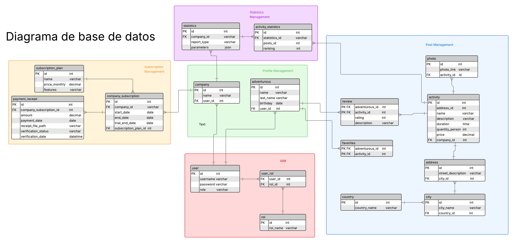

# Capítulo V: Product Implementation

## 5.1. Software Configuration Management  
### 5.1.1. Software Development Environment Configuration  

Antes de iniciar el desarrollo de AventuraPe, establecimos una configuración clara de los **entornos de desarrollo para cada componente del sistema**, asegurando la compatibilidad y eficiencia del flujo de trabajo del equipo.

### Requisitos y Stack Tecnológico Seleccionado

Basados en las necesidades de nuestra aplicación, seleccionamos el siguiente stack tecnológico:

- **Frontend Web**: Node.js con TypeScript para una experiencia de usuario fluida e interactiva
- **Frontend Móvil**: Kotlin con Jetpack Compose para una aplicación Android moderna
- **Backend**: Java con Spring Boot para una arquitectura escalable y robusta
- **Base de datos**: PostgreSQL para almacenamiento relacional de datos
- **Documentación API**: Swagger para endpoints RESTful

### Entornos de Desarrollo Configurados

#### Frontend Web
- **IDE**: WebStorm 2023.1
- **Propósito**: Desarrollo de la interfaz web y gestión de dependencias JS
- **Ruta de descarga**: https://www.jetbrains.com/webstorm/
- **Tecnologías principales**: Node.js, TypeScript, React

#### Frontend Móvil
- **IDE**: Android Studio Hedgehog (2023.1.1)
- **Propósito**: Desarrollo de la aplicación Android nativa
- **Ruta de descarga**: https://developer.android.com/studio
- **Tecnologías principales**: Kotlin, Jetpack Compose, Material Design 3

#### Landing Page
- **IDE**: Visual Studio Code 1.77
- **Propósito**: Desarrollo de landing page estática con HTML, CSS y JavaScript
- **Ruta de descarga**: https://code.visualstudio.com/
- **Despliegue**: GitHub Pages (automáticamente mediante GitHub Actions)

#### Backend
- **IDE**: IntelliJ IDEA 2023.1 (Ultimate Edition)
- **Propósito**: Desarrollo de servicios RESTful y lógica de negocio
- **Ruta de descarga**: https://www.jetbrains.com/idea/
- **Tecnologías principales**: Spring Boot 3.2, Java 17, JPA/Hibernate

#### Control de Versiones
- **Herramienta**: Git 2.40.0
- **Repositorio**: https://github.com/upc-pre-202510-1ASI0732-4438-AventuraPE
- **Estrategia de ramificación**: GitFlow (main, develop, feature/*)

### Herramientas de Diseño y Pruebas

- **Diseño UI/UX**: 
  - **Herramienta**: Figma
  - **Propósito**: Mockups, wireframes y prototipos
  - **URL**: https://www.figma.com/design/XnZ4CmnkLFbmhpGQej7d7W/AventuraPe?node-id=0-1&t=2PMCISPv6qm1ZGJR-1 

- **Pruebas de API**:
  - **Herramienta**: Swagger UI integrado
  - **Propósito**: Documentación y prueba de endpoints RESTful
  - **URL local**: http://localhost:8090/swagger-ui/index.html

### Estado Actual de Despliegue

Actualmente, nuestros entornos funcionan de la siguiente manera:

- **Landing Page**: Desplegada en producción mediante GitHub Pages
- **Aplicación Web**: Ejecución local con servidor de desarrollo (npm run dev)
- **Aplicación Móvil**: Ejecución en emulador Android o dispositivos físicos vía USB
- **Backend**: Ejecutándose localmente en http://localhost:8090
- **Base de datos**: PostgreSQL local en puerto predeterminado

Esta configuración nos permite desarrollar de manera eficiente mientras mantenemos un control preciso sobre cada componente del sistema, facilitando la colaboración entre los miembros del equipo y una integración fluida de los diferentes módulos.

### 5.1.2. Source Code Management 

En esta sección, nuestro equipo establece los medios y el esquema de organización que aplicará para el seguimiento de modificaciones, utilizando GitHub como plataforma y sistema de control de versiones.

### Repositorios

Configuramos diversos repositorios remotos en GitHub para almacenar el código fuente y facilitar la colaboración entre los miembros del equipo. Los URLs de los repositorios son los siguientes:

- **Landing Page:** https://github.com/upc-pre-202510-1ASI0732-4438-AventuraPE/AventuraPE-landing 
- **Frontend App Web:** https://github.com/upc-pre-202510-1ASI0732-4438-AventuraPE/aventurape-web-app 
- **Frontend App Mobile:** https://github.com/upc-pre-202510-1ASI0732-4438-AventuraPE/AventuraPE-mobile-app 
- **Backend:** https://github.com/upc-pre-202510-1ASI0732-4438-AventuraPE/AventurePe-Backend 

### Estructura del Repositorio

Organizamos cada repositorio en ramas específicas para diferentes entornos de desarrollo. Las ramas principales y su propósito son:

- **Main branch (rama principal):** Contiene la versión estable de producción.
- **Develop branch:** Contiene el código en desarrollo, que eventualmente será fusionado en la rama principal.

Implementamos GitFlow siguiendo el modelo descrito por Vincent Driessen, lo que nos permite mantener un flujo de trabajo ordenado y eficiente:

- **Feature branches:** Se crean a partir de develop para implementar nuevas funcionalidades. Nomenclatura: `feature/<nombre-funcionalidad>`
- **Hotfix branches:** Para correcciones urgentes sobre la rama principal. Nomenclatura: `hotfix/<descripción-error>`
- **Release branches:** Para preparar lanzamientos específicos. Nomenclatura: `release/v<versión>`

### Convenciones de Nomenclatura

Aplicamos semantic versioning para nombrar nuestras releases siguiendo el esquema vMAJOR.MINOR.PATCH (por ejemplo, v1.0.0):

- **MAJOR:** Cambios incompatibles con versiones anteriores
- **MINOR:** Nuevas funcionalidades compatibles con versiones anteriores
- **PATCH:** Correcciones de errores compatibles con versiones anteriores

### Mensajes de Commits

Utilizamos Conventional Commits para estandarizar los mensajes en nuestros commits, lo que facilita la generación automática de changelogs y mejora la legibilidad del historial del proyecto. Algunos ejemplos de mensajes de commits son:

- `feat: implementar autenticación de usuario aventurero`
- `fix: corregir validación en formulario de registro`
- `docs: actualizar documentación de API de publicaciones`
- `style: aplicar formato consistente al código de componentes`
- `refactor: optimizar módulo de filtrado de actividades`
- `test: añadir pruebas unitarias para servicio de calificaciones`

### Backup y Recuperación

Implementamos las siguientes estrategias para proteger nuestro código:
- Backups automáticos semanales de todos los repositorios
- Uso de GitHub Actions para exportar y almacenar versiones críticas en almacenamiento externo
- Política de no eliminación de ramas principales sin aprobación del equipo completo

### Monitoreo y Control

Utilizamos las siguientes herramientas para mantener la calidad del código y seguimiento de cambios:
- GitHub Issues para tracking de tareas y bugs
- Pull Requests obligatorios con al menos una aprobación antes de fusionar código
- GitHub Actions para verificación automática de estilo de código y tests

Esta estructura de gestión de código nos permite mantener un desarrollo ordenado, colaborativo y con capacidad de respuesta rápida ante necesidades del proyecto.

### 5.1.3. Source Code Style Guide & Conventions  

Para mantener un código limpio, legible y fácil de mantener en equipo, hemos definido guías de estilo específicas por tecnología, complementadas con linters automáticos y convenciones de nomenclatura. Estas prácticas se alinean con los principios de *Clean Code* y las recomendaciones de la comunidad técnica para cada stack tecnológico utilizado en AventuraPe.

### **Frontend Web (Node.js con TypeScript)**
- **Nomenclatura y estructura:**
  - **CamelCase** para variables y funciones (`handleClick`, `userList`)
  - **PascalCase** para nombres de componentes (`UserCard`, `ActivityCard`)
  - Separación lógica de hooks y lógica de presentación en archivos distintos
  - Nombres descriptivos y significativos para variables y funciones

### **Frontend Móvil (Kotlin con Jetpack Compose)**
- **Convenciones de Kotlin:**
  - Nombres claros, concisos y expresivos
  - Nombres de vistas en XML en snake_case (`btn_register`, `txt_user_email`)
  - Clases y funciones en PascalCase y camelCase respectivamente

- **Arquitectura y estructura:**
  - Arquitectura MVVM (Model-View-ViewModel)
  - Separación clara entre `ViewModel`, `Repository` y componentes UI
  - Composables aislados y reusables

### **Backend (Java con Spring Boot)**
- **Convenciones de Java y Spring:**
  - Clases en **PascalCase** (`UserService`, `PublicationController`)
  - Variables y métodos en **camelCase** (`getPublications()`, `userId`)
  - Constantes en UPPERCASE_SNAKE_CASE (`MAX_RETRY_COUNT`)
  - Separación en capas: `controller`, `service`, `repository`, `model`, `exception`

- **Documentación:**
  - Comentarios Javadoc (`/** */`) en todos los servicios y endpoints
  - Anotaciones claras para mapeos REST (`@GetMapping`, `@PostMapping`)
  - Respuestas HTTP documentadas con códigos apropiados

- **Gestión de excepciones:**
  - Centralización de manejo de excepciones
  - Mensajes de error descriptivos y apropiados para el cliente

### **Landing Page (HTML/CSS/JavaScript)**
- **HTML:**
  - Uso de etiquetas semánticas (`<header>`, `<nav>`, `<main>`, `<footer>`)
  - Indentación consistente para mejorar legibilidad
  - Atributos alt descriptivos para imágenes
  
- **CSS:**
  - Preferencia por clases sobre IDs para estilos reutilizables
  - Uso de variables CSS para colores, fuentes y dimensiones clave
  - Medidas relativas (`em`, `rem`, `%`) para mejorar responsividad

- **JavaScript:**
  - Funciones con propósito único y bien definido
  - Evitar código global utilizando módulos ES6

### **General**
- **Control de versiones:**
  - Commits pequeños y enfocados en una sola tarea
  - Mensajes de commit descriptivos siguiendo Conventional Commits
  - Pull requests documentados con descripción clara de los cambios

Estas convenciones son aplicadas de forma continua mediante revisión manual por parte del equipo **antes de cada merge a la rama `develop`**, asegurando la calidad y consistencia del código en todo el proyecto AventuraPe.

### 5.1.4. Software Deployment Configuration  
Actualmente, el único módulo desplegado en producción es la Landing Page, la cual se publica automáticamente mediante GitHub Actions a través de GitHub Pages. Este despliegue ocurre tras cada push a la rama main, garantizando acceso inmediato a la última versión.
 - El backend RESTful y la aplicación frontend web aún no han sido desplegados en un entorno público. Ambos se ejecutan de forma local para pruebas y desarrollo:
 - Backend: Spring Boot 3.2 corriendo en localhost (http://localhost:8090) con base de datos PostgreSQL.
 - Frontend Web: ejecutado localmente vía servidor de desarrollo (npm run dev).

## 5.2. Product Implementation & Deployment  

### 5.2.1 Sprint Backlogs

### Sprint 1 – Objetivo
**Objetivo del Sprint:** Publicar una versión mínima viable (MVP) de la landing page de AventuraPe, con navegación completa e información esencial visible para visitantes.

**Criterio de éxito:** Se considera completo cuando un usuario puede visitar la landing, acceder a las secciones "Sobre Nosotros", "Servicios", "FAQ", "Testimonios" y "Contacto", y navegar sin errores desde un navegador web.

### Sprint Backlog – Sprint 1

| User Story | Task ID | Tarea Técnica | Estimación (hrs) | Responsable | Estado |
|------------|---------|---------------|------------------|-------------|--------|
| US01 | TSK-01 | Diseñar estructura base de la landing page en HTML/CSS | 3 | Jimena y Barbara | Done |
| US01 | TSK-02 | Implementar navegación con anclas e íconos interactivos | 2 | Jair | Done |
| US02 | TSK-03 | Diseñar sección de servicios con cards y botones de acción | 4 | Jimena y Barbara | Done |
| US04 | TSK-04 | Codificar sección "Sobre Nosotros" con diseño responsive | 3 | Jair | Done |
| US05 | TSK-05 | Implementar sección de testimonios en carrusel dinámico | 5 | Jimena | Done |
| US06 | TSK-06 | Programar sección de contacto con validación de formulario | 4 | Jimena y Jair| Done |
| US01 | TSK-07 | Configurar GitHub Pages + GitHub Actions para despliegue | 2 | Jimena y Barbara| Done |

### Sprint 2 – Objetivo

**Objetivo del Sprint:** Desarrollar e implementar funcionalidades de gestión de usuarios para aventureros: registro, inicio de sesión y visualización de actividades.

**Criterio de éxito:** El sistema debe permitir que un usuario aventurero se registre, inicie sesión y vea publicaciones desde el frontend, todo probado en entorno local.

### Sprint Backlog – Sprint 2 (Aventurero)

| User Story | Task ID | Tarea Técnica | Estimación (hrs) | Responsable | Estado |
|------------|---------|---------------|------------------|-------------|--------|
| US04 | TSK-08 | Crear formulario de login (frontend) con validaciones | 4 | Stefano | Done (local) |
| US06 | TSK-09 | Backend: endpoint POST `/sign-up` con validaciones | 4 | Stefano | Done (local) |
| US11 | TSK-10 | Visualizar mapa interactivo en app móvil (dummy data) | 6 | Stefano | In Progress |
| US12 | TSK-11 | Implementar búsqueda de actividades (frontend móvil) | 4 | Barbara | Done (local) |
| US13 | TSK-12 | Agregar funcionalidad de filtro por nombre | 4 | Jair | In Progress (local) |
| US17 | TSK-13 | Backend: guardar favoritos en lista personal | 3 | Barbara | In Progress |

## Sprint 3 – Objetivo

**Objetivo del Sprint:** Implementar funcionalidades principales para usuarios empresarios: publicar, editar y eliminar actividades, además de visualizar estadísticas.

**Criterio de éxito:** El empresario puede gestionar sus publicaciones desde el frontend móvil y visualizar sus estadísticas generales, todo en entorno local.

### Sprint Backlog – Sprint 3 (Empresario)

| User Story | Task ID | Tarea Técnica | Estimación (hrs) | Responsable | Estado |
|------------|---------|---------------|------------------|-------------|--------|
| US08 | TSK-14 | Crear formulario de publicación de actividades | 5 | Barbara | Done (local) |
| US09 | TSK-15 | Implementar flujo de edición (form + vista previa) | 4 | Jimena | Done (local) |
| US10 | TSK-16 | Backend: lógica para eliminar publicaciones | 3 | Barbara | Done (local) |
| US19 | TSK-17 | Dashboard estadístico: visitas y comentarios por publicación | 5 | Jose | Done (local) |
| US05 | TSK-18 | Login empresario con validación de credenciales | 3 | Stefano | Done (local) |

## Enlace al tablero Trello del proyecto

**Trello URL público:**  
[https://trello.com/invite/b/67fec4eb81fae4e3cb20bc4a/ATTIbaa9f91c96fe0bff5f0c939bfdaa9ee46306E3A0/1asi0732-2510-4438-grupo2](https://trello.com/invite/b/67fec4eb81fae4e3cb20bc4a/ATTIbaa9f91c96fe0bff5f0c939bfdaa9ee46306E3A0/1asi0732-2510-4438-grupo2)

### 5.2.2. Implemented Landing Page Evidence
#### *Link del despliegue de la landing:* https://aventurape-androidsoftware.github.io/AventuraPe_LandingPage/

### Evidencia de la Landing Page :
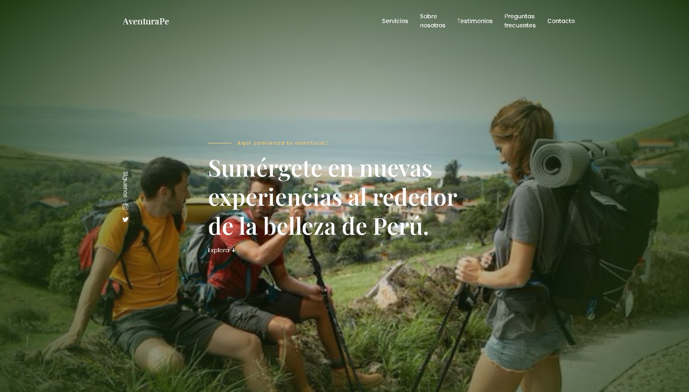</img> 

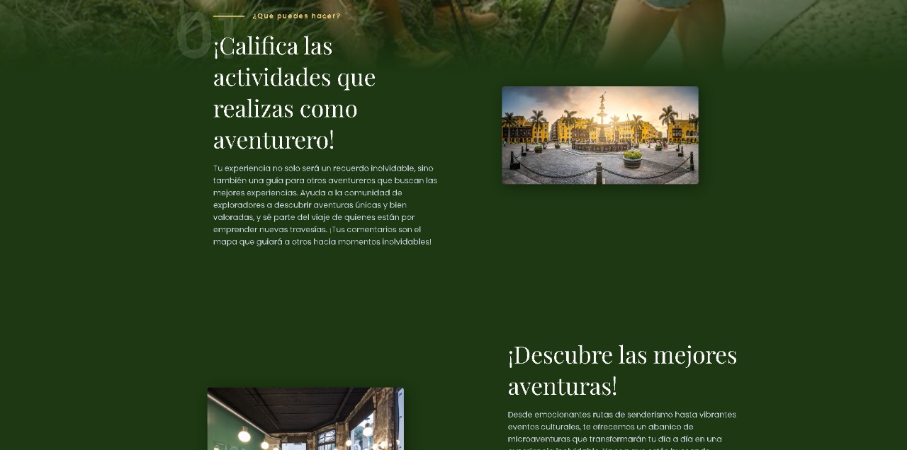</img> 

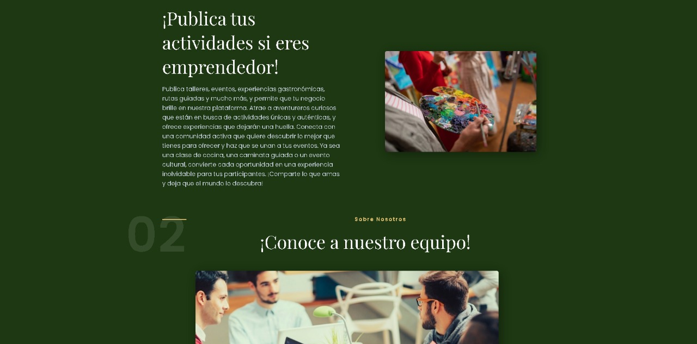</img> 

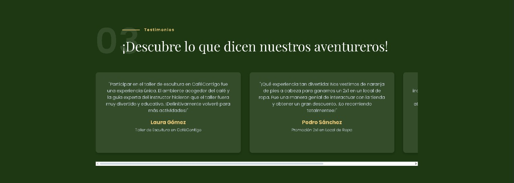</img> 

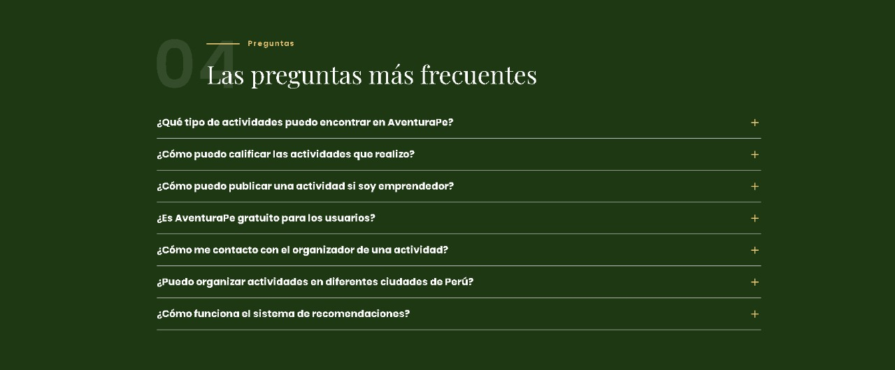</img> 

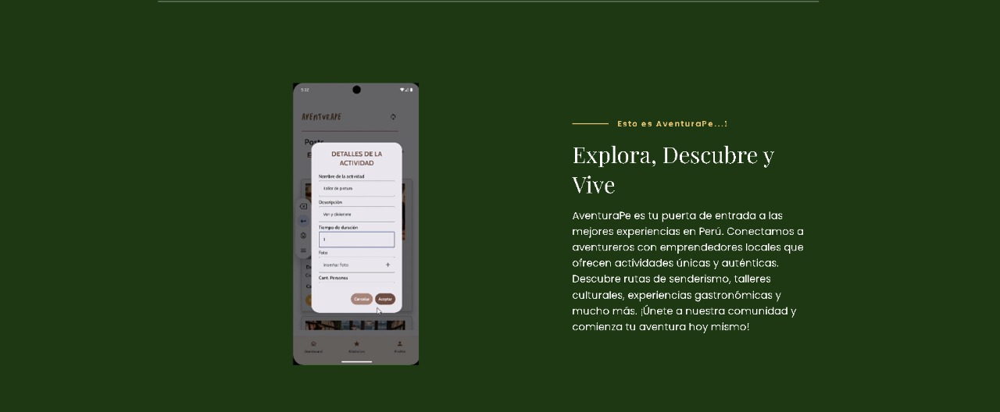</img> 

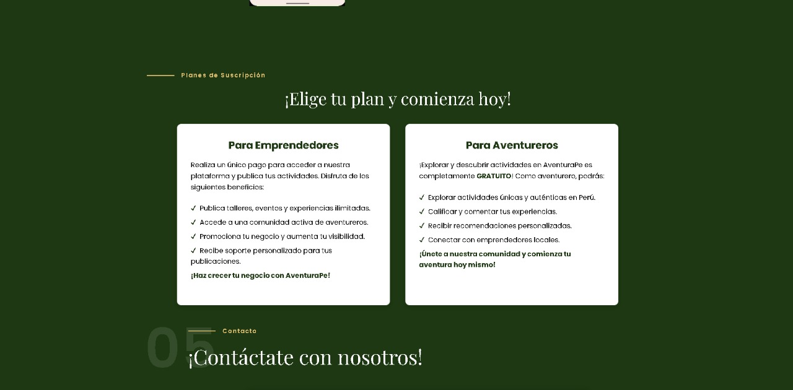</img> 

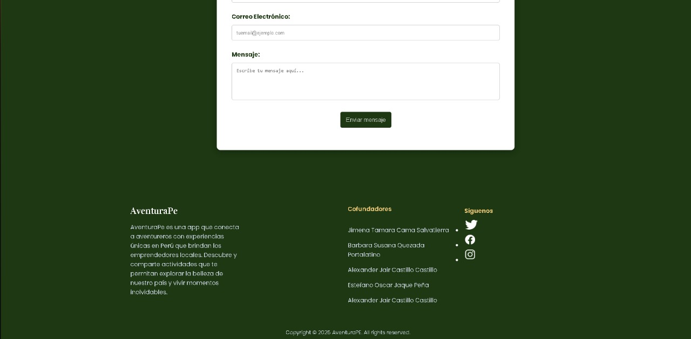</img> 

### 5.2.3. Implemented Frontend-Web Application Evidence  

### 5.2.4. Implemented Native-Mobile Application Evidence  

### Login Management
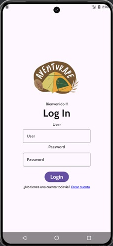</img> 

### Register Management
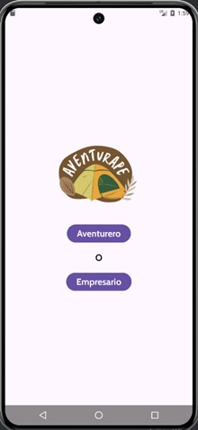</img> 

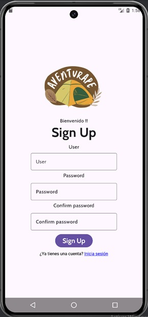</img> 

### Post Activity  Management
</img> 

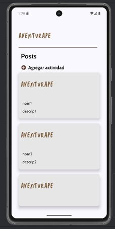</img> 

### Account Adventurer 
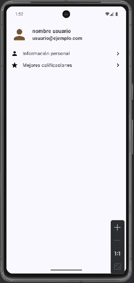</img> 

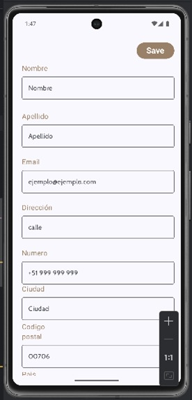</img> 

### Account Entrepreneur 
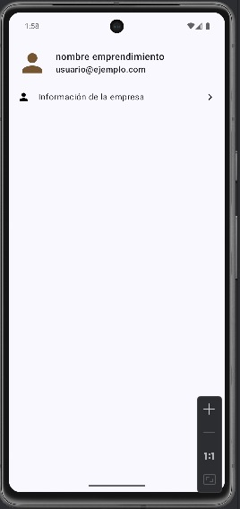</img> 

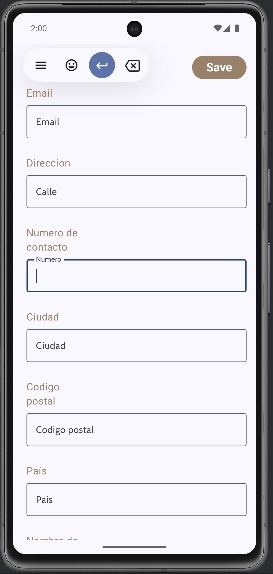</img> 

### All Publitacions
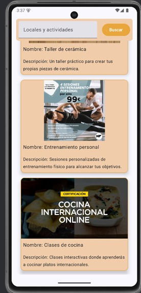</img> 

### Detail Publitacions
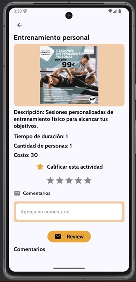</img> 

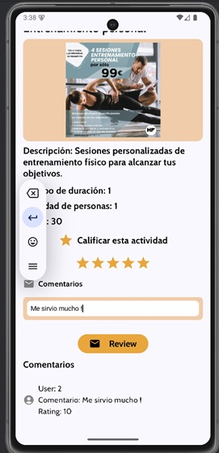</img> 

### 5.2.5. Implemented RESTful API and/or Serverless Backend Evidence  

Hemos añadido correctamente nuestros servicios web bajo una arquitectura RESTful, implementando correcciones en todos los endpoints existentes. Además, hemos añadido un nuevo endpoint llamado favorite-publications, que permite a los usuarios gestionar sus publicaciones favoritas de manera más eficiente.
La nueva funcionalidad de favorite-publications permite a los usuarios obtener, añadir y eliminar publicaciones de su lista de favoritos, mejorando la interacción con el contenido que más les interesa. La documentación de todos los endpoints está disponible a través de Swagger, lo que facilita la interacción con la API.

Acción | Endpoint | Detalles | Enlace
------- | -------- | -------- | --------
POST | /authentication/sign-up | Registro de un nuevo usuario | http://localhost:8090/swagger-ui/index.html#/  
 | /authentication/sign-in | Autenticación de usuario (inicio de sesión) |
 | /publication/{publicationId}/add-comment | Añadir comentario a una publicación específica |
 | /publication/create-publication | Crear una nueva publicación |
 | /profiles | Crear un nuevo perfil de usuario |
GET | /publication/{publicationId}/comments | Obtener comentarios de una publicación específica |
 | /publication/{entrepreneurId}/publications | Obtener todas las publicaciones de un emprendedor específico |
 | /publication/all-publications | Obtener todas las publicaciones disponibles |
 | /publication/all-comments | Obtener todos los comentarios |
 | /publication/{publicationId} | Obtener detalles de una publicación específica |
 | /profiles | Obtener todos los perfiles de usuarios |
 | /profiles/name/{name} | Buscar perfiles por nombre |
 | /profiles/location/{location} | Buscar perfiles por ubicación |
 | /profiles/id/{profileId} | Obtener perfil por ID específico |
PUT | /publication/{publicationId}/update-publication | Actualización de una publicación específica |
 | /profiles/{profileId} | Actualizar el perfil de un usuario específico |
DELETE | /publication/{publicationId}/delete-publication | Eliminar una publicación específica |

### 5.2.6. RESTful API documentation  
Utilizamos Swagger para documentar y probar los endpoints de la API de manera interactiva, lo que facilita a los desarrolladores la integración y verificación de los servicios RESTful.

### Api Documentation

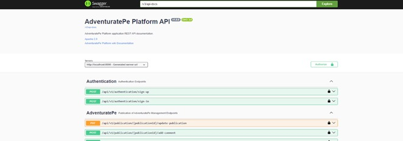</img> 

</img> 

</img> 

### Login Management
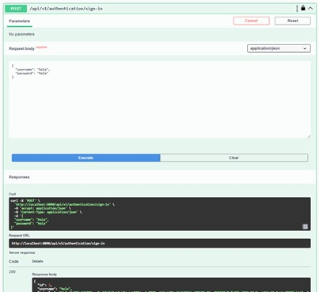</img> 

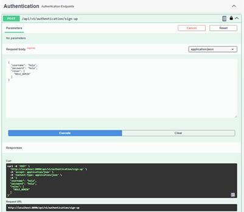</img> 

### Publication Management

</img> 

</img> 

</img> 

</img> 

</img> 

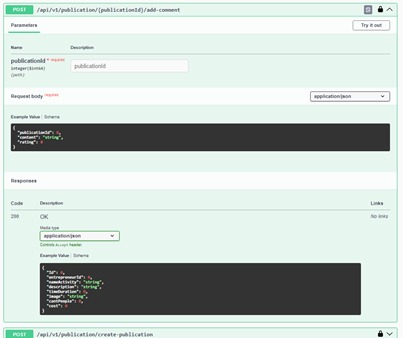</img> 

### Account Management

</img> 

</img> 

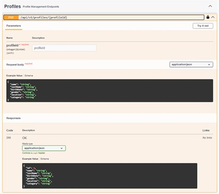</img> 

### User Management

</img> 

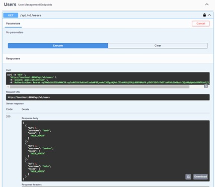</img> 

### Role Management

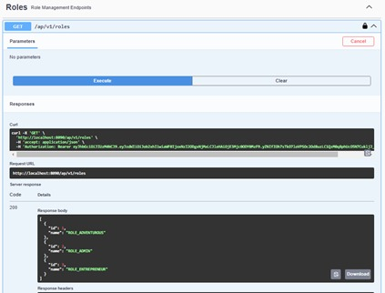</img> 

### 5.2.7. Team Collaboration Insights  
*Durante cada sprint, la colaboración efectiva dentro del equipo es fundamental para garantizar el éxito del proyecto. En el primer sprint, nuestro enfoque principal fue la implementación del backend.*

## 5.3. Video About-the-Product  

# Part II: Verification, Validation & Pipeline  

# Capítulo VI: Product Verification & Validation

## 6.1. Testing Suites & Validation  
### 6.1.1. Core Entities Unit Tests  
### 6.1.2. Core Integration Tests  
### 6.1.3. Core Behavior-Driven Development  
### 6.1.4. Core System Tests  

## 6.2. Static testing & Verification  
### 6.2.1. Static Code Analysis  
#### 6.2.1.1. Coding standard & Code conventions  
#### 6.2.1.2. Code Quality & Code Security  
### 6.2.2. Reviews  

## 6.3. Validation Interviews  
### 6.3.1. Diseño de Entrevistas  
### 6.3.2. Registro de Entrevistas  
### 6.3.3. Evaluaciones según heurísticas  

## 6.4. Auditoría de Experiencias de Usuario  
### 6.4.1. Auditoría realizada  
#### 6.4.1.1. Información del grupo auditado  
#### 6.4.1.2. Cronograma de auditoría realizada  
#### 6.4.1.3. Contenido de auditoría realizada  
### 6.4.2. Auditoría recibida  
#### 6.4.2.1. Información del grupo auditor  
#### 6.4.2.2. Cronograma de auditoría recibida  
#### 6.4.2.3. Contenido de auditoría recibida  
#### 6.4.2.4. Resumen de modificaciones para subsanar hallazgos  

# Capítulo VII: DevOps Practices

## 7.1. Continuous Integration  
### 7.1.1. Tools and Practices  
### 7.1.2. Build & Test Suite Pipeline Components  

## 7.2. Continuous Delivery  
### 7.2.1. Tools and Practices  
### 7.2.2. Stages Deployment Pipeline Components  

## 7.3. Continuous deployment  
### 7.3.1. Tools and Practices  
### 7.3.2. Production Deployment Pipeline Components  

## 7.4. Continuous Monitoring  
### 7.4.1. Tools and Practices  
### 7.4.2. Monitoring Pipeline Components  
### 7.4.3. Alerting Pipeline Components  
### 7.4.4. Notification Pipeline Components  

# Part III: Experiment-Driven Lifecycle  

# Capítulo VIII: Experiment-Driven Development

## 8.1. Experiment Planning  
### 8.1.1. As-Is Summary  
### 8.1.2. Raw Material: Assumptions, Knowledge Gaps, Ideas, Claims  
### 8.1.3. Experiment-Ready Questions  
### 8.1.4. Question Backlog  
### 8.1.5. Experiment Cards  

## 8.2. Experiment Design  
### 8.2.1. Hypotheses  
### 8.2.2. Measures  
### 8.2.3. Conditions  
### 8.2.4. Scale Calculations and Decisions  
### 8.2.5. Methods Selection  
### 8.2.6. Data Analytics: Goals, KPIs and Metrics Selection  
### 8.2.7. Web and Mobile Tracking Plan  

## 8.3. Experimentation  
### 8.3.1. To-Be User Stories  
### 8.3.2. To-Be Product Backlog  
### 8.3.3. Pipeline-supported, Experiment-Driven To-Be Software Platform Lifecycle  
#### 8.3.3.1. To-Be Sprint Backlogs  
#### 8.3.3.2. Implemented To-Be Landing Page Evidence  
#### 8.3.3.3. Implemented To-Be Frontend-Web Application Evidence  
#### 8.3.3.4. Implemented To-Be Native-Mobile Application Evidence  
#### 8.3.3.5. Implemented To-Be RESTful API and/or Serverless Backend Evidence  
#### 8.3.3.6. Team Collaboration Insights  

### 8.3.4. To-Be Validation Interviews  
#### 8.3.4.1. Diseño de Entrevistas  
#### 8.3.4.2. Registro de Entrevistas  

## 8.4. Experiment Aftermath & Analysis  
### 8.4.1. Analysis and Interpretation of Results  
### 8.4.2. Re-scored and Re-prioritized Question Backlog  

## 8.5. Continuous Learning  
### 8.5.1. Shareback Session Artifacts: Learning Workflow  

## 8.6. To-Be Software Platform Pre-launch  
### 8.6.1. About-the-Product Intro Video  

# Conclusiones  
## Conclusiones y recomendaciones  

# Video About-the-Team  

# Bibliografía  

# Anexos  
- **ANEXO A**:  [https://www.figma.com/design/XnZ4CmnkLFbmhpGQej7d7W/AventuraPe?node-id=151-2&t=jrNC7V95qrZFGvXF-1](https://www.figma.com/design/XnZ4CmnkLFbmhpGQej7d7W/AventuraPe?node-id=151-2&t=jrNC7V95qrZFGvXF-1)
- **ANEXO B:**   [https://www.figma.com/design/XnZ4CmnkLFbmhpGQej7d7W/AventuraPe?node-id=151-2&t=jrNC7V95qrZFGvXF-1](https://www.figma.com/design/XnZ4CmnkLFbmhpGQej7d7W/AventuraPe?node-id=151-2&t=jrNC7V95qrZFGvXF-1)
- **ANEXO C:**  [https://imgur.com/a/7i1hv10 ](https://imgur.com/a/7i1hv10)
- **ANEXO D:**  [https://imgur.com/a/FZnhbLQ ](https://imgur.com/a/FZnhbLQ) 
- **ANEXO E:**  [https://imgur.com/a/rOEsUvd ](https://imgur.com/a/rOEsUvd) 
- **ANEXO F:** [https://imgur.com/a/YgYs5Qp ](https://imgur.com/a/YgYs5Qp)
- **ANEXO G:** [https://www.figma.com/design/XnZ4CmnkLFbmhpGQej7d7W/AventuraPe?node-id=47-1888&t=8uKwyhtfkQTKMvj6-1](https://www.figma.com/design/XnZ4CmnkLFbmhpGQej7d7W/AventuraPe?node-id=47-1888&t=8uKwyhtfkQTKMvj6-1)
- **ANEXO H:**   [https://lucid.app/lucidchart/4ca0657e-5e53-4b71-8dcd-e84862e13c3f/edit?viewport_loc=-5149%2C-2964%2C15846%2C6519%2CVuP_hvOzbZtf&invitationId=inv_9f16f8d8-1ba4-4fb5-9bd6-670978bd7794](https://lucid.app/lucidchart/4ca0657e-5e53-4b71-8dcd-e84862e13c3f/edit?viewport_loc=-5149%2C-2964%2C15846%2C6519%2CVuP_hvOzbZtf&invitationId=inv_9f16f8d8-1ba4-4fb5-9bd6-670978bd7794)
- **ANEXO I:**   [https://lucid.app/lucidchart/4ca0657e-5e53-4b71-8dcd-e84862e13c3f/edit?view_items=m-N_lZ8pzENG&invitationId=inv_9f16f8d8-1ba4-4fb5-9bd6-670978bd7794](https://lucid.app/lucidchart/4ca0657e-5e53-4b71-8dcd-e84862e13c3f/edit?view_items=m-N_lZ8pzENG&invitationId=inv_9f16f8d8-1ba4-4fb5-9bd6-670978bd7794)
- **ANEXO J:**  [https://drive.google.com/file/d/1HK6GOXkf34y08Jlw23Pg49A2nIlxzWvP/view?usp=sharing](https://drive.google.com/file/d/1HK6GOXkf34y08Jlw23Pg49A2nIlxzWvP/view?usp=sharing)
- **ANEXO K:** 
[https://drive.google.com/file/d/1uggz0v3AH3j-hx7pL0xatOB6yl6AihsS/view?usp=sharing](https://drive.google.com/file/d/1uggz0v3AH3j-hx7pL0xatOB6yl6AihsS/view?usp=sharing)
- **ANEXO L:**  
[https://drive.google.com/file/d/12urYf_hGV8UgoOGzn-Dvs7sSAo41HFxj/view?usp=sharing](https://drive.google.com/file/d/12urYf_hGV8UgoOGzn-Dvs7sSAo41HFxj/view?usp=sharing)