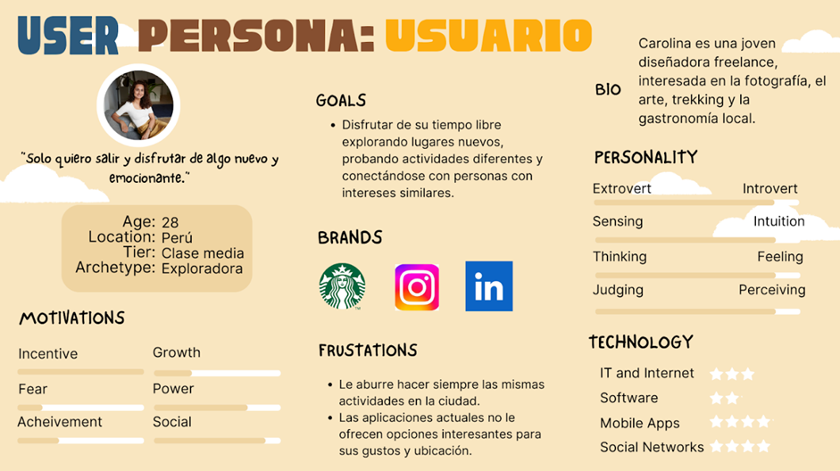
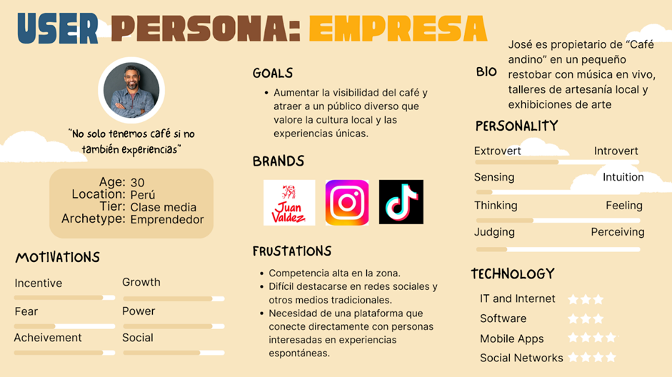
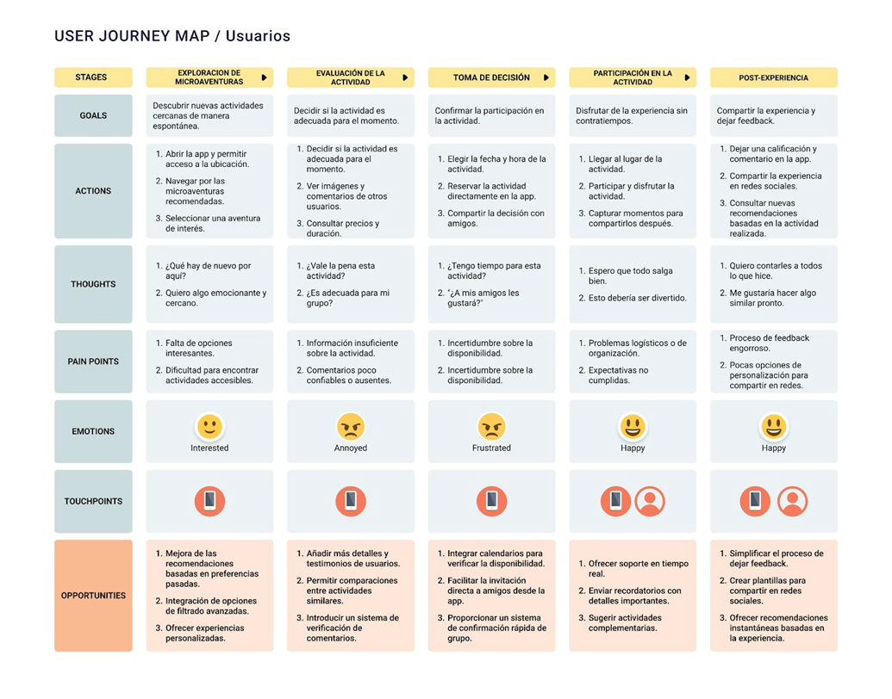
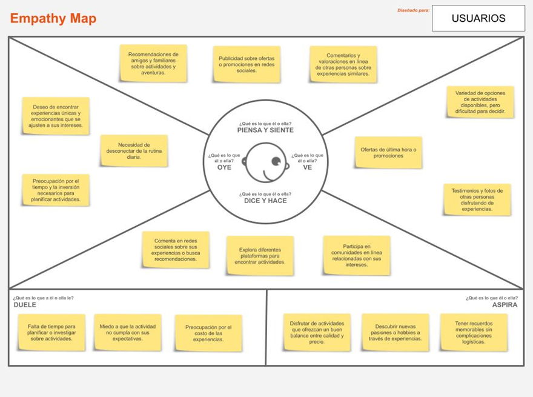
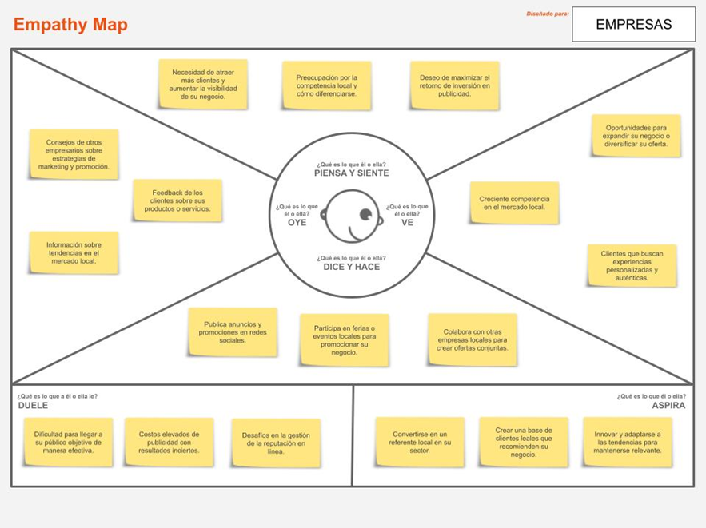

# Capítulo II: Requirements Elicitation & Analysis

## 2.1. Competidores  
### 2.1.1. Análisis competitivo  
Este análisis proporciona una visión detallada del panorama competitivo, destacando las áreas clave donde AventuraPe puede diferenciarse y ofrecer un valor único a sus clientes. 

|**Competitive analysis Landscape** |||||||
| - | :- | :- | :- | :- | :- |:-|
|¿Por qué llevar a cabo este análisis? |Permite a AventuraPe entender mejor el mercado en el que opera, identificar las fortalezas y debilidades de sus competidores, y desarrollar estrategias que permitan diferenciarse y ofrecer un valor superior a los clientes. |||||
|||
 AventuraPe 

|
Eventbrite 

|
All Events in City 

|
TickPick 

|
Meetup 

||
|Perfil |Overview |App de microaventuras espontáneas y personalizadas, conectando usuarios con experiencias locales únicas.|Una plataform a global que permite a los organizad ores de eventos planificar, promocionar y vender entradas para sus eventos, así como gestionar la asistencia. |Una plataforma que ayuda a los usuarios a descubrir eventos en su ciudad, ofreciendo una amplia lista de actividades que incluyen conciertos, talleres, festivales y más.|
Un mercado en línea para la compra y venta de entradas a eventos deportivos, conciertos y otros espectáculos. TickPick se distingue por no cobrar tarifas adicionales a los comprador es.
|Una plataform a que conecta a personas con intereses similares a través de eventos y reuniones en persona. |
||Ventaja competitiva

 ¿Qué valor ofrece a los clientes? |Enfoque en espontaneidad, gamificación, y conexión con negocios locales mediante experiencias personalizadas.|Amplia cobertura de eventos, herramien tas robustas para organizad ores, y una plataform a global reconocid a que facilita la promoció n y venta de entradas.|Proporciona una guía completa de eventos locales, permitiendo a los usuarios explorar y participar en actividades cerca de ellos sin necesidad de una planificación extensa. |Ofrece una experiencia de compra transparent e sin tarifas ocultas, lo que atrae a comprador es de entradas que buscan evitar costos adicionales. |Facilita la creación y participac ión en comunida des locales basadas en intereses comunes, fomentan do la interacció n y las conexion es personale s. </td></tr>
|Perfil de marketing|Mercado Objetivo |Jóvenes adultos (18-45 años) y grupos que buscan experiencias rápidas, únicas y sin planificación.|Organizadores de eventos de todos los tamaños, desde pequeñas reuniones hasta grandes conferencias y festivales.|Residentes urbanos y turistas que desean descubrir y participar en eventos y actividades locales.|Aficionados a los deportes, la música y el entretenimiento en vivo que buscan entradas a eventos sin cargos adicionales.|Personas que buscan conectar con otros que comparten intereses similares.|
||Estrategias de marketing|Alianzas con negocios locales, marketing en redes sociales (ej. TikTok/Instagram) y gamificación (recompensas por explorar).Alianzas con negocios locales, marketing en redes sociales (ej. TikTok/Instagram) y gamificación (recompensas por explorar).|Enfocada en la colaboración con organizadores de eventos y asociaciones con plataformas de redes sociales|Utiliza SEO local (Optimización para Motores de Búsqueda) y publicidad en redes sociales para atraer a usuarios que buscan actividades en su área.|Se apoya en campañas de marketing digital dirigidas a fanáticos de eventos en vivo.|Se basa en la creación de contenido generado por usuarios y el boca a boca, aprovechando la viralidad de las comunidades.|
|Perfil del producto	|Productos & Servicios	|Microaventuras personalizadas, filtros por tiempo/presupuesto, botón "Sorpréndeme", y sistema de rating para negocios.|Venta de entradas y herramientas de marketing.| 	Listado de eventos locales, recomendaciones personalizadas, y herramientas para descubrir nuevas actividades.|	Plataforma de compra y venta de entradas con precios transparentes, comparaciones de precios.|	Gestión de eventos y comunidad online.|
|| Canales de distribución  (Web y/o Móvil)                   |Web y app móvil (iOS y Android).| Web y app móvil (iOS y Android).|Web y app móvil (iOS y Android).|Web y app móvil (iOS y Android).|Web y app móvil (iOS y Android).|
| Análisis SWOT| Fortalezas|Diferenciación con experiencias espontáneas, gamificación y apoyo a negocios locales.|Amplia presencia global, herramientas completas para organizadores.	|Enfoque local, cobertura amplia de eventos.	|Precios transparentes, sin cargos adicionales.|	Red activa de comunidades, alta interacción entre usuarios.|
|| Debilidades|Dependencia de la participación activa de negocios locales y adopción inicial de usuarios.| Dependencia de grandes eventos para ingresos significativos.|	Limitada capacidad de atracción para eventos masivos.|	Menor visibilidad frente a competidores más grandes.|	Competencia con redes sociales para la creación de comunidades.|
|| Oportunidades|Crecimiento de la demanda por experiencias "quick & unique" y alianzas con municipios para promoción.| Expansión a nuevos mercados, colaboración con grandes eventos| Mayor enfoque en el turismo local y las experiencias personalizadas.| Aumento de la demanda para eventos en vivo post-pandemia.| Crecimiento en eventos virtuales.|
|| Amenazas| Competencia de apps de planificación tradicionales (ej. Google Things to Do).|Competencia de plataformas de redes sociales y eventos gratuitos.| Competencia de nuevas plataformas locales con enfoques similares. | Competencia de revendedores de entradas y plataformas de tickets oficiales.  | Cambios en las tendencias de consumo de eventos. |               

### 2.1.2. Estrategias y tácticas frente a competidores  
Fortalezas de la App:  
•	Personalización en tiempo real basada en la ubicación y preferencias.  
•	Sorpresa y novedad como valor diferencial.  
•	Colaboración con negocios locales para ofertas y descuentos exclusivos.  
Debilidades a Superar:  
•	Dependencia de la participación activa de empresas locales.  
•	Necesidad de construir una base de usuarios que confíen en la app para experiencias espontáneas.  
Oportunidades:  
•	Aumento en la demanda de experiencias locales y únicas.  
•	Creciente interés en actividades que no requieren planificación.  
Amenazas:  
•	Competencia de otras apps que ofrecen servicios similares pero con un enfoque diferente.  
•	Cambios en las restricciones locales que pueden afectar la disponibilidad de ciertas actividades.  
Tácticas:  
1.	Alianzas estratégicas: Establecer relaciones con empresas locales para asegurar contenido exclusivo y descuentos.  
2.	Marketing dirigido: Enfocar campañas en redes sociales y anuncios en áreas urbanas con alta densidad de usuarios.  
3.	Diferenciación: Resaltar la capacidad de sorprender y ofrecer experiencias únicas, a diferencia de otras apps que solo listan actividades estándar.  
  
## 2.2. Entrevistas  

### 2.2.1. Diseño de entrevistas  
Para el segmento de Usuarios:  
1. Sobre la experiencia del usuario:  
   - ¿Cómo decides qué actividades realizar en tu tiempo libre?  
   - ¿Qué factores son más importantes al elegir una actividad espontánea?  
   - ¿Cómo influye la cercanía geográfica en tus decisiones de actividades?  
   - ¿Cómo prefieres recibir sugerencias para actividades? (Filtros, recomendaciones, etc.)  
   - ¿Qué tan seguido utilizas aplicaciones móviles para descubrir nuevas experiencias?  
2. Sobre la interacción con la app:  
   - ¿Qué funcionalidades te gustaría encontrar en una aplicación que sugiere actividades?  
   - ¿Cómo influye la personalización en tu decisión de usar una aplicación para explorar actividades?  
   - ¿Qué tan importante es para ti la simplicidad y facilidad de uso en una aplicación móvil? 
   - ¿Cuáles son las principales dificultades que enfrentas al utilizar apps para planificar actividades?  
   - ¿Qué tipo de notificaciones o recordatorios consideramos útiles para mejorar tu experiencia?  
 3. Sobre la disposición a pagar:  
   - ¿Qué características consideras valiosas para pagar por una suscripción en la app?  
   - ¿Qué tipo de beneficios adicionales te incentivarán a pagar por experiencias en una app de aventuras?  
   - ¿Cuánto estarías dispuesto a pagar por acceder a actividades personalizadas o exclusivas?  
     
Para el segmento de Empresas Locales:  
1. Sobre la promoción del negocio:  
   - ¿Qué estrategias utilizas actualmente para promocionar tu negocio a nivel local?  
   - ¿Qué tan efectivas consideramos las redes sociales para atraer nuevos clientes?  
   - ¿Qué factores te motivarían a utilizar una aplicación para promocionar actividades o eventos de tu negocio?  
   - ¿Cómo evalúas la efectividad de las promociones y descuentos en tu negocio?  
2. Sobre la participación en la app:  
   - ¿Qué tipo de actividades o promociones te gustaría ofrecer a través de una aplicación de micro aventuras?  
   - ¿Qué esperas de una plataforma que conecte a usuarios con negocios locales?  
   - ¿Qué tan importante es la posibilidad de recibir feedback de los usuarios sobre tus actividades?  
   - ¿Cómo influiría en tu negocio poder ofrecer descuentos o promociones exclusivas a través de una app?  
 3. Sobre la satisfacción del cliente:  
   - ¿Qué tipo de experiencias te gustaría brindar para atraer a más clientes?   
   - ¿Cómo crees que una plataforma digital podría mejorar la interacción con tus clientes?  
   - ¿Qué tipo de recompensas o programas de lealtad estarías dispuesto a implementar para retener a clientes?

### 2.2.2. Registro de entrevistas  

**Segmento de aventureros**
1. 
- **Entrevistado**: Salvador Diaz Aguirre
- **Duración**: 2.50
- **Resumen**: El entrevistado indicó que suele buscar actividades para realizar a través de redes sociales como Instagram y TikTok, especialmente cuando planea salir con amigos, lo cual ocurre al menos una vez por semana. Señaló que la simplicidad de la plataforma es un aspecto clave, ya que prefiere no invertir demasiado tiempo en planear qué hacer. Además, destacó la importancia de los comentarios y calificaciones de otros usuarios, ya que estos le permiten obtener diferentes perspectivas y tomar decisiones más informadas sobre las experiencias disponibles.
- **Link**: 
[https://drive.google.com/file/d/1ce04nBqyOjyxaB6vpfY9SCI-2bd2Y6M8/view?usp=sharing](https://drive.google.com/file/d/1ce04nBqyOjyxaB6vpfY9SCI-2bd2Y6M8/view?usp=sharing)
 

2.  
- **Entrevistado**: Diego Salinas
- **Duración**: 3.03
- **Resumen**: El entrevistado, un joven de 20 años de Callao, opina sobre la startup Aventura P, una plataforma donde empresas y emprendedores pueden crear y compartir actividades. Él la describe como un tipo de "Facebook de aventuras" donde los usuarios podrían buscar planes . En cuanto a sus propios intereses para encontrar nuevas actividades, menciona que le gustaría algo cercano, vinculado a la actividad física y los deportes extremos que le generen adrenalina, valorando especialmente la proximidad del lugar.

- **Link**: 
[https://drive.google.com/file/d/1ce04nBqyOjyxaB6vpfY9SCI-2bd2Y6M8/view?usp=sharing](https://drive.google.com/file/d/10eVCj7I82mNq8Ye0QHmL6lae7SKMdXty/view?usp=sharing)
 

3. 
- **Entrevistado**: Sebastian Cachis
- **Duración**: 4.24
- **Resumen**: El entrevistado, Sebastián Nicolás Cachi González, de 20 años y residente del distrito de San Miguel, compartió que en su tiempo libre disfruta principalmente de salir, ya sea a caminar, pasear o realizar actividades como ir de compras, consumir servicios de entretenimiento o reunirse con amigos. Señaló que estaría abierto a hacer cosas nuevas si recibe una invitación o si se le presenta la oportunidad.
- **Link**: 
[https://drive.google.com/file/d/1ce04nBqyOjyxaB6vpfY9SCI-2bd2Y6M8/view?usp=sharing](https://drive.google.com/file/d/1auAbtxfxbmQmkZEBzCa8vFG4sR9X2c8P/view?usp=sharing)
 

4. 
- **Entrevistado**: Pamela Vela
- **Duración**: 4.30
- **Resumen**: Pamela Vela, estudiante universitaria de 22 años, valora actividades en su tiempo libre que ofrezcan exclusividad, innovación o beneficios como promociones y lanzamientos de productos. Prefiere recomendaciones personalizadas y usa apps móviles con frecuencia para descubrir eventos, destacando la importancia de filtros como "muestras gratis" o "solo con invitación". Busca en una app funcionalidades como alertas, mapas interactivos y secciones de tendencias, priorizando la simplicidad y personalización. Estaría dispuesta a pagar una suscripción (5−15 dolares mensuales) por acceso anticipado a eventos exclusivos, descuentos o experiencias VIP, siempre que el valor sea claro. La cercanía geográfica es relevante, pero no determinante si la actividad lo merece.
- **Link**: 
[https://drive.google.com/file/d/1TlYYeQKX9zZIUYuLcDEvXlYT-2N0NyCB/view?usp=sharing](https://drive.google.com/file/d/1TlYYeQKX9zZIUYuLcDEvXlYT-2N0NyCB/view?usp=sharing)
 

**Segmento de emprendedores**

1.
- **Entrevistado**: Fabián Castro Lujan-Ripoll
- **Duración**: 4.16
- **Resumen**: El entrevistado indicó que actualmente utiliza anuncios en Facebook e Instagram como parte de su estrategia de marketing, destacando que las redes sociales son fundamentales para la visibilidad de su emprendimiento. Además, expresó interés en contar con una plataforma que le permita ajustar su estrategia de marketing mediante la realización de eventos. Finalmente, mencionó que los comentarios y calificaciones de los usuarios generarían mayor confianza en las personas para asistir a los eventos que organiza.
- **Link**: [https://drive.google.com/file/d/1V4XJTtJC00TLO5Z74WxukIkKkQ_FcBZR/view?usp=sharing](https://drive.google.com/file/d/1V4XJTtJC00TLO5Z74WxukIkKkQ_FcBZR/view?usp=sharing)
 

2.
- **Entrevistado**: Nasthya del Carpio
- **Duración**: 5:12
- **Resumen**: Nasthya, una joven emprendedora de 21 años que vende tote bags personalizadas por Instagram, destacó la importancia de las redes sociales como su principal canal de promoción, valorando especialmente las colaboraciones, sorteos y el contenido visual. Señaló que las promociones y descuentos son clave para atraer clientes, y mostró interés en una app que le permita lanzar ofertas exclusivas y conectar con personas cercanas. Además, considera fundamental recibir feedback para mejorar sus productos y brindarle a sus clientes una experiencia personalizada. También está dispuesta a implementar recompensas para fomentar la lealtad de sus compradores frecuentes.
- **Link**: [https://upcedupe-my.sharepoint.com/:v:/g/personal/u202221518_upc_edu_pe/EVVoDl4UX-lHsCPtgnwimCABTTajWY3l4MOvmrS-xxjqwQ?nav=eyJyZWZlcnJhbEluZm8iOnsicmVmZXJyYWxBcHAiOiJTdHJlYW1XZWJBcHAiLCJyZWZlcnJhbFZpZXciOiJTaGFyZURpYWxvZy1MaW5rIiwicmVmZXJyYWxBcHBQbGF0Zm9ybSI6IldlYiIsInJlZmVycmFsTW9kZSI6InZpZXcifX0%3D&e=pbkvnw](https://upcedupe-my.sharepoint.com/:v:/g/personal/u202221518_upc_edu_pe/EVVoDl4UX-lHsCPtgnwimCABTTajWY3l4MOvmrS-xxjqwQ?nav=eyJyZWZlcnJhbEluZm8iOnsicmVmZXJyYWxBcHAiOiJTdHJlYW1XZWJBcHAiLCJyZWZlcnJhbFZpZXciOiJTaGFyZURpYWxvZy1MaW5rIiwicmVmZXJyYWxBcHBQbGF0Zm9ybSI6IldlYiIsInJlZmVycmFsTW9kZSI6InZpZXcifX0%3D&e=pbkvnw)
 

3.
**Entrevistado**:
**Duración**:
**Resumen**:
**Link**:

### 2.2.3. Análisis de entrevistas  

## 2.3. Needfinding  
### 2.3.1. User Personas  

Para el desarrollo de AventuraPe, es esencial entender a nuestros usuarios y clientes, y así crear una experiencia que realmente cubra sus necesidades. Hemos identificado dos grupos clave: los usuarios que buscan aventuras espontáneas y las empresas locales que desean atraer a estos usuarios. A continuación, presentamos un perfil detallado de un ***user persona*** para cada grupo, describiendo sus datos demográficos, motivaciones, frustraciones y objetivos. Estos perfiles nos ayudarán a tomar decisiones informadas en el diseño y desarrollo de la aplicación, garantizando que AventuraPe cumpla con las expectativas y deseos de nuestros usuarios y clientes. 

User persona de los clientes:** 

User persona de los dueños de pequeños emprendimientos: 

  

### 2.3.2. User Task Matrix  

Segmento Usuarios: 

|Tarea |Frecuencia |Severidad |
| - | - | - |
|Buscar microaventuras cerca de su ubicación |Alta |Media |
|Usar la función "Sorpréndeme" para actividades aleatorias |Media |Media |
|Filtrar actividades por tipo, duración, o costo |Alta |Alta |
|Guardar actividades como favoritas para futuras referencias |Media |Media |
|Compartir experiencias en redes sociales |Media |Alta |
|Calificar y comentar sobre las aventuras realizadas |Baja |Media |
|Recibir notificaciones de nuevas actividades disponibles |Media |Alta |

Segmento Empresas Locales: 

|Tarea |Frecuencia |Severidad |
| - | - | - |
|Publicar nuevas experiencias o actividades en la aplicación |Alta |Alta |
|Actualizar la información de sus actividades |Media |Media |
|Revisar estadísticas de participación y feedback de usuarios |Media |Alta |
|Ofrecer promociones exclusivas a través de la aplicación |Media |Alta |
|Interactuar con usuarios a través de comentarios y mensajes |Media |Alta |
|Recibir notificaciones sobre interacciones de usuarios |Baja |Media |

### 2.3.3. User Journey Mapping  
Segmento Usuarios: 

  

[https://imgur.com/a/7i1hv10 ](https://imgur.com/a/7i1hv10) 

Segmento Empresas Locales:   

  

[https://imgur.com/a/FZnhbLQ ](https://imgur.com/a/FZnhbLQ) 

### 2.3.4. Empathy Mapping  
Segmento Usuarios: 

  

[https://imgur.com/a/rOEsUvd ](https://imgur.com/a/rOEsUvd)  

Segmento Empresas Locales: 

  

[https://imgur.com/a/YgYs5Qp ](https://imgur.com/a/YgYs5Qp)  

### 2.3.5. As-is Scenario Mapping  

|What is the Local Entrepreneur…|||||
|:-|:-|:-|:-|:-|
|Phases	|Búsqueda de un lugar publicitario	|Registro de los servicios del local|	Publicación de actividades|	Análisis del acogimiento del local|
|Doing|	•	Encontró un puesto de periodico cercano.

•	Escoger alguna red social donde publicitar el local.|	•	Llenó un formulario sobre los datos de su local: Nombre, tipo de local, servicios y ubicación.	|•	Imprimió un afiche de las actividades para hacer en su local. 

•	Pagó por la estadía de esa publicidad en el puesto de periodico.

•	Realizó un afiche para postear en su red social.	|•	Visualizó el flujo de clientes que hay en su local después de la publicación de su local.

•	Analizó las estadísticas en la configuración de la red social.|
|Thinking	|•	“Espero encontrar algún puesto donde pegar los afiches.”

•	“Ojalá esta red social sea la mejor opción para publicitar negocios.”	|•	“Qué trabajoso es colocar todos los datos de mi local.”|	•	“Ojala lo que pagué por la estadía de esta  publicación de esta actividad en el periódico valga la pena.”

•	“Quizás esta publicación sea lo suficientemente buena como para que tenga alcance en la red social.”	|•	“No creo que todos hayan visto mi publicación.”

•	“Según esta sección, mi publicación no alcanzó tanta acogida.”|
|Feeling|	•	Angustia

•	Ansiedad|	•	Estresado	|•	Abrumado

•	Enojado	|•	Ansiedad|

|What is the user…|||||
|:-|:-|:-|:-|:-|
|Phases	|Descubrimiento de aplicaciones	|Registro de datos personales|	Exploración de opciones|Realización de reseña|
|Doing	|•	Buscar referencias de buenas aplicaciones en Google.

•	Preguntar a allegados sobre alguna página web.|	•	Entré a alguna aplicación web.

•	Registrar tus datos en la app.|	•	Filtré en la búsqueda de google.

•	Entré a la aplicación que descargué y busqué lugares cercanos que visitar.|	•	Conversé con mis allegados sobre los mejores y peores lugares que encontré|
|Thinking|	•	“Ojalá alguien de mis amigos conozca una aplicación para buscar microaventuras.”

•	“Que cansado es buscar recomendaciones en google”	|•	“Espero que esta app me ayude, porque el proceso de autenticación es muy tedioso.”

•	“Que bueno que pueda ingresar con cuenta de Google o Outlook.”|	•	“Que bueno, que estas aplicaciones tengan filtro de búsqueda.”|	•	“Que mal que solo pueda dar el feedback de mi experiencia por boca.”|
|Feeling|	•	Angustiado	|•	Ansioso

•	Abrumado|	•	Tranquilo	|•	Estresado|

## 2.4. Ubiquitous Language  

El ubiquitous language es un vocabulario común compartido por todos los miembros del equipo y stakeholders para describir los conceptos clave del dominio de AventuraPe. Aquí presentamos los términos fundamentales:

|Término|	Definición|
|:-|:-|
|Microaventura|	Experiencia única y breve (de 1-4 horas) que los usuarios pueden realizar en su entorno local|
|Botón "Sorpréndeme"	|Función que recomienda aleatoriamente una actividad basada en preferencias del usuario|
|Geolocalización	|Tecnología que identifica la ubicación del usuario para sugerir actividades cercanas|
|Gamificación	|Sistema de recompensas (puntos, insignias) por participar en aventuras|
|Perfil de usuario|	Datos personales e intereses del usuario para personalizar recomendaciones|
|Negocio asociado	|Establecimiento local registrado que ofrece experiencias en la plataforma|
|Sistema de rating|	Valoración (1-5 estrellas) y comentarios que los usuarios dan a las experiencias|
|Filtros inteligentes|	Opciones para ajustar búsquedas por tiempo, presupuesto o tipo de actividad|
|Experiencia premium|	Aventura exclusiva disponible mediante suscripción o pago único|
|Panel de negocio	|Interfaz donde los locales gestionan sus publicaciones y ven estadísticas|
# Capítulo III: Requirements Specification

## 3.1. To-Be Scenario Mapping  
## 3.2. User Stories  
## 3.3. Product Backlog  
## 3.4. Impact Mapping  

# Capítulo IV: Product Design

## 4.1. Style Guidelines  
### 4.1.1. General Style Guidelines  
### 4.1.2. Web Style Guidelines  
### 4.1.3. Mobile Style Guidelines  
#### 4.1.3.1. iOS Mobile Style Guidelines  
#### 4.1.3.2. Android Mobile Style Guidelines  

## 4.2. Information Architecture  
### 4.2.1. Organization Systems  
### 4.2.2. Labeling Systems  
### 4.2.3. SEO Tags and Meta Tags  
### 4.2.4. Searching Systems  
### 4.2.5. Navigation Systems  

## 4.3. Landing Page UI Design  
### 4.3.1. Landing Page Wireframe  
### 4.3.2. Landing Page Mock-up  

## 4.4. Mobile Applications UX/UI Design  
### 4.4.1. Mobile Applications Wireframes  
### 4.4.2. Mobile Applications Wireflow Diagrams  
### 4.4.3. Mobile Applications Mock-ups  
### 4.4.4. Mobile Applications User Flow Diagrams  

## 4.5. Mobile Applications Prototyping  
### 4.5.1. Android Mobile Applications Prototyping  
### 4.5.2. iOS Mobile Applications Prototyping  

## 4.6. Web Applications UX/UI Design  
### 4.6.1. Web Applications Wireframes  
### 4.6.2. Web Applications Wireflow Diagrams  
### 4.6.3. Web Applications Mock-ups  
### 4.6.4. Web Applications User Flow Diagrams  

## 4.7. Web Applications Prototyping  

## 4.8. Domain-Driven Software Architecture  
### 4.8.1. Software Architecture Context Diagram  
### 4.8.2. Software Architecture Container Diagrams  
### 4.8.3. Software Architecture Components Diagrams  

## 4.9. Software Object-Oriented Design  
### 4.9.1. Class Diagrams  
### 4.9.2. Class Dictionary  

## 4.10. Database Design  
### 4.10.1. Relational/Non-Relational Database Diagram  

# Capítulo V: Product Implementation

## 5.1. Software Configuration Management  
### 5.1.1. Software Development Environment Configuration  
### 5.1.2. Source Code Management  
### 5.1.3. Source Code Style Guide & Conventions  
### 5.1.4. Software Deployment Configuration  

## 5.2. Product Implementation & Deployment  
### 5.2.1. Sprint Backlogs  
### 5.2.2. Implemented Landing Page Evidence  
### 5.2.3. Implemented Frontend-Web Application Evidence  
### 5.2.4. Implemented Native-Mobile Application Evidence  
### 5.2.5. Implemented RESTful API and/or Serverless Backend Evidence  
### 5.2.6. RESTful API documentation  
### 5.2.7. Team Collaboration Insights  

## 5.3. Video About-the-Product  

# Part II: Verification, Validation & Pipeline  

# Capítulo VI: Product Verification & Validation

## 6.1. Testing Suites & Validation  
### 6.1.1. Core Entities Unit Tests  
### 6.1.2. Core Integration Tests  
### 6.1.3. Core Behavior-Driven Development  
### 6.1.4. Core System Tests  

## 6.2. Static testing & Verification  
### 6.2.1. Static Code Analysis  
#### 6.2.1.1. Coding standard & Code conventions  
#### 6.2.1.2. Code Quality & Code Security  
### 6.2.2. Reviews  

## 6.3. Validation Interviews  
### 6.3.1. Diseño de Entrevistas  
### 6.3.2. Registro de Entrevistas  
### 6.3.3. Evaluaciones según heurísticas  

## 6.4. Auditoría de Experiencias de Usuario  
### 6.4.1. Auditoría realizada  
#### 6.4.1.1. Información del grupo auditado  
#### 6.4.1.2. Cronograma de auditoría realizada  
#### 6.4.1.3. Contenido de auditoría realizada  
### 6.4.2. Auditoría recibida  
#### 6.4.2.1. Información del grupo auditor  
#### 6.4.2.2. Cronograma de auditoría recibida  
#### 6.4.2.3. Contenido de auditoría recibida  
#### 6.4.2.4. Resumen de modificaciones para subsanar hallazgos  

# Capítulo VII: DevOps Practices

## 7.1. Continuous Integration  
### 7.1.1. Tools and Practices  
### 7.1.2. Build & Test Suite Pipeline Components  

## 7.2. Continuous Delivery  
### 7.2.1. Tools and Practices  
### 7.2.2. Stages Deployment Pipeline Components  

## 7.3. Continuous deployment  
### 7.3.1. Tools and Practices  
### 7.3.2. Production Deployment Pipeline Components  

## 7.4. Continuous Monitoring  
### 7.4.1. Tools and Practices  
### 7.4.2. Monitoring Pipeline Components  
### 7.4.3. Alerting Pipeline Components  
### 7.4.4. Notification Pipeline Components  

# Part III: Experiment-Driven Lifecycle  

# Capítulo VIII: Experiment-Driven Development

## 8.1. Experiment Planning  
### 8.1.1. As-Is Summary  
### 8.1.2. Raw Material: Assumptions, Knowledge Gaps, Ideas, Claims  
### 8.1.3. Experiment-Ready Questions  
### 8.1.4. Question Backlog  
### 8.1.5. Experiment Cards  

## 8.2. Experiment Design  
### 8.2.1. Hypotheses  
### 8.2.2. Measures  
### 8.2.3. Conditions  
### 8.2.4. Scale Calculations and Decisions  
### 8.2.5. Methods Selection  
### 8.2.6. Data Analytics: Goals, KPIs and Metrics Selection  
### 8.2.7. Web and Mobile Tracking Plan  

## 8.3. Experimentation  
### 8.3.1. To-Be User Stories  
### 8.3.2. To-Be Product Backlog  
### 8.3.3. Pipeline-supported, Experiment-Driven To-Be Software Platform Lifecycle  
#### 8.3.3.1. To-Be Sprint Backlogs  
#### 8.3.3.2. Implemented To-Be Landing Page Evidence  
#### 8.3.3.3. Implemented To-Be Frontend-Web Application Evidence  
#### 8.3.3.4. Implemented To-Be Native-Mobile Application Evidence  
#### 8.3.3.5. Implemented To-Be RESTful API and/or Serverless Backend Evidence  
#### 8.3.3.6. Team Collaboration Insights  

### 8.3.4. To-Be Validation Interviews  
#### 8.3.4.1. Diseño de Entrevistas  
#### 8.3.4.2. Registro de Entrevistas  

## 8.4. Experiment Aftermath & Analysis  
### 8.4.1. Analysis and Interpretation of Results  
### 8.4.2. Re-scored and Re-prioritized Question Backlog  

## 8.5. Continuous Learning  
### 8.5.1. Shareback Session Artifacts: Learning Workflow  

## 8.6. To-Be Software Platform Pre-launch  
### 8.6.1. About-the-Product Intro Video  

# Conclusiones  
## Conclusiones y recomendaciones  

# Video About-the-Team  

# Bibliografía  

# Anexos  

