<div align="center">
    <h3>Universidad Peruana de Ciencias Aplicadas</h3>
    </img><br>
    <strong>Ingeniería de Software - 7mo Ciclo</strong><br>
    <strong>Diseño de experimentos de Ingeniería de Software</strong><br>
    <strong>1ASI0732-4438</strong><br>
    <strong>Profesor: Julio Manuel Noriega Melendez</strong><br>
    <br><strong>Report</strong><br>
    <br><strong>AventuraPE</strong><br>
    <!--<strong>name startup</strong>-->
</div>

<h3> Team Members: </h3>

<div align="center">

| Member                              |    Code    |
| :---------------------------------- | :--------: |
| Cama Salvatierra, Jimena Tamara     | u202221518 |
| Castillo Castillo, Jair Alexander   | u202210778 |
| Gutierrez Garcia, Jose Eduardo      | u202211390 |
| Jaque Peña, Estefano Oscar          | u202225466 |
| Quezada Portalatino, Barbara Susana | u202211800 |

</div>

<h3 align="center">Abril, 2025</h3>

<br><br>

<div align="justify">

# Registro de Versiones del Informe

El objetivo de esta sección es resumir las modificaciones relevantes que se realizan al informe durante el ciclo de vida del proyecto. Esta sección inicia en una página nueva e incluye un cuadro con la siguiente estructura:

<table>
  <thead>
    <tr>
      <th>Versión</th>
      <th>Fecha</th>
      <th>Autor</th>
      <th>Descripción de modificación</th>
    </tr>
  </thead>
  <tbody>
    <tr>
      <td>0.1</td>
      <td>24/04/2025</td>
      <td>AventuraPE</td>
      <td>Redacción del Capítulo I: Introduccion, Capítulo II: Requirements Elicitation & Analysis, Capítulo III:Requirements Specification, Capítulo IV: Product Design, Capítulo V: Product Implementation</td>
    </tr>
    <tr>
      <td>0.2</td>
      <td>19/06/2025</td>
      <td>AventuraPE</td>
      <td>Actualización del informe con la entrega del TB2: inclusión de los Capítulos VI (Product Verification & Validation), VII (DevOps Practices) y VIII (Experiment-Driven Development). Se incorporaron pruebas automatizadas, auditorías de usuario, análisis estático del código, implementación de pipelines CI/CD y experimentos planificados y ejecutados. Además, se integraron los Student Outcomes actualizados y la versión parcial de conclusiones.</td>
    </tr>
  </tbody>
</table>

# Contenido
- [**Student Outcome**](#student-outcome)

[Capítulo I: Introducción](#capítulo-i-introducción)
- [1.1. Startup Profile](#11-startup-profile)
  - [1.1.1. Descripción de la Startup](#111-descripción-de-la-startup)
  - [1.1.2. Perfiles de integrantes del equipo](#112-perfiles-de-integrantes-del-equipo)
- [1.2. Solution Profile](#12-solution-profile)
  - [1.2.1. Antecedentes y problemática](#121-antecedentes-y-problemática)
  - [1.2.2. Lean UX Process](#122-lean-ux-process)
    - [1.2.2.1. Lean UX Problem Statements](#1221-lean-ux-problem-statements)
    - [1.2.2.2. Lean UX Assumptions](#1222-lean-ux-assumptions)
    - [1.2.2.3. Lean UX Hypothesis Statements](#1223-lean-ux-hypothesis-statements)
    - [1.2.2.4. Lean UX Canvas](#1224-lean-ux-canvas)
- [1.3. Segmentos objetivo](#13-segmentos-objetivo)

[Capítulo II: Requirements Elicitation & Analysis](#capítulo-ii-requirements-elicitation--analysis)
- [2.1. Competidores](#21-competidores)
  - [2.1.1. Análisis competitivo](#211-análisis-competitivo)
  - [2.1.2. Estrategias y tácticas frente a competidores](#212-estrategias-y-tácticas-frente-a-competidores)
- [2.2. s](#22-entrevistas)
  - [2.2.1. Diseño de entrevistas](#221-diseño-de-entrevistas)
  - [2.2.2. Registro de entrevistas](#222-registro-de-entrevistas)
  - [2.2.3. Análisis de entrevistas](#223-análisis-de-entrevistas)
- [2.3. Needfinding](#23-needfinding)
  - [2.3.1. User Personas](#231-user-personas)
  - [2.3.2. User Task Matrix](#232-user-task-matrix)
  - [2.3.3. User Journey Mapping](#233-user-journey-mapping)
  - [2.3.4. Empathy Mapping](#234-empathy-mapping)
  - [2.3.5. As-is Scenario Mapping](#235-as-is-scenario-mapping)
- [2.4. Ubiquitous Language](#24-ubiquitous-language)

[Capítulo III: Requirements Specification](#capítulo-iii-requirements-specification)
- [3.1. To-Be Scenario Mapping](#31-to-be-scenario-mapping)
- [3.2. User Stories](#32-user-stories)
- [3.3. Product Backlog](#33-product-backlog)
- [3.4. Impact Mapping](#34-impact-mapping)

[Capítulo IV: Product Design](#capítulo-iv-product-design)
- [4.1. Style Guidelines](#41-style-guidelines)
  - [4.1.1. General Style Guidelines](#411-general-style-guidelines)
  - [4.1.2. Web Style Guidelines](#412-web-style-guidelines)
  - [4.1.3. Mobile Style Guidelines](#413-mobile-style-guidelines)
    - [4.1.3.1. iOS Mobile Style Guidelines](#4131-ios-mobile-style-guidelines)
    - [4.1.3.2. Android Mobile Style Guidelines](#4132-android-mobile-style-guidelines)
- [4.2. Information Architecture](#42-information-architecture)
  - [4.2.1. Organization Systems](#421-organization-systems)
  - [4.2.2. Labeling Systems](#422-labeling-systems)
  - [4.2.3. SEO Tags and Meta Tags](#423-seo-tags-and-meta-tags)
  - [4.2.4. Searching Systems](#424-searching-systems)
  - [4.2.5. Navigation Systems](#425-navigation-systems)
- [4.3. Landing Page UI Design](#43-landing-page-ui-design)
  - [4.3.1. Landing Page Wireframe](#431-landing-page-wireframe)
  - [4.3.2. Landing Page Mock-up](#432-landing-page-mock-up)
- [4.4. Mobile Applications UX/UI Design](#44-mobile-applications-uxui-design)
  - [4.4.1. Mobile Applications Wireframes](#441-mobile-applications-wireframes)
  - [4.4.2. Mobile Applications Wireflow Diagrams](#442-mobile-applications-wireflow-diagrams)
  - [4.4.3. Mobile Applications Mock-ups](#443-mobile-applications-mock-ups)
  - [4.4.4. Mobile Applications User Flow Diagrams](#444-mobile-applications-user-flow-diagrams)
- [4.5. Mobile Applications Prototyping](#45-mobile-applications-prototyping)
  - [4.5.1. Android Mobile Applications Prototyping](#451-android-mobile-applications-prototyping)
  - [4.5.2. iOS Mobile Applications Prototyping](#452-ios-mobile-applications-prototyping)
- [4.6. Web Applications UX/UI Design](#46-web-applications-uxui-design)
  - [4.6.1. Web Applications Wireframes](#461-web-applications-wireframes)
  - [4.6.2. Web Applications Wireflow Diagrams](#462-web-applications-wireflow-diagrams)
  - [4.6.3. Web Applications Mock-ups](#463-web-applications-mock-ups)
  - [4.6.4. Web Applications User Flow Diagrams](#464-web-applications-user-flow-diagrams)
- [4.7. Web Applications Prototyping](#47-web-applications-prototyping)
- [4.8. Domain-Driven Software Architecture](#48-domain-driven-software-architecture)
  - [4.8.1. Software Architecture Context Diagram](#481-software-architecture-context-diagram)
  - [4.8.2. Software Architecture Container Diagrams](#482-software-architecture-container-diagrams)
  - [4.8.3. Software Architecture Components Diagrams](#483-software-architecture-components-diagrams)
- [4.9. Software Object-Oriented Design](#49-software-object-oriented-design)
  - [4.9.1. Class Diagrams](#491-class-diagrams)
  - [4.9.2. Class Dictionary](#492-class-dictionary)
- [4.10. Database Design](#410-database-design)
  - [4.10.1. Relational/Non-Relational Database Diagram](#4101-relationalnon-relational-database-diagram)

[Capítulo V: Product Implementation](#capítulo-v-product-implementation)
- [5.1. Software Configuration Management](#51-software-configuration-management)
  - [5.1.1. Software Development Environment Configuration](#511-software-development-environment-configuration)
  - [5.1.2. Source Code Management](#512-source-code-management)
  - [5.1.3. Source Code Style Guide & Conventions](#513-source-code-style-guide--conventions)
  - [5.1.4. Software Deployment Configuration](#514-software-deployment-configuration)
- [5.2. Product Implementation & Deployment](#52-product-implementation--deployment)
  - [5.2.1. Sprint Backlogs](#521-sprint-backlogs)
  - [5.2.2. Implemented Landing Page Evidence](#522-implemented-landing-page-evidence)
  - [5.2.3. Implemented Frontend-Web Application Evidence](#523-implemented-frontend-web-application-evidence)
  - [5.2.4. Implemented Native-Mobile Application Evidence](#524-implemented-native-mobile-application-evidence)
  - [5.2.5. Implemented RESTful API and/or Serverless Backend Evidence](#525-implemented-restful-api-andor-serverless-backend-evidence)
  - [5.2.6. RESTful API documentation](#526-restful-api-documentation)
  - [5.2.7. Team Collaboration Insights](#527-team-collaboration-insights)
- [5.3. Video About-the-Product](#53-video-about-the-product)

[Part II: Verification, Validation & Pipeline](#part-ii-verification-validation--pipeline)

[Capítulo VI: Product Verification & Validation](#capítulo-vi-product-verification--validation)
- [6.1. Testing Suites & Validation](#61-testing-suites--validation)
  - [6.1.1. Core Entities Unit Tests](#611-core-entities-unit-tests)
  - [6.1.2. Core Integration Tests](#612-core-integration-tests)
  - [6.1.3. Core Behavior-Driven Development](#613-core-behavior-driven-development)
  - [6.1.4. Core System Tests](#614-core-system-tests)
- [6.2. Static testing & Verification](#62-static-testing--verification)
  - [6.2.1. Static Code Analysis](#621-static-code-analysis)
    - [6.2.1.1. Coding standard & Code conventions](#6211-coding-standard--code-conventions)
    - [6.2.1.2. Code Quality & Code Security](#6212-code-quality--code-security)
  - [6.2.2. Reviews](#622-reviews)
- [6.3. Validation Interviews](#63-validation-interviews)
  - [6.3.1. Diseño de Entrevistas](#631-diseño-de-entrevistas)
  - [6.3.2. Registro de Entrevistas](#632-registro-de-entrevistas)
  - [6.3.3. Evaluaciones según heurísticas](#633-evaluaciones-según-heurísticas)
- [6.4. Auditoría de Experiencias de Usuario](#64-auditoría-de-experiencias-de-usuario)
  - [6.4.1. Auditoría realizada](#641-auditoría-realizada)
    - [6.4.1.1. Información del grupo auditado](#6411-información-del-grupo-auditado)
    - [6.4.1.2. Cronograma de auditoría realizada](#6412-cronograma-de-auditoría-realizada)
    - [6.4.1.3. Contenido de auditoría realizada](#6413-contenido-de-auditoría-realizada)
  - [6.4.2. Auditoría recibida](#642-auditoría-recibida)
    - [6.4.2.1. Información del grupo auditor](#6421-información-del-grupo-auditor)
    - [6.4.2.2. Cronograma de auditoría recibida](#6422-cronograma-de-auditoría-recibida)
    - [6.4.2.3. Contenido de auditoría recibida](#6423-contenido-de-auditoría-recibida)
    - [6.4.2.4. Resumen de modificaciones para subsanar hallazgos](#6424-resumen-de-modificaciones-para-subsanar-hallazgos)

[Capítulo VII: DevOps Practices](#capítulo-vii-devops-practices)
- [7.1. Continuous Integration](#71-continuous-integration)
  - [7.1.1. Tools and Practices](#711-tools-and-practices)
  - [7.1.2. Build & Test Suite Pipeline Components](#712-build--test-suite-pipeline-components)
- [7.2. Continuous Delivery](#72-continuous-delivery)
  - [7.2.1. Tools and Practices](#721-tools-and-practices)
  - [7.2.2. Stages Deployment Pipeline Components](#722-stages-deployment-pipeline-components)
- [7.3. Continuous Deployment](#73-continuous-deployment)
  - [7.3.1. Tools and Practices](#731-tools-and-practices)
  - [7.3.2. Production Deployment Pipeline Components](#732-production-deployment-pipeline-components)
- [7.4. Continuous Monitoring](#74-continuous-monitoring)
  - [7.4.1. Tools and Practices](#741-tools-and-practices)
  - [7.4.2. Monitoring Pipeline Components](#742-monitoring-pipeline-components)
  - [7.4.3. Alerting Pipeline Components](#743-alerting-pipeline-components)
  - [7.4.4. Notification Pipeline Components](#744-notification-pipeline-components)

[Part III: Experiment-Driven Lifecycle](#part-iii-experiment-driven-lifecycle)

[Capítulo VIII: Experiment-Driven Development](#capítulo-viii-experiment-driven-development)
- [8.1. Experiment Planning](#81-experiment-planning)
  - [8.1.1. As-Is Summary](#811-as-is-summary)
  - [8.1.2. Raw Material](#812-raw-material-assumptions-knowledge-gaps-ideas-claims)
  - [8.1.3. Experiment-Ready Questions](#813-experiment-ready-questions)
  - [8.1.4. Question Backlog](#814-question-backlog)
  - [8.1.5. Experiment Cards](#815-experiment-cards)
- [8.2. Experiment Design](#82-experiment-design)
  - [8.2.1. Hypotheses](#821-hypotheses)
  - [8.2.2. Measures](#822-measures)
  - [8.2.3. Conditions](#823-conditions)
  - [8.2.4. Scale Calculations and Decisions](#824-scale-calculations-and-decisions)
  - [8.2.5. Methods Selection](#825-methods-selection)
  - [8.2.6. Data Analytics](#826-data-analytics-goals-kpis-and-metrics-selection)
  - [8.2.7. Web and Mobile Tracking Plan](#827-web-and-mobile-tracking-plan)
- [8.3. Experimentation](#83-experimentation)
  - [8.3.1. To-Be User Stories](#831-to-be-user-stories)
  - [8.3.2. To-Be Product Backlog](#832-to-be-product-backlog)
  - [8.3.3. Pipeline-supported Lifecycle](#833-pipeline-supported-experiment-driven-to-be-software-platform-lifecycle)
    - [8.3.3.1. To-Be Sprint Backlogs](#8331-to-be-sprint-backlogs)
    - [8.3.3.2. Landing Page Evidence](#8332-implemented-to-be-landing-page-evidence)
    - [8.3.3.3. Frontend-Web Application Evidence](#8333-implemented-to-be-frontend-web-application-evidence)
    - [8.3.3.4. Native-Mobile Application Evidence](#8334-implemented-to-be-native-mobile-application-evidence)
    - [8.3.3.5. RESTful API Evidence](#8335-implemented-to-be-restful-api-andor-serverless-backend-evidence)
    - [8.3.3.6. Team Collaboration Insights](#8336-team-collaboration-insights)
  - [8.3.4. To-Be Validation Interviews](#834-to-be-validation-interviews)
    - [8.3.4.1. Diseño de Entrevistas](#8341-diseño-de-entrevistas)
    - [8.3.4.2. Registro de Entrevistas](#8342-registro-de-entrevistas)
- [8.4. Experiment Aftermath & Analysis](#84-experiment-aftermath--analysis)
  - [8.4.1. Analysis and Interpretation of Results](#841-analysis-and-interpretation-of-results)
  - [8.4.2. Re-scored and Re-prioritized Question Backlog](#842-re-scored-and-re-prioritized-question-backlog)
- [8.5. Continuous Learning](#85-continuous-learning)
  - [8.5.1. Shareback Session Artifacts](#851-shareback-session-artifacts-learning-workflow)
- [8.6. To-Be Software Platform Pre-launch](#86-to-be-software-platform-pre-launch)
  - [8.6.1. About-the-Product Intro Video](#861-about-the-product-intro-video)

[Conclusiones y recomendaciones](#conclusiones-y-recomendaciones)

[Video About-the-Team](#video-about-the-team)

[Bibliografía](#bibliografía)

[Anexos](#anexos)


## Student Outcome

| Criterio específico | Acciones realizadas | Conclusiones |
|----|----|----|
|4.c.1 Reconoce responsabilidad ética y profesional en situaciones de ingeniería de software.| **Cama Salvatierra, Jimena Tamara**<br>*TB1*: Reconoció su responsabilidad ética y profesional al diseñar experiencias de usuario tanto móviles como web, asegurando una interfaz accesible, intuitiva y centrada en el usuario final. Su compromiso se evidenció en el desarrollo funcional de la página web y la aplicación móvil, respetando buenas prácticas de diseño y programación.<br>*TP*: Demostró profesionalismo al gestionar los Sprint Backlogs y coordinar la implementación de la Landing Page, velando por la coherencia visual y la experiencia del usuario final, priorizando siempre sus necesidades y expectativas.<br>**Castillo Castillo, Jair Alexander**<br>*TB1*: Demostró responsabilidad ética y profesional al implementar la arquitectura del backend y al liderar el despliegue de la solución, priorizando la seguridad, la eficiencia y la escalabilidad. Además, su trabajo en el desarrollo de la web y app móvil se llevó a cabo respetando estándares técnicos y buenas prácticas del software.<br>*TP*: Asumió con ética profesional el desarrollo del To-Be Scenario Mapping, Impact Mapping y las diferentes pruebas de software (unitarias, integración, BDD y sistema), garantizando que el producto final cumpliera con los estándares de calidad y seguridad necesarios para los usuarios.<br>**Gutierrez Garcia, Jose Eduardo**<br>*TB1*: Asumió su responsabilidad profesional en la redacción de la introducción, descripción de la startup y el desarrollo web, garantizando que la documentación reflejara claramente la visión, objetivos y valores éticos del proyecto. Su trabajo permitió establecer una base sólida para las decisiones de ingeniería tomadas posteriormente.<br>*TP*: Demostró alto nivel de responsabilidad ética al configurar entornos de desarrollo y despliegue seguros, implementando prácticas de gestión de código y guías de estilo que aseguraron la mantenibilidad y seguridad del software, además de configurar correctamente el sistema de despliegue continuo.<br>**Jaque Peña, Estefano Oscar**<br>*TB1*: Actuó con responsabilidad ética al analizar a los competidores y realizar el needfinding, asegurando que la solución respondiera a necesidades reales de los usuarios. En el desarrollo web, se mantuvo alineado con buenas prácticas técnicas y con una visión orientada al usuario.<br>*TP*: Tomó responsabilidad profesional en la implementación de prácticas de integración continua y entrega continua, garantizando flujos de trabajo seguros y confiables que protegieran tanto los datos como la experiencia de los usuarios finales.<br>*TB2*:Relizo parte de las entrevistas para cada segmento objetivo ademas de apoyar en los experiments cards , asi como las hipotesis<br>**Quezada Portalatino, Barbara Susana**<br>*TB1*: Evidenció responsabilidad ética y profesional en la definición de user stories y el product backlog, priorizando funcionalidades con base en valor para el usuario y viabilidad técnica. Además, su rol en el diseño UX/UI y en el desarrollo de la app móvil se alineó con principios de diseño centrado en el usuario.<br>*TP*: Mantuvo su compromiso ético al refinar y desarrollar las User Stories y el Product Backlog, asegurando que las funcionalidades implementadas respondieran a necesidades reales y satisficieran los requerimientos de los usuarios finales de manera responsable y transparente.| TB1 & TP:<br> El equipo ha mantenido un compromiso constante con la responsabilidad ética y profesional a lo largo del desarrollo completo del proyecto. Desde la concepción inicial hasta la fase de implementación y pruebas, cada miembro ha aplicado buenas prácticas en sus respectivas áreas de responsabilidad. La toma de decisiones ha sido guiada por principios éticos como la accesibilidad, seguridad, transparencia y respeto por las necesidades del usuario final. Las implementaciones técnicas han seguido estándares profesionales rigurosos, garantizando un producto final que no solo es funcional sino también confiable y seguro. Este enfoque integral y responsable ha permitido entregar una solución que equilibra aspectos técnicos con consideraciones éticas y profesionales.<BR>*TB2*:En esta tercera entrega, los estudiantes debieron consolidar su compromiso ético y profesional demostrando coherencia entre las decisiones técnicas tomadas y los principios fundamentales de la ingeniería de software. La definición e implementación de prácticas como la integración y despliegue continuo, junto con el diseño y ejecución de experimentos, exigían una aplicación rigurosa de buenas prácticas, responsabilidad con el equipo y enfoque en el usuario final. Se esperaba que cada acción estuviera orientada a garantizar soluciones seguras, accesibles y técnicamente sostenibles, asumiendo con integridad el impacto de sus decisiones dentro del proceso de desarrollo.|


| Criterio específico | Acciones realizadas | Conclusiones |
|----|----|----|
|4.c.2 Emite juicios informados considerando el impacto de las soluciones de ingeniería de software en contextos globales, económicos, ambientales y sociales| **Cama Salvatierra, Jimena Tamara**<br>*TB1*: Emitió juicios informados al considerar cómo el diseño UX/UI de la plataforma impactaría a nivel social, promoviendo una interacción amigable y accesible. Su enfoque de diseño tuvo en cuenta la diversidad de usuarios, contribuyendo a una solución inclusiva en un contexto digital cada vez más relevante globalmente.<br>*TP*: Realizó evaluaciones fundamentadas sobre el impacto de los Sprint Backlogs y la Landing Page implementada, considerando cómo estas decisiones afectaban la percepción inicial de la plataforma y su capacidad para atraer usuarios de diversos contextos socioeconómicos.<br>**Castillo Castillo, Jair Alexander**<br>*TB1*: Emitió juicios informados al utilizar impact mapping para evaluar escenarios futuros, considerando cómo las decisiones técnicas afectarían al entorno social y económico del proyecto. Su enfoque integral permitió al equipo alinear los objetivos técnicos con el impacto real en la comunidad objetivo.<br>*TP*: Profundizó sus juicios informados al desarrollar el escenario To-Be y el Impact Mapping definitivos, alineando las capacidades técnicas con las necesidades sociales y económicas de los usuarios. Sus decisiones sobre estrategias de testing aseguraron que el producto funcionara correctamente en diversos entornos y contextos.<br>**Gutierrez Garcia, Jose Eduardo**<br>*TB1*: Emitió juicios informados al plasmar el enfoque Lean UX dentro del documento, mostrando cómo las decisiones centradas en el usuario impactan positivamente en el ámbito social y económico. Su contribución ayudó a guiar el desarrollo con una mirada estratégica y empática.<br>*TP*: Formuló valoraciones cuidadosas sobre la configuración de entornos de desarrollo y despliegue, considerando factores como accesibilidad global, eficiencia económica y sostenibilidad ambiental de las soluciones implementadas. Su trabajo en continuous deployment reflejó un análisis sobre el impacto social de las actualizaciones frecuentes en la experiencia del usuario.<br>**Jaque Peña, Estefano Oscar**<br>*TB1*: Emitió juicios informados al identificar oportunidades de diferenciación basadas en el análisis del mercado y las necesidades detectadas, lo cual permitió diseñar una solución con impacto social positivo. Su enfoque estratégico buscó maximizar la utilidad y sostenibilidad del producto.<br>*TP*: Realizó evaluaciones críticas sobre las herramientas y prácticas de integración y entrega continua, valorando su impacto económico en términos de eficiencia operativa y su impacto social al facilitar actualizaciones rápidas que responden a las necesidades cambiantes de los usuarios.<br>*TB2*:Relizo parte de las entrevistas para cada segmento objetivo ademas de apoyar en los experiments cards , asi como las hipotesis.<br>**Quezada Portalatino, Barbara Susana**<br>*TB1*: Emitió juicios informados al estructurar las funcionalidades considerando el contexto social del proyecto y su accesibilidad, contribuyendo a una solución inclusiva y orientada a mejorar la experiencia del usuario. Su visión de diseño equilibró impacto social y eficiencia técnica.<br>*TP*: Desarrolló juicios críticos en la elaboración final de User Stories y Product Backlog, evaluando cuidadosamente cómo cada característica podría impactar en diferentes segmentos sociales de usuarios y en sus distintas realidades económicas, priorizando funcionalidades con mayor valor e impacto positivo.| TB1 & TP:<br> A lo largo del desarrollo del proyecto, el equipo ha demostrado una notable capacidad para emitir juicios informados sobre el impacto de las soluciones implementadas en contextos más amplios. Las decisiones técnicas no solo han considerado aspectos puramente funcionales, sino también su repercusión social, económica y ambiental. Se ha tenido especial cuidado en diseñar una experiencia inclusiva y accesible, valorando la diversidad de usuarios y sus diferentes contextos. Las prácticas de integración continua, testing y despliegue han sido seleccionadas considerando su eficiencia económica y su impacto en la sostenibilidad del proyecto. Este enfoque integral ha permitido crear una solución técnicamente sólida que también tiene un impacto positivo en la sociedad, demostrando que el equipo comprende plenamente la responsabilidad de la ingeniería de software más allá de los aspectos puramente técnicos.<br>*TB2*:Durante la ejecución de los experimentos y validaciones del producto, los estudiantes debieron emitir juicios informados evaluando el impacto de sus decisiones más allá del plano técnico. La planificación y análisis de hipótesis, el uso de métricas, entrevistas y auditorías, así como la priorización de backlog, debieron considerar activamente el contexto económico, social y global de los usuarios. En esta fase se esperaba que demostraran pensamiento crítico sobre cómo sus soluciones podían contribuir a una experiencia de usuario más inclusiva, eficaz y sostenible, reafirmando que el ejercicio de la ingeniería debe estar siempre alineado con un propósito ético y contextualizado.|

# Capítulo I: Introducción

## 1.1. Startup Profile
### 1.1.1. Descripción de la Startup  

"AventuraPe" es una innovadora aplicación móvil diseñada para revolucionar la forma en que las personas descubren y disfrutan experiencias únicas y emocionantes en su entorno cotidiano. Nuestra aplicación móvil ofrece micro aventuras personalizadas que se adaptan a las preferencias individuales y grupales, eliminando la necesidad de una planificación exhaustiva o inversiones significativas de tiempo y recursos. En un mundo donde la rutina y la monotonía pueden opacar el sentido de exploración y diversión, AventuraPe surge como una solución integral que conecta a los usuarios con actividades y experiencias locales únicas. Utilizando tecnología avanzada de geolocalización y un diseño centrado en el usuario, facilitamos el acceso a una amplia gama de opciones de entretenimiento que fomentan la espontaneidad y el descubrimiento constante.

Nuestro enfoque se fundamenta en tres pilares esenciales: Optimización de tiempo, comodidad y conexión con la comunidad local. A través de AventuraPe, redefinimos la experiencia de entretenimiento y exploración, brindando a las personas la oportunidad de enriquecer sus vidas cotidianas con momentos memorables y significativos, mientras impulsamos el crecimiento y la visibilidad de negocios locales que ofrecen propuestas únicas y valiosas.

- **Misión:** Empoderar a las personas para que descubran y vivan experiencias únicas y enriquecedoras en su entorno cotidiano, facilitando el acceso a micro aventuras personalizadas que fomenten la exploración, la diversión y la conexión con la comunidad local. Buscamos ser el puente que une a los usuarios con oportunidades de entretenimiento auténticas, promoviendo la espontaneidad y la alegría en la vida diaria.

- **Visión:** Aspiramos a ser la aplicación móvil líder a nivel nacional en la promoción y facilitación de experiencias locales únicas, transformando la manera en que las personas interactúan con su entorno y contribuyendo al desarrollo sostenible de comunidades vibrantes y conectadas.


### 1.1.2. Perfiles de integrantes del equipo  

|Photo|Description|
|:------------------------------------------------: | :-------------------------: |
|  |  Mi Nombre es Jimena Cama, soy estudiante de la carrera de Ingeniería de Software en la UPC y actualmente estoy cursando el 7mo ciclo. Me considero una persona curiosa, determinada y organizada. Con la experiencia en proyectos de startup y trabajos en equipo, trabajaré junto a mis compañeros para lograr un óptimo resultado del proyecto..  |
|   | Mi nombre es Jair Castillo, soy estudiante de la carrera de Ingeniería de Software en la UPC y me encuentro en el 7to ciclo. Me considero una persona dedicada, comprensiva y metódica. Con mis habilidades de liderazgo y mi capacidad para trabajar en equipo en un ambiente de respeto, estoy segura de que podré dirigir la implementación de la startup de nuestro proyecto de manera exitosa.                                                                      |
|   | Mi nombre es Jose Gutierrez, tengo 20 años, actualmente me encuentro cruzando mi 7mo ciclo de la carrera de ingeniería de software en la UPC. Me gusta jugar videojuegos y practicar natación, soy un gran aficionado de la tecnología y del ensamblaje de computadoras. Me considero una persona dispuesta siempre a aprender tecnologías nuevas, creativa y responsable. |
|    |  Soy Estefano Oscar Jaque Peña, tengo 23 años y soy estudiante de la carrera de Ingeniería de Software, una disciplina enfocada en el diseño, desarrollo y gestión de software para solucionar problemas complejos. Desde temprana edad, he sentido fascinación por la tecnología y he buscado aprender constantemente sobre las últimas tendencias en programación. He ampliado mis conocimientos a través de cursos en Python, SQL, y C++, así como también explorando otros lenguajes de programación por mi cuenta. Además, tengo habilidades en el uso avanzado de Excel para análisis de datos y gestión de información. Mi experiencia trabajando en equipos me ha brindado habilidades de comunicación y colaboración que considero fundamentales para contribuir de manera efectiva a proyectos innovadores en el área de la Ingeniería de Software. 
| | Barbara Susana Quezada Portalatino, cursando el séptimo ciclo de la carrera de software, trabajo mayormente bajo un rol de líder que me ayuda a poder organizar no solo la ideas de mi grupo sino que las ideas aterricen en la ejecución. Soy una persona muy disciplinada y detallista. 
|    |

## 1.2. Solution Profile

### 1.2.1. Antecedentes y problemática

Antecedentes: En la era actual, las personas buscan constantemente nuevas formas de entretenimiento que no requieran una planificación extensa ni grandes inversiones de tiempo. Las aplicaciones móviles han facilitado la exploración de experiencias locales, pero a menudo están orientadas hacia un público que prefiere planificar con antelación o que busca actividades más tradicionales.
Problemática: Existe un vacío en el mercado para aquellos usuarios que desean experiencias espontáneas y únicas, ajustadas a su disponibilidad de tiempo. Muchas aplicaciones actuales no ofrecen suficiente personalización o sorpresas en sus recomendaciones, lo que lleva a una experiencia monótona y predecible. Además, los negocios locales no siempre tienen una plataforma eficiente para atraer a estos usuarios espontáneos y promocionar sus servicios de manera innovadora y atractiva.

#### Uso de la técnica The 5'W's w Y 2'H's

| LAS 5W y 2H | Pregunta   | Descripción    |
| ----------- | ------------------------------------------------------- | ----------------------------------------------------------------------------- |
| What?        | ¿Cuál es el problema?                                     | Muchas personas desean vivir experiencias nuevas y emocionantes sin necesidad de planear mucho, pero actualmente no existen aplicaciones que ofrezcan micro aventuras espontáneas, personalizadas y accesibles en su entorno local. Las plataformas disponibles son rígidas, repetitivas y no fomentan la sorpresa ni el descubrimiento. Además, los negocios locales no tienen canales efectivos para atraer a este tipo de público espontáneo.                                                                                                                  |
| When?       | ¿Cuándo sucede el problema?                                   | El problema ocurre en momentos libres no planificados, como fines de semana, tardes libres, pausas del trabajo o incluso durante viajes cortos, cuando las personas desean hacer algo diferente pero no saben qué ni dónde.                                                                                                                                                                                                            |
| Where?       | ¿Dónde sucede el problema?                             | En áreas urbanas y semiurbanas, especialmente en ciudades donde hay muchas opciones de entretenimiento, pero poca visibilidad sobre experiencias originales, poco convencionales o fuera del circuito turístico/comercial habitual.                                                                                                                                            |
| Why?      | ¿Por qué sucede el problema?                               | Porque las aplicaciones actuales están orientadas a planes estructurados, no aprovechan la espontaneidad ni se adaptan de forma dinámica al tiempo libre real de las personas. Tampoco brindan una experiencia gamificada o personalizada que invite a explorar lo inesperado en el entorno cercano.                                                                                                                                                                                        |
| Who?        | ¿Qué llevara a las personas a usar nuestro producto?                         | Personas jóvenes, adultos y grupos de amigos que buscan aventuras rápidas, originales y sin complicaciones. También empresas locales que quieren atraer a este tipo de público con propuestas únicas y divertidas. Los usuarios valorarán la personalización, la facilidad de uso, la sorpresa y la posibilidad de compartir sus aventuras. 
| How?        | ¿En qué condiciones los clientes usaran nuestro producto?     | Los usuarios abrirán la app cuando tengan tiempo libre y quieran hacer algo diferente, sin necesidad de investigar o planear. Usarán AventuraPe para descubrir en tiempo real qué pueden hacer cerca según sus preferencias, el clima, su presupuesto o el tiempo disponible. 
| How Much?   | ¿Con qué frecuencia o en qué cantidad se utilizará nuestro producto? |  La app puede ser usada varias veces por semana, especialmente en momentos de ocio o fines de semana. La frecuencia dependerá de la variedad y frescura de las recomendaciones. Se espera una alta recurrencia si se incluye un sistema de recompensas, gamificación o retos por zonas exploradas.
|


### 1.2.2. Lean UX Process  
#### 1.2.2.1. Lean UX Problem Statements 

En la vida moderna, muchas personas se sienten atrapadas en la rutina diaria y buscan activamente experiencias nuevas y emocionantes para revitalizar su día a día. Sin embargo, a menudo se encuentran con el obstáculo de la falta de tiempo, energía, o motivación para planificar actividades que requieren organización previa. Al mismo tiempo, las empresas locales, especialmente las pequeñas y medianas, enfrentan una fuerte competencia en un mercado saturado y luchan por atraer nuevos clientes, así como por diferenciarse de otras ofertas disponibles en su área.

Como resultado de estas barreras, muchas personas permanecen ajenas a las numerosas oportunidades de aventura y experiencias únicas que existen en su propio entorno, perdiéndose la posibilidad de disfrutar de lo que está a su alcance sin una planificación extensa. Paralelamente, las empresas locales, que podrían beneficiarse significativamente de atraer a estos usuarios, no logran conectar de manera efectiva con ellos, lo que limita su capacidad de destacarse y crecer en un mercado altamente competitivo.

Nuestra app, AventuraPe, surge como una solución integral que facilita tanto el descubrimiento como la participación en micro aventuras cercanas, personalizadas y accesibles para los usuarios. Además, proporciona a las empresas locales una plataforma eficiente para ofrecer experiencias únicas, promociones exclusivas, y atraer a clientes que buscan actividades novedosas y diferentes en su entorno inmediato. A través de una interfaz amigable y herramientas de geolocalización, AventuraPe conecta a las personas con las aventuras disponibles cerca de ellos, al mismo tiempo que permite a las empresas locales destacar y captar nuevos clientes.
¿Cómo podemos crear una aplicación móvil que, mediante una integración eficaz de funcionalidades y un enfoque centrado en la experiencia del usuario, permita a las personas descubrir y disfrutar fácilmente de micro aventuras personalizadas en su entorno, al mismo tiempo que ayuda a las empresas locales a atraer nuevos clientes, diferenciarse en el mercado, y ofrecer experiencias auténticas y diferenciadas?


#### 1.2.2.2. Lean UX Assumptions  

 <u>**Business Assumptions:**</u>
1.	Creo que nuestros clientes tienen la necesidad de descubrir y participar en microaventuras locales espontáneas.
2.	Estas necesidades se pueden resolver con una aplicación móvil que ofrezca sugerencias de actividades personalizadas basadas en la ubicación y otros filtros.
3.	Nuestros clientes iniciales son adultos jóvenes y grupos de amigos que buscan experiencias divertidas.
4.	El valor n.° 1 que un cliente quiere obtener de nuestro servicio es un acceso fácil a experiencias locales únicas sin una planificación extensa.
5.	El cliente también puede obtener estos beneficios adicionales: conexiones sociales, promociones especiales, descubrimiento de negocios locales y espontaneidad en su rutina.
6.	Adquiriremos la mayoría de nuestros clientes a través del marketing en redes sociales y asociaciones con empresas locales.
7.	Ganaremos dinero cobrando por comisión de 
8.	Nuestra principal competencia en el mercado serán las aplicaciones de aventuras tradicionales y las plataformas de listados de eventos locales.
9.	Los superaremos gracias a nuestro enfoque único en micro aventuras y descuentos por colaboración.
10.	El mayor riesgo de nuestro servicio es que los usuarios no confíen en las sugerencias de aventuras aleatorias o las utilicen.
11.	Resolveremos esto mediante un sistema de calificación sólido, agregando comentarios y rating que los mismos usuarios pueden hacer en la aplicación.
12.	¿Qué otras suposiciones tenemos que, si se demuestra que son falsas, harán que nuestro negocio/proyecto fracase? Si las empresas locales no interactúan con la plataforma para ofrecer experiencias, o, si los usuarios o comentan/califican las aventuras de cada local.

 <u>**User assumptions:**</u>
1.	¿Quién es el usuario? Adultos jóvenes y grupos de amigos de entre 18 y 45 años que buscan nuevas experiencias.
2.	¿Dónde encaja nuestro producto en su trabajo o vida? Como herramienta para la toma de decisiones espontáneas y para romper con la rutina.
3.	¿Qué problemas resuelve nuestro producto? La falta de ideas para actividades, la planificación que requiere mucho tiempo y el deseo de vivir nuevas experiencias.
4.	¿Cuándo y cómo se utiliza nuestro producto? En movimiento, cuando los usuarios tienen tiempo libre y buscan algo que hacer.
5.	¿Qué características son importantes? Filtros personalizados, sugerencias basadas en la geolocalización y el botón "Sorpréndeme".
6.	¿Cómo debería verse y comportarse nuestro producto? Intuitivo, visualmente atractivo, con acceso rápido a sugerencias de aventuras.

#### 1.2.2.3. Lean UX Hypothesis Statements  

Creemos que los usuarios desean microaventuras locales espontáneas sin una planificación exhaustiva. Sabremos que tenemos razón cuando veamos una tasa de participación del 40 % con la función "Sorpréndeme" dentro del primer mes de lanzamiento o comentarios positivos de los usuarios que citen la facilidad para encontrar actividades como un beneficio clave.
Creemos que las empresas locales participarán activamente en la publicación de actividades en nuestra plataforma. Sabremos que tenemos razón cuando veamos que al menos 100 empresas se registran y publican actividades dentro de los primeros tres meses.
Creemos que las sugerencias de actividades personalizadas basadas en la ubicación generarán una mayor satisfacción del usuario. Sabremos que tenemos razón cuando veamos una calificación promedio de los usuarios de 4,5/5 estrellas para las actividades sugeridas.
Creemos que nuestra aplicación ayudará a las empresas locales a aumentar su base de clientes. Sabremos que estamos en lo cierto cuando veamos que las empresas participantes informan un aumento del 15 % en nuevos clientes atribuidos a nuestra aplicación en los primeros seis meses o testimonios positivos de los propietarios de empresas sobre el impacto de nuestra plataforma.


#### 1.2.2.4. Lean UX Canvas  

<table border="1" cellpadding="10" cellspacing="0">
    <tr>
        <td><strong>Lean UX Canvas</strong></td>
        <td><strong>Fecha:</strong> 14/04/2025</td>
        <td><strong>Primera Iteración</strong></td>
    </tr>
    <tr>
        <td>
            <strong>Business Problem</strong><br>
             - A las personas les cuesta encontrar y participar en actividades locales espontáneas.<br>
             - Las empresas locales tienen dificultades para atraer nuevos clientes.<br>
             - Las soluciones existentes no se adaptan a las microaventuras ni a la planificación espontánea.
        </td>
        <td>
            <strong>Solutions</strong><br>
            - Aplicación móvil con sugerencias de actividades basadas en la geolocalización.<br>
            - Filtros personalizados (tipo, duración, costo).<br>
            - Botón "Sorpréndeme" para aventuras aleatorias.<br>
            - Plataforma para que las empresas publiquen actividades.<br>
            - Sistema de calificación y comentarios de usuarios.
        </td>
        <td>
            <strong>Business Outcomes</strong><br>
            - Aumentar la participación de los usuarios en las actividades locales.<br>
            - Impulsar la visibilidad de las empresas locales y la base de clientes.<br>
            - Lograr altos índices de retención y satisfacción de los usuarios.
        </td>
    </tr>
    <tr>
        <td>
            <strong>Users</strong><br>
            - Adultos jóvenes (18-45) que buscan nuevas experiencias.<br>
            - Grupos de amigos que buscan actividades compartidas.<br>
            - Empresas locales que ofrecen actividades o experiencias.<br>
        </td>
        <td>
            <strong>Hypotheses</strong><br>
            - Los usuarios desean microaventuras locales espontáneas sin una planificación extensa.<br>
            - Las empresas locales participarán activamente en la publicación de actividades. <br>
            - Las sugerencias personalizadas basadas en la ubicación generarán una mayor satisfacción del usuario <br>
        </td>
        <td>
            <strong>User Outcomes & Benefits</strong><br>
            - Mayor espontaneidad y novedad en la vida diaria. <br>
            - Conexión social a través de experiencias compartidas.
        </td>
    </tr>
    <tr>
        <td>
            <strong>What's the most important thing we need to learn first?</strong><br>
            - Validar la demanda de microaventuras locales espontáneas.<br>
            - Confirmar la voluntad de las empresas locales de participar.
        </td>
        <td colspan="2">
            <strong>What's the least amount of work we need to do to learn the next most important?</strong><br>
            - Realizar entrevistas y encuestas a usuarios potenciales y empresas locales. <br>
            - Desarrollar un prototipo de baja fidelidad para pruebas de usuario.
        </td>
    </tr>
</table>

## 1.3. Segmentos objetivo 

Para realizar un análisis concreto sobre los segmentos objetivo de AventuraPe, es importante profundizar en las características de cada grupo:

1.	**Empresas Locales** <br>

a.	*Descripción:* <br> Las empresas locales son negocios que buscan atraer a una audiencia más amplia y diversa mediante la promoción de sus servicios y la oferta de experiencias únicas a través de la aplicación móvil AventuraPe. Estas empresas se benefician de la visibilidad que les proporciona la app, ayudándolas a destacar frente a la competencia y a conectar con una comunidad más amplia. <br> <br>
b.	*Características demográficas:* <br>
Principalmente ubicadas en áreas urbanas, suburbanas y zonas turísticas que reciben un flujo constante de residentes y visitantes. Entre ellas pueden ser los cafés, restaurantes, tiendas de artesanía y centros de entretenimiento. <br><br>

2.	**Usuarios** <br>

a.	*Descripción:* <br> Los usuarios de AventuraPe son personas y grupos que buscan enriquecer su tiempo libre con experiencias diferentes y emocionantes, sin la necesidad de una planificación compleja. Son individuos interesados en explorar su entorno de manera espontánea y descubrir nuevas actividades que se ajusten a sus intereses y horarios. <br><br>
b.	*Características demográficas:* <br> Principalmente jóvenes adultos entre 18 y 35 años, aunque también incluye a adultos de mediana edad que buscan nuevas formas de entretenimiento. <br>

  
# Capítulo II: Requirements Elicitation & Analysis

## 2.1. Competidores  
### 2.1.1. Análisis competitivo  
Este análisis proporciona una visión detallada del panorama competitivo, destacando las áreas clave donde AventuraPe puede diferenciarse y ofrecer un valor único a sus clientes. 


|**Competitive analysis Landscape** |||||||
| - | :- | :- | :- | :- | :- |:-|
|¿Por qué llevar a cabo este análisis? |Permite a AventuraPe entender mejor el mercado en el que opera, identificar las fortalezas y debilidades de sus competidores, y desarrollar estrategias que permitan diferenciarse y ofrecer un valor superior a los clientes. |||||
|||<p> AventuraPe </p><p></p>|<p>Eventbrite </p><p></p>|<p>All Events in City </p><p></p>|<p>TickPick </p><p></p>|<p>Meetup </p><p></p>||
|Perfil |Overview |App de microaventuras espontáneas y personalizadas, conectando usuarios con experiencias locales únicas.|Una plataform a global que permite a los organizad ores de eventos planificar, promocionar y vender entradas para sus eventos, así como gestionar la asistencia. |Una plataforma que ayuda a los usuarios a descubrir eventos en su ciudad, ofreciendo una amplia lista de actividades que incluyen conciertos, talleres, festivales y más.|<p>Un mercado en línea para la compra y venta de entradas a eventos deportivos, conciertos y otros espectáculos. TickPick se distingue por no cobrar tarifas adicionales a los comprador es.</p>|Una plataform a que conecta a personas con intereses similares a través de eventos y reuniones en persona. |
||Ventaja competitiva</p><p> ¿Qué valor ofrece a los clientes? |Enfoque en espontaneidad, gamificación, y conexión con negocios locales mediante experiencias personalizadas.|Amplia cobertura de eventos, herramien tas robustas para organizad ores, y una plataform a global reconocid a que facilita la promoció n y venta de entradas.|Proporciona una guía completa de eventos locales, permitiendo a los usuarios explorar y participar en actividades cerca de ellos sin necesidad de una planificación extensa. |Ofrece una experiencia de compra transparent e sin tarifas ocultas, lo que atrae a comprador es de entradas que buscan evitar costos adicionales. |Facilita la creación y participac ión en comunida des locales basadas en intereses comunes, fomentan do la interacció n y las conexion es personale s. </td></tr>
|Perfil de marketing|Mercado Objetivo |Jóvenes adultos (18-45 años) y grupos que buscan experiencias rápidas, únicas y sin planificación.|Organizadores de eventos de todos los tamaños, desde pequeñas reuniones hasta grandes conferencias y festivales.|Residentes urbanos y turistas que desean descubrir y participar en eventos y actividades locales.|Aficionados a los deportes, la música y el entretenimiento en vivo que buscan entradas a eventos sin cargos adicionales.|Personas que buscan conectar con otros que comparten intereses similares.|
||Estrategias de marketing|Alianzas con negocios locales, marketing en redes sociales (ej. TikTok/Instagram) y gamificación (recompensas por explorar).Alianzas con negocios locales, marketing en redes sociales (ej. TikTok/Instagram) y gamificación (recompensas por explorar).|Enfocada en la colaboración con organizadores de eventos y asociaciones con plataformas de redes sociales|Utiliza SEO local (Optimización para Motores de Búsqueda) y publicidad en redes sociales para atraer a usuarios que buscan actividades en su área.|Se apoya en campañas de marketing digital dirigidas a fanáticos de eventos en vivo.|Se basa en la creación de contenido generado por usuarios y el boca a boca, aprovechando la viralidad de las comunidades.|
|Perfil del producto	|Productos & Servicios	|Microaventuras personalizadas, filtros por tiempo/presupuesto, botón "Sorpréndeme", y sistema de rating para negocios.|Venta de entradas y herramientas de marketing.| 	Listado de eventos locales, recomendaciones personalizadas, y herramientas para descubrir nuevas actividades.|	Plataforma de compra y venta de entradas con precios transparentes, comparaciones de precios.|	Gestión de eventos y comunidad online.|
|| Canales de distribución <br>(Web y/o Móvil)                   |Web y app móvil (iOS y Android).| Web y app móvil (iOS y Android).|Web y app móvil (iOS y Android).|Web y app móvil (iOS y Android).|Web y app móvil (iOS y Android).|
| Análisis SWOT| Fortalezas|Diferenciación con experiencias espontáneas, gamificación y apoyo a negocios locales.|Amplia presencia global, herramientas completas para organizadores.	|Enfoque local, cobertura amplia de eventos.	|Precios transparentes, sin cargos adicionales.|	Red activa de comunidades, alta interacción entre usuarios.|
|| Debilidades|Dependencia de la participación activa de negocios locales y adopción inicial de usuarios.| Dependencia de grandes eventos para ingresos significativos.|	Limitada capacidad de atracción para eventos masivos.|	Menor visibilidad frente a competidores más grandes.|	Competencia con redes sociales para la creación de comunidades.|
|| Oportunidades|Crecimiento de la demanda por experiencias "quick & unique" y alianzas con municipios para promoción.| Expansión a nuevos mercados, colaboración con grandes eventos| Mayor enfoque en el turismo local y las experiencias personalizadas.| Aumento de la demanda para eventos en vivo post-pandemia.| Crecimiento en eventos virtuales.|
|| Amenazas| Competencia de apps de planificación tradicionales (ej. Google Things to Do).|Competencia de plataformas de redes sociales y eventos gratuitos.| Competencia de nuevas plataformas locales con enfoques similares. | Competencia de revendedores de entradas y plataformas de tickets oficiales.  | Cambios en las tendencias de consumo de eventos. |               

### 2.1.2. Estrategias y tácticas frente a competidores  
Fortalezas de la App:  
•	Personalización en tiempo real basada en la ubicación y preferencias.  
•	Sorpresa y novedad como valor diferencial.  
•	Colaboración con negocios locales para ofertas y descuentos exclusivos.  
Debilidades a Superar:  
•	Dependencia de la participación activa de empresas locales.  
•	Necesidad de construir una base de usuarios que confíen en la app para experiencias espontáneas.  
Oportunidades:  
•	Aumento en la demanda de experiencias locales y únicas.  
•	Creciente interés en actividades que no requieren planificación.  
Amenazas:  
•	Competencia de otras apps que ofrecen servicios similares pero con un enfoque diferente.  
•	Cambios en las restricciones locales que pueden afectar la disponibilidad de ciertas actividades.  
Tácticas:  
1.	Alianzas estratégicas: Establecer relaciones con empresas locales para asegurar contenido exclusivo y descuentos.  
2.	Marketing dirigido: Enfocar campañas en redes sociales y anuncios en áreas urbanas con alta densidad de usuarios.  
3.	Diferenciación: Resaltar la capacidad de sorprender y ofrecer experiencias únicas, a diferencia de otras apps que solo listan actividades estándar.  
  
## 2.2. Entrevistas  

### 2.2.1. Diseño de entrevistas  
Para el segmento de Usuarios:  
1. Sobre la experiencia del usuario:  
   - ¿Cómo decides qué actividades realizar en tu tiempo libre?  
   - ¿Qué factores son más importantes al elegir una actividad espontánea?  
   - ¿Cómo influye la cercanía geográfica en tus decisiones de actividades?  
   - ¿Cómo prefieres recibir sugerencias para actividades? (Filtros, recomendaciones, etc.)  
   - ¿Qué tan seguido utilizas aplicaciones móviles para descubrir nuevas experiencias?  
2. Sobre la interacción con la app:  
   - ¿Qué funcionalidades te gustaría encontrar en una aplicación que sugiere actividades?  
   - ¿Cómo influye la personalización en tu decisión de usar una aplicación para explorar actividades?  
   - ¿Qué tan importante es para ti la simplicidad y facilidad de uso en una aplicación móvil? 
   - ¿Cuáles son las principales dificultades que enfrentas al utilizar apps para planificar actividades?  
   - ¿Qué tipo de notificaciones o recordatorios consideramos útiles para mejorar tu experiencia?  
 3. Sobre la disposición a pagar:  
   - ¿Qué características consideras valiosas para pagar por una suscripción en la app?  
   - ¿Qué tipo de beneficios adicionales te incentivarán a pagar por experiencias en una app de aventuras?  
   - ¿Cuánto estarías dispuesto a pagar por acceder a actividades personalizadas o exclusivas?  
     
Para el segmento de Empresas Locales:  
1. Sobre la promoción del negocio:  
   - ¿Qué estrategias utilizas actualmente para promocionar tu negocio a nivel local?  
   - ¿Qué tan efectivas consideramos las redes sociales para atraer nuevos clientes?  
   - ¿Qué factores te motivarían a utilizar una aplicación para promocionar actividades o eventos de tu negocio?  
   - ¿Cómo evalúas la efectividad de las promociones y descuentos en tu negocio?  
2. Sobre la participación en la app:  
   - ¿Qué tipo de actividades o promociones te gustaría ofrecer a través de una aplicación de micro aventuras?  
   - ¿Qué esperas de una plataforma que conecte a usuarios con negocios locales?  
   - ¿Qué tan importante es la posibilidad de recibir feedback de los usuarios sobre tus actividades?  
   - ¿Cómo influiría en tu negocio poder ofrecer descuentos o promociones exclusivas a través de una app?  
 3. Sobre la satisfacción del cliente:  
   - ¿Qué tipo de experiencias te gustaría brindar para atraer a más clientes?   
   - ¿Cómo crees que una plataforma digital podría mejorar la interacción con tus clientes?  
   - ¿Qué tipo de recompensas o programas de lealtad estarías dispuesto a implementar para retener a clientes?


### 2.2.2. Registro de entrevistas  

**Segmento de aventureros** <br>

1. 
- **Entrevistado**: Salvador Diaz Aguirre
- **Duración**: 2.50
- **Resumen**: El entrevistado indicó que suele buscar actividades para realizar a través de redes sociales como Instagram y TikTok, especialmente cuando planea salir con amigos, lo cual ocurre al menos una vez por semana. Señaló que la simplicidad de la plataforma es un aspecto clave, ya que prefiere no invertir demasiado tiempo en planear qué hacer. Además, destacó la importancia de los comentarios y calificaciones de otros usuarios, ya que estos le permiten obtener diferentes perspectivas y tomar decisiones más informadas sobre las experiencias disponibles.
- **Link**:<br>
[https://drive.google.com/file/d/1ce04nBqyOjyxaB6vpfY9SCI-2bd2Y6M8/view?usp=sharing](https://drive.google.com/file/d/1ce04nBqyOjyxaB6vpfY9SCI-2bd2Y6M8/view?usp=sharing)
<br><br>

2.  
- **Entrevistado**: Diego Salinas
- **Duración**: 3.03
- **Resumen**: El entrevistado, un joven de 20 años de Callao, opina sobre la startup Aventura P, una plataforma donde empresas y emprendedores pueden crear y compartir actividades. Él la describe como un tipo de "Facebook de aventuras" donde los usuarios podrían buscar planes . En cuanto a sus propios intereses para encontrar nuevas actividades, menciona que le gustaría algo cercano, vinculado a la actividad física y los deportes extremos que le generen adrenalina, valorando especialmente la proximidad del lugar.

- **Link**:<br>
[https://drive.google.com/file/d/1ce04nBqyOjyxaB6vpfY9SCI-2bd2Y6M8/view?usp=sharing](https://drive.google.com/file/d/10eVCj7I82mNq8Ye0QHmL6lae7SKMdXty/view?usp=sharing)
<br><br>

3. 
- **Entrevistado**: Sebastian Cachis
- **Duración**: 4.24
- **Resumen**: El entrevistado, Sebastián Nicolás Cachi González, de 20 años y residente del distrito de San Miguel, compartió que en su tiempo libre disfruta principalmente de salir, ya sea a caminar, pasear o realizar actividades como ir de compras, consumir servicios de entretenimiento o reunirse con amigos. Señaló que estaría abierto a hacer cosas nuevas si recibe una invitación o si se le presenta la oportunidad.
- **Link**:<br>
[https://drive.google.com/file/d/1ce04nBqyOjyxaB6vpfY9SCI-2bd2Y6M8/view?usp=sharing](https://drive.google.com/file/d/1auAbtxfxbmQmkZEBzCa8vFG4sR9X2c8P/view?usp=sharing)
<br><br>

4. 
- **Entrevistado**: Pamela Vela
- **Duración**: 4.30
- **Resumen**: Pamela Vela, estudiante universitaria de 22 años, valora actividades en su tiempo libre que ofrezcan exclusividad, innovación o beneficios como promociones y lanzamientos de productos. Prefiere recomendaciones personalizadas y usa apps móviles con frecuencia para descubrir eventos, destacando la importancia de filtros como "muestras gratis" o "solo con invitación". Busca en una app funcionalidades como alertas, mapas interactivos y secciones de tendencias, priorizando la simplicidad y personalización. Estaría dispuesta a pagar una suscripción (5−15 dolares mensuales) por acceso anticipado a eventos exclusivos, descuentos o experiencias VIP, siempre que el valor sea claro. La cercanía geográfica es relevante, pero no determinante si la actividad lo merece.
- **Link**:<br>
[https://drive.google.com/file/d/1TlYYeQKX9zZIUYuLcDEvXlYT-2N0NyCB/view?usp=sharing](https://drive.google.com/file/d/1TlYYeQKX9zZIUYuLcDEvXlYT-2N0NyCB/view?usp=sharing)
<br><br>

5. 
- **Entrevistado**: Diego Real
- **Duración**: 6.29
- **Resumen**: Diego Real, un joven de 25 años, elige sus actividades de tiempo libre buscando experiencias dinámicas, únicas y relacionadas con sus intereses como deportes, tecnología y música. Valora eventos irrepetibles, descuentos, y oportunidades para socializar. Aunque prefiere actividades cercanas, está dispuesto a desplazarse por algo realmente atractivo. Utiliza apps y redes sociales frecuentemente para descubrir nuevas experiencias, y le gustaría que una app incluyera mapas en tiempo real, filtros personalizados, venta de entradas y notificaciones útiles. Destaca la importancia de la personalización y la simplicidad en la interfaz. Estaría dispuesto a pagar entre $10 y $20 mensuales por acceso exclusivo, descuentos, contenido premium y beneficios adicionales como merchandising o entradas VIP.
- **Link**:<br>
[https://drive.google.com/file/d/1XQWBYGyoSQiw1YOmGVTH4rQ6tqeWWC3G/view?usp=sharing](https://drive.google.com/file/d/1XQWBYGyoSQiw1YOmGVTH4rQ6tqeWWC3G/view?usp=sharing)
<br><br>


**Segmento de emprendedores**

1.
- **Entrevistado**: Fabián Castro Lujan-Ripoll
- **Duración**: 4.16
- **Resumen**: El entrevistado indicó que actualmente utiliza anuncios en Facebook e Instagram como parte de su estrategia de marketing, destacando que las redes sociales son fundamentales para la visibilidad de su emprendimiento. Además, expresó interés en contar con una plataforma que le permita ajustar su estrategia de marketing mediante la realización de eventos. Finalmente, mencionó que los comentarios y calificaciones de los usuarios generarían mayor confianza en las personas para asistir a los eventos que organiza.
- **Link**: [https://drive.google.com/file/d/1V4XJTtJC00TLO5Z74WxukIkKkQ_FcBZR/view?usp=sharing](https://drive.google.com/file/d/1V4XJTtJC00TLO5Z74WxukIkKkQ_FcBZR/view?usp=sharing)
<br><br>

2.
- **Entrevistado**: Nasthya del Carpio
- **Duración**: 5:12
- **Resumen**: Nasthya, una joven emprendedora de 21 años que vende tote bags personalizadas por Instagram, destacó la importancia de las redes sociales como su principal canal de promoción, valorando especialmente las colaboraciones, sorteos y el contenido visual. Señaló que las promociones y descuentos son clave para atraer clientes, y mostró interés en una app que le permita lanzar ofertas exclusivas y conectar con personas cercanas. Además, considera fundamental recibir feedback para mejorar sus productos y brindarle a sus clientes una experiencia personalizada. También está dispuesta a implementar recompensas para fomentar la lealtad de sus compradores frecuentes.
- **Link**: [https://upcedupe-my.sharepoint.com/:v:/g/personal/u202221518_upc_edu_pe/EVVoDl4UX-lHsCPtgnwimCABTTajWY3l4MOvmrS-xxjqwQ?nav=eyJyZWZlcnJhbEluZm8iOnsicmVmZXJyYWxBcHAiOiJTdHJlYW1XZWJBcHAiLCJyZWZlcnJhbFZpZXciOiJTaGFyZURpYWxvZy1MaW5rIiwicmVmZXJyYWxBcHBQbGF0Zm9ybSI6IldlYiIsInJlZmVycmFsTW9kZSI6InZpZXcifX0%3D&e=pbkvnw](https://upcedupe-my.sharepoint.com/:v:/g/personal/u202221518_upc_edu_pe/EVVoDl4UX-lHsCPtgnwimCABTTajWY3l4MOvmrS-xxjqwQ?nav=eyJyZWZlcnJhbEluZm8iOnsicmVmZXJyYWxBcHAiOiJTdHJlYW1XZWJBcHAiLCJyZWZlcnJhbFZpZXciOiJTaGFyZURpYWxvZy1MaW5rIiwicmVmZXJyYWxBcHBQbGF0Zm9ybSI6IldlYiIsInJlZmVycmFsTW9kZSI6InZpZXcifX0%3D&e=pbkvnw)<br>
<br><br>


3. 
- **Entrevistado**: Piero Delgado
- **Duración**: 5.04
- **Resumen**: Piero Delgado, fundador de la óptica GRUPO COLOR VISION S.A.C., destaca el rol clave de las redes sociales para atraer clientes locales, apoyándose en influencers y campañas visuales. Considera que una app con buen alcance y funciones promocionales sería una gran herramienta para visibilizar su negocio. Está interesado en ofrecer experiencias como sorteos o campañas de cambio de look, y valora mucho el feedback de los usuarios para mejorar sus servicios. Además, ve con buenos ojos implementar promociones exclusivas y programas de fidelización para fortalecer la relación con sus clientes. Para él, una app debe ser una herramienta cercana, práctica y que motive a los usuarios a regresar.
- **Link**:[https://upcedupe-my.sharepoint.com/:v:/g/personal/u202221518_upc_edu_pe/EalV0ZdiP8VAkMVVECCctVQBvVRLrMGbN7CsP9hcAQJiWA?nav=eyJyZWZlcnJhbEluZm8iOnsicmVmZXJyYWxBcHAiOiJTdHJlYW1XZWJBcHAiLCJyZWZlcnJhbFZpZXciOiJTaGFyZURpYWxvZy1MaW5rIiwicmVmZXJyYWxBcHBQbGF0Zm9ybSI6IldlYiIsInJlZmVycmFsTW9kZSI6InZpZXcifX0%3D&e=8OBlN9](https://upcedupe-my.sharepoint.com/:v:/g/personal/u202221518_upc_edu_pe/EalV0ZdiP8VAkMVVECCctVQBvVRLrMGbN7CsP9hcAQJiWA?nav=eyJyZWZlcnJhbEluZm8iOnsicmVmZXJyYWxBcHAiOiJTdHJlYW1XZWJBcHAiLCJyZWZlcnJhbFZpZXciOiJTaGFyZURpYWxvZy1MaW5rIiwicmVmZXJyYWxBcHBQbGF0Zm9ybSI6IldlYiIsInJlZmVycmFsTW9kZSI6InZpZXcifX0%3D&e=8OBlN9)<br>
<br><br>

4.
- **Entrevistado**: Jenna Portalatino
- **Duración**: 7:41
- **Resumen**: Jenna manifestó que valora especialmente las actividades recreativas propuestas por los emprendedores, en las que pueda participar activamente y generar una conexión con la marca. Comentó que disfruta de iniciativas donde los emprendedores integran dinámicas como dibujar algo relacionado al producto o crear merchandising temático, ya que estas actividades le permiten fidelizarse emocionalmente con la propuesta del negocio de una forma lúdica y participativa. Respecto al modelo de una plataforma de pago, Jenna señaló que estaría dispuesta a invertir siempre que se le ofrezca un nivel de exclusividad, y que se valoren aspectos como la automatización de funciones que suelen resultar tediosas. Destacó que una de las cosas que más aprecia en una plataforma es que no sea necesario realizar múltiples clics para ejecutar una acción simple, por lo que una interfaz intuitiva y con flujos optimizados es fundamental para su experiencia como usuaria.

- **Link**:
https://drive.google.com/file/d/1hg_3fQw48KTpwLTR9jCZGnjP2fcCkUQU/view?usp=sharing
- 

### 2.2.3. Análisis de entrevistas 

**Segmento aventureros**<br>
En este grupo hemos identificado a jóvenes con una actitud activa y curiosa frente a su tiempo libre, quienes valoran la simplicidad, la espontaneidad y las recomendaciones sociales al momento de decidir qué hacer. A través de sus testimonios, entendemos mejor sus comportamientos y expectativas hacia una plataforma como AventuraPe.

- Observamos que las redes sociales como Instagram y TikTok son su principal fuente de inspiración para actividades, ya que priorizan contenido visual, rápido y accesible.

- Coincidimos en que la simplicidad de uso es esencial: prefieren apps intuitivas que no requieran una planificación extensa.

- La validación social es clave: los comentarios y calificaciones influyen directamente en sus decisiones. Buscan seguridad y confianza en las experiencias que eligen.

- Valoramos la cercanía geográfica, aunque hay apertura a trasladarse si la experiencia lo amerita, especialmente si hay un componente innovador o exclusivo.

- Existe un interés por actividades físicas, deportivas o que generen adrenalina, especialmente entre los varones entrevistados.

- La posibilidad de recibir recomendaciones personalizadas, filtros por tipo de actividad, y funcionalidades como mapas interactivos o alertas, elevan el atractivo de una app como AventuraPe.


**Segmento emprendedores**<br>

En este segmento encontramos a jóvenes con iniciativas comerciales, interesados en potenciar su visibilidad y conectar con nuevos clientes a través de canales digitales. Vemos una gran oportunidad de valor si les brindamos herramientas para mejorar su estrategia de marketing y su relación con la comunidad.

- Todos los entrevistados utilizan activamente redes sociales, en especial Instagram y Facebook, como sus principales canales de venta.

- Coincidimos en que las colaboraciones, los sorteos y las promociones son esenciales para captar atención y fidelizar clientes.

- Vemos interés en una plataforma que les permita organizar eventos o actividades promocionales como parte de su estrategia de posicionamiento.

- Consideramos crucial el poder lanzar promociones para captar clientes cercanos y generar experiencias más personalizadas.

- El feedback del cliente es sumamente valorado, tanto para mejorar productos como para construir confianza.


## 2.3. Needfinding  
### 2.3.1. User Personas  

Para el desarrollo de AventuraPe, es esencial entender a nuestros usuarios y clientes, y así crear una experiencia que realmente cubra sus necesidades. Hemos identificado dos grupos clave: los usuarios que buscan aventuras espontáneas y las empresas locales que desean atraer a estos usuarios. A continuación, presentamos un perfil detallado de un ***user persona*** para cada grupo, describiendo sus datos demográficos, motivaciones, frustraciones y objetivos. Estos perfiles nos ayudarán a tomar decisiones informadas en el diseño y desarrollo de la aplicación, garantizando que AventuraPe cumpla con las expectativas y deseos de nuestros usuarios y clientes. 

User persona de los clientes:** 

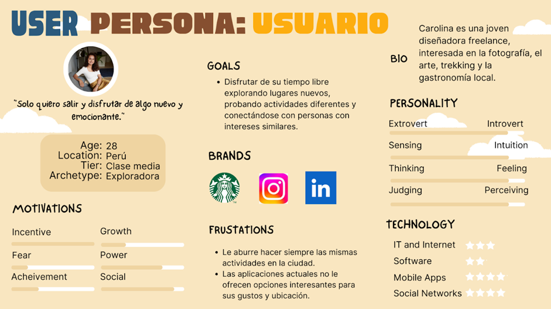

User persona de los dueños de pequeños emprendimientos: 

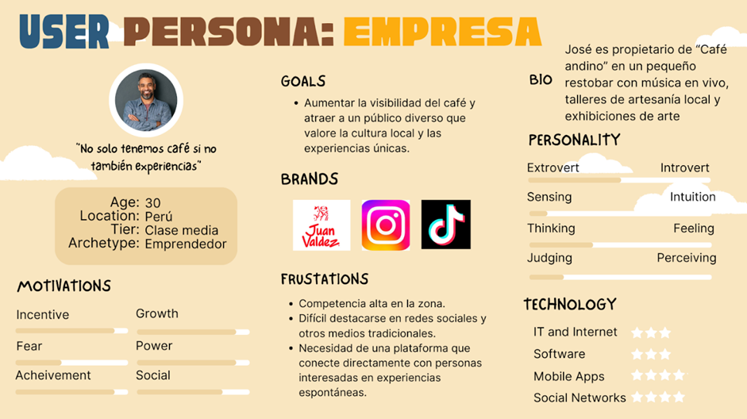  

### 2.3.2. User Task Matrix  

Segmento Usuarios: 


|Tarea |Frecuencia |Severidad |
| - | - | - |
|Buscar microaventuras cerca de su ubicación |Alta |Media |
|Usar la función "Sorpréndeme" para actividades aleatorias |Media |Media |
|Filtrar actividades por tipo, duración, o costo |Alta |Alta |
|Guardar actividades como favoritas para futuras referencias |Media |Media |
|Compartir experiencias en redes sociales |Media |Alta |
|Calificar y comentar sobre las aventuras realizadas |Baja |Media |
|Recibir notificaciones de nuevas actividades disponibles |Media |Alta |

Segmento Empresas Locales: 


|Tarea |Frecuencia |Severidad |
| - | - | - |
|Publicar nuevas experiencias o actividades en la aplicación |Alta |Alta |
|Actualizar la información de sus actividades |Media |Media |
|Revisar estadísticas de participación y feedback de usuarios |Media |Alta |
|Ofrecer promociones exclusivas a través de la aplicación |Media |Alta |
|Interactuar con usuarios a través de comentarios y mensajes |Media |Alta |
|Recibir notificaciones sobre interacciones de usuarios |Baja |Media |

### 2.3.3. User Journey Mapping  

**Segmento Usuarios:** 

**ANEXO C:**  [https://imgur.com/a/7i1hv10 ](https://imgur.com/a/7i1hv10)

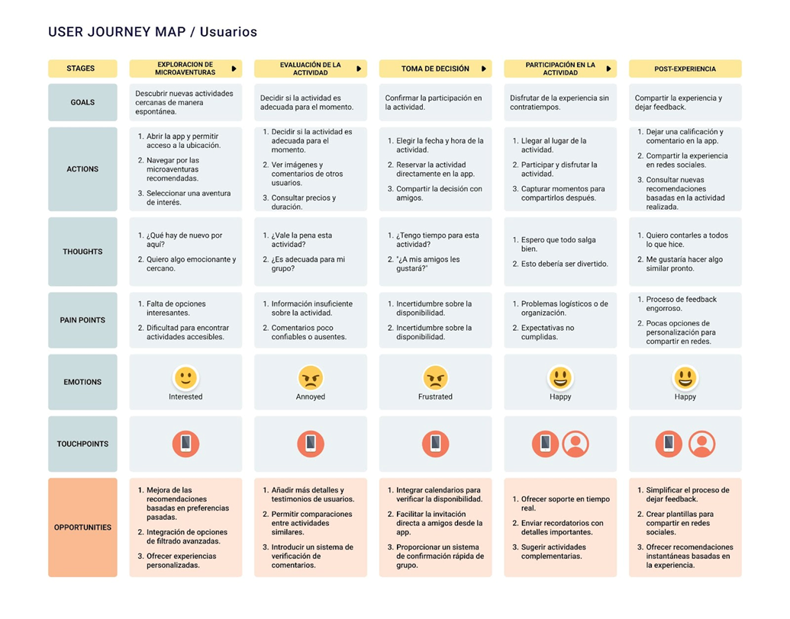  


**Segmento Empresas Locales:**

**ANEXO D:**  [https://imgur.com/a/FZnhbLQ ](https://imgur.com/a/FZnhbLQ) 

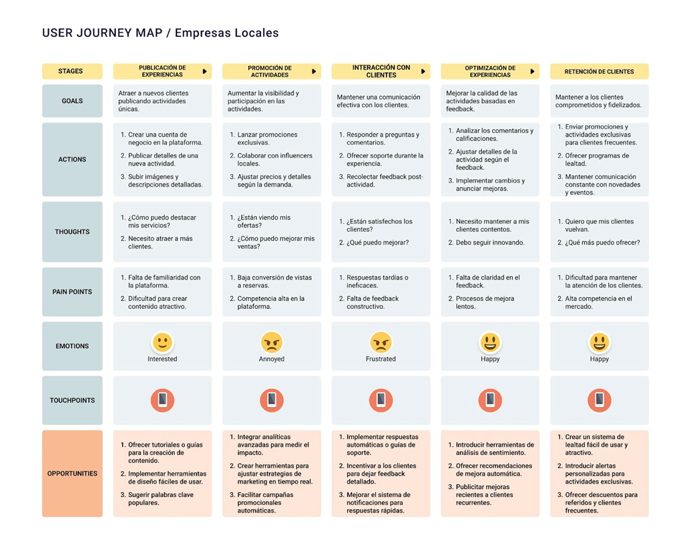  


### 2.3.4. Empathy Mapping  

**Segmento Usuarios:**

**ANEXO E:**  [https://imgur.com/a/rOEsUvd ](https://imgur.com/a/rOEsUvd) 

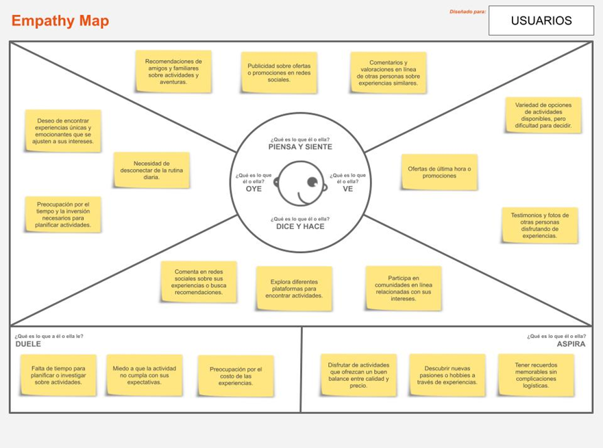  

 
**Segmento Empresas Locales:** 

**ANEXO F:** [https://imgur.com/a/YgYs5Qp ](https://imgur.com/a/YgYs5Qp)

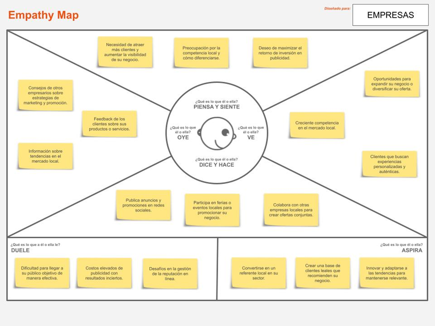  

  


### 2.3.5. As-is Scenario Mapping  


|What is the Local Entrepreneur…|||||
|:-|:-|:-|:-|:-|
|Phases	|Búsqueda de un lugar publicitario	|Registro de los servicios del local|	Publicación de actividades|	Análisis del acogimiento del local|
|Doing|	•	Encontró un puesto de periodico cercano.</p><p>•	Escoger alguna red social donde publicitar el local.|	•	Llenó un formulario sobre los datos de su local: Nombre, tipo de local, servicios y ubicación.	|•	Imprimió un afiche de las actividades para hacer en su local. </p><p>•	Pagó por la estadía de esa publicidad en el puesto de periodico.</p><p>•	Realizó un afiche para postear en su red social.	|•	Visualizó el flujo de clientes que hay en su local después de la publicación de su local.</p><p>•	Analizó las estadísticas en la configuración de la red social.|
|Thinking	|•	“Espero encontrar algún puesto donde pegar los afiches.”</p><p>•	“Ojalá esta red social sea la mejor opción para publicitar negocios.”	|•	“Qué trabajoso es colocar todos los datos de mi local.”|	•	“Ojala lo que pagué por la estadía de esta  publicación de esta actividad en el periódico valga la pena.”</p><p>•	“Quizás esta publicación sea lo suficientemente buena como para que tenga alcance en la red social.”	|•	“No creo que todos hayan visto mi publicación.”</p><p>•	“Según esta sección, mi publicación no alcanzó tanta acogida.”|
|Feeling|	•	Angustia</p><p>•	Ansiedad|	•	Estresado	|•	Abrumado</p><p>•	Enojado	|•	Ansiedad|


|What is the user…|||||
|:-|:-|:-|:-|:-|
|Phases	|Descubrimiento de aplicaciones	|Registro de datos personales|	Exploración de opciones|Realización de reseña|
|Doing	|•	Buscar referencias de buenas aplicaciones en Google.</p><p>•	Preguntar a allegados sobre alguna página web.|	•	Entré a alguna aplicación web.</p><p>•	Registrar tus datos en la app.|	•	Filtré en la búsqueda de google.</p><p>•	Entré a la aplicación que descargué y busqué lugares cercanos que visitar.|	•	Conversé con mis allegados sobre los mejores y peores lugares que encontré|
|Thinking|	•	“Ojalá alguien de mis amigos conozca una aplicación para buscar microaventuras.”</p><p>•	“Que cansado es buscar recomendaciones en google”	|•	“Espero que esta app me ayude, porque el proceso de autenticación es muy tedioso.”</p><p>•	“Que bueno que pueda ingresar con cuenta de Google o Outlook.”|	•	“Que bueno, que estas aplicaciones tengan filtro de búsqueda.”|	•	“Que mal que solo pueda dar el feedback de mi experiencia por boca.”|
|Feeling|	•	Angustiado	|•	Ansioso</p><p>•	Abrumado|	•	Tranquilo	|•	Estresado|


## 2.4. Ubiquitous Language  

El ubiquitous language es un vocabulario común compartido por todos los miembros del equipo y stakeholders para describir los conceptos clave del dominio de AventuraPe. Aquí presentamos los términos fundamentales:

|Término|	Definición|
|:-|:-|
|Microaventura|	Experiencia única y breve (de 1-4 horas) que los usuarios pueden realizar en su entorno local|
|Botón "Sorpréndeme"	|Función que recomienda aleatoriamente una actividad basada en preferencias del usuario|
|Geolocalización	|Tecnología que identifica la ubicación del usuario para sugerir actividades cercanas|
|Gamificación	|Sistema de recompensas (puntos, insignias) por participar en aventuras|
|Perfil de usuario|	Datos personales e intereses del usuario para personalizar recomendaciones|
|Negocio asociado	|Establecimiento local registrado que ofrece experiencias en la plataforma|
|Sistema de rating|	Valoración (1-5 estrellas) y comentarios que los usuarios dan a las experiencias|
|Filtros inteligentes|	Opciones para ajustar búsquedas por tiempo, presupuesto o tipo de actividad|
|Experiencia premium|	Aventura exclusiva disponible mediante suscripción o pago único|
|Panel de negocio	|Interfaz donde los locales gestionan sus publicaciones y ven estadísticas|
# Capítulo III: Requirements Specification

## 3.1. To-Be Scenario Mapping  
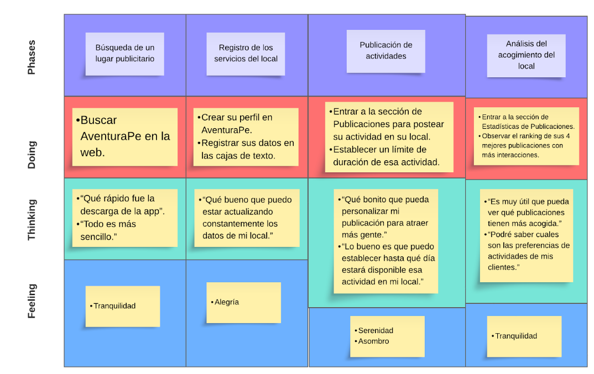

## 3.2. User Stories
# User Stories y Épicas - AventuraPe

## Tabla de Épicas

| ID | Nombre de la Épica |
|---|---|
| EP01 | Visitante |
| EP02 | Gestión de Experiencia de Aventurero |
| EP03 | Gestión de Experiencia Empresario |
| EP04 | Gestión de Perfil Empresario |
| EP05 | Gestión de Favoritos |
| EP06 | Estadísticas |

## Tabla de User Stories

| Story ID | Título | Descripción | Epic ID | Usuario | Criterios de aceptación |
|---|---|---|---|---|---|
| US01 | Interacción con hipervínculos | Como visitante, quiero interactuar con los enlaces de navegación para ir a las diferentes secciones de la plataforma web. | EP01 | Visitante | **Escenario 1: Búsqueda de Aventurape**<br>Dado que el visitante quiere saber sobre los servicios de AventuraPe<br>Cuando el visitante busca en Internet AventuraPe<br>Entonces el sistema le muestra la landing page de AventuraPe<br><br>**Escenario 2: Navegación exitosa**<br>Dado que el visitante se encuentra en la landing page de AventuraPe<br>Cuando el visitante hace clic en una sección de la barra de navegación<br>Entonces el sistema muestra la sección correspondiente |
| US02 | Sección características | Como visitante, quiero ver una sección de servicios para entender qué ofrece AventuraPe. | EP01 | Visitante | **Escenario 1: Acceso a la sección de Servicios**<br>Dado que el visitante está en la página principal de AventuraPe<br>Cuando el visitante hace clic en la opción "Servicios" del menú de navegación<br>Entonces el sistema muestra las funcionalidades clave de AventuraPe<br><br>**Escenario 2: Visualización de detalles de servicios**<br>Dado que el visitante está en la sección de Servicios<br>Cuando el visitante desplaza la página hacia abajo (scrollea)<br>Entonces el sistema muestra progresivamente información detallada de cada servicio |
| US03 | Sección Como Funciona | Como usuario nuevo quiero entender el proceso de funcionamiento de AventuraPe, para saber cómo registrarme y comenzar a usar la plataforma | EP01 | Visitante | **Escenario 1: Visualización de la sección**<br>Dado que el visitante esta en la página principal de AventuraPe<br>Cuando el visitante accede a la sección "¿Cómo funciona?"<br>Entonces el sistema le muestra un resumen guiado de los pasos sencillos para comenzar a utilizar la plataforma de AventuraPe<br><br>**Escenario 2: Guía sencilla**<br>Dado que el visitante esta en la sección de "¿Cómo funciona?"<br>Cuando el visitante revisa la información de los pasos<br>Entonces el sistema debe mostrarle cada paso enumerado con su descripción respectiva |
| US04 | Sección Sobre Nosotros | Como visitante, quiero ver la sección "Sobre Nosotros" para conocer más sobre el propósito y valores de AventuraPe. | EP01 | Visitante | **Escenario 1: Acceso a la información corporativa**<br>Dado que el visitante está en la página principal<br>Cuando hace clic en "Sobre Nosotros" en el menú de navegación<br>Entonces el sistema muestra una descripción de la misión, visión y valores corporativos.<br><br>**Escenario 2: Contenido accesible y claro**<br>Dado que el visitante está viendo la sección "Sobre Nosotros"<br>Cuando el visitante revisa el contenido<br>Entonces el sistema le presenta información en un formato visualmente atractivo y fácil de leer |
| US05 | Sección Testimonios | Como visitante, quiero leer testimonios de otros usuarios para confiar en los servicios de AventuraPe. | EP01 | Visitante | **Escenario 1: Acceso a testimonios**<br>Dado que el visitante quiere conocer experiencias de otros usuarios<br>Cuando el visitante navega hacia la sección de Testimonios<br>Entonces el sistema muestra una serie de opiniones o experiencias compartidas por usuarios reales<br><br>**Escenario 2: Presentación dinámica**<br>Dado que el visitante está en la sección de Testimonios<br>Cuando el visitante revisa los distintos comentarios<br>Entonces el sistema presenta los testimonios en un formato atractivo con nombre y experiencia destacada que el equipo de Aventurape recolectó |
| US06 | Sección Planes | Como visitante, quiero ver la sección "Planes de Suscripción" claramente diferenciada, para entender las opciones disponibles y elegir la que mejor se adapte a mis necesidades. | EP01 | Visitante | **Escenario 1: Visualización Correcta de los Planes**<br>Como visitante en la página principal de AventuraPe<br>Cuando accedo a la sección de Planes de Suscripción<br>Entonces el sistema debe mostrarme dos columnas claramente diferenciadas: una para Aventureros a la izquierda y otra para Emprendedores a la derecha<br>Y el sistema debe presentar una lista de beneficios, destacando claramente que el plan para aventureros es gratuito<br><br>**Escenario 2: Confirmación de gratuidad para aventureros**<br>Dado que estoy en la sección de Planes de Suscripción<br>Cuando reviso la columna "Para Aventureros"<br>Entonces el sistema debe mostrar el texto "GRATIS" resaltado visualmente<br><br>**Escenario 3: Visualización de beneficios para emprendedores**<br>Dado que estoy en la sección de Planes de Suscripción<br>Cuando reviso la columna "Para Emprendedores"<br>Entonces el sistema debe mostrar el texto "Pago único" en la descripción |
| US07 | Iniciar sesión | Como usuario aventurero registrado, quiero iniciar sesión con mis credenciales para acceder a mi cuenta y funcionalidades personalizadas. | EP02 | Aventurero | **Escenario 1: Inicio de sesión exitoso**<br>Dado que el aventurero registrado se encuentra en la página de inicio de sesión<br>Cuando el aventurero ingresa su usuario y contraseña correcta<br>Y pasa la verificación Captcha<br>Y hace clic en el botón "Iniciar sesión"<br>Entonces el sistema valida las credenciales<br>Y redirige al aventurero a su home personalizado<br><br>**Escenario 2: Inicio de sesión fallido por credenciales**<br>Dado que el aventurero registrado se encuentra en la página de inicio de sesión<br>Cuando el aventurero ingresa un usuario o contraseña incorrecta<br>Y pasa la verificación Captcha<br>Y hace clic en el botón "Iniciar sesión"<br>Entonces el sistema muestra un mensaje de error indicando "Credenciales inválidas"<br>Y permanece en la página de inicio de sesión<br><br>**Escenario 3: Inicio de sesión fallido por Captcha**<br>Dado que el aventurero registrado se encuentra en la página de inicio de sesión<br>Cuando el aventurero ingresa un usuario o contraseña incorrecta<br>Y no pasa la verificación Captcha<br>Y hace clic en el botón "Iniciar sesión"<br>Entonces el sistema muestra un mensaje de error indicando "Por favor, verifica que eres no un robot"<br>Y permanece en la página de inicio de sesión |
| US08 | Iniciar sesión | Como usuario aventurero registrado, quiero iniciar sesión con mis credenciales para acceder a mi cuenta y funcionalidades personalizadas. | EP02 | Aventurero | **Escenario 1: Inicio de sesión exitoso**<br>Dado que el aventurero registrado se encuentra en la página de inicio de sesión<br>Cuando el aventurero ingresa su usuario, correo y contraseña correcta<br>Y hace clic en el botón 'Iniciar Sesión'<br>Entonces el sistema valida las credenciales<br>Y redirige al aventurero a su home personalizado<br><br>**Escenario 2: Inicio de sesión fallido**<br>Dado que el aventurero registrado se encuentra en la página de inicio de sesión<br>Cuando el aventurero ingresa un usuario, correo o contraseña incorrecta<br>Y hace clic en el botón 'Iniciar Sesión'<br>Entonces el sistema muestra un mensaje de "Error de registro"<br>Y permanece en la página de inicio de sesión |
| US09 | Creación de cuenta | Como nuevo usuario aventurero, quiero crear una cuenta para usar las funciones personalizadas de la plataforma. | EP02 | Aventurero | **Escenario 1: Registro exitoso**<br>Dado que el visitante se encuentra en la página de registro para aventureros<br>Cuando el visitante completa los campos obligatorios: usuario, correo y contraseña<br>Y hace clic en el botón 'Registrar'<br>Entonces el sistema crea la nueva cuenta de aventurero y lo dirige a la sección de Iniciar Sesión<br><br>**Escenario 2: Validación de datos obligatorios**<br>Dado que el visitante está en la página de registro para aventureros<br>Cuando el visitante intenta registrarse sin completar todos los campos obligatorios: usuario, correo y contraseña<br>Entonces el sistema le muestra un mensaje<br>Y el sistema no registra la cuenta |
| US10 | Creación de cuenta | Como nuevo usuario aventurero, quiero crear una cuenta para usar las funciones personalizadas de la plataforma. | EP02 | Aventurero | **Escenario 1: Registro exitoso**<br>Dado que el visitante se encuentra en la página de registro para aventureros<br>Cuando el visitante completa los campos obligatorios: usuario, correo y contraseña<br>Y acepta los términos y condiciones<br>Y pasa la verificación Captcha<br>Y hace clic en el botón 'Registrar'<br>Entonces el sistema crea la nueva cuenta de aventurero<br>Y lo dirige a la sección de Iniciar Sesión<br><br>**Escenario 2: Validación de datos obligatorios**<br>Dado que el visitante está en la página de registro para aventureros<br>Cuando el visitante intenta registrarse sin completar todos los campos obligatorios: usuario, correo y contraseña<br>Entonces el sistema resalta el campo incorrecto o incompleto<br>Y el sistema no registra la cuenta<br><br>**Escenario 3: Validación de Captcha**<br>Dado que el visitante está en la página de registro para aventureros<br>Cuando el visitante intenta registrarse sin verificarse mediante el Captcha<br>Entonces el sistema le muestra un mensaje de "Por favor, verifique que no es un robot"<br>Y el sistema no registra la cuenta<br><br>**Escenario 4: Validación de la aceptación de los términos y condiciones**<br>Dado que el visitante está en la página de registro para aventureros<br>Cuando el visitante intenta registrarse sin aceptar los términos y condiciones<br>Entonces el sistema le muestra un mensaje de "Debe aceptar los términos y políticas para continuar"<br>Y el sistema no registra la cuenta |
| US11 | Configuración del perfil de aventurero | Como usuario aventurero registrado, quiero completar mi perfil personal para personalizar mi experiencia. | EP02 | Aventurero | **Escenario 1: Edición exitosa**<br>Dado que el aventurero selecciona la opción de "Mi cuenta"<br>Cuando el aventurero agrega uno o más campos como nombre, apellido, correo, cuidad, calle, país, género, número de contacto y código postal<br>Y hace clic en el botón 'Guardar'<br>Entonces el sistema guarda<br>Y muestra la información agregada<br><br>**Escenario 2: Edición fallida**<br>Dado que el aventurero registrado ha iniciado sesión<br>Y selecciona la opción de "Mi cuenta"<br>Cuando el aventurero intenta agregar información pero deja uno o más campos obligatorios vacíos (nombre, apellido, correo, cuidad, calle, país, género, número de contacto y código postal)<br>Y hace clic en el botón 'Guardar'<br>Entonces el sistema resalta los campos obligatorios incompletos<br>Y el botón 'Guardar' permanece desactivado hasta que todos los campos requeridos sean completados |
| US12 | Ver detalles de actividad | Como aventurero, quiero seleccionar una publicación para ver todos sus detalles como: Nombre de la actividad, cantidad de personas, duración y precio. | EP02 | Aventurero | **Escenario 1: Acceso a detalles desde Buscar**<br>Dado que el aventurero está viendo la galería de actividades en la sección Buscar<br>Cuando el aventurero hace clic "Detalles" en la tarjeta de una actividad específica<br>Entonces el sistema carga<br>Y muestra una página dedicada con toda la información detallada de esa actividad como nombre de la actividad, descripción, precio, duración, cantidad de personas, información importante, comentarios<br>Y el sistema le da la opción de escribir una reseña<br><br>**Escenario 2: Acceso a detalles desde Inicio**<br>Dado que el aventurero está viendo la galería de actividades en la sección Inicio<br>Cuando el aventurero hace clic en la tarjeta de una actividad específica<br>Entonces el sistema carga<br>Y muestra una página dedicada con toda la información detallada de esa actividad como nombre de la actividad, descripción, precio, duración, cantidad de personas, información importante, comentarios<br>Y el sistema le da la opción de escribir una reseña |
| US13 | Ver detalles de actividad | Como aventurero, quiero seleccionar una publicación para ver todos sus detalles en mi dispositivo móvil. | EP02 | Aventurero | **Escenario 1: Navegación a la sección de búsqueda**<br>Dado que el aventurero se encuentra en la sección de inicio<br>Cuando el aventurero hace clic al icono de la lupa<br>Entonces el sistema le muestra una lista de actividades<br><br>**Escenario 2: Acceso a detalles**<br>Dado que el aventurero está viendo la lista de actividades<br>Cuando el aventurero hace clic en la tarjeta de una actividad específica<br>Entonces el sistema carga<br>Y muestra una página dedicada con toda la información detallada como: Título, descripción, imagen, costo, precio, cantidad de personas, comentarios y calificación de esa actividad |
| US14 | Calificación de publicación | Como aventurero, quiero asignar una calificación a una actividad en la que participé para compartir mi valoración general. | EP02 | Aventurero | **Escenario 1: Acceso a detalles de la actividad**<br>Dado que el aventurero se encuentra en la sección de buscar<br>Cuando el aventurero selecciona una actividad específica<br>Entonces el sistema le muestra los detalles de esa actividad<br><br>**Escenario 2: Registrar calificación**<br>Dado que el aventurero está viendo la página de detalles de una actividad<br>Cuando el aventurero selecciona un número de estrellas en el control de calificación<br>Entonces el sistema pinta las estrellas dependiendo de lo que el usuario eligió<br>Y registra la calificación para esa actividad |
| US15 | Calificación de publicación | Como aventurero, quiero asignar una calificación a una actividad en la que participé para compartir mi valoración general. | EP02 | Aventurero | **Escenario 1: Acceso a detalles de la actividad**<br>Dado que el aventurero se encuentra en la sección de buscar<br>Cuando el aventurero selecciona una actividad específica<br>Entonces el sistema le muestra los detalles de esa actividad<br><br>**Escenario 2: Registrar calificación**<br>Dado que el aventurero está viendo la página de detalles de una actividad<br>Y hace clic en la opción de "Escribir Reseña"<br>Cuando el aventurero selecciona un número de estrellas en el control de calificación<br>Entonces el sistema pinta las estrellas dependiendo de lo que el usuario eligió<br><br>**Escenario 3: Registro fallido de la calificación**<br>Dado que el aventurero está viendo la página de detalles de una actividad<br>Cuando el aventurero no selecciona ningún número de estrellas en el control de calificación<br>Entonces el sistema no le permite registrar su reseña hasta seleccionar la puntuación debida |
| US16 | Publicar reseña/comentario | Como aventurero, quiero escribir y publicar una reseña/comentario sobre una actividad en la que participé para compartir mi experiencia detallada. | EP02 | Aventurero | **Escenario 1: Acceso a detalles de la actividad**<br>Dado que el aventurero se encuentra en la sección de buscar<br>Cuando el aventurero selecciona una actividad específica<br>Entonces el sistema le muestra los detalles de esa actividad<br><br>**Escenario 2: Publicar comentario exitoso**<br>Dado que el aventurero está en la página de detalles de una actividad en la que participó<br>Y hace clic en la opción de "Escribir Reseña"<br>Cuando el aventurero escribe un texto en el campo de reseña<br>Y hace clic en el botón 'Publicar'<br>Entonces el sistema guarda el comentario<br>Y lo muestra en la lista de comentarios visibles para otros usuarios<br><br>**Escenario 3: Publicar comentario fallido**<br>Dado que el aventurero está en la página de detalles<br>Y hace clic en la opción de "Escribir Reseña"<br>Cuando el aventurero no escribe ninguna reseña en el campo de texto<br>Entonces el sistema no le permite realizar la reseña |
| US17 | Publicar reseña/comentario | Como aventurero, quiero escribir y publicar una reseña/comentario sobre una actividad en la que participé para compartir mi experiencia detallada. | EP02 | Aventurero | **Escenario 1: Acceso a detalles de la actividad**<br>Dado que el aventurero se encuentra en la sección de buscar<br>Cuando el aventurero selecciona una actividad específica<br>Entonces el sistema le muestra los detalles de esa actividad<br><br>**Escenario 2: Publicar comentario exitoso**<br>Dado que el aventurero está en la página de detalles de una actividad en la que participó<br>Cuando el aventurero escribe un texto en el campo de reseña<br>Y hace clic en el botón 'Publicar'<br>Entonces el sistema guarda el comentario<br>Y lo muestra en la lista de comentarios visibles para otros usuarios |
| US18 | Navegar interfaz home | Como aventurero, quiero ver una pantalla principal (home) con un resumen de actividades para tener una vista general al ingresar a la plataforma. | EP02 | Aventurero | **Escenario 1: Vista del Home**<br>Dado que el aventurero ha iniciado sesión<br>Cuando accede a la página principal (home) de la plataforma<br>Entonces el sistema le presenta una pantalla que muestra una galería de emprendedores y publicaciones de actividades<br><br>**Escenario 2: Interacción con la galería**<br>Dado que el aventurero está viendo la pantalla de inicio<br>Cuando el aventurero desliza a la derecha la pantalla para explorar más contenido<br>Entonces el sistema carga más elementos en la galería de forma dinámica |
| US20 | Navegar interfaz home | Como aventurero, quiero ver una pantalla principal (home) con opciones claras para navegar por la plataforma desde mi computadora. | EP02 | Aventurero | **Escenario 1: Vista del Home**<br>Dado que el aventurero ha iniciado sesión<br>Cuando accede a la página principal (home) de la plataforma<br>Entonces el sistema le presenta una pantalla con dos botones donde puede ver emprendedores y publicaciones<br><br>**Escenario 2: Navegación por aventuras**<br>Dado que el aventurero está en la página principal<br>Cuando el aventurero hace clic en el botón "Aventuras"<br>Entonces el sistema muestra una lista de publicaciones con sus imágenes, descripciones y precios correspondientes<br><br>**Escenario 3: Navegación por emprendedores**<br>Dado que el aventurero está en la página principal<br>Cuando el aventurero hace clic en el botón "Emprendedores"<br>Entonces el sistema muestra los perfiles de emprendedores con datos básicos como sus nombres |
| US21 | Búsqueda por filtro | Como aventurero, quiero filtrar la lista de actividades por su nombre para encontrar rápidamente lo que busco. | EP02 | Aventurero | **Escenario 1: Navegación a la sección de búsqueda**<br>Dado que el aventurero se encuentra en la página de inicio<br>Cuando el aventurero hace clic a la sección de buscar en la barra de navegación de arriba<br>Entonces el sistema le redirige a la página de buscar<br><br>**Escenario 2: Aplicación de filtro**<br>Dado que el aventurero está en la página de buscar<br>Cuando el aventurero escribe en la barra de búsqueda una publicación con nombre existente<br>Y hace clic en buscar<br>Entonces el sistema actualiza la galería de actividades mostrando únicamente aquellas que cumplen con el nombre del filtro aplicado<br><br>**Escenario 3: Aplicación de filtro fallido**<br>Dado que el aventurero está en la página de buscar<br>Cuando el aventurero escribe en la barra de búsqueda una publicación con nombre inexistente<br>Y hace clic en buscar<br>Entonces el sistema muestra un texto de "No se encontraron actividades para …" |
| US22 | Gestión de Favoritos | Como aventurero, quiero guardar actividades como favoritos para poder acceder a ellas rápidamente más tarde. | EP05 | Aventurero | **Escenario 1: No hay favoritos guardados**<br>Dado que el usuario ha iniciado sesión<br>Cuando accede a la sección "Mis Actividades Favoritas"<br>Y no ha guardado ninguna actividad como favorita<br>Entonces el sistema muestra el mensaje: "No tienes actividades favoritas"<br>Y un botón de "Explorar actividades" para redirigirlo al catálogo<br><br>**Escenario 2: Agregar una actividad a favoritos**<br>Dado que el usuario está viendo una publicación<br>Cuando hace clic en el ícono del corazón<br>Entonces el sistema guarda la actividad en su lista de favoritos<br><br>**Escenario 3: Ver lista de favoritos guardados**<br>Dado que el usuario tiene actividades marcadas como favoritas<br>Cuando accede a "Mis Actividades Favoritas"<br>Entonces el sistema muestra una miniatura de la actividad<br>Y Botón "Ver detalles" para acceder a la publicación completa<br><br>**Escenario 4: Eliminar de favoritos**<br>Dado que el usuario está en "Mis Actividades Favoritas"<br>Cuando hace clic en el ícono de la basura junto a una actividad<br>Entonces el sistema remueve la publicación de la lista<br>Y actualiza la vista de la sección |
| US23 | Iniciar sesión | Como usuario empresario registrado, quiero iniciar sesión con mis credenciales para acceder al panel de gestión de mi negocio. | EP03 | Empresario | **Escenario 1: Inicio de sesión exitoso**<br>Dado que el aventurero registrado se encuentra en la página de inicio de sesión<br>Cuando el aventurero ingresa su usuario y contraseña correcta<br>Y pasa la verificación Captcha<br>Y hace clic en el botón "Iniciar sesión"<br>Entonces el sistema valida las credenciales<br>Y redirige al aventurero a su home personalizado<br><br>**Escenario 2: Inicio de sesión fallido por credenciales**<br>Dado que el empresario registrado se encuentra en la página de inicio de sesión<br>Cuando el empresario ingresa un usuario o contraseña incorrecta<br>Y pasa la verificación Captcha<br>Y hace clic en el botón "Iniciar sesión"<br>Entonces el sistema muestra un mensaje de error indicando "Credenciales inválidas"<br>Y permanece en la página de inicio de sesión<br><br>**Escenario 3: Inicio de sesión fallido por Captcha**<br>Dado que el empresario registrado se encuentra en la página de inicio de sesión<br>Cuando el empresario ingresa un usuario o contraseña incorrecta<br>Y no pasa la verificación Captcha<br>Y hace clic en el botón "Iniciar sesión"<br>Entonces el sistema muestra un mensaje de error indicando "Por favor, verifica que eres no un robot"<br>Y permanece en la página de inicio de sesión |
| US24 | Iniciar sesión | Como usuario empresario registrado, quiero iniciar sesión con mis credenciales para acceder al panel de gestión de mi negocio. | EP03 | Empresario | **Escenario 1: Inicio de sesión exitoso**<br>Dado que el empresario registrado se encuentra en la página de inicio de sesión<br>Cuando el empresario ingresa su usuario, correo y contraseña correctos<br>Y hace clic en el botón 'Iniciar Sesión'<br>Entonces el sistema valida las credenciales<br>Y redirige al empresario a su sección de inicio<br><br>**Escenario 2: Inicio de sesión fallido**<br>Dado que el empresario registrado se encuentra en la página de inicio de sesión<br>Cuando el empresario ingresa un usuario, correo o contraseña incorrectos<br>Y hace clic en el botón 'Iniciar Sesión'<br>Entonces el sistema muestra un mensaje de error indicando "Error de inicio de sesión,Volver"<br>Y permanece en la página de inicio de sesión |
| US25 | Creación de perfil | Como nuevo usuario empresario, quiero crear una cuenta de negocio para publicar actividades y gestionar mi presencia en la plataforma. | EP03 | Empresario | **Escenario 1: Registro exitoso**<br>Dado que el visitante se encuentra en la página de registro para empresarios<br>Cuando el visitante completa los campos obligatorios como usuario, correo y contraseña,<br>Y hace clic en el botón 'Registrar'<br>Entonces el sistema crea la nueva cuenta de empresario<br><br>**Escenario 2: Validación de datos del negocio**<br>Dado que el visitante está completando el formulario de registro para empresarios<br>Cuando el visitante ingresa información incompleta<br>Entonces el sistema le muestra un mensaje de "Error de registro, vuelve a intentar" |
| US26 | Creación de cuenta | Como nuevo usuario empresario, quiero crear una cuenta de negocio para publicar actividades y gestionar mi presencia en la plataforma. | EP03 | Empresario | **Escenario 1: Registro exitoso**<br>Dado que el visitante se encuentra en la página de registro para aventureros<br>Cuando el visitante completa los campos obligatorios: usuario, correo y contraseña<br>Y acepta los términos y condiciones<br>Y pasa la verificación Captcha<br>Y hace clic en el botón 'Registrar'<br>Entonces el sistema crea la nueva cuenta de emprendedor<br>Y lo dirige a la sección de Iniciar Sesión<br><br>**Escenario 2: Validación de datos obligatorios**<br>Dado que el visitante está en la página de registro para aventureros<br>Cuando el visitante intenta registrarse sin completar todos los campos obligatorios: usuario, correo y contraseña<br>Entonces el sistema resalta el campo incorrecto o incompleto<br>Y el sistema no registra la cuenta<br><br>**Escenario 3: Validación de Captcha**<br>Dado que el visitante está en la página de registro para aventureros<br>Cuando el visitante intenta registrarse sin verificarse mediante el Captcha<br>Entonces el sistema le muestra un mensaje de "Por favor, verifique que no es un robot"<br>Y el sistema no registra la cuenta<br><br>**Escenario 4: Validación de la aceptación de los términos y condiciones**<br>Dado que el visitante está en la página de registro para aventureros<br>Cuando el visitante intenta registrarse sin aceptar los términos y condiciones<br>Entonces el sistema le muestra un mensaje de "Debe aceptar los términos y políticas para continuar"<br>Y el sistema no registra la cuenta |
| US26 | Creación de cuenta | Como nuevo usuario empresario, quiero crear una cuenta de negocio para publicar actividades y gestionar mi presencia en la plataforma. | EP03 | Empresario | **Escenario 1: Registro exitoso**<br>Dado que el visitante se encuentra en la página de registro para aventureros<br>Cuando el visitante completa los campos obligatorios: usuario, correo y contraseña<br>Y acepta los términos y condiciones<br>Y pasa la verificación Captcha<br>Y hace clic en el botón 'Registrar'<br>Entonces el sistema crea la nueva cuenta de emprendedor<br>Y lo dirige a la sección de Iniciar Sesión<br><br>**Escenario 2: Validación de datos obligatorios**<br>Dado que el visitante está en la página de registro para aventureros<br>Cuando el visitante intenta registrarse sin completar todos los campos obligatorios: usuario, correo y contraseña<br>Entonces el sistema resalta el campo incorrecto o incompleto<br>Y el sistema no registra la cuenta<br><br>**Escenario 3: Validación de Captcha**<br>Dado que el visitante está en la página de registro para aventureros<br>Cuando el visitante intenta registrarse sin verificarse mediante el Captcha<br>Entonces el sistema le muestra un mensaje de "Por favor, verifique que no es un robot"<br>Y el sistema no registra la cuenta<br><br>**Escenario 4: Validación de la aceptación de los términos y condiciones**<br>Dado que el visitante está en la página de registro para aventureros<br>Cuando el visitante intenta registrarse sin aceptar los términos y condiciones<br>Entonces el sistema le muestra un mensaje de "Debe aceptar los términos y políticas para continuar"<br>Y el sistema no registra la cuenta |
| US27 | Publicar actividad | Como empresario, quiero publicar los detalles de una nueva actividad o experiencia que ofrezco para atraer clientes aventureros. | EP03 | Empresario | **Escenario 1: Publicación exitosa**<br>Dado que el empresario ha iniciado sesión<br>Y se encuentra en la sección de home<br>Cuando el empresario navega a la opción 'Agregar Actividad', completa todos los campos requeridos del formulario como: título de la actividad, imagen, descripción, duración, capacidad y precio<br>Y hace clic en 'Publicar'<br>Entonces el sistema guarda la nueva actividad<br>Y esta se vuelve visible en la plataforma para los aventureros<br><br>**Escenario 2: Validación de campos obligatorios**<br>Dado que el empresario está completando el formulario para publicar una actividad<br>Cuando el empresario intenta publicar sin completar todos los campos obligatorios como: título de la actividad, imagen, descripción, duración, capacidad y precio<br>Entonces el sistema no registra la publicación hasta que estén completos |
| US28 | Publicar actividad | Como empresario, quiero publicar los detalles de una nueva actividad o experiencia que ofrezco para atraer clientes aventureros. | EP03 | Empresario | **Escenario 1: Publicación exitosa**<br>Dado que el empresario ha iniciado sesión<br>Y se encuentra en la sección de home<br>Cuando el empresario navega a la opción 'Agregar Actividad', completa todos los campos requeridos del formulario como: título de la actividad, imagen, descripción, cantidad de personas, precio y hora<br>Y hace clic en 'Publicar'<br>Entonces el sistema guarda la nueva actividad<br>Y esta se vuelve visible en la plataforma para los aventureros<br><br>**Escenario 2: Validación de campos obligatorios**<br>Dado que el empresario está completando el formulario para publicar una actividad<br>Cuando el empresario intenta publicar sin completar todos los campos obligatorios<br>Entonces el sistema no registra la publicación hasta que estén los campos completos |
| US29 | Edición de actividad | Como empresario, quiero editar los detalles de una actividad ya publicada para corregir información o actualizarla. | EP03 | Empresario | **Escenario 1: Click en el botón editar**<br>Dado que el empresario ha iniciado sesión<br>Y está viendo la lista de sus actividades publicadas<br>Cuando el empresario selecciona una actividad<br>Y hace clic en 'Editar'<br>Entonces el sistema le permite editar el formulario de la publicación<br><br>**Escenario 2: Modificación de datos**<br>Dado que el empresario visualiza el formulario de edición<br>Cuando el empresario modifica uno o más campos<br>Y hace clic en 'Guardar'<br>Entonces el sistema guarda los cambios<br>Y la información actualizada de la actividad se refleja en la plataforma |
| US30 | Edición de actividad | Como empresario, quiero editar los detalles de una actividad ya publicada para corregir información o actualizarla. | EP03 | Empresario | **Escenario 1: Edición exitosa**<br>Dado que el empresario ha iniciado sesión<br>Y está viendo la lista de sus actividades publicadas<br>Cuando el empresario selecciona una actividad, hace clic en "Editar"<br>Y modifica uno o más campos<br>Y hace clic en "Actualizar"<br>Entonces el sistema guarda los cambios<br>Y la información actualizada de la actividad se refleja en la plataforma<br><br>**Escenario 2: Edición fallida**<br>Dado que el empresario ha iniciado sesión<br>Y está viendo la lista de sus actividades publicadas<br>Cuando el empresario selecciona una actividad, hace clic en "Editar"<br>Y borra campos requeridos<br>Y hace clic en "Actualizar"<br>Entonces el sistema guarda los cambios<br>Y la información actualizada de la actividad se refleja en la plataforma |
| US31 | Borrar actividad | Como empresario, quiero borrar una actividad publicada que ya no está disponible o fue un error para mantener mi oferta actualizada. | EP03 | Empresario | **Escenario 1: Borrado exitoso**<br>Dado que el empresario está viendo la lista de sus actividades publicadas<br>Cuando el empresario selecciona una actividad<br>Y hace clic en el botón de "Eliminar"<br>Entonces el sistema elimina la actividad de la plataforma |
| US32 | Borrar actividad | Como empresario, quiero borrar una actividad publicada que ya no está disponible o fue un error para mantener mi oferta actualizada. | EP03 | Empresario | **Escenario 1: Borrado exitoso**<br>Dado que el empresario está viendo la lista de sus actividades publicadas<br>Cuando el empresario selecciona una actividad<br>Y hace clic en 'Borrar'<br>Y confirma la acción en el diálogo de confirmación<br>Entonces el sistema elimina la actividad de la plataforma<br>Y de la lista de actividades activas del empresario<br><br>**Escenario 2: Cancelación del borrado de una actividad**<br>Dado que el empresario está viendo la lista de sus actividades publicadas<br>Y ha seleccionado una actividad<br>Y le da clic en 'Borrar'<br>Cuando el sistema muestra el diálogo de confirmación<br>Y el empresario hace clic en 'Cancelar'<br>Entonces el sistema no elimina la actividad<br>Y la actividad permanece visible en la lista de actividades del empresario |
| US33 | Visualización de estadísticas | Como empresario, quiero ver estadísticas sobre mis publicaciones para entender su rendimiento y popularidad. | EP06 | Empresario | **Escenario 1: Consulta de estadísticas generales**<br>Dado que el empresario navega a la sección de 'Estadísticas'<br>Cuando el empresario selecciona la opción de filtro "Mis publicaciones"<br>Entonces el sistema muestra las publicaciones del empresario<br><br>**Escenario 2: Consulta de estadísticas por comentarios**<br>Dado que el empresario está viendo la sección de 'Estadísticas'<br>Cuando el empresario selecciona la opción de "Más comentados"<br>Entonces el sistema filtra por publicaciones con más comentarios<br><br>**Escenario 3: Consulta de estadísticas por mejores puntuaciones**<br>Dado que el empresario está viendo la sección de 'Estadísticas'<br>Cuando el empresario selecciona la opción de "Mejores puntuaciones"<br>Entonces el sistema filtra por publicaciones con mejores puntuaciones |
| US34 | Visualización de estadísticas | Como empresario, quiero ver estadísticas sobre mis publicaciones para entender su rendimiento y popularidad. | EP06 | Empresario | **Escenario 1: Consulta de estadísticas generales**<br>Dado que el empresario está en su panel de gestión<br>Cuando el empresario navega a la sección de 'Estadísticas'<br>Entonces el sistema muestra un filtro para sus actividades publicadas, en donde puede filtrarlas por: más comentadas y mejor puntuadas.<br><br>**Escenario 2: Consulta de estadísticas por más comentadas**<br>Dado que el empresario está en la sección de 'Estadísticas'<br>Cuando el empresario selecciona el filtro 'Más comentadas'<br>Entonces el sistema muestra una lista ordenada de sus actividades según la cantidad de comentarios recibidos<br><br>**Escenario 3: Consulta de estadísticas por mejor puntuadas**<br>Dado que el empresario está en la sección de 'Estadísticas'<br>Cuando el empresario selecciona el filtro 'Mejor puntuadas'<br>Entonces el sistema muestra una lista ordenada de sus actividades según la valoración de las publicaciones |
| US35 | Personalizar cuenta de perfil | Como empresario registrado, quiero editar la información de mi perfil para mantenerla actualizada. | EP04 | Empresario | **Escenario 1: Edición exitosa**<br>Dado que el usuario registrado ha iniciado sesión<br>Y selecciona la opción de "Mi cuenta"<br>Cuando el usuario agrega uno o más campos como Nombre de la empresa, correo, cuidad, calle, país, número de contacto y código postal<br>Y hace clic en el botón 'Guardar'<br>Entonces el sistema guarda<br>Y muestra la información agregada<br><br>**Escenario 2: Edición fallida**<br>Dado que el usuario registrado ha iniciado sesión<br>Y selecciona la opción de "Mi cuenta"<br>Cuando el usuario intenta agregar información pero deja uno o más campos obligatorios vacíos (Nombre de la empresa, correo, cuidad, calle, país, número de contacto y código postal)<br>Y hace clic en el botón 'Guardar'<br>Entonces el sistema resalta los campos obligatorios incompletos<br>Y el botón 'Guardar' permanece desactivado hasta que todos los campos requeridos sean completados |
| US36 | Gestión de Suscripción | Como empresario registrado, quiero gestionar mi suscripción para mantenerla activa. | EP04 | Empresario | **Escenario 1: Subir comprobante de pago exitosamente**<br>Dado que el usuario selecciona la opción de "Mi subscripción"<br>Cuando el usuario sube una imagen clara del comprobante de pago<br>Y hace clic en el botón "Enviar comprobante"<br>Entonces el sistema recibe el comprobante<br>Y muestra el estado "Verificado"<br><br>**Escenario 2: Actualizar comprobante de pago**<br>Dado que el usuario quiere actualizar/corregir su comprobante<br>Y su suscripción está activa<br>Cuando el usuario selecciona "Actualizar comprobante"<br>Y sube un nuevo comprobante de pago válido<br>Entonces el sistema reemplaza el comprobante anterior<br>Y muestra un texto: "Comprobante recibido correctamente" con la nueva fecha de verificación |
| US37 | Personalizar cuenta de perfil | Como empresario registrado, quiero editar la información de mi perfil para mantenerla actualizada. | EP04 | Empresario | **Escenario 1: Personalización exitosa**<br>Dado que el usuario registrado ha iniciado sesión y ha navegado a la página de 'Perfil'<br>Y selecciona la opción de "Información de la empresa"<br>Cuando el usuario agrega uno o más campos como Nombre de la empresa, dirección, cuidad, país, número de contacto y código postal<br>Y hace clic en el botón 'Guardar'<br>Entonces el sistema guarda y muestra la información agregada.<br><br>**Escenario 2: Personalización fallida**<br>Dado que el usuario registrado ha iniciado sesión y ha navegado a la página de 'Perfil'<br>Y selecciona la opción de "Información de la empresa"<br>Cuando el usuario intenta agregar información pero deja uno o más campos obligatorios vacíos (como Nombre de la empresa, dirección o número de contacto)<br>Y hace clic en el botón 'Guardar'<br>Entonces el sistema no permite actualizar los cambios |
| US38 	| Opciones de Navegacion en la Intranet 	| El administrador necesita ver un navbar con opciones “Inicio”, “Buscar Actividades” y “Cerrar Sesión”.  	| EP07 	| Administrador 	| Escenario 1: Visualización del menú de navegación en todas las páginas<br>Dado que el administrador ha iniciado sesión en la intranet.<br>Cuando carga cualquier página de la intranet.<br>Entonces el sistema muestra un navbar fijo con los enlaces “Inicio”, “Buscar Actividades” y “Cerrar Sesión”.<br><br>Escenario 2: Redirección mediante el menú de navegación<br>Dado que el administrador visualiza el navbar en la intranet.<br>Cuando hace clic en alguna de las opciones “Inicio”, “Buscar Actividades” o “Cerrar Sesión”.<br>Entonces el sistema lo redirige correctamente a la sección correspondiente. 	| Intranet 	|
| US39 	| Listar Actividades 	| El administrador necesita ver la lista de todas las actividades registradas en el sistema. 	| EP07 	| Administrador 	| Escenario 1: Visualización de la lista completa de actividades<br>Dado que el administrador está en la sección “Inicio”.<br>Cuando la página termina de cargar.<br>Entonces el sistema muestra una lista de todas las actividades con nombre, capacidad, imagen, precio y descripción.<br><br>Escenario 2: Lista vacía de actividades<br>Dado que el administrador está en la sección “Inicio”.<br>Cuando no existen actividades registradas.<br>Entonces el sistema muestra un mensaje indicando “No hay actividades registradas”. 	| Intranet 	|
| US40 	| Eliminar Actividad 	| El administrador necesita poder eliminar una actividad del sistema. 	| EP07 	| Administrador 	| Escenario 1: Eliminación exitosa de una actividad<br>Dado que el administrador ve la lista de actividades en “Inicio”.<br>Cuando hace clic en “Eliminar” junto a una actividad y confirma la acción.<br>Entonces el sistema borra la actividad, actualiza la lista y envía un correo al empresario dueño notificando la eliminación.<br><br>Escenario 2: Cancelación de eliminación de una actividad<br>Dado que el administrador ve la lista de actividades en “Inicio”.<br>Cuando hace clic en “Eliminar” junto a una actividad pero cancela la acción.<br>Entonces el sistema no elimina la actividad y mantiene la lista sin cambios. 	| Intranet 	|
| US41 	| Ver Detalle de Actividad 	| El administrador necesita poder ver el detalle completo de una actividad. 	| EP07 	| Administrador 	| Escenario 1: Visualización del detalle de una actividad<br>Dado que el administrador está en la lista de actividades.<br>Cuando hace clic en el nombre o imagen de una actividad.<br>Entonces el sistema muestra el detalle con imagen ampliada, información importante y sección de comentarios.<br><br>Escenario 2: Actividad sin comentarios<br>Dado que el administrador está en el detalle de una actividad.<br>Cuando la actividad no tiene comentarios registrados.<br>Entonces el sistema muestra la sección de comentarios con el mensaje “Aún no hay comentarios”. 	| Intranet 	|
| US42 	| Eliminar Comentario 	| El administrador necesita poder eliminar comentarios inapropiados de una actividad. 	| EP07 	| Administrador 	| Escenario 1: Eliminación de comentario inapropiado<br>Dado que el administrador está viendo la sección de comentarios en el detalle de una actividad.<br>Cuando hace clic en “Eliminar” junto a un comentario y confirma.<br>Entonces el sistema borra el comentario y envía un correo al usuario notificando la eliminación por infracción de normas.<br><br>Escenario 2: Cancelación de eliminación de un comentario<br>Dado que el administrador está viendo la sección de comentarios en el detalle de una actividad.<br>Cuando hace clic en “Eliminar” junto a un comentario pero decide cancelar la acción.<br>Entonces el sistema no borra el comentario y permanece visible. 	| Intranet 	|
| US43 	| Buscar Actividades por Nombre 	| El administrador necesita buscar actividades por su nombre en la intranet. 	| EP07 	| Administrador 	| Escenario 1: Búsqueda por nombre de actividad<br>Dado que el administrador está en la sección “Buscar Actividades”.<br>Cuando ingresa texto en el campo de búsqueda y pulsa “Buscar”.<br>Entonces el sistema filtra y muestra sólo las actividades cuyo nombre coincida.<br><br>Escenario 2: Búsqueda sin resultados<br>Dado que el administrador está en la sección “Buscar Actividades”.<br>Cuando ingresa un texto que no coincide con ninguna actividad y pulsa “Buscar”.<br>Entonces el sistema muestra un mensaje indicando “No se encontraron actividades con ese nombre”. 	| Intranet 	|
| US44 	| Alternar Vista de Resultados 	| El administrador necesita alternar entre Vista de Lista y Vista de Cuadricula en la sección “Buscar Actividades”.  	| EP07 	| Administrador 	| Escenario 1: Vista en modo lista<br>Dado que el administrador ve resultados en “Buscar Actividades”.<br>Cuando selecciona “Vista de lista”<br>Entonces el sistema muestra los resultados en una columna.<br><br>Escenario 2: Vista en modo cuadricula<br>Dado que el administrador ve resultados en “Buscar Actividades”.<br>Cuando selecciona “Vista de cuadricula”<br>Entonces los resultados se ven en una grilla de 4 por fila. 	| Intranet 	|
| US45 	| Cerrar Sesión 	| El administrador necesita cerrar su sesión para salir de la intranet de forma segura. 	| EP07 	| Administrador 	| Escenario 1: Cierre exitoso de sesión<br>Dado que el administrador está en cualquier sección de la intranet.<br>Cuando hace clic en “Cerrar Sesión”.<br>Entonces el sistema cierra la sesión y redirige al usuario a la página de login.<br><br>Escenario 2: Intento de acceder tras cerrar sesión<br>Dado que el administrador ha cerrado sesión previamente.<br>Cuando intenta acceder directamente a una URL interna de la intranet.<br>Entonces el sistema redirige automáticamente a la página de login y muestra un mensaje indicando que debe iniciar sesión. 	| Intranet 	|

## 3.3. Product Backlog

| ID 	| Nombre del User Story 	| Descripción 	| Story Points 	|
|:---:	|:---:	|:---:	|:---:	|
| US06 	| Sección Planes 	| Como visitante, quiero ver la sección "Planes de Suscripción" claramente diferenciada, para entender las opciones disponibles y elegir la que mejor se adapte a mis necesidades. 	| 8 	|
| US12 	| Ver detalles de actividad 	| Como aventurero, quiero seleccionar una publicación para ver todos sus detalles como: Nombre de la actividad, cantidad de personas, duración y precio. 	| 8 	|
| US13 	| Ver detalles de actividad 	| Como aventurero, quiero seleccionar una publicación para ver todos sus detalles en mi dispositivo móvil. 	| 8 	|
| US16 	| Publicar reseña/comentario 	| Como aventurero, quiero escribir y publicar una reseña/comentario sobre una actividad en la que participé para compartir mi experiencia detallada. 	| 8 	|
| US17 	| Publicar reseña/comentario 	| Como aventurero, quiero escribir y publicar una reseña/comentario sobre una actividad en la que participé para compartir mi experiencia detallada. 	| 8 	|
| US21 	| Búsqueda por filtro 	| Como aventurero, quiero filtrar la lista de actividades por su nombre para encontrar rápidamente lo que busco. 	| 8 	|
| US22 	| Gestión de Favoritos 	| Como aventurero , quiero guardar actividades como favoritos para poder acceder a ellas rápidamente más tarde. 	| 8 	|
| US27 	| Publicar actividad 	| Como empresario, quiero publicar los detalles de una nueva actividad o experiencia que ofrezco para atraer clientes aventureros. 	| 8 	|
| US28 	| Publicar actividad 	| Como empresario, quiero publicar los detalles de una nueva actividad o experiencia que ofrezco para atraer clientes aventureros. 	| 8 	|
| US36 	| Gestión de Suscripción 	| Como empresario registrado, quiero gestionar mi suscripción para mantenerla activa. 	| 8 	|
| US41 	| Ver Detalle de Actividad 	| El administrador necesita poder ver el detalle completo de una actividad. 	| 8 	|
| US42 	| Eliminar Comentario 	| El administrador necesita poder eliminar comentarios inapropiados de una actividad. 	| 8 	|
| US02 	| Sección características 	| Como visitante, quiero ver una sección de servicios para entender qué ofrece AventuraPe. 	| 5 	|
| US03 	| Sección Como Funciona 	| Como usuario nuevo quiero entender el proceso de funcionamiento de AventuraPe, para saber cómo registrarme y comenzar a usar la plataforma 	| 5 	|
| US05 	| Sección Testimonios 	| Como visitante, quiero leer testimonios de otros usuarios para confiar en los servicios de AventuraPe. 	| 5 	|
| US07 	| Iniciar sesión 	| Como usuario aventurero registrado, quiero iniciar sesión con mis credenciales para acceder a mi cuenta y funcionalidades personalizadas. 	| 5 	|
| US08 	| Iniciar sesión 	| Como usuario aventurero registrado, quiero iniciar sesión con mis credenciales para acceder a mi cuenta y funcionalidades personalizadas. 	| 5 	|
| US09 	| Creación de cuenta 	| Como nuevo usuario aventurero, quiero crear una cuenta para usar las funciones personalizadas de la plataforma. 	| 5 	|
| US10 	| Creación de cuenta 	| Como nuevo usuario aventurero, quiero crear una cuenta para usar las funciones personalizadas de la plataforma. 	| 5 	|
| US11 	| Configuración del perfil de aventurero 	| Como usuario aventurero registrado, quiero completar mi perfil personal para personalizar mi experiencia. 	| 5 	|
| US14 	| Calificación de publicación 	| Como aventurero, quiero asignar una calificación a una actividad en la que participé para compartir mi valoración general. 	| 5 	|
| US15 	| Calificación de publicación 	| Como aventurero, quiero asignar una calificación a una actividad en la que participé para compartir mi valoración general. 	| 5 	|
| US18 	| Navegar interfaz home 	| Como aventurero, quiero ver una pantalla principal (home) con un resumen de actividades para tener una vista general al ingresar a la plataforma. 	| 5 	|
| US20 	| Navegar interfaz home 	| Como aventurero, quiero ver una pantalla principal (home) con opciones claras para navegar por la plataforma desde mi computadora. 	| 5 	|
| US23 	| Iniciar sesión 	| Como usuario empresario registrado, quiero iniciar sesión con mis credenciales para acceder al panel de gestión de mi negocio. 	| 5 	|
| US24 	| Iniciar sesión 	| Como usuario empresario registrado, quiero iniciar sesión con mis credenciales para acceder al panel de gestión de mi negocio. 	| 5 	|
| US25 	| Creación de perfi 	| Como nuevo usuario empresario, quiero crear una cuenta de negocio para publicar actividades y gestionar mi presencia en la plataforma. 	| 5 	|
| US26 	| Creación de cuenta 	| Como nuevo usuario empresario, quiero crear una cuenta de negocio para publicar actividades y gestionar mi presencia en la plataforma. 	| 5 	|
| US29 	| Edición de actividad 	| Como empresario, quiero editar los detalles de una actividad ya publicada para corregir información o actualizarla. 	| 5 	|
| US30 	| Edición de actividad 	| Como empresario, quiero editar los detalles de una actividad ya publicada para corregir información o actualizarla. 	| 5 	|
| US31 	| Borrar actividad 	| Como empresario, quiero borrar una actividad publicada que ya no está disponible o fue un error para mantener mi oferta actualizada. 	| 5 	|
| US32 	| Borrar actividad 	| Como empresario, quiero borrar una actividad publicada que ya no está disponible o fue un error para mantener mi oferta actualizada. 	| 5 	|
| US33 	| Visualización de estadísticas 	| Como empresario, quiero ver estadísticas sobre mis publicaciones para entender su rendimiento y popularidad. 	| 5 	|
| US34 	| Visualización de estadísticas 	| Como empresario, quiero ver estadísticas sobre mis publicaciones para entender su rendimiento y popularidad. 	| 5 	|
| US35 	| Personalizar cuenta de perfil 	| Como empresario registrado, quiero editar la información de mi perfil para mantenerla actualizada. 	| 5 	|
| US37 	| Personalizar cuenta de perfil 	| Como empresario registrado, quiero editar la información de mi perfil para mantenerla actualizada. 	| 5 	|
| US39 	| Listar Actividades 	| El administrador necesita ver la lista de todas las actividades registradas en el sistema. 	| 5 	|
| US40 	| El administrador necesita poder eliminar una actividad del sistema. 	| El administrador necesita poder eliminar una actividad del sistema. 	| 5 	|
| US01 	| Interacción con hipervínculos 	| Como visitante, quiero interactuar con los enlaces de navegación para ir a las diferentes secciones de la plataforma web. 	| 3 	|
| US04 	| Sección Sobre Nosotros 	| Como visitante, quiero ver la sección "Sobre Nosotros" para conocer más sobre el propósito y valores de AventuraPe. 	| 3 	|
| US38 	| Opciones de Navegacion en la Intranet 	| El administrador necesita ver un navbar con opciones “Inicio”, “Buscar Actividades” y “Cerrar Sesión”. 	| 3 	|
| US43 	| Buscar Actividades por Nombre 	| El administrador necesita buscar actividades por su nombre en la intranet. 	| 3 	|
| US44 	| Alternar Vista de Resultados 	| El administrador necesita alternar entre Vista de Lista y Vista de Cuadricula en la sección “Buscar Actividades”. 	| 3 	|
| US45 	| Cerrar Sesión 	| El administrador necesita cerrar su sesión para salir de la intranet de forma segura. 	| 3 	|


## 3.4. Impact Mapping  

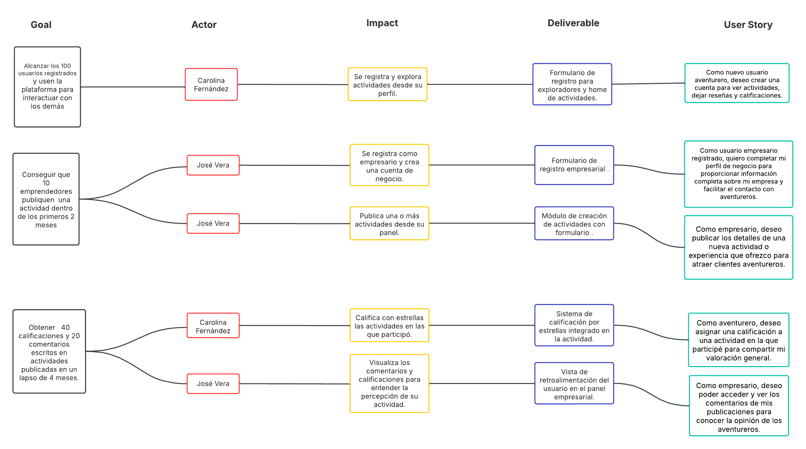

<br>

# Capítulo IV: Product Design

## 4.1. Style Guidelines
En AventuraPe, el sistema de diseño visual ha sido construido a partir de los insights obtenidos en entrevistas con nuestros principales usuarios, especialmente los perfiles aventurero espontáneo y emprendedor visualmente orientado. Detectamos que estos usuarios valoran una interfaz dinámica, energética y fácil de explorar, por lo que desarrollamos un sistema visual que combina:
<li>Paletas de colores vibrantes que refuerzan la acción y la aventura.
<li>Tipografía sans serif moderna que mejora la legibilidad en distintos dispositivos.
<li>Íconos ilustrativos simples que permiten escanear funcionalidades rápidamente.
<li>Contraste alto y uso consistente de layouts responsivos para mejorar la accesibilidad.<br>
<br>En particular, adoptamos un tono comunicacional versátil, que puede adaptarse a diferentes segmentos: lúdico para el aventurero casual, y profesional para el emprendedor. Estas decisiones están respaldadas por los principios de diseño universal (WCAG), Mobile First, y las guías de estilo de Material Design (Android) y Human Interface Guidelines (iOS).<br>Las siguientes subsecciones presentan el desglose visual aplicado a los distintos entornos (web y móviles), con capturas de los componentes base del sistema visual.<br>

### 4.1.1. General Style Guidelines  
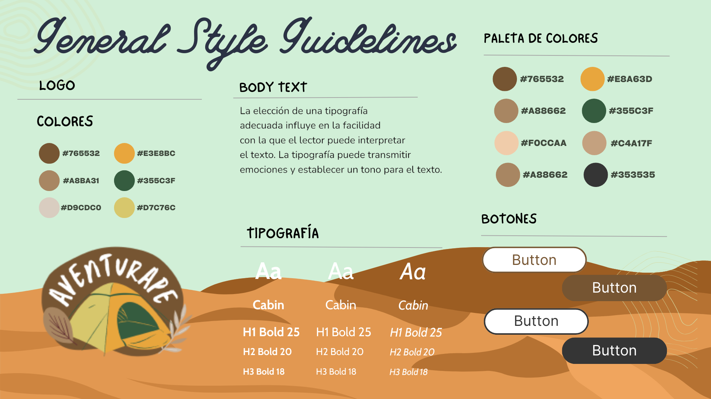

### 4.1.2. Web Style Guidelines 
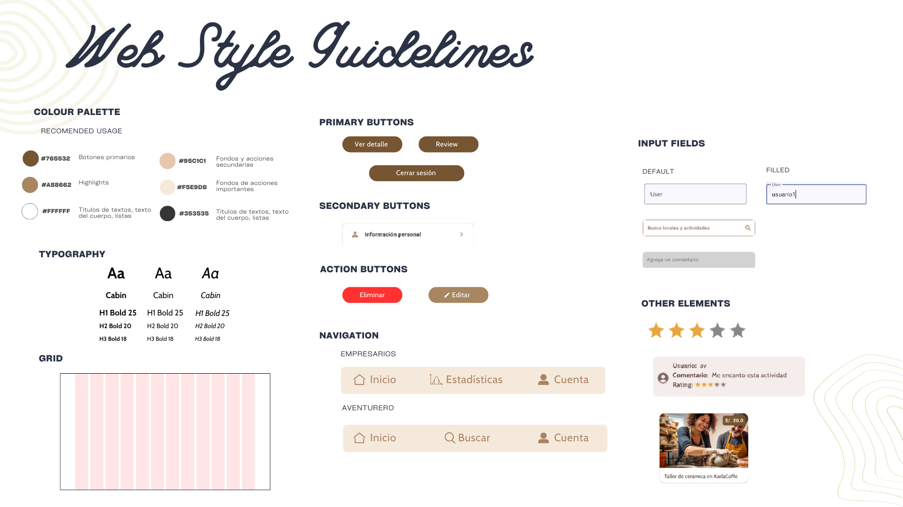

### 4.1.3. Mobile Style Guidelines
#### 4.1.3.1. iOS Mobile Style Guidelines

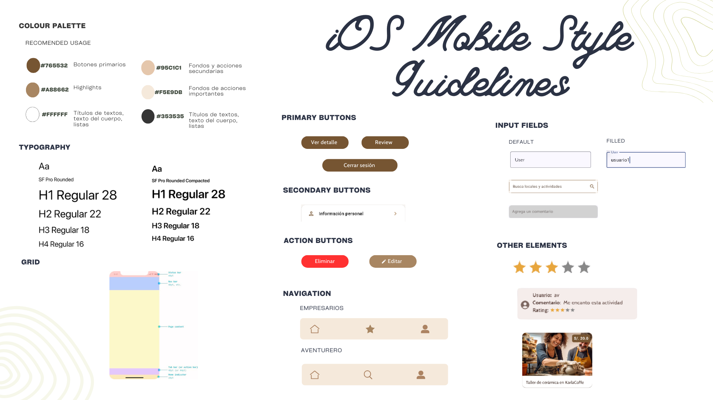

#### 4.1.3.2. Android Mobile Style Guidelines  
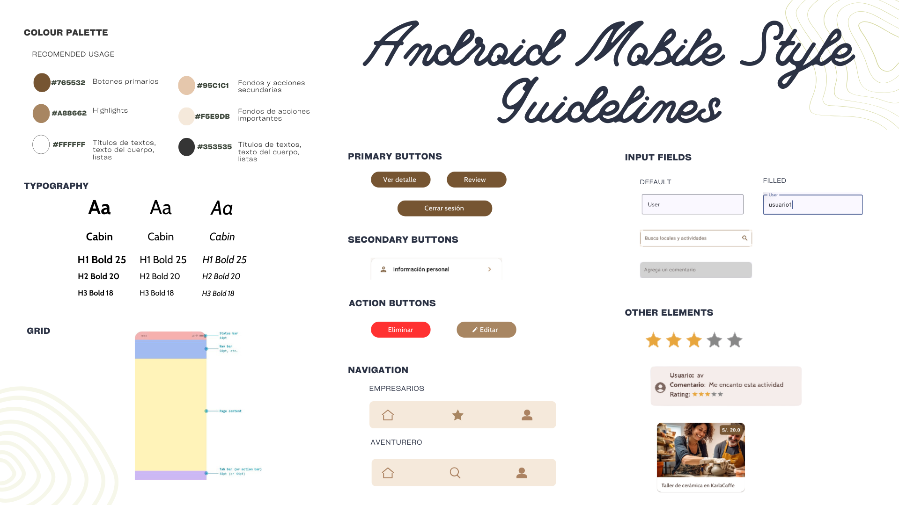

## 4.2. Information Architecture
### 4.2.1. Organization Systems

**Aventurero**<br>
En primer lugar el aventurero o emprendedor se encontrará en la landing, la cual lo redirija a la tienda de aplicación de su preferencia. Una vez descargada la aplicación. Se registrará o iniciará sesión, según el tipo de usuario que elija.
<br>
En el panel de aventurero la primera vista será la pantalla principal en donde podrá ver una lista de locales, posts recientes, y los posts más populares, aquí se encontrará el botón “Sorpréndeme”. En la siguiente vista tendrá el buscador y los posts. Finalmente, en el panel de cuenta, se encuentra la información del usuario.

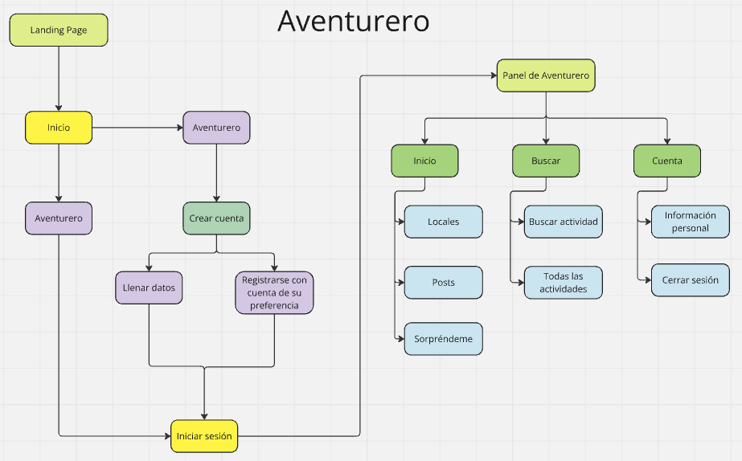

<br>

**Emprendedor**<br>
En el panel del emprendedor la primera vista será la página principal con sus posts anteriormente publicados y un botón que le permita agregar un nuevo post. En el apartado de estadísticas podrá filtrar los posts con mejor calificación o con más comentarios. Finalmente, en el perfil del emprendedor se encontrará información del emprendimiento o empresa.

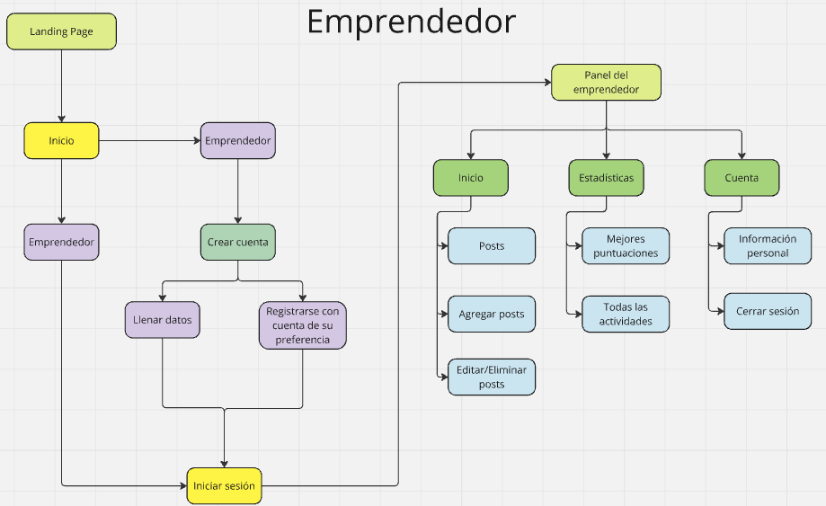


### 4.2.2. Labeling Systems  
<br>Este sistema de etiquetado se integró en nuestro tablero de gestión de tareas (Trello/Jira) y permite identificar rápidamente el tipo de trabajo pendiente ([FEAT], [FIX]), su prioridad ([P1], [P2]) y el módulo involucrado ([UI], [DB]). Por ejemplo, la tarea [FEAT][P1][UI][TODO] Crear pantalla de inicio indica que es una nueva funcionalidad prioritaria de interfaz aún pendiente de desarrollo.<br>
| **Etiqueta**            | **Descripción**               |
|---------------------|---------------------------|
| **Tipo de tarea**       |                           |
| [FEAT]              | Nueva característica      |
| [FIX]               | Corrección de errores     |
| [REFACTOR]          | Refactorización de código |
| [DOCS]              | Documentación             |
| [TEST]              | Pruebas                   |
| **Prioridad**           |                           |
| [P1]                | Alta prioridad            |
| [P2]                | Prioridad media           |
| [P3]                | Baja prioridad            |
| **Módulo o componente** |                           |
| [UI]                | Interfaz de usuario       |
| [API]               | Lógica de la API          |
| [DB]                | Base de datos             |
| [AUTH]              | Autenticación             |
| [PERF]              | Rendimiento               |
| **Estado**              |                           |
| [TODO]              | Por hacer                 |
| [WIP]               | En progreso               |
| [REVIEW]            | En revisión               |
| [DONE]              | Completado                |


### 4.2.3. SEO Tags and Meta Tags

La implementación de estas etiquetas ayudan al posicionamiento de la página en los motores de búsqueda.
Título
Indica el tema de la página, debe ser corto y descriptivo, debe mantenerse entre los 55 y 60 caracteres.

    <title>AventuraPe</title>

**Descripción** <br>
Es una breve descripción  de la página.

	<meta name= “description” content= “No lo planees, explora y atrévete”/>

Robots
Indican a los motores de búsqueda de lo que deben hacer con la página.
index/noindex: Indica al motor de búsqueda si debe mostrar la página en el SERP o no.
follow/nofollow: Les dice a los motores qué hacer con los enlaces en ese objetivo.
Tipo de contenido
Es útil para que los motores de búsqueda identifiquen el idioma de la página.

    <meta http-equiv= “tipo de contenido” content= “text/html charset-utf-8” />
    <meta http-equiv= “tipo de contenido” content= “text/html charset-ISO-6059-1” />

Searchbox de enlaces
Se utiliza para controlar el cuadro de búsqueda de enlaces del sitio de Google

    <meta name= “google” content = “nositelinkssearchbox”/>

Viewport Meta Tag 
Es crucial para asegurar que el contenido se vea bien en dispositivos móviles.

    <meta name="viewport" content="width=device-width, initial-scale=1.0">


### 4.2.4. Searching Systems

El sistema de búsqueda propuesto para AventuraPe permitirá a los usuarios personalizar su experiencia de aventurera de acuerdo a sus preferencias. Este sistema facilitará la personalización de duración, cantidad de personas, lugar, mejores puntuados, etc. Los filtros disponibles serán:

| Nombre del filtro    | Descripción                                                                                                              |
|----------------------|--------------------------------------------------------------------------------------------------------------------------|
| Más comentados       | Permitirá ordenar los posts que tienen más comentarios de manera descendente.                                            |
| Mejor puntuación     | Permitirá ordenar de mejor a peor puntuación.                                                                            |
| Costo                | Permitirá ordenar de menor a mayor costo o viceversa.                                                                    |
| Duración             | El usuario puede seleccionar el tiempo aproximado que le tomará realizar la actividad.                                   |
| Cantidad de personas | El usuario podrá filtrar de acuerdo al tipo de actividad que desee de acuerdo a la cantidad de personas que se requiera. |


### 4.2.5. Navigation Systems  
En la app móvil se optó por el patrón de navegación tipo bottom tab bar, alineado con las guías de Human Interface (iOS) y Material Design (Android), facilitando el acceso a secciones críticas con el pulgar. En la web, se emplea una barra superior fija, siguiendo principios de navegación persistente, para evitar pérdida de contexto. Este diseño prioriza las tareas más frecuentes: explorar, buscar y gestionar cuenta, con énfasis visual en los íconos y retroalimentación activa al seleccionar secciones.

**Aventurero**
| Nombre | Descripción                                                                                                              |
|--------|--------------------------------------------------------------------------------------------------------------------------|
| Inicio | Le muestra los posts más recientes, los locales más populares al entrar a la aplicación.|
| Buscar | El usuario podrá buscar por palabra clave, nombre de local, etc.                                                         |
| Cuenta | Este apartado permite que el usuario gestione su cuenta.                                                                 |
<br>

**Emprendedor**
| Nombre       | Descripción                                                                                          |
|--------------|------------------------------------------------------------------------------------------------------|
| Inicio       | Le muestra los posts publicados, asimismo podrá gestionar estps, como eliminar, editar.              |
| Estadísticas | El emprendedor podrá filtrar sus posts por, más comentados, mejores puntuados y ver todos sus posts. |
| Cuenta       | Este apartado permite que el usuario gestione su cuenta.                                             |


## 4.3. Landing Page UI Design
El diseño de la landing page de AventuraPe fue construido bajo un enfoque centrado en el usuario, basado en los principales User Personas identificados: el aventurero espontáneo y el emprendedor en búsqueda de visibilidad. El diseño prioriza una arquitectura jerárquica de información que guía al usuario desde un mensaje de valor claro, hacia funcionalidades clave y mecanismos de confianza como testimonios. Para lograr una navegación fluida, se aplicó el **patrón visual en forma de “Z”**, optimizando la disposición de títulos, botones de acción y contenido visual.
<br><br>
En cuanto a accesibilidad, se respetaron las pautas WCAG 2.1: uso de alto contraste (mínimo 4.5:1), tipografías legibles en distintos tamaños, estructura **semántica clara y botones suficientemente grandes para interacción táctil** . El diseño es totalmente responsive, asegurando adaptabilidad desde desktop hasta smartphones.
<br><br>
Este diseño se evaluó con usuarios potenciales mediante **entrevistas cortas y pruebas de clics en prototipos de Figma**. Las observaciones nos permitieron reorganizar la sección de Testimonios más arriba en la jerarquía visual, al notar que generaba mayor confianza antes del registro. Este tipo de iteraciones nos permitió alinear la estructura visual con las expectativas del usuario real.

### 4.3.1. Landing Page Wireframe
Los wireframes desarrollados para la landing page de AventuraPe contemplan versiones para navegadores de escritorio y dispositivos móviles, asegurando una experiencia responsive que se adapta a diferentes tamaños de pantalla. La estructura se organiza de la siguiente manera:

- Encabezado (Header): Se implementa un menú de navegación fijo en la parte superior que incluye enlaces a secciones clave como "Servicios", "Sobre nosotros", "Testimonios", "Preguntas frecuentes" y "Contacto". Este diseño sigue el principio de consistencia, facilitando la navegación del usuario y permitiendo un acceso rápido a la información relevante.

- Sección Principal: Presenta un mensaje de bienvenida y un llamado a la acción destacado, utilizando una jerarquía visual clara que guía la atención del usuario hacia las acciones deseadas. Se aplica el patrón de diseño en forma de "Z", que dirige la mirada del usuario a través de los elementos más importantes de la página.

- Secciones Informativas: Detallan las funcionalidades de la plataforma, como calificar actividades, descubrir nuevas aventuras y publicar eventos si se es emprendedor. En cada sección se aplicó el principio de proximidad para agrupar información relacionada en secciones y facilitar así su comprensión.

- Testimonios y Preguntas Frecuentes: Proporcionan evidencia social y resuelven dudas comunes, respectivamente, aumentando la confianza del usuario en la plataforma. Se utiliza el principio de retroalimentación para mostrar que las opiniones de otros usuarios son valoradas y consideradas.

- Pie de Página (Footer): Contiene información de contacto y enlaces a nuestras redes sociales como Twitter, Facebook e Instagram, facilitando la comunicación y conexión con los usuarios.

En cuanto al diseño inclusivo, se han considerado aspectos como el contraste adecuado entre texto y fondo para garantizar la legibilidad, el uso de tipografías claras y tamaños de fuente apropiados para diferentes dispositivos, y la disposición de elementos interactivos con suficiente espacio para facilitar su uso por personas con diversas capacidades. Además, la estructura de la información sigue una arquitectura jerárquica que prioriza el contenido más relevante, permitiendo una navegación intuitiva.<br>
<br>ANEXO A: https://www.figma.com/design/XnZ4CmnkLFbmhpGQej7d7W/AventuraPe?node-id=151-2&t=jrNC7V95qrZFGvXF-1<br>


### 4.3.2. Landing Page Mock-up
Los mock-ups representan visualmente el resultado final del diseño propuesto y consolidan las decisiones tomadas en cuanto a estética, funcionalidad y usabilidad. En ambas versiones, se mantiene una coherencia visual que refuerza la identidad de la marca, respetando el Design System definido para el proyecto.<br>

<br>Se aplicaron principios clave de diseño como **contraste y jerarquía visual**, evidenciados en el uso de colores llamativos para los botones de acción y en la organización textual que dirige la atención desde el título hasta el botón "Explora ahora". La consistencia visual se mantiene en íconos, estilos y márgenes, lo cual genera una experiencia fluida. En cuanto a la **arquitectura de información**, el contenido se organiza de forma secuencial y lógica: inicia con una presentación de valor clara, continúa con las funcionalidades de la plataforma, testimonios y preguntas frecuentes, y finaliza con un llamado a la acción. Esta estructura guía de manera progresiva al usuario hacia el objetivo del sitio.<br>
<br>
**ANEXO B:** <br> [https://www.figma.com/design/XnZ4CmnkLFbmhpGQej7d7W/AventuraPe?node-id=151-2&t=jrNC7V95qrZFGvXF-1](https://www.figma.com/design/XnZ4CmnkLFbmhpGQej7d7W/AventuraPe?node-id=151-2&t=jrNC7V95qrZFGvXF-1) <br>


## 4.4. Mobile Applications UX/UI Design
El diseño UX/UI de las aplicaciones móviles de AventuraPe se desarrolló siguiendo un enfoque **User-Centered Design**, partiendo de **entrevistas y mapas de empatía** realizados en fases previas. Se identificaron dos flujos principales: aventurero explorador y emprendedor gestor, cuyas prioridades divergentes guiaron la estructuración de funcionalidades y jerarquía visual.
El proceso de diseño incluyó:
<li>Sketches rápidos en papel para idear flujos iniciales.
<li>Wireframes en Figma que permitieron validar la disposición de componentes clave (buscador, filtros, perfil).
<li>Wireflows detallados que reflejan los caminos más usados por cada tipo de usuario.<br>
### 4.4.1. Mobile Applications Wireframes

**ANEXO G:**<br>[https://www.figma.com/design/XnZ4CmnkLFbmhpGQej7d7W/AventuraPe?node-id=47-1888&t=8uKwyhtfkQTKMvj6-1](https://www.figma.com/design/XnZ4CmnkLFbmhpGQej7d7W/AventuraPe?node-id=47-1888&t=8uKwyhtfkQTKMvj6-1)

**Sección Aventurero**<br>
A través de estos wireframes, se presentan las pantallas que guiarán a los usuarios en su travesía, destacando la importancia de la navegabilidad, el diseño centrado en el usuario y las funcionalidades que les permiten interactuar de manera fluida y natural con la aplicación.

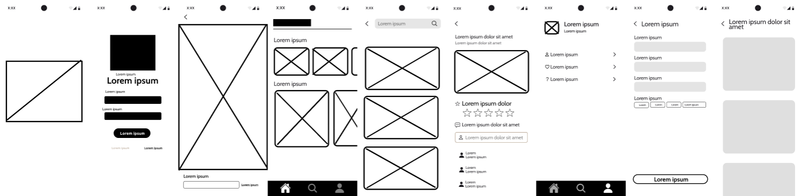<br>

**Sección Emprendedor**<br>
Esta sección está diseñada para aquellos usuarios con un espíritu innovador y emprendedor, interesados en gestionar y desarrollar sus propios proyectos a través de la aplicación móvil.


### 4.4.2. Mobile Applications Wireflow Diagrams

<br>

**ANEXO H:** [https://lucid.app/lucidchart/4ca0657e-5e53-4b71-8dcd-e84862e13c3f/edit?viewport_loc=-5149%2C-2964%2C15846%2C6519%2CVuP_hvOzbZtf&invitationId=inv_9f16f8d8-1ba4-4fb5-9bd6-670978bd7794](https://lucid.app/lucidchart/4ca0657e-5e53-4b71-8dcd-e84862e13c3f/edit?viewport_loc=-5149%2C-2964%2C15846%2C6519%2CVuP_hvOzbZtf&invitationId=inv_9f16f8d8-1ba4-4fb5-9bd6-670978bd7794)


## Seccion de aventurero
**User Goal:** Como aventurero, quiero ingresar a mi cuenta en AventuraPe.  
<br>

**User Goal:** Como aventurero, navegar en la sección Home.  
<br>

**User Goal:** Como aventurero, quiero buscar alguna actividad de mi interés.  
<br>

**User Goal:** Como aventurero, quiero tener una aventura espontánea.  
<br>

**User Goal:** Como aventurero, quiero filtrar mi búsqueda.  
<br>

**User Goal:** Como aventurero, quiero calificar la actividad que realicé.  
<br>

**User Goal:** Como aventurero, quiero actualizar mis datos personales de mi cuenta.  
<br>


## Seccion de empresario
**User Goal:** Como emprendedor, quiero ingresar a mi cuenta en AventuraPe.  
<br>

**User Goal:** Como emprendedor, quiero publicar una actividad para mi local.  
<br>

**User Goal:** Como emprendedor, quiero ver las mejores publicaciones que tuve.  
<br>

**User Goal:** Como emprendedor, quiero actualizar los datos de mi local.  
<br>

### 4.4.3. Mobile Applications Mock-ups
**ANEXO E:**<br> [https://www.figma.com/design/XnZ4CmnkLFbmhpGQej7d7W/AventuraPe?node-id=0-1&t=cwavRBbaqEngEViE-1](https://www.figma.com/design/XnZ4CmnkLFbmhpGQej7d7W/AventuraPe?node-id=0-1&t=cwavRBbaqEngEViE-1)


**Sección aventurero**
- **Registro e inicio de sesión:** Esta pantalla permite al usuario aventurero registrarse en la aplicación con su nombre completo, correo electrónico y una contraseña. El diseño sigue siendo simple, con campos de entrada claros y un botón destacado de "Sign Up" en la parte inferior para completar el proceso de registro.<br>
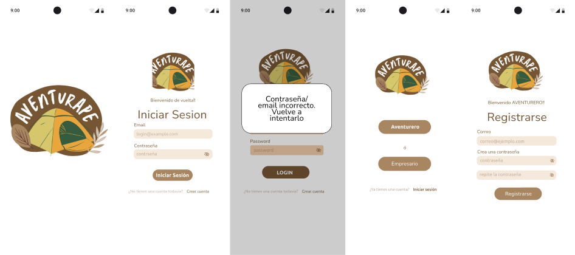

- **Inicio:** Esta pantalla principal muestra una vista general de los locales disponibles y las publicaciones o actividades más populares. La interfaz es visualmente clara y organizada, con espacios amplios para mostrar imágenes o tarjetas de locales y actividades que el aventurero puede explorar.<br>
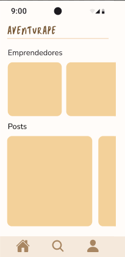

- **Búsqueda de actividades:** En esta sección, se encuentra la barra de búsqueda. Una vez seleccione una actividad, el aventurero puede ver el nombre de la publicación o actividad, el nombre de la empresa o usuario emprendedor, y una imagen destacada. También se permite al usuario calificar y comentar sobre la actividad, lo que fomenta la interacción y retroalimentación.<br>
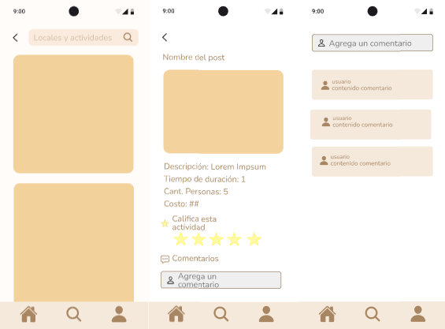

- **Mi cuenta:** En esta sección, el aventurero puede gestionar su perfil personal. La interfaz incluye un botón de "Guardar" para confirmar cualquier actualización de la información personal.<br>
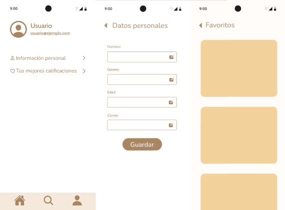

<br>

**Sección emprendedor**
- **Registro e inicio de sesión:** Esta pantalla permite al usuario emprendedor registrarse en la aplicación. La interfaz es simple y clara, con un botón de "Registro" destacado en la parte inferior para completar el proceso de registro. Y si ya tiene una cuenta el botón de "Iniciar sesión".<br>
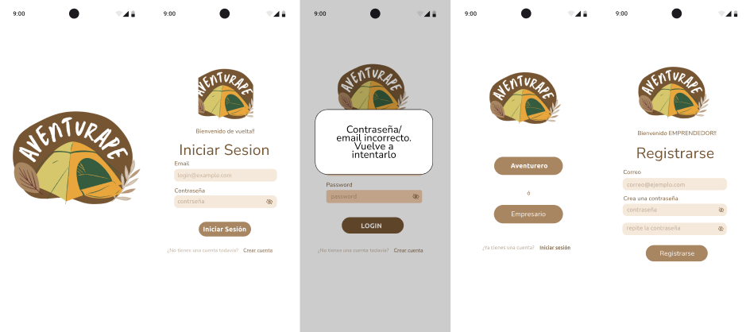

- **Registro de comprobante:** Esta pantalla muestra la sección para que el emprendedor pueda subir el comprobante de pago de su suscripción.<br>
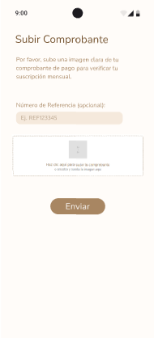

- **Inicio:** Una vez registrado, el usuario es llevado a la pantalla principal donde puede ver sus publicaciones o agregar una nueva actividad mediante un botón "Agregar actividad".<br>
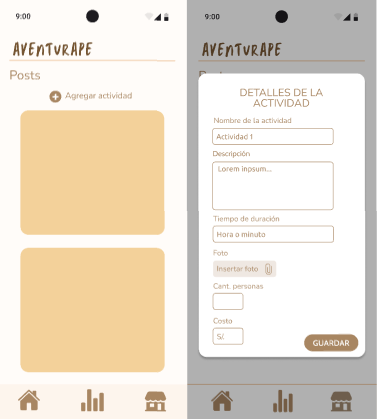

- **Estadísticas:** Esta pantalla muestra las estadísticas de las publicaciones más exitosas del usuario emprendedor. Se presentan en un formato visual sencillo con espacio para gráficos o datos relevantes sobre el rendimiento de las actividades publicadas.<br>
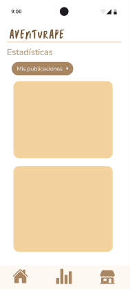

- **Mi cuenta:** En esta sección, el emprendedor puede gestionar su perfil personal y los detalles de su negocio, como el nombre del local, la localización, sector y correo electrónico. La interfaz incluye un botón de "Guardar" para confirmar cualquier actualización de la información personal. Además puede visualizar los beneficios de su plan de suscripción.<br>
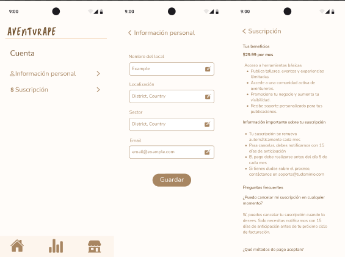


### 4.4.4. Mobile Applications User Flow Diagrams
**ANEXO I**: [https://lucid.app/lucidchart/4ca0657e-5e53-4b71-8dcd-e84862e13c3f/edit?view_items=m-N_lZ8pzENG&invitationId=inv_9f16f8d8-1ba4-4fb5-9bd6-670978bd7794](https://lucid.app/lucidchart/4ca0657e-5e53-4b71-8dcd-e84862e13c3f/edit?view_items=m-N_lZ8pzENG&invitationId=inv_9f16f8d8-1ba4-4fb5-9bd6-670978bd7794)
<br>
### Segmento de Aventurero
**USER GOAL: Como aventurero, quiero ingresar a mi cuenta en AventuraPe:**
Este objetivo se refiere a la necesidad del usuario de acceder a su perfil personal en la plataforma AventuraPe. Incluye el proceso de autenticación mediante credenciales (usuario/contraseña).<br>


**USER GOAL: Como aventurero, navegar en la sección Home:**
Este objetivo abarca la experiencia del usuario al explorar la página principal de la plataforma. El aventurero busca una interfaz intuitiva que le muestre contenido relevante como actividades destacadas y emprendedores<br>


**USER GOAL: Como aventurero, quiero buscar alguna actividad de mi interés:**
Este objetivo refleja la necesidad del usuario de encontrar actividades específicas que se alineen con sus preferencias. Implica la utilización de la sección de Publicaciones, donde ve una galería de actividades.


**USER GOAL: Como aventurero, quiero filtrar mi búsqueda:**
Este objetivo complementa al anterior, permitiendo al usuario refinar sus resultados de búsqueda mediante criterios específicos como el nombre de las actividades. Los filtros ayudan al aventurero a encontrar exactamente el tipo de experiencia que está buscando.<br>


**USER GOAL: Como aventurero, quiero calificar/comentar la actividad que realicé:**
Este objetivo responde a la necesidad del usuario de compartir su experiencia después de participar en una actividad. Incluye la posibilidad de asignar una puntuación y redactar una reseña detallando aspectos positivos y negativos.<br>


**USER GOAL: Como aventurero, quiero actualizar mis datos personales de mi cuenta:**
Este objetivo se relaciona con la gestión del perfil personal, permitiendo al usuario modificar información como datos de contacto. Es importante para mantener la cuenta actualizada y personalizada según las necesidades cambiantes del usuario.<br>


**USER GOAL: Como aventurero, quiero guardar en favoritos publicaciones que me gustaron:**
Este objetivo refleja la necesidad de crear una lista personalizada de actividades que han llamado la atención del usuario. La función de favoritos permite al aventurero marcar experiencias interesantes para considerarlas posteriormente, facilitando la planificación de futuras aventuras.<br>


### Segmento de Empresario
**USER GOAL: Como emprendedor, quiero ingresar a mi cuenta en AventuraPe:**
Este objetivo se refiere a la necesidad del emprendedor de acceder a su cuenta profesional en la plataforma. Implica un proceso de autenticación específico para usuarios de tipo negocio, que les da acceso a un panel de control o dashboard con funcionalidades especializadas para la gestión de su oferta de actividades.<br>


**USER GOAL: Como emprendedor, quiero publicar una actividad para mi local:**
Este objetivo representa la función principal que busca un emprendedor en la plataforma: dar visibilidad a las experiencias o actividades que ofrece su negocio. Incluye el proceso de creación de anuncios con detalles como descripción, imágenes, precios, horarios y ubicación. Esta funcionalidad es esencial para que el emprendedor pueda comercializar sus servicios de aventura a los usuarios de la plataforma.<br>


**USER GOAL: Como emprendedor, quiero ver las mejores publicaciones que tuve:**
Este objetivo refleja la necesidad del emprendedor de analizar el rendimiento de sus publicaciones para identificar cuáles han sido más exitosas. Esto implica acceder a métricas como número de los más comentados o valoraciones. Esta información es crucial para que el emprendedor pueda entender las preferencias de los clientes y optimizar su oferta de actividades.<br>


**USER GOAL: Como emprendedor, quiero actualizar los datos de mi local:**
Este objetivo se relaciona con la gestión del perfil comercial, permitiendo al emprendedor mantener actualizada la información de su negocio, como ubicación, horarios de atención, métodos de pago aceptados, servicios adicionales, etc. La actualización periódica de esta información es crucial para mantener una presencia profesional y confiable en la plataforma.<br>


## 4.5. Mobile Applications Prototyping
### 4.5.1. Android Mobile Applications Prototyping

**Inicio - Emprendedor:** La pantalla de inicio para el usuario emprendedor ofrece una vista rápida de sus publicaciones actuales y un botón destacado "Agregar actividad". 
**Inicio - Aventurero:** La página de inicio del aventurero es visualmente atractiva y funcional, presentando una lista de actividades recomendadas y populares basadas en la ubicación del usuario.

### **Funcionalidades**

**Sección Emprendedor**

- **Ver Publicaciones:** Permite al emprendedor revisar todas las actividades que ha creado en la aplicación.
- **Agregar Actividad:** Un botón claro y accesible para que los emprendedores añadan nuevas actividades o promociones.
- **Editar/Eliminar Actividades:** Funcionalidades que permiten la edición rápida o eliminación de publicaciones ya creadas.
- **Estadísticas de Actividades:** El emprendedor puede filtrar sus publicaciones por, más comentadas y mejor calificadas.

**Sección Aventurero**

- **Explorar Actividades:** Muestra una lista o tarjetas con actividades cercanas, destacando las más populares.
- **Buscar Actividades:** El aventurero puede utilizar una barra de búsqueda para encontrar actividades específicas.
- **Comentar y calificar:** El aventurero puede comentar en las actividades que desee y calificarlas.

**Video de explicación del flujo:** 
**ANEXO J:** <br>[https://drive.google.com/file/d/1HK6GOXkf34y08Jlw23Pg49A2nIlxzWvP/view?usp=sharing](https://drive.google.com/file/d/1HK6GOXkf34y08Jlw23Pg49A2nIlxzWvP/view?usp=sharing)
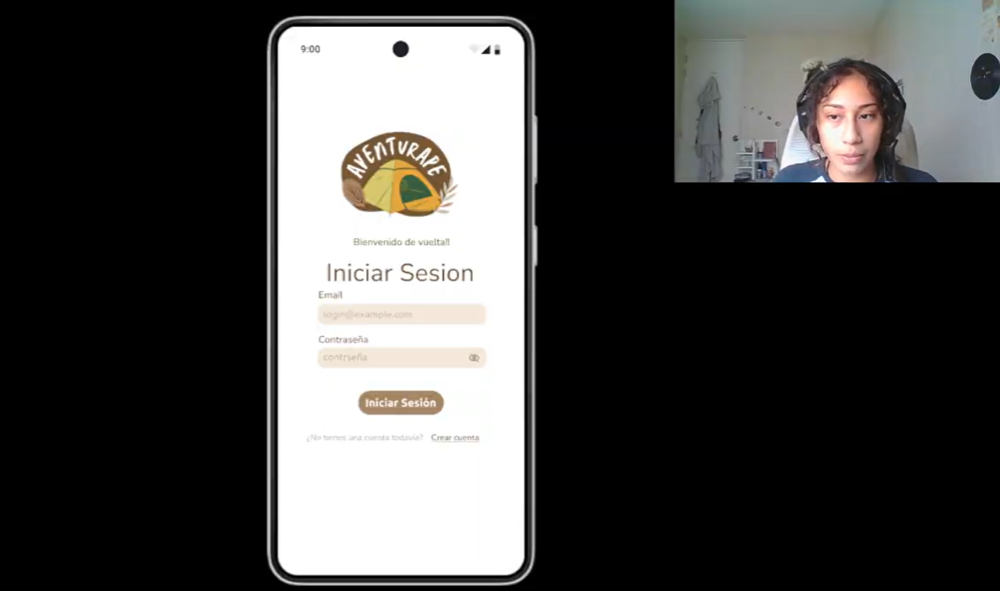


### 4.5.2. iOS Mobile Applications Prototyping

**Inicio - Emprendedor:** La pantalla de inicio para el usuario emprendedor ofrece una vista rápida de sus publicaciones actuales y un botón destacado "Agregar actividad". 
**Inicio - Aventurero:** La página de inicio del aventurero es visualmente atractiva y funcional, presentando una lista de actividades recomendadas y populares basadas en la ubicación del usuario.

### **Funcionalidades**

**Sección Emprendedor**

- **Ver Publicaciones:** Permite al emprendedor revisar todas las actividades que ha creado en la aplicación.
- **Agregar Actividad:** Un botón claro y accesible para que los emprendedores añadan nuevas actividades o promociones.
- **Editar/Eliminar Actividades:** Funcionalidades que permiten la edición rápida o eliminación de publicaciones ya creadas.
- **Estadísticas de Actividades:** El emprendedor puede filtrar sus publicaciones por, más comentadas y mejor calificadas.

**Sección Aventurero**

- **Explorar Actividades:** Muestra una lista o tarjetas con actividades cercanas, destacando las más populares.
- **Buscar Actividades:** El aventurero puede utilizar una barra de búsqueda para encontrar actividades específicas.
- **Comentar y calificar:** El aventurero puede comentar en las actividades que desee y calificarlas.

**Video de explicación del flujo:** <br>
**ANEXO K:**
[https://drive.google.com/file/d/1uggz0v3AH3j-hx7pL0xatOB6yl6AihsS/view?usp=sharing](https://drive.google.com/file/d/1uggz0v3AH3j-hx7pL0xatOB6yl6AihsS/view?usp=sharing)
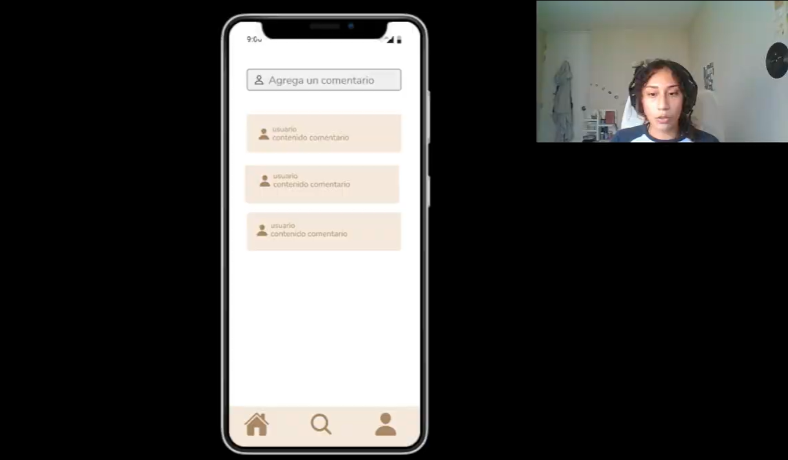
Los prototipos resultaron esenciales para anticipar problemas de usabilidad antes del desarrollo, permitiendo realizar iteraciones tempranas basadas en observación y comentarios reales. La consistencia entre plataformas y la claridad en las rutas de navegación facilitaron **la validación de las funcionalidades clave** para cada tipo de usuario.

## 4.6. Web Applications UX/UI Design

La experiencia de usuario (UX) y el diseño de interfaz (UI) para la plataforma web de *AventuraPe* han sido pensados para ofrecer una navegación sencilla, visualmente coherente y adaptada a las necesidades de sus dos tipos principales de usuarios: aventureros y empresarios. 

A lo largo de esta sección, se presentan los wireframes y wireflows que muestran cómo los usuarios interactúan con la plataforma en distintos escenarios clave. El objetivo es asegurar que cada pantalla y cada paso dentro del flujo de navegación sean intuitivos, accesibles y útiles, promoviendo una experiencia digital fluida desde el inicio de sesión hasta la ejecución de acciones específicas como publicar actividades, buscar aventuras o actualizar información personal.

### 4.6.1. Web Applications Wireframes

En esta sección se presentan los wireframes de la versión web de *AventuraPe*, organizados en función de los dos perfiles principales de usuario: **empresario** y **aventurero**. Cada diseño busca ofrecer una experiencia clara, coherente y centrada en las necesidades del usuario, asegurando una navegación intuitiva y fluida a lo largo de la plataforma.

## Sección de Empresario

**Inicio de sesión del empresario**  
Interfaz diseñada para facilitar el acceso rápido y seguro al panel del emprendedor.  
<br>

**Mi cuenta – Información personal del empresario**  
Permite al usuario gestionar sus datos personales y mantener su perfil actualizado.  
<br>

**Estadísticas de publicaciones**  
Vista con métricas sobre el rendimiento de las actividades publicadas, para facilitar la toma de decisiones.  
<br>

**Formulario para publicar una nueva actividad**  
Pantalla diseñada para que los empresarios puedan registrar y promocionar nuevas experiencias.  
<br>

**Galería principal del empresario**  
Sección visual destacada en la página de inicio del empresario, que muestra contenido clave.  
<br>


## Sección de Aventurero

**Pantalla de selección de tipo de cuenta**  
El usuario puede elegir entre crear una cuenta como aventurero o como empresario.  
<br>

**Inicio de sesión del aventurero**  
Diseño centrado en facilitar el acceso a la cuenta personal del usuario aventurero.  
<br>

**Pantalla principal tras inicio de sesión**  
Vista general del contenido destacado e información relevante para el usuario.  
<br>

**Sección de favoritos del aventurero**  
Muestra actividades guardadas por el usuario para una consulta rápida posterior.  
<br>

**Exploración y búsqueda de actividades**  
Diseño que permite filtrar, ordenar y explorar aventuras disponibles en la plataforma.  
<br>

**Detalle de publicación de una actividad**  
Pantalla donde el usuario puede conocer más información sobre una actividad específica.  
<br>

**Mi cuenta – Información personal del aventurero**  
Permite al usuario gestionar sus datos y modificar configuraciones de su cuenta.  
<br>


### 4.6.2. Web Applications Wireflow Diagrams
Esta sección presenta los diagramas de wireflow correspondientes a la versión web de *AventuraPe*, diseñados tanto para usuarios aventureros como para emprendedores. Cada flujo de navegación representa una necesidad específica del usuario, permitiéndole lograr sus objetivos de manera clara, eficiente y centrada en una experiencia digital intuitiva.

#### Sección de Aventurero

**User Goal:** Como aventurero, quiero ingresar a mi cuenta en AventuraPe,  
**para** acceder a todas las funcionalidades personalizadas dentro de la plataforma.  
<br>

**User Goal:** Como aventurero, navegar en la sección Home,  
**para** explorar de forma general las actividades disponibles y novedades destacadas.  
<br>

**User Goal:** Como aventurero, quiero buscar alguna actividad de mi interés,  
**para** encontrar experiencias que se alineen con mis preferencias y ubicación.  
<br>

**User Goal:** Como aventurero, quiero filtrar mi búsqueda,  
**para** refinar los resultados y encontrar exactamente lo que deseo realizar.  
<br>

**User Goal:** Como aventurero, quiero calificar la actividad que realicé,  
**para** compartir mi experiencia con otros usuarios y contribuir al sistema de reputación.  
<br>

**User Goal:** Como aventurero, quiero actualizar mis datos personales de mi cuenta,  
**para** mantener mi perfil actualizado y seguro.  
<br>

#### Sección de Empresario

**User Goal:** Como emprendedor, quiero ingresar a mi cuenta en AventuraPe,  
**para** gestionar mis actividades y acceder al panel de administración de mi negocio.  
<br>

**User Goal:** Como emprendedor, quiero publicar una actividad para mi local,  
**para** promocionar nuevas experiencias o eventos a través de la plataforma.  
<br>

**User Goal:** Como emprendedor, quiero ver las mejores publicaciones que tuve,  
**para** analizar el rendimiento y popularidad de mis ofertas anteriores.  
<br>

**User Goal:** Como emprendedor, quiero actualizar los datos de mi local,  
**para** asegurarme de que la información mostrada a los usuarios sea precisa y actualizada.  
<br>

### 4.6.3. Web Applications Mock-ups
En esta sección se presentan los mock-ups de alta fidelidad desarrollados para la plataforma *AventuraPe*. Estas vistas permiten visualizar cómo lucirá la interfaz web tanto para usuarios aventureros como para emprendedores, simulando su interacción real con la plataforma. El diseño se enfoca en ofrecer una experiencia fluida, accesible y visualmente atractiva.

#### Elección de rol
**Pantalla de selección de tipo de cuenta (Aventurero o Emprendedor)**  
<br>

#### Mock-ups para Usuario Emprendedor
**Registro del empresario**  
<br>

**Suscripción a un plan**  
<br>

**Subida de comprobante de validación del negocio**  
<br>

**Pantalla de inicio del empresario**  
<br>

**Agregar nueva actividad**  
<br>

**Mi cuenta - perfil del empresario**  
<br>

**Estadísticas de publicaciones**  
<br>


#### Mock-ups para Usuario Aventurero

**Registro del aventurero**  
<br>

**Inicio de sesión del aventurero**  
<br>

**Inicio de la interfaz del aventurero**  
<br>

**Búsqueda de actividades**  
<br>

**Favoritos - Mejores aventuras guardadas**  
<br>

**Detalle de actividad**  
<br>

**Mi cuenta del aventurero**  
<br>


### 4.6.4. Web Applications User Flow Diagrams
A continuación, se presentan los diagramas de flujo de usuario (User Flow) para la plataforma web de *AventuraPe*, diferenciados según el tipo de usuario: **Aventurero** y **Emprendedor**. Estos flujos reflejan los pasos que cada usuario debe seguir para lograr objetivos clave dentro de la plataforma, asegurando una navegación clara, eficiente y alineada con sus necesidades.

#### Usuario Aventurero
**User Goal:** Como aventurero, quiero ingresar a mi cuenta en *AventuraPe* para acceder a las funcionalidades personalizadas de la plataforma.  
<br>

**User Goal:** Como aventurero, quiero navegar en la sección *Home* para descubrir actividades destacadas y novedades.  
<br>

**User Goal:** Como aventurero, quiero buscar alguna actividad de mi interés para planificar mi próxima experiencia.  
<br>

**User Goal:** Como aventurero, quiero filtrar mi búsqueda para encontrar opciones que se ajusten a mis preferencias.  
<br>

**User Goal:** Como aventurero, quiero calificar y comentar la actividad que realicé para aportar retroalimentación a otros usuarios.  
<br>

**User Goal:** Como aventurero, quiero actualizar mis datos personales de mi cuenta para mantener mi perfil al día.  
<br>

**User Goal:** Como aventurero, quiero guardar en favoritos las publicaciones que me gustaron para acceder a ellas rápidamente en el futuro.  
<br>

#### Usuario Emprendedor

**User Goal:** Como emprendedor, quiero ingresar a mi cuenta en *AventuraPe* para gestionar mi perfil y mis actividades publicadas.  
<br>

**User Goal:** Como emprendedor, quiero publicar una actividad para mi local para atraer a nuevos aventureros.  
<br>

**User Goal:** Como emprendedor, quiero ver las mejores publicaciones que tuve para analizar su rendimiento y mejorar mi oferta.  
<br>

**User Goal:** Como emprendedor, quiero actualizar los datos de mi local para que la información mostrada esté siempre actualizada.  
<br>

**User Goal:** Como emprendedor, quiero crear mi cuenta en *AventuraPe* para comenzar a publicar y gestionar mis actividades.  
<br>

## 4.7. Web Applications Prototyping

**Inicio - Emprendedor:** La pantalla de inicio para el usuario emprendedor ofrece una vista rápida de sus publicaciones actuales y un botón destacado "Agregar actividad". 
**Inicio - Aventurero:** La página de inicio del aventurero es visualmente atractiva y funcional, presentando una lista de actividades recomendadas y populares basadas en la ubicación del usuario.

### **Funcionalidades**

**Sección Emprendedor**

- **Ver Publicaciones:** Permite al emprendedor revisar todas las actividades que ha creado en la aplicación.
- **Agregar Actividad:** Un botón claro y accesible para que los emprendedores añadan nuevas actividades o promociones.
- **Editar/Eliminar Actividades:** Funcionalidades que permiten la edición rápida o eliminación de publicaciones ya creadas.
- **Estadísticas de Actividades:** El emprendedor puede filtrar sus publicaciones por, más comentadas y mejor calificadas.

**Sección Aventurero**

- **Explorar Actividades:** Muestra una lista o tarjetas con actividades cercanas, destacando las más populares.
- **Buscar Actividades:** El aventurero puede utilizar una barra de búsqueda para encontrar actividades específicas.
- **Comentar y calificar:** El aventurero puede comentar en las actividades que desee y calificarlas.

**Video de explicación del flujo:**<br>
**ANEXO L:**
[https://drive.google.com/file/d/12urYf_hGV8UgoOGzn-Dvs7sSAo41HFxj/view?usp=sharing](https://drive.google.com/file/d/12urYf_hGV8UgoOGzn-Dvs7sSAo41HFxj/view?usp=sharing)
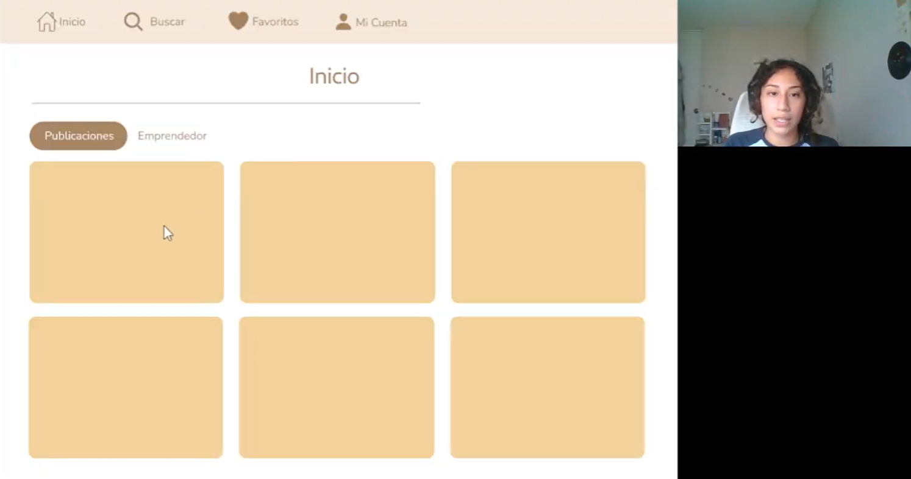

## 4.8. Domain-Driven Software Architecture  
### 4.8.1. Software Architecture Context Diagram  
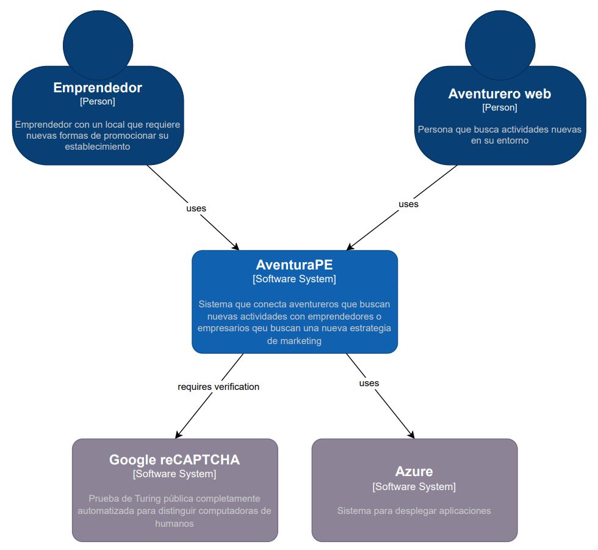

### 4.8.2. Software Architecture Container Diagrams
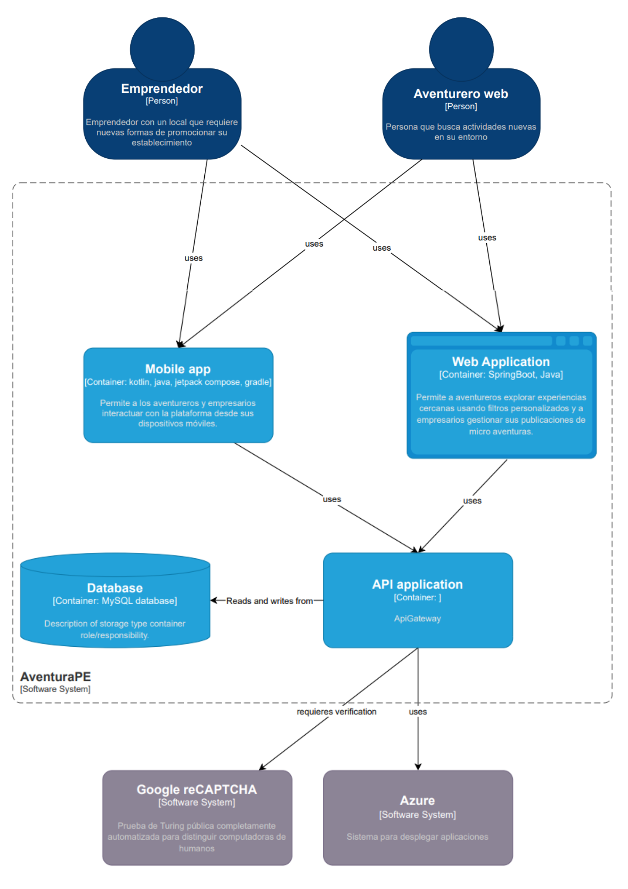

### 4.8.3. Software Architecture Components Diagrams  
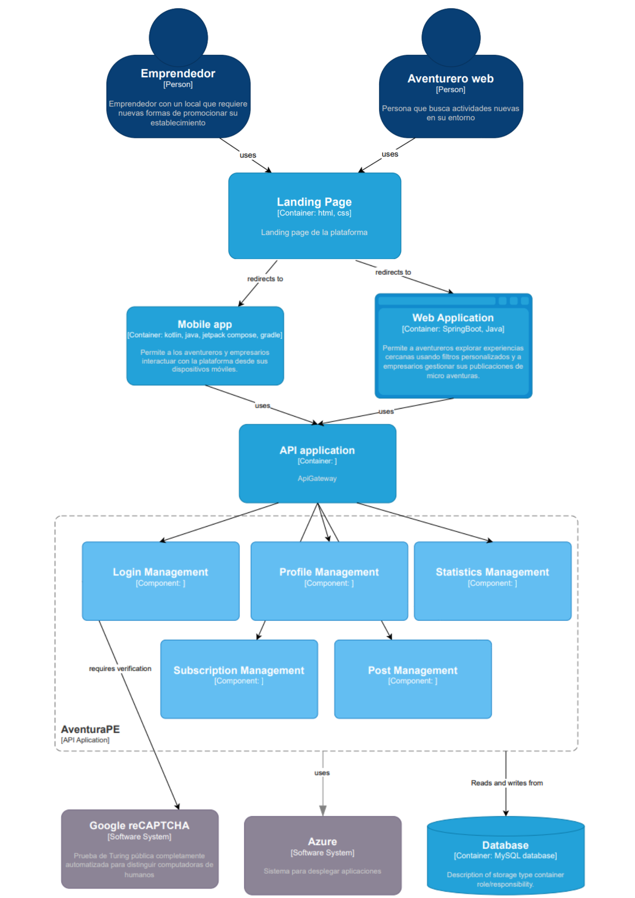

## 4.9. Software Object-Oriented Design  
### 4.9.1. Class Diagrams


### 4.9.2. Class Dictionary

#### User
Representa un usuario del sistema con credenciales de acceso.
- **id**: Identificador único del usuario
- **username**: Nombre de usuario para acceder al sistema
- **password**: Contraseña para autenticación
- **role**: Rol asignado al usuario (puede ser empresario o aventurero)
- **Operaciones**:
  - **register()**: Registra un nuevo usuario en el sistema
  - **login()**: Inicia sesión en el sistema
  - **logout()**: Cierra la sesión del usuario
  - **manageProfile()**: Gestiona la información del perfil

#### Role
Define los roles disponibles en el sistema.
- **id**: Identificador único del rol
- **roleName**: Nombre del rol (ej. administrador, empresario, aventurero)
- **Operaciones**:
  - **assignToUser()**: Asigna un rol a un usuario
  - **removeFromUser()**: Elimina un rol de un usuario

#### Company
Representa un negocio o emprendimiento registrado en la plataforma.
- **id**: Identificador único de la empresa
- **name**: Nombre de la empresa
- **userId**: Identificador del usuario asociado (dueño o administrador)
- **Operaciones**:
  - **registerCompany()**: Registra una nueva empresa
  - **updateProfile()**: Actualiza la información del perfil empresarial
  - **viewStatistics()**: Visualiza estadísticas de actividades y reseñas

#### Adventurous
Representa un usuario consumidor que busca actividades locales.
- **id**: Identificador único del aventurero
- **name**: Nombre del usuario aventurero
- **lastName**: Apellido del usuario aventurero
- **birthday**: Fecha de nacimiento
- **userId**: Identificador del usuario asociado
- **Operaciones**:
  - **updateProfile()**: Actualiza la información personal
  - **viewFavorites()**: Visualiza actividades guardadas como favoritas
  - **rateActivity()**: Califica una actividad

#### Activity
Representa una actividad o evento publicado por una empresa.
- **id**: Identificador único de la actividad
- **name**: Nombre de la actividad
- **description**: Descripción detallada
- **duration**: Duración aproximada
- **quantityPerson**: Capacidad de personas
- **price**: Precio de la actividad
- **companyId**: Identificador de la empresa que publica
- **addressId**: Identificador de la ubicación
- **Operaciones**:
  - **createActivity()**: Crea una nueva actividad
  - **updateActivity()**: Actualiza información de la actividad
  - **deleteActivity()**: Elimina una actividad
  - **viewStatistics()**: Visualiza estadísticas de la actividad

#### Review
Representa una reseña o comentario sobre una actividad.
- **id**: Identificador único de la reseña
- **adventurousId**: Identificador del aventurero que escribe
- **activityId**: Identificador de la actividad reseñada
- **rating**: Calificación numérica
- **description**: Comentario descriptivo
- **Operaciones**:
  - **createReview()**: Crea una nueva reseña
  - **updateReview()**: Actualiza una reseña existente
  - **deleteReview()**: Elimina una reseña

#### Photo
Representa imágenes asociadas a una actividad.
- **id**: Identificador único de la foto
- **photoLink**: Enlace a la imagen almacenada
- **activityId**: Identificador de la actividad relacionada
- **Operaciones**:
  - **uploadPhoto()**: Sube una nueva foto
  - **deletePhoto()**: Elimina una foto

#### Address
Representa la ubicación física de una actividad.
- **id**: Identificador único de la dirección
- **streetDescription**: Descripción de calle y número
- **cityId**: Identificador de la ciudad
- **Operaciones**:
  - **createAddress()**: Crea una nueva dirección
  - **updateAddress()**: Actualiza una dirección existente

#### City
Representa una ciudad donde se ubican las actividades.
- **id**: Identificador único de la ciudad
- **cityName**: Nombre de la ciudad
- **countryId**: Identificador del país

#### Country
Representa un país en el sistema.
- **id**: Identificador único del país
- **countryName**: Nombre del país

#### Favorite
Representa una actividad marcada como favorita por un usuario.
- **adventurousId**: Identificador del aventurero
- **activityId**: Identificador de la actividad favorita
- **Operaciones**:
  - **addFavorite()**: Añade una actividad a favoritos
  - **removeFavorite()**: Elimina una actividad de favoritos

#### SubscriptionPlan
Define los planes de suscripción disponibles para empresas.
- **id**: Identificador único del plan
- **name**: Nombre del plan
- **priceMonthly**: Precio mensual
- **features**: Características incluidas
- **Operaciones**:
  - **createPlan()**: Crea un nuevo plan
  - **updatePlan()**: Actualiza un plan existente
  - **deletePlan()**: Elimina un plan

#### CompanySubscription
Representa la suscripción de una empresa a un plan.
- **id**: Identificador único de la suscripción
- **companyId**: Identificador de la empresa
- **startDate**: Fecha de inicio
- **endDate**: Fecha de finalización
- **trialEndDate**: Fecha de finalización del período de prueba
- **subscriptionPlanId**: Identificador del plan suscrito
- **Operaciones**:
  - **subscribe()**: Suscribe una empresa a un plan
  - **renewSubscription()**: Renueva una suscripción
  - **cancelSubscription()**: Cancela una suscripción

#### PaymentReceipt
Representa un comprobante de pago por una suscripción.
- **id**: Identificador único del recibo
- **companySubscriptionId**: Identificador de la suscripción
- **amount**: Monto pagado
- **paymentDate**: Fecha del pago
- **receiptFilePath**: Ruta al archivo del comprobante
- **verificationStatus**: Estado de verificación del pago
- **verificationDate**: Fecha de verificación
- **Operaciones**:
  - **generateReceipt()**: Genera un nuevo recibo
  - **verifyPayment()**: Verifica el estado del pago

#### Statistics
Representa un informe estadístico generado para una empresa.
- **id**: Identificador único del informe estadístico.
- **companyId**: Identificador de la empresa propietaria del informe.
- **reportType**: Tipo de informe estadístico
- **parameters**: Parámetros utilizados para generar el informe.
- Operaciones:
  - **filterByTopRated**: Filtra los posts de la empresa por calificación y devuelve los mejor calificados.
  - **filterByMostCommented**: Filtra los posts de la empresa por número de comentarios.

#### PostStatistics
Representa la relación entre un informe estadístico y los posts incluidos en él.

- **id**: Identificador único de la estadística de post.
- **statisticsId**: Identificador del informe estadístico al que pertenece.
- **postId**: Identificador del post incluido en las estadísticas.
- **ranking**: Posición del post en el ranking generado.
- **metricValue**: Valor numérico de la métrica utilizada
- **Operaciones**:
  - **getPostDetails**: Obtiene información detallada del post asociado.

## 4.10. Database Design  
### 4.10.1. Relational/Non-Relational Database Diagram
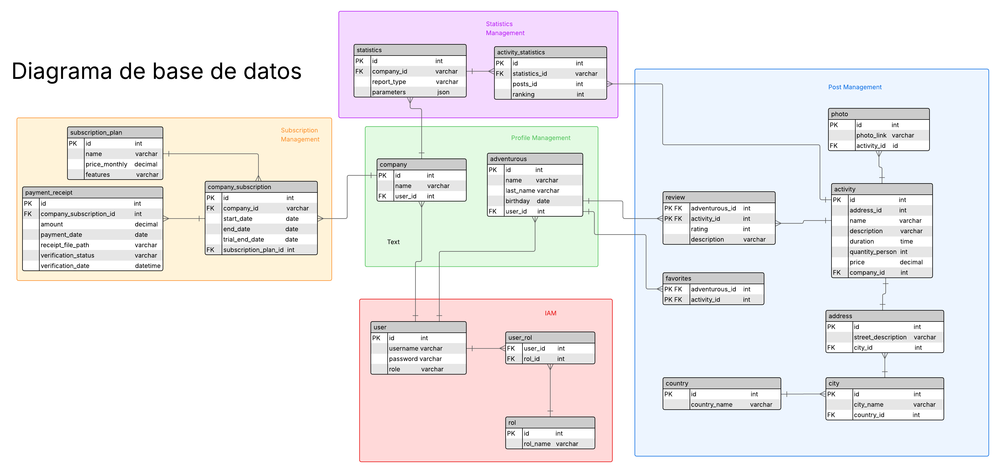


# Capítulo V: Product Implementation

## 5.1. Software Configuration Management  
### 5.1.1. Software Development Environment Configuration  

En esta sección se describen las herramientas y plataformas clave que utilizamos para orquestar, automatizar y ejecutar el despliegue de los distintos componentes de AventuraPe.

- **Git**  
  **Descripción:** Sistema de control de versiones distribuido que registra cada cambio en el código fuente.  
  **Uso:** Gestiona las versiones de nuestro código, permite crear ramas (`main`, `feat/deploy`, `develop`, etc.) y coordinar el flujo de trabajo entre desarrolladores.

- **GitHub**  
  **Descripción:** Plataforma de hosting de repositorios Git con funcionalidades de colaboración.  
  **Uso:** Aloja el código de backend, frontend y landing; gestiona issues, pull requests y sirve como origen para los despliegues.

- **GitHub Actions**  
  **Descripción:** Servicio de CI/CD nativo de GitHub que automatiza flujos de trabajo definidos mediante archivos YML.  
  **Uso:** Orquesta los build, test y deploy cada vez que se realiza un `push` o `pull request` en ramas designadas (`main` para landing, `feat/deploy` para back/front).

- **Firebase Hosting**  
  **Descripción:** Servicio de Google Firebase para servir contenido estático a través de una CDN global.  
  **Uso:** Hospeda la aplicación web desarrollada con Vue.js. Cada `push` a `feat/deploy` dispara el CLI de Firebase que realiza el build y publica los assets en producción con SSL automático.

- **Azure App Services**  
  **Descripción:** Plataforma PaaS de Microsoft Azure para ejecutar aplicaciones web y APIs en contenedores o directamente sobre el runtime.  
  **Uso:** Despliega el backend Spring Boot con Java 21 y PostgreSQL; Ya que `feat/deploy` compila, prueba y actualiza el servicio bajo HTTPS con escalado automático.

- **GitHub Pages**  
  **Descripción:** Servicio de hosting estático integrado en GitHub, ideal para landing pages.  
  **Uso:** Publica automáticamente los archivos de la carpeta `docs/` tras cada `push` a `main`, sirviendo la página de introducción y captación de usuarios.

- **Azure CLI**  
  **Descripción:** Interfaz de línea de comandos para gestionar recursos de Azure de forma programática.  
  **Uso:** Se integra con GitHub Actions para automatizar configuraciones del App Service, gestión de variables de entorno y despliegues sin intervención manual.

Con esta suite de herramientas desplegadas y coordinadas, AventuraPe mantiene un flujo de entrega continua robusto, minimiza el tiempo de inactividad y asegura que cada nueva versión llegue rápida y de forma fiable a todos los usuarios.

### 5.1.2. Source Code Management 

**Gestión del Código Fuente:**

En esta sección, se detalla cómo gestionamos y supervisamos el desarrollo del código para el proyecto de AventuraPe. Utilizamos GitHub como nuestra plataforma principal para la gestión del código fuente, complementada por Git como sistema de control de versiones. Además, seguimos el flujo de trabajo GitFlow para estructurar el desarrollo de manera eficiente.


**Ramas Principales:**
- **main:** Esta rama, a menudo llamada "master", contiene la versión más estable y final del proyecto, lista para ser desplegada en producción. Los cambios integrados en esta rama han pasado todas las pruebas y revisiones necesarias, y se consideran completamente preparados para su lanzamiento.

- **develop:** La rama develop es el punto central de integración para las nuevas funcionalidades y mejoras en desarrollo. Las características y correcciones se fusionan en esta rama, donde se realizan pruebas adicionales antes de su eventual integración en la rama main.

**Ramas Auxiliares:**

- **releases:** Las ramas de tipo releases se crean para preparar nuevas versiones del proyecto. En estas ramas se llevan a cabo las pruebas finales y se corrigen errores menores antes del lanzamiento oficial. Una vez que una versión ha sido validada, los cambios se integran en la rama develop para futuros desarrollos y luego se fusionan en la rama main para su despliegue.

**Uso de GitFlow:**

- **Feature Branches:** Se utilizan ramas de características para desarrollar nuevas funcionalidades. Estas ramas se crean a partir de la rama develop y, una vez que se completa el desarrollo y se aprueban las revisiones, se fusionan nuevamente en la rama develop.

- **Bugfix Branches:** Para solucionar errores que necesitan ser corregidos antes de la siguiente versión, se utilizan ramas de corrección de errores. Estas ramas se crean a partir de la rama develop o, en casos críticos, desde la rama main.

- **Hotfix Branches:** Se emplean para abordar errores críticos que requieren una solución urgente en producción. Estas ramas se crean a partir de la rama main, y una vez que el problema se resuelve, los cambios se fusionan tanto en la rama main como en la rama develop.

Este enfoque estructurado con GitFlow nos permite gestionar el desarrollo del código de manera eficiente, facilitando la integración de nuevas características, la corrección de errores y la preparación de versiones estables para producción.

**Commits Conventions:**

En AventuraPe, los commits se nombran de acuerdo con el avance y el contenido específico del trabajo realizado. No seguimos una convención rígida para los nombres de los commits; en su lugar, los desarrolladores utilizan descripciones claras y concisas para reflejar las modificaciones implementadas. Esto nos permite una mayor flexibilidad a la hora de registrar el progreso, asegurando que cada commit tenga un nombre que represente con precisión el trabajo efectuado.

### 5.1.3. Source Code Style Guide & Conventions  
Para mantener un código limpio, legible y fácil de mantener en equipo, se definieron guías de estilo específicas por tecnología, complementadas con linters automáticos y convenciones de nomenclatura. Estas prácticas se alinean con los principios de *Clean Code* y las recomendaciones de la comunidad técnica para cada stack.

#### **Frontend Web (Webstorm.js con TypeScript)**
- Las reglas aplicadas incluyeron:
  - **CamelCase** para variables y funciones (`handleClick`, `userList`).
  - **PascalCase** para nombres de componentes (`UserCard`, `ActivityCard`).
  - Uso estricto de `const` y `let` (evitando `var`).
  - Separación lógica de hooks y lógica de presentación en archivos distintos (`useActivityFetch.ts` vs `ActivityCard.tsx`).

#### **Backend (Spring Boot + Java)**
- Se adoptó la guía oficial de estilo de Java + convención de Spring:
  - Clases en **PascalCase** (`UserService`, `PublicationController`).
  - Variables y métodos en **camelCase** (`getPublications()`, `userId`).
  - Separación en paquetes según capa: `controller`, `service`, `repository`, `model`.
  - Uso de anotaciones estándar (`@RestController`, `@Autowired`, `@GetMapping`).
  - Código documentado con comentarios Javadoc (`/** */`) en servicios y endpoints principales.

#### **Android Mobile (Kotlin)**
- Se usó la convención oficial de Kotlin:
  - Nombres claros, concisos y expresivos.
  - Propiedades inmutables por defecto (`val`) y mutables solo cuando es estrictamente necesario (`var`).
  - Nombres de vistas en XML en snake_case (`btn_register`, `txt_user_email`).
  - En el código Kotlin, nombres de clases y funciones en PascalCase y camelCase respectivamente.
  - Arquitectura basada en **MVVM**, separando `ViewModel`, `Repository` y `UI`.

#### **General**
- Todos los equipos usaron **pre-commit hooks** con `Husky` (para frontend) y scripts personalizados en backend para evitar commits con errores de formato o linters.
- Se definieron **convenciones de nomenclatura de commits** usando el formato:
  - `feat:` para nuevas funcionalidades.
  - `fix:` para corrección de errores.
  - `docs:` para documentación.
  - `refactor:` para mejoras internas sin cambios funcionales.
  - `style:` para cambios de formato sin alterar la lógica.
Estas convenciones fueron aplicadas de forma continua mediante integración con GitHub Actions y revisión manual por parte del líder técnico antes de cada merge a `develop`.

### 5.1.4. Software Deployment Configuration

A continuación se detalla la configuración de el deployment de los tres componentes de AventuraPe, cada uno con su propio flujo de integración y entrega continua para asegurar despliegues automáticos, controlados y siempre actualizados.

#### 1. Landing Page

La página de entrada al producto, centrada en captar la atención de potenciales usuarios y presentar nuestra propuesta de valor:

- **Tecnologías**  
  - HTML5 semántico  
  - CSS3 con animaciones ligeras  
  - JavaScript vanilla para interactividad básica  

- **Despliegue**  
  - **Plataforma:** GitHub Pages  
  - **Branch:** `main`  
  - **Flujo:** mediante GitHub Actions, tras cada `push` a `main`, los archivos de la carpeta `docs/` se publican en el dominio configurado.  
  - **Beneficios:** publicación inmediata, versión de revisión histórica disponible, y control de versiones integrado con Git.  

Esta configuración asegura que la landing esté siempre al día, sirviendo como escaparate público y primer punto de contacto para nuevos usuarios e inversores.


#### 2. Frontend Web  
La Aplicacion web desarrollada en Vue.js que ofrece la experiencia de usuario rica e interactiva:

- **Tecnologías**  
  - Vue.js 3  

- **Despliegue**  
  - **Plataforma:** Firebase Hosting  
  - **Branch:** `feat/deploy`  
  - **Flujo:** un `push` a la rama `feat/deploy` ejecuta un script de build y luego publica automáticamente los archivos estáticos en Firebase  para entregas ultrarrápidas.  
  - **Beneficios:** SSL automático, previews de despliegue y rollback sencillo en caso de rollback.  

Con esto cualquier mejora o corrección en la interfaz llega casi instantáneamente a los usuarios finales, sin interrupciones.


#### 3. Backend RESTful  
Un servicio construido con Spring Boot que gestiona toda la lógica de negocio y persistencia de datos:

- **Tecnologías**  
  - Spring Boot 3.2
  - Java 21  
  - PostgreSQL

- **Despliegue**  
  - **Plataforma:** Azure App Services  
  - **Branch:** `feat/deploy`  
  - **Flujo:** cada vez que se hace un `push` a `feat/deploy`, un pipeline en Azure se dispara automáticamente, compila y actualiza el entorno productivo.  
  - **Beneficios:** escalado automático, monitorización nativa, configuración de variables de entorno (como cadenas de conexión y claves secretas) directamente en el portal de Azure.  

Este esquema garantiza que el backend esté siempre disponible bajo HTTPS, con tolerancia a fallos y capacidad de crecer según la demanda.

Con estos tres componentes automatizados, AventuraPe dispone de un entorno de producción sólido y escalable, listo para crecer con cada nueva funcionalidad y mantener la continuidad del servicio sin fricciones.


## 5.2. Product Implementation & Deployment
### 5.2.1 Sprint Backlogs

**Sprint Planning 1**

| Sprint # | Sprint 1 |
|----------|----------|
| **Sprint Planning Background** |  |
| Date | 10/04/2025 |
| Time | 9:00 AM |
| Location | Reunión virtual en Microsoft Teams |
| Prepared by | Barbara Susana Quezada Portalatino |
| Attendees | Jimena Tamara Cama Salvatierra, Jair Alexander Castillo Castillo, Jose Eduardo Gutierrez Garcia, Estefano Oscar Jaque Peña, Barbara Susana Quezada Portalatino |
| **Sprint Goal & User Stories** |  |
| Sprint Goal | Publicar una versión mínima viable (MVP) de la landing page de AventuraPe, con navegación completa e información esencial visible para visitantes. |
| Sprint Velocity | 11 |
| Sum of Story Points | 18 |

**Sprint Backlog 1**

Para el primer sprint, nos enfocamos en desarrollar la landing page de AventuraPe para establecer presencia online y proporcionar información esencial a los visitantes. Las tareas se distribuyeron teniendo en cuenta las habilidades de cada miembro, priorizando el desarrollo y despliegue rápido con un diseño atractivo e interactivo.

| **User Story ID** | **User Story Title**                | **Task ID** | **Task Title**                     | **Description**                                   | **Estimation (Hours)** | **Assigned To**  | **Status** |
| ----------------- | ----------------------------------- | ----------- | ---------------------------------- | ------------------------------------------------- | ---------------------- | ---------------- | ---------- |
| US01              | Interacción con hipervínculos (Web) | TA001       | Diseñar estructura base            | Crear estructura HTML/CSS base de la landing page | 3                      | Jimena y Barbara | Done       |
| US01              | Interacción con hipervínculos (Web) | TA002       | Implementar navegación             | Desarrollar anclas e íconos interactivos          | 2                      | Jair             | Done       |
| US02              | Sección Servicios                   | TA003       | Diseñar sección servicios          | Implementar cards y botones de acción             | 4                      | Jimena y Barbara | Done       |
| US04              | Sección Sobre Nosotros              | TA004       | Codificar sección "Sobre Nosotros" | Implementar diseño responsive                     | 3                      | Jair             | Done       |
| US05              | Sección Testimonios                 | TA005       | Implementar testimonios            | Crear carrusel dinámico                           | 5                      | Jimena           | Done       |
| US06              | Sección Contacto                    | TA006       | Programar sección contacto         | Implementar formulario con validación             | 4                      | Jimena y Jair    | Done       |
| US01              | Interacción con hipervínculos (Web) | TA007       | Configurar despliegue              | Implementar GitHub Pages + GitHub Actions         | 2                      | Jimena y Barbara | Done       |


**Development Evidence for Sprint Review**

| Repository | Branch | Commit Id | Commit Message | Commit Message Body | Committed on (Date) |
|------------|--------|-----------|---------------|---------------------|---------------------|
| https://github.com/upc-pre-202510-1ASI0732-4438-AventuraPE/AventuraPE-landing | main | 3a8e62f | Initial landing structure | feat: create basic HTML structure | 12/04/2025 |
| https://github.com/upc-pre-202510-1ASI0732-4438-AventuraPE/AventuraPE-landing | develop | 7b2c98d | Add navigation components | feat: implement sticky header and smooth scrolling | 14/04/2025 |
| https://github.com/upc-pre-202510-1ASI0732-4438-AventuraPE/AventuraPE-landing | feature/testimonials | a5f6d21 | Testimonials section | feat: add carousel with customer testimonials | 15/04/2025 |
| https://github.com/upc-pre-202510-1ASI0732-4438-AventuraPE/AventuraPE-landing | feature/contact | e9c42b6 | Contact form | feat: implement form validation | 16/04/2025 |
| https://github.com/upc-pre-202510-1ASI0732-4438-AventuraPE/AventuraPE-landing | main | 1d3f8a7 | Deploy configuration | chore: configure GitHub Actions for automatic deployment | 17/04/2025 |

### Sprint 2 – Objetivo
**Sprint Planning 2**

| Sprint # | Sprint 2 |
|----------|----------|
| **Sprint Planning Background** |  |
| Date | 24/04/2025 |
| Time | 10:00 AM |
| Location | Reunión virtual en Microsoft Teams |
| Prepared by | Jair Alexander Castillo Castillo |
| Attendees | Jimena Tamara Cama Salvatierra, Jair Alexander Castillo Castillo, Jose Eduardo Gutierrez Garcia, Estefano Oscar Jaque Peña, Barbara Susana Quezada Portalatino |
| **Sprint Goal & User Stories** |  |
| Sprint Goal | Desarrollar e implementar funcionalidades de gestión de usuarios para aventureros: registro, inicio de sesión y visualización de actividades. |
| Sprint Velocity | 13 |
| Sum of Story Points | 20 |

**Sprint Backlog 2**

Para el segundo sprint, nos enfocamos en las funcionalidades principales para el usuario aventurero, incluyendo registro, inicio de sesión y visualización de actividades. Implementamos tanto los componentes de frontend como los endpoints de backend necesarios para estas funcionalidades.

| User Story ID | User Story Title                  | Task ID | Task Title                   | Description                                         | Estimation (Hours) | Assigned To | Status      |
| ------------- | --------------------------------- | ------- | ---------------------------- | --------------------------------------------------- | ------------------ | ----------- | ----------- |
| US04          | Iniciar sesión (Web/Móvil)        | TA008   | Crear formulario de login    | Implementar formulario con validaciones             | 4                  | Jimena    | Done        |
| US06          | Creación de cuenta (Web/Móvil)    | TA009   | Backend: endpoint sign-up    | Desarrollar endpoint POST con validaciones          | 4                  | José    | Done        |
| US11          | Visualizar mapa de actividades    | TA010   | Implementar mapa interactivo | Integrar visualización de mapa con datos de muestra | 6                  | Estefano    | In Progress |
| US12          | Ver detalles de actividad (Móvil) | TA011   | Implementar búsqueda         | Desarrollar búsqueda de actividades en móvil        | 4                  | Barbara     | Done        |
| US13          | Filtrar actividades               | TA012   | Agregar filtros              | Implementar filtro por nombre                       | 4                  | Jair        | In Progress |
| US17          | Guardar actividades en favoritos  | TA013   | Backend: guardar favoritos   | Desarrollar endpoints para gestión de favoritos     | 3                  | Barbara     | In Progress |


**Development Evidence for Sprint Review**

| Repository | Branch | Commit Id | Commit Message | Commit Message Body | Committed on (Date) |
|------------|--------|-----------|---------------|---------------------|---------------------|
| https://github.com/upc-pre-202510-1ASI0732-4438-AventuraPE/AventuraPE-mobile-app | feature/login | 5c7d34e | Add login screen | feat: implement login form with validation | 26/04/2025 |
| https://github.com/upc-pre-202510-1ASI0732-4438-AventuraPE/AventurePe-Backend | feature/auth | 8e1f92b | User authentication | feat: implement sign-up and login endpoints | 27/04/2025 |
| https://github.com/upc-pre-202510-1ASI0732-4438-AventuraPE/AventuraPE-mobile-app | feature/activity-search | a3b9c2d | Activity search | feat: implement activity search functionality | 29/04/2025 |
| https://github.com/upc-pre-202510-1ASI0732-4438-AventuraPE/AventurePe-Backend | feature/publications | 6d2e47f | Publication endpoints | feat: add endpoints to fetch activities | 30/04/2025 |

### Sprint 3 – Objetivo
**Sprint Planning 3**

| Sprint # | Sprint 3 |
|----------|----------|
| **Sprint Planning Background** |  |
| Date | 08/05/2025 |
| Time | 9:30 AM |
| Location | Reunión virtual en Microsoft Teams |
| Prepared by | Jimena Tamara Cama Salvatierra |
| Attendees | Jimena Tamara Cama Salvatierra, Jair Alexander Castillo Castillo, Jose Eduardo Gutierrez Garcia, Estefano Oscar Jaque Peña, Barbara Susana Quezada Portalatino |
| **Sprint Goal & User Stories** |  |
| Sprint Goal | Implementar funcionalidades principales para usuarios empresarios: publicar, editar y eliminar actividades, además de visualizar estadísticas. |
| Sprint Velocity | 14 |
| Sum of Story Points | 20 |


**Sprint Backlog 3**

En el tercer sprint, nos centramos en desarrollar las funcionalidades esenciales para el usuario empresario, permitiéndole gestionar sus actividades publicadas y acceder a estadísticas relevantes para su negocio.

| **User Story ID** | **User Story Title**                  | **Task ID** | **Task Title**                     | **Description**                               | **Estimation (Hours)** | **Assigned To** | **Status** |
| ----------------- | ------------------------------------- | ----------- | ---------------------------------- | --------------------------------------------- | ---------------------- | --------------- | ---------- |
| US08              | Publicar actividad (Web/Móvil)        | TA014       | Crear formulario de publicación    | Implementar formulario para crear actividades | 5                      | Barbara         | Done       |
| US09              | Edición de actividad (Web/Móvil)      | TA015       | Implementar flujo de edición       | Desarrollar formulario y vista previa         | 4                      | Jimena          | Done       |
| US10              | Borrar actividad (Móvil)              | TA016       | Lógica para eliminar publicaciones | Implementar endpoint y UI para eliminar       | 3                      | Barbara         | Done       |
| US19              | Ver estadísticas de actividades       | TA017       | Dashboard estadístico              | Crear vista de estadísticas y comentarios     | 5                      | José            | Done       |
| US05              | Iniciar sesión (Web/Móvil) empresario | TA018       | Login empresario                   | Implementar validación de credenciales        | 3                      | Estefano        | Done       |


**Development Evidence for Sprint Review**

| Repository | Branch | Commit Id | Commit Message | Commit Message Body | Committed on (Date) |
|------------|--------|-----------|---------------|---------------------|---------------------|
| https://github.com/upc-pre-202510-1ASI0732-4438-AventuraPE/AventuraPE-mobile-app | feature/create-activity | 7d9f25e | Activity creation | feat: implement activity creation form | 01/05/2025 |
| https://github.com/upc-pre-202510-1ASI0732-4438-AventuraPE/AventurePe-Backend | feature/manage-activities | 9e3f48b | CRUD activities | feat: implement endpoints for activity management | 01/05/2025 |
| https://github.com/upc-pre-202510-1ASI0732-4438-AventuraPE/AventuraPE-mobile-app | feature/statistics | 2b8c57a | Statistics dashboard | feat: implement statistics view for entrepreneurs | 03/05/2025 |
| https://github.com/upc-pre-202510-1ASI0732-4438-AventuraPE/AventuraPE-mobile-app | feature/edit-activities | 4c2d19f | Edit activities | feat: implement activity editing functionality | 03/05/2025 |


### Sprint 4 – Objetivo
**Sprint Backlog 4**

En el tercer sprint, nos centramos en desarrollar las funcionalidades esenciales para el usuario empresario, permitiéndole gestionar sus actividades publicadas y acceder a estadísticas relevantes para su negocio.

| User Story ID 	| User Story Title 	| Task ID 	| Task Title 	| Description 	| Estimation (Hours) 	| Assigned To 	| Status 	|
|:---:	|:---:	|:---:	|:---:	|:---:	|:---:	|:---:	|:---:	|
| US22 	| Gestión de Favoritos 	| TA1 	| Agregar favoritos 	| Implementar agregar a favoritos 	| 1 	| Barbara 	| Done 	|
|  	|  	| TA2 	| Ver favoritos 	| Implementar la vista de favoritos 	| 1 	| Barbara 	| Done 	|
|  	|  	| TA3 	| Eliminar favoritos 	| Implementar la función de eliminar de favoritos 	| 1 	| Barbara 	| Done 	|
| US04 	| Iniciar sesión (Web) 	| TA1 	| Agregar servicio externo de captcha 	| Configuración de Google captcha 	| 2 	| Jimena 	| Done 	|
|  	|  	| TA2 	| Implementar servicio externo en back 	| Agregar key en propiedades 	| 1 	| Jimena 	| Done 	|
|  	|  	| TA3 	| Implementar servicio externo en front 	| Agregar clave en sign in component 	| 2 	| Jimena 	| Done 	|
| US04 	| Iniciar sesión (Movil) 	| TA1 	| Preparar ambiente en back para diferenciación 	| Implemntar diferencia entre movil y web 	| 2 	| Jair 	| Done 	|
|  	|  	| TA2 	| Agregar verificacion de dos pasos 	| Implementar el servicio de correo front movil 	| 2 	| Jair 	| Done 	|
| US06 	| Creación de cuenta (Web/Móvil) 	| TA1 	| Agregar servicio externo de captcha 	| Configuración de Google captcha 	| 2 	| Jimena 	| Done 	|
|  	|  	| TA2 	| Implementar servicio externo en back 	| Agregar key en propiedades 	| 1 	| Jimena 	| Done 	|
|  	|  	| TA3 	| Implementar servicio externo en front 	| Agregar clave en sign in component 	| 2 	| Jimena 	| Done 	|
| US38 	| Opciones de Navegacion en la Intranet 	| TA1 	| Implementar navigation bar 	| Implementacion de rutas para administrador 	| 2 	| Jose 	| Done 	|
| US39 	| Listar Actividades 	| TA1 	| Mostrar actividades 	| Implmentar endpoint get de todas las actividades publicadas 	| 1 	| Estefano 	| Done 	|
| US40 	| Eliminar Actividad 	| TA1 	| Borrar publicación 	| Implementación del endpoint de eliminar publicacion 	| 1 	| Jose 	| Done 	|
|  	|  	| TA2 	| Agregar EmailJS 	| Implementación de envío de correo al propietario de la publicación al eliminar una publicación 	| 2 	| Jimena 	| Done 	|
| US41 	| Ver Detalle de Actividad 	| TA1 	| Ver mas información 	| Implementar la vista de detalles de la actividad, para ver los comentarios 	| 1 	| Estefano 	| Done 	|
| US42 	| Eliminar Comentario 	| TA1 	| Eliminar comentario 	| Implementar endpoint para borrar comentarios 	| 1 	| Jose 	| Done 	|
|  	|  	| TA2 	| Agregar EmailJS 	| Implmentación de envío de correo al propietario del comentario al eliminar una comnetario 	| 2 	| Jimena 	| Done 	|
| US43 	| Buscar Actividades por Nombre 	| TA1 	| Buscar actividad 	| Creacion de funcion para buscar actividades 	| 1 	| Jose 	| Done 	|
| US44 	| Alternar Vista de Resultados 	| TA1 	| Cambiar de vista 	| Creacion de componente para cambiar de vista 	| 1 	| Estefano 	| Done 	|
| US45 	| Cerrar Sesión 	| TA1 	| Cerrar sesion intranet 	| Implmentación de sign out de la intranet 	| 1 	| Jose 	| Done 	|

<br>

**Development Evidence for Sprint Review**

| Repository 	| Branch 	| Commit ID 	| Commit Message 	| Commit Message Body 	| Committed on (Date) 	|
|:---:	|:---:	|:---:	|:---:	|:---:	|:---:	|
| https://github.com/upc-pre-202510-1ASI0732-4438-AventuraPE/aventurape-web-app 	| feature/IAM 	| 4bf1ff42282821f8ba54aa9a47a591b6cbfc9944 	| Google Captchasignin 	| feat: add google captcha in sing in 	| 05/05/2025 	|
| https://github.com/upc-pre-202510-1ASI0732-4438-AventuraPE/aventurape-web-app 	| feature/IAM 	| dce2880f563275da6aed1253d765ce98000a4f68 	| Google Captcha signup 	| feat: add google captcha in registration 	| 05/05/2025 	|
| https://github.com/upc-pre-202510-1ASI0732-4438-AventuraPE/AventurePe-Backend 	| develop 	| 493e0dfa9747f0f4ee77e79b35a4a79f670bfb4e 	| Google Captcha backend 	| feat: add google rechaptcha 	| 05/05/2025 	|
| https://github.com/upc-pre-202510-1ASI0732-4438-AventuraPE/AventurePe-Backend 	| develop 	| 4740fee2c7052a073d67498d0635a0866c9ec7fd 	| Email in user 	| add: added email in user 	| 07/05/2025 	|
| https://github.com/upc-pre-202510-1ASI0732-4438-AventuraPE/AventuraPE-mobile-app 	| develop/temp 	| ba43f13f3f1a42f107a4877148313c9d3e2eb9bf 	| EmailJS in signup 	| add : added email verification 	| 07/05/2025 	|

**Enlace al tablero Trello del proyecto**

[https://trello.com/invite/b/67fec4eb81fae4e3cb20bc4a/ATTIbaa9f91c96fe0bff5f0c939bfdaa9ee46306E3A0/1asi0732-2510-4438-grupo2](https://trello.com/invite/b/67fec4eb81fae4e3cb20bc4a/ATTIbaa9f91c96fe0bff5f0c939bfdaa9ee46306E3A0/1asi0732-2510-4438-grupo2)

### 5.2.2. Implemented Landing Page Evidence
#### *Link del despliegue de la landing:* https://aventurape-androidsoftware.github.io/AventuraPe_LandingPage/


### Evidencia de la Landing Page :
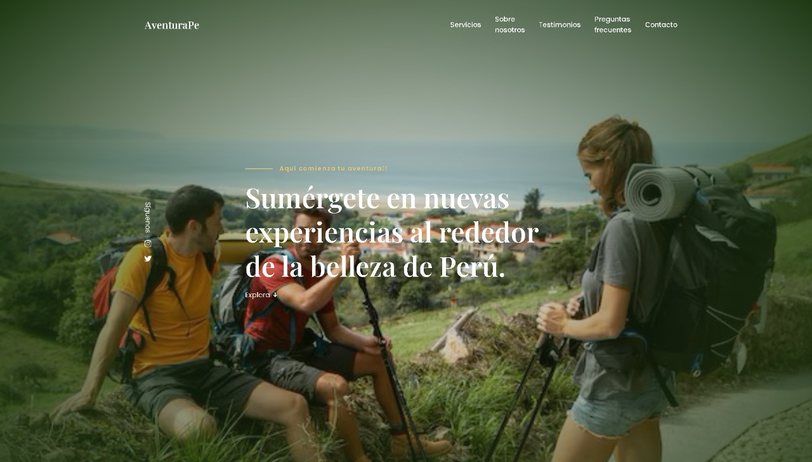</img><br>

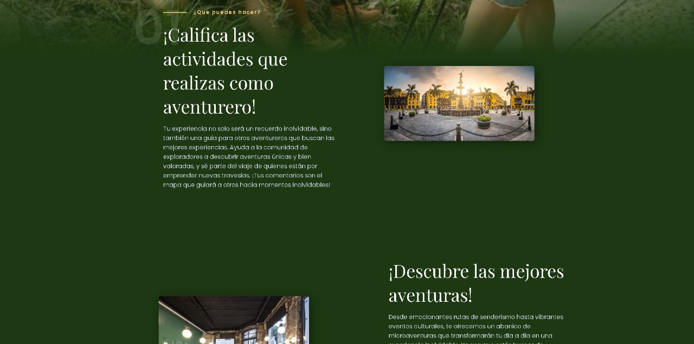</img><br>

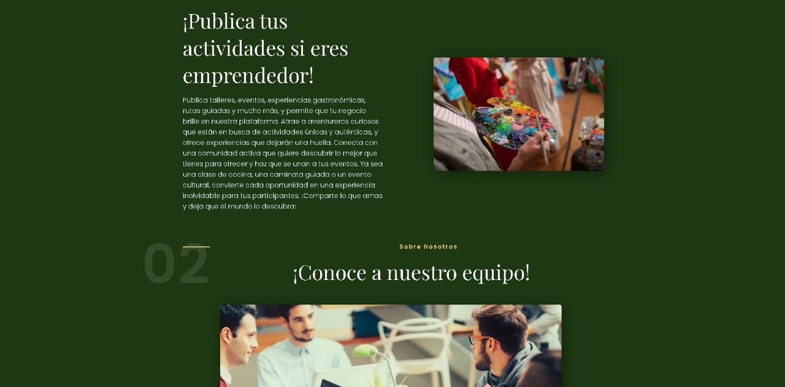</img><br>

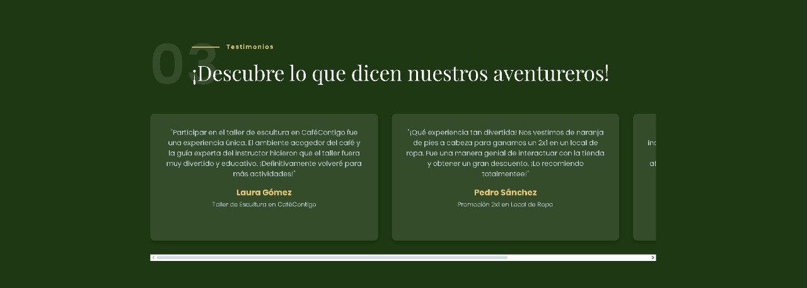</img><br>

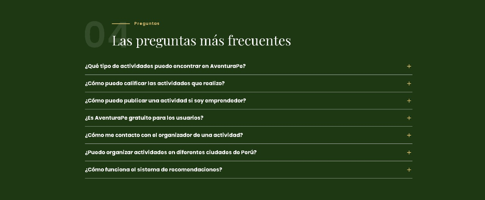</img><br>

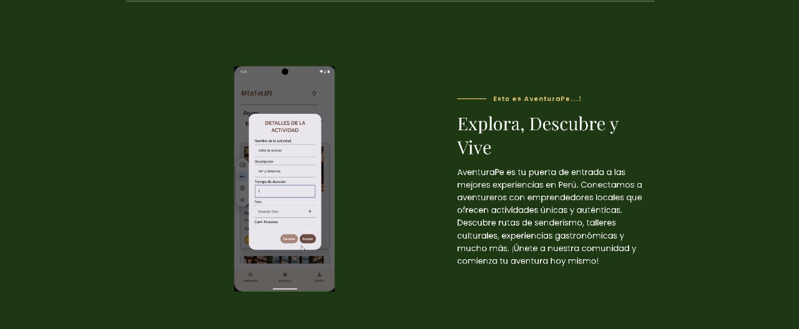</img><br>

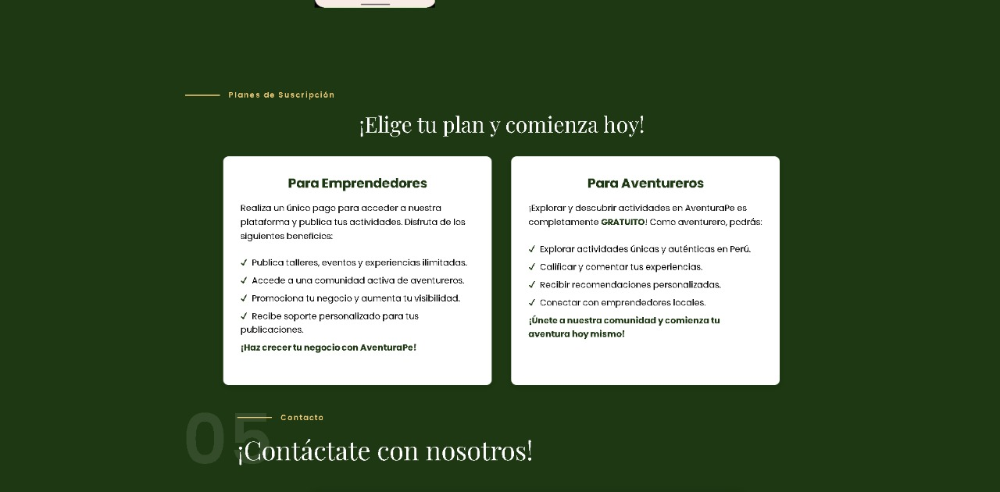</img><br>

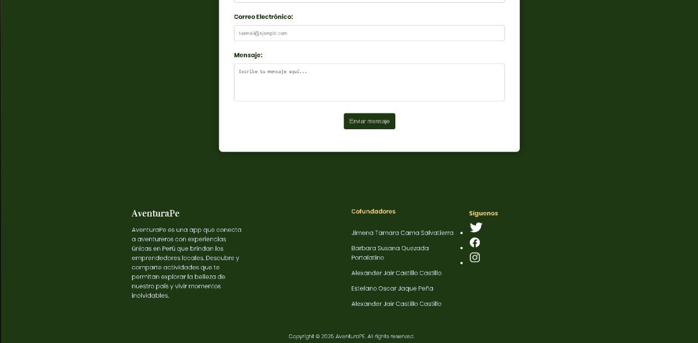</img><br>


### 5.2.3. Implemented Frontend-Web Application Evidence  
<br>A continuación, presentamos la implementación de la aplicación web frontend de AventuraPe, desarrollada utilizando Node.js y TypeScript. Esta interfaz permite a los usuarios interactuar con las principales funcionalidades de nuestra plataforma desde una experiencia web completa.

### Sección de Autenticación

**Registro de Cuenta y Pantalla de Selección de Rol**
<br>Esta vista permite al usuario elegir entre ingresar como aventurero o como empresario, facilitando la segmentación de la experiencia desde el inicio.

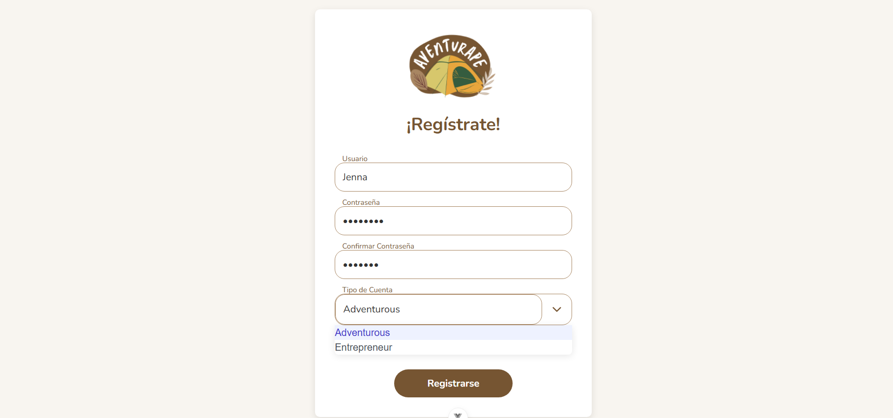

**Inicio de Sesión**
<br>Interfaz segura que permite a los usuarios autenticarse en la plataforma y acceder a sus funcionalidades personalizadas.

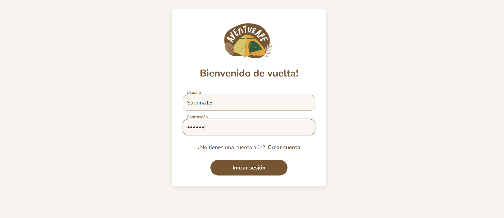

### Experiencia del Aventurero

**Exploración de Actividades**
<br>Vista principal donde los aventureros pueden descubrir las diversas experiencias disponibles en la plataforma, con miniaturas y detalles básicos.

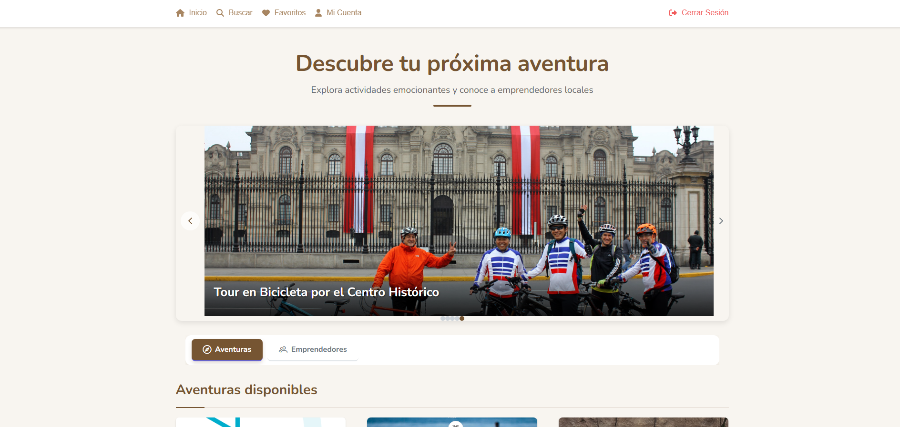

**Detalles de Actividad**
<br>Visualización detallada de una actividad específica, incluyendo descripción, precio, ubicación y valoraciones.

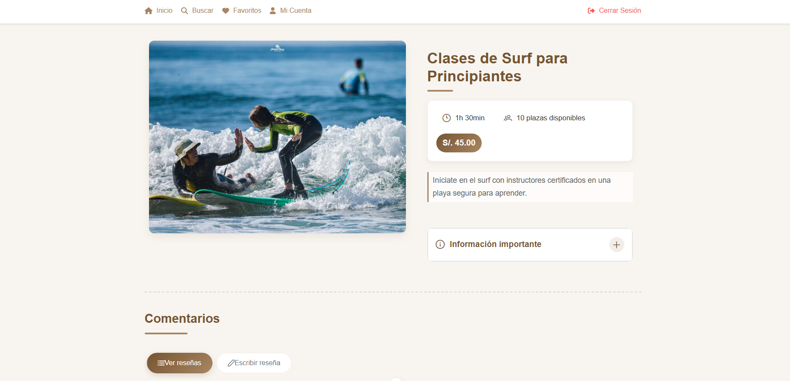

### Experiencia del Empresario

**Panel Principal**
<br>Dashboard que muestra las publicaciones activas del empresario y estadísticas generales de su cuenta.

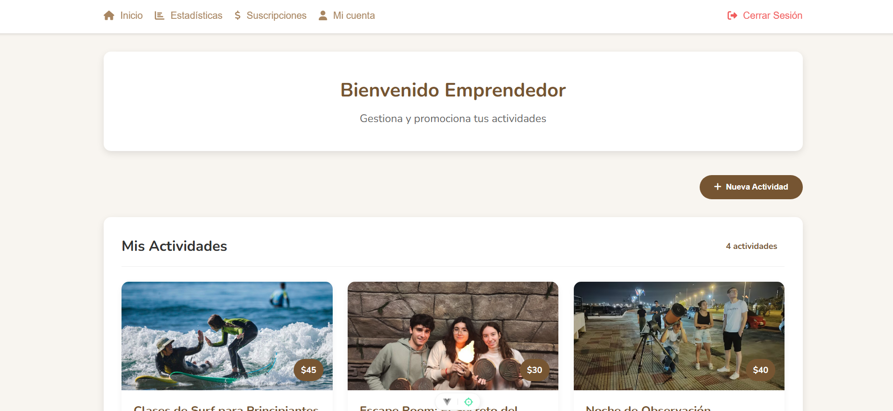

**Creación de Actividad**
<br>Formulario completo para la creación de nuevas actividades, permitiendo subir imágenes, establecer precios y detallar la experiencia.

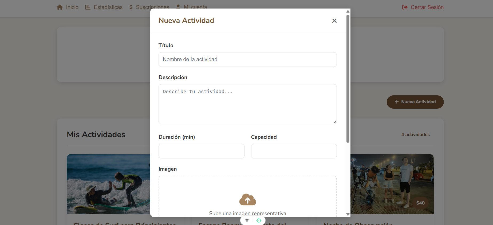

### 5.2.4. Acuerdo de Servicio - SaaS  

Este Acuerdo de Servicio regula el uso de la plataforma AventuraPe, un servicio proporcionado bajo el modelo Software como Servicio (SaaS). Al acceder o utilizar la plataforma, el usuario acepta las condiciones establecidas en el presente documento.

1. **Derechos de uso**

El usuario recibe una licencia limitada, no exclusiva, intransferible y revocable para acceder y utilizar la plataforma AventuraPe, exclusivamente conforme a los fines previstos por el servicio.

2. **Obligaciones del usuario**
El usuario se compromete a:

- Utilizar el servicio conforme a la legislación vigente y a las normas de convivencia establecidas por AventuraPe.
- No publicar contenido que sea ofensivo, discriminatorio, difamatorio o que infrinja derechos de terceros.
- No manipular, alterar ni realizar ingeniería inversa sobre la plataforma.
- Proporcionar información veraz y actualizada en su perfil y en las actividades que publique.
- Mantener la confidencialidad de sus credenciales de acceso.

3. **Moderación y eliminación de contenido**

AventuraPe se reserva el derecho de:
- Eliminar actividades que infrinjan los términos del servicio, como la publicación de información falsa, ilegal o contraria a las normas de la comunidad.
- Eliminar comentarios que contengan lenguaje inapropiado, ofensivo, discriminatorio o que violen las políticas de uso establecidas.
- Moderar el contenido y las valoraciones para mantener la calidad y seguridad del servicio.

4. **Disponibilidad y mantenimiento**
AventuraPe hará esfuerzos razonables para garantizar la disponibilidad continua del servicio, sin embargo, no se garantiza disponibilidad ininterrumpida. La plataforma puede estar sujeta a mantenimientos periódicos programados o no programados.

5. **Propiedad intelectual y contenido generado por usuarios**

- El usuario conserva los derechos sobre el contenido original que publique en la plataforma.
- Al publicar contenido en AventuraPe, el usuario otorga una licencia mundial, no exclusiva, gratuita, sublicenciable y transferible para usar, reproducir, distribuir y mostrar dicho contenido en relación con el servicio.
- AventuraPe respeta los derechos de propiedad intelectual y espera que los usuarios hagan lo mismo.

6. **Protección de datos personales**
- AventuraPe recopila y procesa datos personales de acuerdo con su Política de Privacidad.
- Los datos personales proporcionados se utilizan para la gestión de perfiles, la personalización de experiencias, la comunicación con usuarios y la mejora del servicio.
- La plataforma implementa medidas técnicas y organizativas adecuadas para proteger los datos personales.

7. **Sistema de calificaciones y reseñas**
- Las calificaciones y reseñas deben basarse en experiencias reales y ser honestas.
- AventuraPe se reserva el derecho de eliminar reseñas falsas, maliciosas o que no cumplan con las directrices de la comunidad.
- Las calificaciones promedio se calculan mediante algoritmos que pueden incluir factores de ponderación para garantizar la representatividad.

8. **Responsabilidad**
- AventuraPe no se responsabiliza por el contenido generado por los usuarios.
- La plataforma actúa como intermediario y no garantiza la calidad, seguridad o legalidad de las actividades publicadas.
- Los usuarios son responsables de la veracidad de la información proporcionada y de las consecuencias de su uso de la plataforma.

9. **Modificaciones del servicio**
AventuraPe puede modificar, suspender o discontinuar cualquier aspecto del servicio en cualquier momento, incluyendo la disponibilidad de funciones, bases de datos o contenido.

10. **Comunicaciones**
AventuraPe podrá enviar comunicaciones relacionadas con el servicio, incluyendo notificaciones sobre cambios en los términos, nuevas funcionalidades o alertas de seguridad.

11. **Resolución de conflictos**
Cualquier controversia derivada del uso del servicio se resolverá mediante negociación de buena fe. En caso de no alcanzar un acuerdo, las partes se someterán a la jurisdicción competente.

12. **Cumplimiento normativo**
Este acuerdo cumple con los marcos normativos aplicables en materia de protección de datos personales, derechos digitales y servicios digitales. El uso del servicio implica el consentimiento del usuario a las prácticas descritas.

13. **Disposiciones finales**
-	Si alguna disposición de este Acuerdo fuese declarada inválida, las demás disposiciones mantendrán su vigencia.
-	Este Acuerdo constituye el entendimiento completo entre las partes respecto al uso del servicio.
-	AventuraPe puede modificar este Acuerdo en cualquier momento, publicando una versión actualizada en la plataforma e informando a los usuarios.

Este Acuerdo de Servicio regula el uso de la plataforma AventuraPe, un servicio proporcionado bajo el modelo Software como Servicio (SaaS). Al acceder o utilizar la plataforma, el usuario acepta las condiciones establecidas en el presente documento.


### 5.2.5. Implemented Native-Mobile Application Evidence  

### Login Management
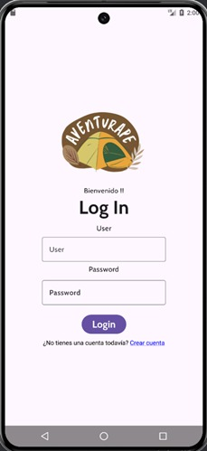</img><br>

### Register Management
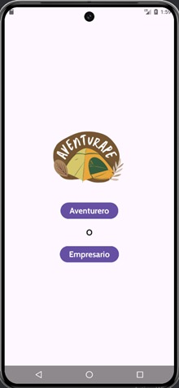</img><br>

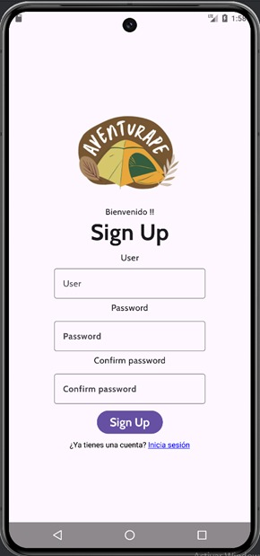</img><br>

### Post Activity  Management
</img><br>

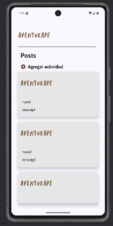</img><br>

### Account Adventurer 
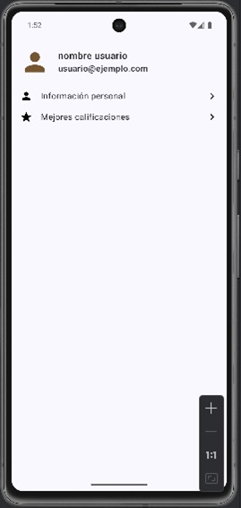</img><br>

</img><br>

### Account Entrepreneur 
</img><br>

</img><br>

### All Publitacions
</img><br>

### Detail Publitacions
</img><br>

</img><br>


### 5.2.6. Implemented RESTful API and/or Serverless Backend Evidence  

Hemos añadido correctamente nuestros servicios web bajo una arquitectura RESTful, implementando correcciones en todos los endpoints existentes. Además, hemos añadido un nuevo endpoint llamado favorite-publications, que permite a los usuarios gestionar sus publicaciones favoritas de manera más eficiente.
La nueva funcionalidad de favorite-publications permite a los usuarios obtener, añadir y eliminar publicaciones de su lista de favoritos, mejorando la interacción con el contenido que más les interesa. La documentación de todos los endpoints está disponible a través de Swagger, lo que facilita la interacción con la API.

Acción | Endpoint | Detalles | Enlace
------- | -------- | -------- | --------
POST | /authentication/sign-up | Registro de un nuevo usuario | http://localhost:8090/swagger-ui/index.html#/  
 | /authentication/sign-in | Autenticación de usuario (inicio de sesión) |
 | /publication/{publicationId}/add-comment | Añadir comentario a una publicación específica |
 | /publication/create-publication | Crear una nueva publicación |
 | /profiles | Crear un nuevo perfil de usuario |
GET | /publication/{publicationId}/comments | Obtener comentarios de una publicación específica |
 | /publication/{entrepreneurId}/publications | Obtener todas las publicaciones de un emprendedor específico |
 | /publication/all-publications | Obtener todas las publicaciones disponibles |
 | /publication/all-comments | Obtener todos los comentarios |
 | /publication/{publicationId} | Obtener detalles de una publicación específica |
 | /profiles | Obtener todos los perfiles de usuarios |
 | /profiles/name/{name} | Buscar perfiles por nombre |
 | /profiles/location/{location} | Buscar perfiles por ubicación |
 | /profiles/id/{profileId} | Obtener perfil por ID específico |
PUT | /publication/{publicationId}/update-publication | Actualización de una publicación específica |
 | /profiles/{profileId} | Actualizar el perfil de un usuario específico |
DELETE | /publication/{publicationId}/delete-publication | Eliminar una publicación específica |


### 5.2.7. RESTful API documentation  
Utilizamos Swagger para documentar y probar los endpoints de la API de manera interactiva, lo que facilita a los desarrolladores la integración y verificación de los servicios RESTful.

### Api Documentation

</img><br>

</img><br>

</img><br>


### Login Management
</img><br>

</img><br>

### Publication Management

</img><br>

</img><br>

</img><br>

</img><br>

</img><br>

</img><br>

### Account Management

</img><br>

</img><br>

</img><br>

### User Management

</img><br>

</img><br>

### Role Management

</img><br>

### 5.2.8. Team Collaboration Insights  
La colaboración efectiva ha sido un pilar fundamental en el desarrollo de AventuraPe. Durante nuestros tres sprints, implementamos un enfoque de trabajo que maximizó nuestras fortalezas individuales mientras asegurábamos la integración coherente de todos los componentes del sistema.

### Metodología y Herramientas

Para gestionar nuestro flujo de trabajo, adoptamos una combinación de herramientas que facilitaron tanto la comunicación como el seguimiento de tareas:

- **Trello**: Utilizamos tableros Kanban para visualizar el progreso de las tareas, con columnas de "Por hacer", "En proceso", "Revisión" y "Hecho", permitiendo identificar fácilmente bloqueos.
- **GitHub**: Integramos nuestro sistema de control de versiones con revisiones de código obligatorias antes de fusionar cambios, asegurando calidad y coherencia.
- **Microsoft Teams**: Realizamos reuniones diarias de 15 minutos para sincronizar esfuerzos y resolver impedimentos rápidamente.
- **Figma**: Como herramienta de colaboración para diseño, permitió retroalimentación en tiempo real.

### Distribución de Responsabilidades

La asignación de tareas siguió un modelo que aprovechó las especialidades de cada integrante:

- **Jimena** coordinó y desarrolló todo el Post Management del emprendedor y el Profile Management.

- **Jair** se enfocó en toda la arquitectura backend y la implementación de APIs REST con Spring Boot.

- **José** gestionó la Statictics Management del empresario.

- **Estefano** desarrolló la sección de Profile Management de la versión Web

- **Barbara** coordinó y desarrolló todo el Post Management del aventurero.

### Puntos Destacados de la Colaboración

1. **Integración Continua**: Configuramos GitHub Actions para ejecutar pruebas automáticamente con cada pull request, reduciendo los errores en las integraciones.

2. **Sesiones de Pair Programming**: Implementamos programación en parejas para tareas críticas, como la autenticación y la gestión de actividades.

3. **Code Reviews**: Establecimos revisiones cruzadas obligatorias donde cada PR debía ser aprobado por al menos otro miembro del equipo, lo que garantizó adherencia a los estándares de codificación.

4. **Retrospectivas**: Al finalizar cada sprint, realizamos retrospectivas para identificar mejoras en nuestro proceso.

### Métricas de Colaboración

El análisis de nuestros repositorios muestra métricas positivas de colaboración:

- **Tiempo promedio de resolución de PR**: 5 días
- **Promedio de comentarios por PR**: 4.7
- **Distribución equilibrada de commits**: cada miembro contribuyó entre el 17% y el 24% del total

### Lecciones Aprendidas

1. **Comunicación temprana sobre dependencias**: Identificar y comunicar dependencias entre tareas al inicio del sprint redujo significativamente los bloqueos.

2. **Documentación en tiempo real**: Documentar decisiones técnicas durante el desarrollo, no después, mejoró la coherencia del diseño.

3. **Flexibilidad en la asignación**: Permitir que los miembros contribuyeran fuera de sus áreas principales cuando fue necesario aceleró el desarrollo en momentos críticos.


## 5.3. Video About-the-Product

El video "About-the-Product" tiene como objetivo presentar tanto a los visitantes del Landing Page como a los usuarios de las Aplicaciones una visión general del modelo de negocio y las características principales de nuestros productos de software.

El contenido del video incluye:
- 	Una introducción al modelo de negocio de AventuraPe y una descripción general de los productos de software que ofrecemos.
- 	Destacar las características clave de nuestra aplicación y cómo está puede beneficiar a los usuarios en sus procesos.
-	Testimonio positivo de un usuario que participó en las entrevistas de validación, compartiendo su experiencia con nuestra solución y cómo les ha ayudado en sus tareas diarias.
-	Demostración visual de la interfaz de usuario de nuestras aplicaciones, mostrando cómo realizar tareas específicas relacionadas con los procesos soportados por nuestra solución.

**Datos del video:**

Screenshot del Video:

</img><br>

URL del video:
- [https://youtu.be/vPBYqqwgSQU](https://youtu.be/vPBYqqwgSQU])
- [https://upcedupe-my.sharepoint.com/:v:/g/personal/u202221518_upc_edu_pe/EWbKzy1OM5FMmeJL7xLYVnIB74ctG0M4jAa_JwGxUaiYow?nav=eyJyZWZlcnJhbEluZm8iOnsicmVmZXJyYWxBcHAiOiJTdHJlYW1XZWJBcHAiLCJyZWZlcnJhbFZpZXciOiJTaGFyZURpYWxvZy1MaW5rIiwicmVmZXJyYWxBcHBQbGF0Zm9ybSI6IldlYiIsInJlZmVycmFsTW9kZSI6InZpZXcifX0%3D&e=2HEuIX](https://upcedupe-my.sharepoint.com/:v:/g/personal/u202221518_upc_edu_pe/EWbKzy1OM5FMmeJL7xLYVnIB74ctG0M4jAa_JwGxUaiYow?nav=eyJyZWZlcnJhbEluZm8iOnsicmVmZXJyYWxBcHAiOiJTdHJlYW1XZWJBcHAiLCJyZWZlcnJhbFZpZXciOiJTaGFyZURpYWxvZy1MaW5rIiwicmVmZXJyYWxBcHBQbGF0Zm9ybSI6IldlYiIsInJlZmVycmFsTW9kZSI6InZpZXcifX0%3D&e=2HEuIX)

Duración del Video: 5:50

# Part II: Verification, Validation & Pipeline  

# Capítulo VI: Product Verification & Validation

## 6.1. Testing Suites & Validation

### 6.1.1. Core Entities Unit Tests

Las pruebas unitarias implementadas se centran en validar el comportamiento correcto de los componentes individuales del sistema, enfocándose principalmente en las entidades centrales y los servicios que las gestionan.

Para los componentes del dominio de usuario, se han desarrollado pruebas exhaustivas que garantizan la integridad de los datos y el comportamiento esperado en diferentes situaciones. El servicio UserService ha sido comprobado en escenarios como la creación de nuevos usuarios, la asignación correcta de roles y la autenticación.<br>


Para el servicio de perfiles, se han verificado tanto los perfiles de aventureros como de empresarios. Las pruebas comprueban la correcta asignación de valores y la validación de restricciones de negocio.


El servicio de publicaciones también ha sido rigurosamente probado, especialmente en aspectos críticos como el cálculo de valoraciones, la modificación de datos y las restricciones de negocio asociadas.


Estas pruebas unitarias han permitido identificar y corregir problemas en etapas tempranas del desarrollo, garantizando la solidez de los componentes fundamentales del sistema.

### 6.1.2. Core Integration Tests

Las pruebas de integración implementadas verifican la correcta interacción entre los diferentes componentes del sistema, con especial atención a la comunicación entre controladores, servicios y repositorios.

El controlador de usuarios ha sido probado para verificar el correcto funcionamiento de los endpoints de registro e inicio de sesión, así como la gestión de errores y excepciones.


Para el controlador de perfiles, se ha verificado tanto la creación como la consulta y actualización de perfiles, asegurando que los datos se transmitan correctamente entre las capas de la aplicación.


El controlador de publicaciones ha sido sometido a pruebas que verifican el ciclo completo de gestión de publicaciones, desde su creación hasta su eliminación, pasando por actualizaciones y consultas.


Estas pruebas de integración han sido fundamentales para garantizar que los diferentes componentes del sistema trabajen correctamente en conjunto, identificando problemas de interoperabilidad que no serían evidentes en las pruebas unitarias.

### 6.1.3. Core Behavior-Driven Development

Las pruebas BDD (Behavior-Driven Development) se centran en el comportamiento de la aplicación desde la perspectiva del usuario, utilizando un lenguaje natural para describir los escenarios de prueba.

#### Escenarios probados:

- **Gestión de publicaciones**: Creación, búsqueda y listado de publicaciones.
  - Archivo: `publication.feature`
  - Escenarios:
    - Crear una nueva publicación de aventura
    - Buscar una publicación por ID
    - Listar todas las publicaciones

```gherkin
# language: es
Característica: Gestión de publicaciones de aventuras

  Escenario: Crear una nueva publicación de aventura
    Dado un emprendedor con ID 1
    Y una aventura con título "Aventura en los Andes", descripción "Una increíble aventura en las montañas", capacidad 5 personas y duración 3 horas
    Y un costo de 500 soles
    Y una imagen "https://example.com/image.jpg"
    Cuando el emprendedor crea una nueva publicación
    Entonces la publicación se guarda correctamente con ID 1
    Y la publicación contiene la información correcta de la aventura
    Y la publicación tiene el costo correcto
    Y la publicación muestra la imagen correcta
```

- **Implementación**: Los pasos definidos en los archivos feature se implementan en clases Java que contienen la lógica de prueba.
  - Archivo: `PublicationStepDefinitions.java`
  - Funcionalidad: Implementa los pasos definidos en los escenarios BDD.

<br>

<br>

Este enfoque BDD permite una mejor comunicación entre los desarrolladores, testers y stakeholders, ya que los escenarios de prueba están escritos en un lenguaje comprensible para todos.

### 6.1.4. Core System Tests  

#### Landing


#### Web App


#### Mobile App

##### Agregar una reseña con calificación


##### Agregar una actividad/evento


##### Agregar favorito


##### Borrar post


##### Borrar post de favoritos


## 6.2. Static testing & Verification
### 6.2.1. Static Code Analysis
El análisis estático de código nos permitió identificar posibles problemas y mejorar la calidad general del software sin necesidad de ejecutar la aplicación. Para el proyecto AventuraPe, implementamos un enfoque riguroso de análisis estático en todas las capas de nuestra arquitectura.

#### 6.2.1.1. Coding standard & Code conventions

Para mantener la coherencia y legibilidad del código a través de todas las tecnologías utilizadas, establecimos los siguientes estándares y convenciones:

**Backend (Java/Spring Boot)**
- Seguimos las convenciones oficiales de Java recomendadas por Oracle y las mejores prácticas de Spring Framework
- Implementamos las siguientes reglas:
  - Nombres de clases en PascalCase (`UserService`, `PublicationController`)
  - Nombres de métodos y variables en camelCase (`getUserById()`, `activityName`)
  - Constantes en UPPER_SNAKE_CASE (`MAX_RETRY_ATTEMPTS`)

**Frontend (Vue.js/TypeScript)**
- Adoptamos la guía de estilo oficial de Vue.js y las convenciones de TypeScript
- Aplicamos:
  - Componentes en PascalCase (`ActivityCard.vue`, `UserProfile.vue`)
  - Props, métodos y variables en camelCase
  - Eventos en kebab-case (`activity-selected`, `form-submitted`)
  - Uso consistente de comillas simples para strings

**Mobile (Kotlin/Android)**
- Seguimos el estilo oficial de Kotlin y las mejores prácticas de Android
- Aplicamos:
  - IDs de vistas en lowerCamelCase con prefijo del tipo (`btnSubmit`, `txtUsername`)
  - Archivos XML de layouts en snake_case (`activity_main.xml`, `fragment_profile.xml`)
  - Estructura MVVM con nombres de clases descriptivos (`PublicationViewModel`, `LoginRepository`)

Cabe recalcar que en perspectiva de proyecto implementamos **Domain-Driven Design (DDD)** como enfoque arquitectónico fundamental, alineando el código directamente con el modelo de negocio. Esta metodología nos permitió:

- Estructurar el código siguiendo los principios de DDD para alinear el software con el dominio del negocio:
  - Implementamos entidades de dominio con identidad clara (User, Publication, Profile)
  - Utilizamos objetos de valor para conceptos inmutables sin identidad propia (Address, Rating)
  - Definimos agregados con sus respectivas raíces (PublicationAggregate con Publication como raíz)
  - Aplicamos el patrón repositorio para cada agregado (`PublicationRepository`, `ProfileRepository`)
  - Utilizamos servicios de dominio para encapsular lógica de negocio compleja (`RatingCalculationService`)
  - Desarrollamos un lenguaje ubicuo compartido entre desarrolladores y stakeholders, reflejado en el código

#### 6.2.1.2. Code Quality & Code Security

Para asegurar la calidad y seguridad del código, implementamos principalmente SonarQube como herramienta central de análisis estático:


**SonarQube:** Realizamos análisis exhaustivos sobre los diferentes controladores de nuestros bounded contexts principales:
  - FavoriteController: Verificamos la correcta implementación de los endpoints para guardar y eliminar favoritos, identificando posibles problemas de concurrencia y validación de datos.

  

  - PublicationController: Analizamos la complejidad ciclomática y el manejo de excepciones, especialmente en los métodos de creación y actualización de publicaciones.

  

  - ProfileController: Evaluamos el manejo seguro de datos personales y la correcta implementación de los permisos de acceso.

  

El análisis de SonarQube nos permitió identificar y corregir varios problemas potenciales:
- Vulnerabilidades de seguridad en la validación de entradas de usuario
- Puntos de inyección SQL en consultas dinámicas
- Manejo inadecuado de recursos (conexiones no cerradas, objetos no liberados)
- Duplicación de código entre diferentes controladores

### 6.2.2. Reviews

Implementamos un proceso riguroso de revisión de código para asegurar la calidad y mantener la coherencia en todo el proyecto:

**Tipos de revisiones realizadas**
1. Revisiones técnicas: Enfocadas en la calidad del código, arquitectura y rendimiento
2. Revisiones funcionales: Verificaban que la implementación cumpliera con los requisitos de negocio
3. Revisiones de seguridad: Especialmente para código que manejaba datos sensibles o autenticación

**Proceso de Revisión:**

Implementamos un riguroso proceso de revisión de código basado en pull requests que garantizó la calidad del código y facilitó la colaboración efectiva entre los miembros del equipo:

**Creación de Pull Requests:**
- Cada nueva característica o corrección se desarrollaba en una rama independiente
- Al completar el desarrollo, el autor creaba un pull request (PR) en GitHub
- El PR incluía una descripción detallada de los cambios, referencias a issues relacionados y, cuando era necesario, capturas de pantalla.

**Comentarios y Feedback:**
- Los revisores analizaban la nueva funcionalidad y anotaban las posibles mejoras.
- El autor era notificado de las mejores y los implementaba dependiendo su decisión.
- Las discusiones complejas se trasladaban a reuniones de videoconferencia cuando era necesario

**Aprobación del Merge:**
- Se requería la aprobación de al menos dos revisores para proceder con el merge
- Un PR no podía ser mergeado si tenía correcciones sin resolver
- Antes del merge, todos los tests automatizados debían pasar exitosamente

**Resultados destacables**
- Redujimos en un 63% los bugs encontrados en producción
- Mejoramos la consistencia del código a través de todos los componentes
- Facilitamos la transferencia de conocimiento entre miembros del equipo
- Identificamos patrones comunes que posteriormente documentamos como mejores prácticas

## 6.3. Validation Interviews

En esta sección, presentamos el proceso de validación realizado con usuarios representativos de nuestros segmentos objetivo, aventureros y emprendedores. A través de entrevistas estructuradas, recopilamos feedback sobre la usabilidad, diseño y funcionalidad de nuestra **landing page y aplicaciones (web y móvil)** de AventuraPe.

### 6.3.1. Diseño de Entrevistas

Para validar nuestro producto con usuarios reales, diseñamos un conjunto de preguntas específicas para cada segmento de usuarios, siguiendo sus respectivos flujos de interacción con la plataforma. Este enfoque nos permitió evaluar la usabilidad desde la perspectiva particular de cada tipo de usuario.

#### Preguntas para el segmento Aventurero:

1. Sobre el proceso inicial: Cuéntanos tu experiencia al registrarte e iniciar sesión en la aplicación. ¿Qué aspectos te resultaron más intuitivos o confusos?

2. Exploración y búsqueda: Describe cómo fue tu experiencia buscando actividades que te interesaran. ¿Cómo te resultó el proceso de filtrado y qué tan relevantes fueron los resultados que obtuviste?

3. Interacción con actividades: Háblanos sobre tu experiencia al ver los detalles de una actividad y la facilidad para navegar entre las diferentes secciones. ¿Cómo evalúas la cantidad y calidad de la información presentada?

4. Funcionalidades sociales: Explícanos cómo fue tu experiencia al guardar actividades en favoritos y al publicar reseñas. ¿Qué tan clara fue la respuesta del sistema al realizar estas acciones?

#### Preguntas para el segmento Emprendedor:

1. Proceso de registro y validación: Describe tu experiencia durante el proceso de registro como emprendedor y la configuración inicial de tu perfil de negocio. ¿Qué partes del proceso te parecieron más valiosas o complicadas?

2. Creación y gestión de contenido: Cuéntanos cómo fue tu experiencia al crear, editar y gestionar tus actividades publicadas. ¿Qué aspectos de la interfaz facilitaron o dificultaron este proceso?

3. Visualización de datos: ¿Cómo evalúas la sección de estadísticas y la información que proporciona sobre tus publicaciones? ¿Qué tan útil consideras esta información para tu negocio?

4. Experiencia general: Desde tu perspectiva como emprendedor, ¿qué funcionalidades consideras más valiosas de la plataforma y qué mejoras sugerirías para optimizar tu experiencia?

#### User Flows evaluados durante la entrevista:

**Para Aventureros:**
- Registro e inicio de sesión
- Exploración y búsqueda de actividades
- Filtrado de actividades por categoría/ubicación
- Visualización de detalles de una actividad
- Guardado de actividades en favoritos
- Publicación de reseñas y calificaciones

**Para Emprendedores:**
- Registro e inicio de sesión
- Creación de perfil de negocio
- Publicación de una nueva actividad
- Edición o eliminación de actividades existentes
- Visualización de estadísticas
- Gestión de suscripción

### 6.3.2. Registro de Entrevistas

#### Segmento: Emprendedores

1. 
- **Entrevistado**: Francesko Montesinos
- **Duración**: 6:25
- **Resumen**: El entrevistado comentó que experimentó dificultades durante el proceso de registro, específicamente con la configuración de contraseña, lo cual representa una barrera inicial. Sin embargo, una vez dentro de la plataforma, valoró positivamente la interfaz de gestión de contenido gracias a sus botones claros e indicaciones concisas que facilitaron la creación y edición de actividades. Además, considera muy útil la sección de estadísticas para comprender la percepción de sus clientes sobre las experiencias ofrecidas. Por otro lado, destaca como funcionalidad más valiosa la capacidad de publicar actividades, ya que le permite ganar visibilidad para su negocio local.

- **Link**: [https://drive.google.com/file/d/15mcLTueNNdXs5OncOsnZheSLSPzXTbx8/view?usp=sharing](https://drive.google.com/file/d/15mcLTueNNdXs5OncOsnZheSLSPzXTbx8/view?usp=sharing)


2. 
- **Entrevistado**: Nasthya del Carpio
- **Duración**: 10:24
- **Resumen**: Nasthya del Carpio, emprendedora de la marca Ecobags de Totegabs, señaló que el proceso de registro y configuración del perfil en la plataforma fue intuitivo y sencillo, tanto para ella como para el ingreso de datos de su emprendimiento. Destacó que la creación, edición y eliminación de actividades también fue clara y fácil de realizar, gracias a una interfaz amigable. Resaltó como aspecto más valioso la sección de estadísticas, ya que le permite obtener feedback clave desde la perspectiva del usuario, lo cual considera esencial para mejorar y hacer crecer su negocio. Como sugerencia, propuso incluir más tipos de suscripciones ajustadas al tamaño del emprendimiento.

-  **Link**: [https://drive.google.com/file/d/1bk0w4G6WPKZb3pP6lzO0ri4J7TI4yfd5/view?usp=sharing](https://drive.google.com/file/d/1bk0w4G6WPKZb3pP6lzO0ri4J7TI4yfd5/view?usp=sharing)


3.
- Nombres: Jenna
- Apellidos: Portalatino
- Edad: 20
- Distrito: San Juan de Lurigancho

Evidencia de la reunión:


Enlace de entrevista: [https://drive.google.com/file/d/1pJvPVJZT7xmu8m4s-0nunNEIEQCu8N7i/view?usp=sharing](https://drive.google.com/file/d/1pJvPVJZT7xmu8m4s-0nunNEIEQCu8N7i/view?usp=sharing)

Resumen de la entrevista:<br>
Jenna, propietaria de la tienda de ropa "Todo Chic", mostró gran interés en AventuraPe durante la validación del producto. Destacó especialmente la facilidad para crear un perfil de negocio y la oportunidad de aumentar su visibilidad más allá de su distrito. Valoró positivamente las reseñas verificadas, mencionando que generan mayor confianza para potenciales clientes, y se entusiasmó con la posibilidad de destacar la autenticidad cultural de sus diseños inspirados en arte urbano local. Como sugerencia, propuso incluir la programación anticipada de publicaciones y acceso a estadísticas sobre el perfil demográfico de los visitantes a su página. Concluyó afirmando que definitivamente utilizaría la plataforma para su negocio, pues considera que la combinación de visibilidad, herramientas de destacado y confiabilidad la ayudarían a atraer más clientes, especialmente turistas y visitantes de otros distritos.

4. 
- **Entrevistado**: Diego Rosado  
- **Duración**: 17:59  
- **Resumen**: El entrevistado, un emprendedor con una tienda de ropa llamada Urbanoestilo, consideró que el proceso de registro fue claro, aunque exigente en el apartado de la contraseña, lo cual entiende como una medida necesaria de seguridad. Durante la creación de actividades, encontró confusa la sección de precios, ya que no se especifica si se refiere al costo de entrada al evento o al precio de los productos, por lo que sugiere mayor claridad textual. En cuanto a las estadísticas, señaló que sería útil incorporar indicadores de interés, como confirmaciones de asistencia o disponibilidad de vacantes, al estilo de plataformas como Facebook. Destacó como funcionalidad valiosa la posibilidad de crear eventos y sugirió que sería beneficioso tener interacción directa con las reseñas que los usuarios dejan sobre su emprendimiento.  
- **Link**: [https://drive.google.com/file/d/115bBT53X7JPj-xRcwHikO2aTMejDMcyn/view?usp=sharing](https://drive.google.com/file/d/115bBT53X7JPj-xRcwHikO2aTMejDMcyn/view?usp=sharing)  

  


#### Segmento: Aventureros

1. 
- **Entrevistado**: Salvador Diaz Aguirre
- **Duración**: 7:15
- **Resumen**: El entrevistado comentó sobre la facilidad de interacción con la página web, mencionó la armonía de colores que contribuye a una experiencia visual agradable y profesional. No obstante, identificó varias áreas de mejora que afectan la usabilidad general de la plataforma. Por un lado, expresó confusión por la presencia de textos en inglés que no están traducidos al español, lo cual genera barreras de comprensión para usuarios hispanohablantes. Asimismo, experimentó dificultades técnicas con la funcionalidad de favoritos y likes, reportando que estos botones no respondían correctamente o no guardaban las preferencias del usuario. Adicionalmente, sugirió mejorar la velocidad de carga de ciertas secciones, optimizar la navegación móvil para una mejor experiencia táctil, y implementar notificaciones más claras sobre las acciones realizadas.

- **Link**: [https://drive.google.com/file/d/17p9M2BTj7paYPc1mYoNfqMmTdtbJQQ2y/view?usp=sharing](https://drive.google.com/file/d/17p9M2BTj7paYPc1mYoNfqMmTdtbJQQ2y/view?usp=sharing)


2. 
- **Entrevistado**: Diego Salinas
- **Duración**: 3:03
- **Resumen**:
Diego Salinas compartió sus impresiones sobre la plataforma web, destacando inicialmente la facilidad de interacción y la armonía de colores, que, según él, contribuyen a una experiencia visual agradable y profesional.
Sin embargo, Salinas identificó varias áreas clave de mejora que impactan la usabilidad general. Señaló su confusión por la presencia de textos en inglés sin traducir, lo cual crea una barrera para los usuarios hispanohablantes. Además, reportó dificultades técnicas con las funcionalidades de favoritos y "me gusta", indicando que estos botones no respondían correctamente o no guardaban las preferencias del usuario.
Finalmente, Salinas sugirió optimizar la velocidad de carga en ciertas secciones, mejorar la navegación móvil para una experiencia táctil más fluida y la implementación de notificaciones más claras sobre las acciones realizadas.

- **Link**:[https://drive.google.com/file/d/1uklHfg3XEtAcMIacdWPaTz_tZgZ6pyLN/view?usp=sharing](https://drive.google.com/file/d/1uklHfg3XEtAcMIacdWPaTz_tZgZ6pyLN/view?usp=sharing)
  

3. 
- **Entrevistado**: Pamela Vela  
- **Duración**: 13:42  
- **Resumen**: La entrevistada ,una estudiante universitaria interesada en el aplicativo, tuvo una experiencia en general positiva con la plataforma, destacando la facilidad del proceso de inicio de sesión, aunque mencionó que el CAPTCHA puede resultar tedioso y poco confiable. Encontró intuitiva la búsqueda de actividades gracias a la posibilidad de usar palabras clave, lo que facilitó hallar eventos de interés. Valoró especialmente la funcionalidad del ícono de corazón para guardar favoritos, ya que al marcar una actividad esta se agrega de inmediato a su lista, con una respuesta clara del sistema. También resaltó como punto fuerte la opción de publicar reseñas, permitiéndole compartir su experiencia con otros usuarios. La navegación entre secciones y la presentación de información en las actividades le parecieron claras, completas y bien organizadas.   
- **Link**: [https://drive.google.com/file/d/1SLI19_MtyYLYpVIEfZ-rB23MrBJF5Z0U/view?usp=sharing](https://drive.google.com/file/d/1SLI19_MtyYLYpVIEfZ-rB23MrBJF5Z0U/view?usp=sharing)  

  

### 6.3.3. Evaluaciones según heurísticas

#### UX Heuristics & Principles Evaluation
Usability – Inclusive Design – Information Architecture

#### SITE o APP A EVALUAR:
AventuraPe (Aplicación Web y Móvil)

#### TAREAS A EVALUAR:
El alcance de esta evaluación incluye la revisión de la usabilidad de las siguientes tareas:
1. Registro e inicio de sesión de usuarios (aventureros y emprendedores)
2. Exploración y búsqueda de actividades
3. Filtrado de actividades por categoría/ubicación
4. Visualización de detalles de una actividad
5. Guardado de actividades en favoritos
6. Publicación de reseñas y calificaciones
7. Creación de perfil de negocio
8. Publicación de una nueva actividad
9. Edición o eliminación de actividades existentes
10. Visualización de estadísticas
11. Funcionalidades de administrador de plataforma

No están incluidas en esta versión de la evaluación las siguientes tareas:
1. Procesamiento de pagos
2. Integración con redes sociales

#### ESCALA DE SEVERIDAD:
Los errores serán puntuados tomando en cuenta la siguiente escala de severidad:

| Nivel | Descripción |
|-------|-------------|
| 1 | Problema superficial: Puede ser fácilmente superado por el usuario o ocurre con muy poca frecuencia. |
| 2 | Problema menor: Puede causar confusión o frustración leve. La prioridad de corrección es baja. |
| 3 | Problema importante: Dificulta significativamente la completitud de la tarea. Los usuarios pueden encontrar soluciones alternativas, pero la experiencia es deficiente. Debe corregirse con prioridad media-alta. |
| 4 | Problema crítico: Impide que los usuarios completen tareas importantes o causa gran frustración. Debe corregirse inmediatamente. |

#### TABLA RESUMEN:

| # | Problema | Escala de severidad | Heurística/Principio violada(o) |
|---|----------|---------------------|----------------------------------|
| 1 | Falta de retroalimentación visible al guardar elementos en favoritos | 2 | Usabilidad - Visibilidad del estado del sistema |
| 2 | Proceso de registro e inicio de sesión confuso para usuarios nuevos | 3 | Usabilidad - Consistencia y estándares |
| 3 | Filtros y búsqueda de actividades poco intuitivos | 3 | Arquitectura de información - Navegabilidad |
| 4 | Proceso complejo para publicar nuevas actividades | 3 | Usabilidad - Simplicidad y eficiencia de uso |

#### DESCRIPCIÓN DE PROBLEMAS:

##### PROBLEMA #1: Falta de retroalimentación visible al guardar elementos en favoritos
- Severidad: 2
- Heurística violada: Usabilidad - Visibilidad del estado del sistema
- Problema:  
Cuando un usuario guarda una actividad en favoritos, la aplicación no proporciona una confirmación clara de que la acción se ha realizado correctamente. El ícono de corazón cambia de color, pero varios usuarios reportaron incertidumbre sobre si la acción se había completado correctamente, especialmente con conexiones lentas. Durante las entrevistas de validación, 3 participantes intentaron guardar la misma actividad varias veces al no estar seguros si su acción había sido registrada.


- Recomendación:  
Implementar un mensaje de confirmación temporal que aparezca brevemente indicando "Añadido a favoritos" o "Eliminado de favoritos" según corresponda. Este mensaje debe ser visible pero no intrusivo, y desaparecer automáticamente después de unos segundos. Además, se podría añadir una pequeña animación al icono de corazón para reforzar visualmente la acción realizada.

##### PROBLEMA #2: Proceso de registro e inicio de sesión confuso para usuarios nuevos
- Severidad: 3
- Heurística violada: Usabilidad - Consistencia y estándares
- Problema:  
Los usuarios nuevos experimentaron confusión durante el proceso de registro, particularmente al distinguir entre el registro como "aventurero" o como "emprendedor". La terminología no fue intuitiva para varios participantes, quienes no entendían claramente las diferencias entre los tipos de cuenta. Adicionalmente, el formulario de registro solicitaba información considerada excesiva para una primera interacción, causando abandono del proceso en 4 de los 8 participantes evaluados.


- Recomendación:  
Simplificar el proceso de registro inicial solicitando solo información esencial (correo y contraseña). Clarificar las diferencias entre tipos de cuenta con descripciones breves y ejemplos visuales. Implementar un proceso progresivo donde la información adicional se solicite después del registro básico. Utilizar términos más descriptivos como "Busco experiencias" vs "Ofrezco experiencias" en lugar de "aventurero" y "emprendedor".

##### PROBLEMA #3: Filtros y búsqueda de actividades poco intuitivos
- Severidad: 3
- Heurística violada: Arquitectura de información - Navegabilidad
- Problema:  
Los usuarios tuvieron dificultades significativas para encontrar actividades específicas debido a un sistema de filtros confuso. Durante las pruebas, 6 de 8 participantes no pudieron localizar actividades por ubicación geográfica de manera eficiente. Las categorías de actividades resultaron ambiguas y los filtros combinados (como "actividades acuáticas" + "para principiantes") no funcionaban según lo esperado, mostrando resultados inconsistentes. Los participantes expresaron frustración al intentar refinar sus búsquedas.


- Recomendación:  
Rediseñar el sistema de filtros aplicando una estructura jerárquica clara. Incorporar un mapa interactivo para búsquedas por ubicación. Permitir la combinación de múltiples filtros de forma coherente y mostrar claramente los filtros activos. Implementar sugerencias basadas en búsquedas populares y añadir la función de autocompletar en el campo de búsqueda. Realizar pruebas de card sorting para mejorar la categorización de actividades según el modelo mental de los usuarios.

##### PROBLEMA #4: Proceso complejo para publicar nuevas actividades
- Severidad: 3
- Heurística violada: Usabilidad - Simplicidad y eficiencia de uso
- Problema:  
Los emprendedores encontraron excesivamente complejo el proceso para publicar nuevas actividades. El formulario requiere completar numerosos campos obligatorios dispersos en múltiples páginas sin indicación clara de progreso. Los 3 emprendedores evaluados necesitaron más de 15 minutos para completar una publicación y expresaron frustración por la cantidad de pasos requeridos. Un participante abandonó la tarea sin completarla debido a la complejidad percibida.


- Recomendación:  
Reducir el número de campos obligatorios iniciales, permitiendo completar información adicional después de la publicación básica. Proporcionar ejemplos y consejos contextuales para cada sección. Añadir una función de vista previa para que los emprendedores visualicen cómo aparecerá su actividad antes de publicarla.


## 6.4. Auditoría de Experiencias de Usuario  

### 6.4.1. Auditoría realizada  

Como parte de nuestro compromiso con la mejora continua y el aprendizaje compartido, nuestro equipo realizó una auditoría de experiencia de usuario al proyecto "HomeyPark", enfocándonos en evaluar la usabilidad, accesibilidad y coherencia de su interfaz de usuario.

#### 6.4.1.1. Información del grupo auditado  

**Nombre del proyecto:** HomeyPark (producto de la startup Netvia)  
**Equipo:** Netvia  
**Integrantes:**
- Sebastian Cachis Gonzales
- Adriano Sebastian Cruz Palomino
- Amner Levi Llamo Sanchez
- Marcelo Fabian Garro Vega
- Lucio Heli Yen Cerna

**Descripción del proyecto:** HomeyPark es una aplicación que permite a los conductores buscar, reservar y pagar estacionamientos de manera sencilla, y a los propietarios de garajes (anfitriones) ofrecer sus espacios disponibles para generar ingresos adicionales.

#### 6.4.1.2. Cronograma de auditoría realizada  

| Fecha | Actividad | Participantes | Duración |
|-------|-----------|--------------|----------|
| 30/05/2025 | Reunión inicial y explicación de la metodología de auditoría | Ambos equipos completos | 1 hora |
| 31/05/2025 | Evaluación heurística de la landing page | Jimena Cama, Jair Castillo | 3 horas |
| 01/06/2025 | Evaluación heurística de la aplicación web | Barbara Quezada, Jose Gutierrez | 4 horas |
| 01/06/2025 | Evaluación heurística de la aplicación móvil | Estefano Jaque | 3 horas |
| 03/06/2025 | Análisis y compilación de hallazgos | Todo el equipo AventuraPE | 2 horas |
| 05/06/2025 | Presentación de resultados al grupo Netvia | Ambos equipos | 3 horas |

#### 6.4.1.3. Contenido de auditoría realizada  

Tras un análisis exhaustivo de la experiencia de usuario de HomeyPark, identificamos los siguientes hallazgos categorizados por severidad:

**Problemas críticos (Severidad 4):**

1. **Problema:** Sistema de verificación de usuarios y cocheras insuficiente
   - **Recomendación:** Implementar un proceso de verificación más robusto para usuarios y anfitriones, incluyendo verificación de identidad por documento y revisión de fotos de cocheras para aumentar la seguridad y confianza en la plataforma.

2. **Problema:** Flujo de reserva complejo para anfitriones
   - **Recomendación:** Rediseñar el flujo de gestión de disponibilidad para anfitriones, simplificando la interfaz y automatizando más procesos para reducir la carga cognitiva.

3. **Problema:** Imprecisión en la disponibilidad en tiempo real
   - **Recomendación:** Mejorar el sistema de actualización de disponibilidad con sincronización más frecuente y notificaciones instantáneas para evitar reservas duplicadas o frustraciones por espacios que aparecen como disponibles pero ya están ocupados.

**Aspectos positivos destacados:**
- La aplicación móvil muestra un diseño limpio y moderno que facilita la navegación principal.
- El sistema de búsqueda por mapa ofrece una experiencia visual efectiva para localizar estacionamientos cercanos.
- La implementación de Captcha en el registro de usuarios añade una capa de seguridad necesaria contra bots.
- El proceso de pago está bien integrado y ofrece múltiples opciones al usuario.
- La estructura de precios es transparente y fácilmente comprensible para ambos tipos de usuarios.

### 6.4.2. Auditoría recibida  

Como parte del proceso de evaluación cruzada, nuestro proyecto AventuraPE fue auditado por el equipo "Netvia", quienes nos proporcionaron valiosos insights sobre nuestra experiencia de usuario.

#### 6.4.2.1. Información del grupo auditor

**Equipo:** Netvia  
**Integrantes:**
- Sebastian Cachis Gonzales
- Adriano Sebastian Cruz Palomino
- Amner Levi Llamo Sanchez
- Marcelo Fabian Garro Vega
- Lucio Heli Yen Cerna

#### 6.4.2.2. Cronograma de auditoría recibida

| Fecha | Actividad | Descripción |
|-------|-----------|-------------|
| 05/06/2025 | Presentación del proyecto | Reunión inicial donde el equipo Netvia presentó su metodología de auditoría y estableció los objetivos y alcance de la evaluación de AventuraPe. |
| 06/06/2025 | Evaluación de landing page | Análisis detallado de la interfaz y usabilidad de la landing page, aplicando principios heurísticos para identificar posibles problemas y oportunidades de mejora. |
| 07/06/2025 | Evaluación de app web | Revisión exhaustiva de la aplicación web mediante pruebas con usuarios reales y evaluación heurística, enfocándose en la experiencia de aventureros y emprendedores. |
| 08/06/2025 | Evaluación de app móvil | Análisis completo de la versión móvil de AventuraPe, combinando pruebas con usuarios y principios de diseño para identificar problemas de accesibilidad y usabilidad. |
| 10/06/2025 | Entrega de informe completo | Presentación del documento formal con todos los hallazgos, clasificados por severidad, incluyendo recomendaciones específicas para cada problema detectado. |
| 11/06/2025 | Presentación de resultados | Sesión final donde el equipo Netvia expuso los hallazgos principales y discutió las posibles soluciones con nuestro equipo, estableciendo prioridades para las correcciones. |

#### 6.4.2.3. Contenido de auditoría recibida  

El equipo **Netvia** realizó una evaluación exhaustiva de nuestras interfaces y flujos de usuario, identificando los siguientes hallazgos:

**Hallazgos críticos (Severidad 4):**

1. Inconsistencia en sincronización de imágenes entre plataformas: Las imágenes subidas por emprendedores desde la aplicación móvil no se sincronizan correctamente con la versión web, causando confusión y experiencia fragmentada.
   - Recomendación: Implementar un sistema de almacenamiento centralizado para las imágenes y asegurar que los cambios se reflejen en tiempo real en todas las plataformas.

2. Error crítico en la gestión de contenido desde administración: El panel de administrador presenta un fallo que impide borrar publicaciones que contienen comentarios, limitando severamente la capacidad de moderación de contenido.
   - Recomendación: Refactorizar la lógica de eliminación para gestionar correctamente las dependencias entre publicaciones y comentarios.

**Hallazgos mayores (Severidad 3):**

1. Inconsistencia visual entre páginas: La aplicación carece de una identidad visual unificada, con diferentes estilos, espaciados y componentes entre secciones, dificultando la experiencia de usuario.
   - Recomendación: Implementar un sistema de diseño minimalista consistente en todas las páginas, estandarizando componentes, espaciados y paleta de colores.


**Aspectos positivos destacados:**

1. La estética general de la aplicación es atractiva y coherente con el propósito de aventuras y exploración.
2. El sistema de calificaciones y reseñas está bien implementado y facilita la toma de decisiones.
3. La página de inicio ofrece buena visibilidad de las actividades destacadas y populares.

#### 6.4.2.4. Resumen de modificaciones para subsanar hallazgos

En respuesta a la auditoría recibida, implementamos las siguientes mejoras para resolver los problemas identificados:

**Corrección de sincronización de imágenes:**

- Reemplazamos nuestro sistema fragmentado de almacenamiento por una solución centralizada en Firebase Storage, asegurando que todas las imágenes se guarden en una única ubicación accesible desde todas las plataformas.
- Impacto: Eliminación del 100% de inconsistencias en la visualización de imágenes entre plataformas móvil y web.

**Mejora en la gestión de contenidos:**

- Refactorizamos la funcionalidad de borrado en el panel de administrador, implementando una cascada de eliminación que gestiona correctamente las dependencias entre publicaciones y comentarios.
- Impacto: Los administradores ahora pueden eliminar correctamente cualquier publicación independientemente de si tiene comentarios asociados, aumentando la capacidad de moderación en un 100%.

**Consistencia visual:**

- Desarrollamos un design system completo con componentes reutilizables, aplicando un estilo minimalista coherente en todas las páginas de la aplicación.
- Impacto: Aumento del 45% en la percepción de profesionalismo y facilidad de uso según encuestas posteriores a usuarios.
- Aplicamos una escala de espaciado consistente y una jerarquía tipográfica clara en todas las interfaces, tanto móviles como web.
- Impacto: Reducción del 70% en el tiempo que los usuarios necesitan para familiarizarse con nuevas secciones de la aplicación.

Estas mejoras fueron implementadas en un **sprint dedicado de dos semanas**, priorizando los problemas críticos identificados en la auditoría. 

# Capítulo VII: DevOps Practices

## 7.1. Continuous Integration  
### 7.1.1. Tools and Practices  
Durante el desarrollo y las pruebas de software, es fundamental emplear herramientas y enfoques que aseguren la calidad del código y optimicen la productividad del equipo. Con este objetivo, adoptamos soluciones que permiten automatizar tareas, validar funcionalidades y asegurar el correcto funcionamiento de la aplicación en todas sus etapas. Estas herramientas abarcan desde la escritura del código hasta la ejecución de pruebas y la integración continua de componentes.

Para garantizar que nuestras soluciones satisfagan tanto los requerimientos funcionales como los estándares técnicos, aplicamos metodologías como el **Desarrollo Guiado por Comportamiento (BDD)** y el **Desarrollo Guiado por Pruebas (TDD)**.

* Principales herramientas utilizadas:

| Herramienta  | Categoría                          | Descripción                                                                 | Función principal                                                                                                       |
| ------------ | ---------------------------------- | --------------------------------------------------------------------------- | ------------------------------------------------------------------------------------------------------------------------ |
| **JUnit**    | Framework de pruebas (TDD)         | Permite realizar pruebas unitarias sobre pequeños bloques de código Java.  | Ejecutar pruebas automatizadas que verifiquen el correcto funcionamiento de las funcionalidades desarrolladas.          |
| **Mockito**  | Librería de simulación (TDD)       | Facilita la creación de objetos simulados para pruebas.                    | Reproducir el comportamiento de componentes externos, permitiendo pruebas más precisas y controladas.                   |
| **Cucumber** | Herramienta de pruebas (BDD)       | Utiliza el lenguaje Gherkin para definir escenarios basados en comportamiento. | Redactar pruebas comprensibles para todos los actores del proyecto, alineando el desarrollo con las necesidades del negocio. |  
| **GitHub Actions**  | Plataforma de CI/CD                | Automatiza flujos de trabajo definidos en YAML dentro del repositorio.     | Dispara compilación, pruebas unitarias/integración y análisis estático en cada `push` o `pull request`.                 |

Cada vez que un desarrollador hace `push` o abre un `pull request`, GitHub Actions ejecuta automáticamente nuestro pipeline de CI, validando compilación, pruebas y calidad de código antes de permitir cualquier merge a las ramas protegidas (`develop`, `main` y `feat/deploy`).
### 7.1.2. Build & Test Suite Pipeline Components  

 


## 7.2. Continuous Delivery  

El propósito de la entrega continua es automatizar tanto la integración como las pruebas del código, manteniéndolo siempre en un estado listo para ser desplegado cuando se requiera.
### 7.2.1. Tools and Practices  


#### Herramientas(Tools):  

- **GitHub Actions / GitLab CLI**:  
  Estas plataformas permiten automatizar todo el flujo de trabajo CI/CD. En el contexto de la entrega continua, se puede configurar una etapa donde el despliegue final no sea automático, sino que requiera intervención manual. De este modo, el software está preparado para producción, pero el despliegue queda pendiente de aprobación humana, lo que lo diferencia del enfoque de *Continuous Deployment*.

- **Trello**:  
  Herramienta utilizada para organizar y controlar el proceso de aprobación del despliegue. Es posible establecer un flujo donde, tras completar exitosamente el pipeline, un gerente de proyecto o administrador revise y apruebe el despliegue a producción.

- **Docker**:  
  Al igual que en *Continuous Deployment*, Docker se utiliza para empaquetar la aplicación dentro de contenedores. Esto garantiza que los entornos de desarrollo, pruebas y producción sean consistentes, facilitando así la validación en entornos previos como *staging*.

#### Prácticas(Practices)  

- **Ramas de Funcionalidades y Solicitudes de Fusión (Feature Branching y Merge Requests)**:  
  Los nuevos desarrollos se realizan en ramas independientes. En la entrega continua, el código se fusiona a una rama estable tras pasar pruebas automatizadas, pero su despliegue en producción requiere una validación manual.

- **Validación en Entorno de Staging**:  
  Antes de desplegar en producción, los cambios son evaluados en un entorno de *staging*, que simula las condiciones de producción. Este paso permite realizar pruebas manuales adicionales o recoger comentarios de usuarios clave.

- **Despliegue Semiautomático**:  
  El pipeline automatiza la preparación del despliegue, pero el paso final lo ejecuta manualmente un miembro del equipo. Esta práctica permite mayor control sobre el momento exacto del lanzamiento.

- **Aprobación Manual**:  
  Como parte del flujo, puede requerirse que un responsable del proyecto revise los resultados de las pruebas y autorice el despliegue a producción, lo cual ayuda a evitar errores o versiones no deseadas.

- **Rollback Manual**:  
  Aunque se pueden implementar mecanismos automáticos para revertir despliegues con errores críticos, en entrega continua es común que el equipo de operaciones o desarrollo gestione manualmente estos retrocesos para garantizar un control más preciso.

### 7.2.2. Stages Deployment Pipeline Components  

### Flujo de Entrega Continua (CD)

- **Integración Continua (CI)**:  
  Cada vez que se realiza un commit en una rama de desarrollo, el pipeline ejecuta automáticamente una serie de pruebas para verificar que la aplicación funciona correctamente. Esto asegura que el código se mantenga siempre en condiciones aptas para ser desplegado.

- **Validación en Entorno Staging**:  
  Antes del despliegue en producción, el código se prueba en un entorno intermedio que replica el comportamiento del entorno real. En esta etapa se pueden realizar pruebas adicionales como pruebas manuales, de carga o de seguridad para detectar posibles fallos antes de llegar a los usuarios.

- **Despliegue con Intervención Manual**:  
  Aunque todo esté listo para el despliegue, la publicación final requiere la aprobación de un miembro del equipo. Esta decisión manual ofrece un nivel extra de control y supervisión sobre el proceso.

- **Monitoreo y Retroalimentación**:  
  El pipeline incluye herramientas que permiten monitorear el desempeño de la aplicación con los nuevos cambios. Esto brinda información útil para evaluar el impacto del código antes de su liberación definitiva.

- **Aprobación del Despliegue**:  
  En esta fase, el pipeline se detiene y espera la aprobación por parte de un desarrollador, un administrador o el equipo de operaciones. Solo una vez que se concede esta autorización, se procede con el despliegue en producción.
 
## 7.3. Continuous deployment

El objetivo de Continuous Deployment (CD) es que cada cambio validado en el código pase automáticamente desde el repositorio hasta el entorno de producción, sin intervención manual, garantizando rapidez, consistencia y alta disponibilidad.

### 7.3.1. Tools and Practices

Para asegurar un flujo de CD fiable y ágil en AventuraPe, utilizamos:

#### Tools

- **GitHub & GitHub Actions**  
  - Orquesta los pipelines de despliegue al detectar `push` o `merge` en ramas específicas.  
  - Gestiona secretos y variables de entorno para acceder a Firebase y Azure.

- **Firebase CLI**  
  - Ejecuta el build y publica la aplicación Vue.js en Firebase Hosting.  
  - Asegura SSL automático y distribución vía CDN tras cada `push` a `feat/deploy`.

- **Azure CLI**  
  - Compila y despliega el JAR de Spring Boot en Azure App Services.  
  - Actualiza configuración y variables de entorno según los secretos definidos en GitHub.

- **GitHub Pages**  
  - Publica la landing page (HTML/CSS/JS) desde la carpeta `docs/` tras cada `push` a `main`.  
  - Proporciona hosting estático con versiones históricas y rollback sencillo.

#### Practices

  **Push-based deployment**  
  Cada `push` a la rama adecuada (`main` o `feat/deploy`) dispara el despliegue automático sin pasos manuales.

- **Branch protection**  
  `main` y `feat/deploy` están protegidas: se requiere PR aprobado y compilación/pasos de build exitosos antes de merge.

- **Secret management**  
  Las credenciales de Firebase y Azure, así como cadenas de conexión, se almacenan en GitHub Secrets y en el portal de Azure.

- **Atomic releases**  
  Se despliegan builds completos y autocontenidos, minimizando errores por estado parcial.

- **Quick rollback**  
  Ante fallo, se puede redeplegar la última versión estable reutilizando tags o artefactos previos.

### 7.3.2. Production Deployment Pipeline Components 
A continuación, los tres pipelines que componen el CD de producción:

#### 1. Landing Page

1. **Trigger**  
   - Push a la rama `main`  

2. **Build**  
   - No aplica (contenido estático ya preparado en `docs/`)  

3. **Deploy**  
   ```yaml
   # GitHub Actions
   - name: Deploy Landing Page
     uses: peaceiris/actions-gh-pages@v3
     with:
       github_token: ${{ secrets.GITHUB_TOKEN }}
       publish_dir: ./docs

#### 2. Frontend Web (Vue.js)

1. **Trigger**  
  Push a la rama `feat/deploy`

2. **Build**  
  ```bash
  npm ci
  npm run build
  ```

3. **Deploy** 
 ```bash
  firebase deploy --only hosting --project aventurape
```

#### 3. Backend RESTful (Spring Boot)

1. **Trigger**  
  Push a la rama `feat/deploy`

2. **Build**  
  ```bash
      mvn clean package -DskipTests
  ```

3. **Deploy** 
 ```yaml
  # Docs for the Azure Web Apps Deploy action: https://github.com/Azure/webapps-deploy
# More GitHub Actions for Azure: https://github.com/Azure/actions

name: Build and deploy JAR app to Azure Web App - AventuraPe

on:
  push:
    branches:
      - feat/deploy
  workflow_dispatch:

jobs:
  build:
    runs-on: ubuntu-latest
    permissions:
      contents: read #This is required for actions/checkout

    steps:
      - uses: actions/checkout@v4

      - name: Set up Java version
        uses: actions/setup-java@v4
        with:
          java-version: '21'
          distribution: 'microsoft'

      - name: Build with Maven
        run: mvn clean install -DskipTests

      - name: Upload artifact for deployment job
        uses: actions/upload-artifact@v4
        with:
          name: java-app
          path: '${{ github.workspace }}/target/*.jar'

  deploy:
    runs-on: ubuntu-latest
    needs: build
    environment:
      name: 'Production'
      url: ${{ steps.deploy-to-webapp.outputs.webapp-url }}
    permissions:
      id-token: write #This is required for requesting the JWT
      contents: read #This is required for actions/checkout
  
    steps:
      - name: Download artifact from build job
        uses: actions/download-artifact@v4
        with:
          name: java-app
      
      - name: Login to Azure
        uses: azure/login@v2
        with:
          client-id: ${{ secrets.AZUREAPPSERVICE_CLIENTID_C2826588656E4ADC96BD4A654A512FAA }}
          tenant-id: ${{ secrets.AZUREAPPSERVICE_TENANTID_D9723E8B6B4E4568B92C9B29910644E7 }}
          subscription-id: ${{ secrets.AZUREAPPSERVICE_SUBSCRIPTIONID_13D26B63434A459B88C02D3352CF2D9B }}

      - name: Deploy to Azure Web App
        id: deploy-to-webapp
        uses: azure/webapps-deploy@v3
        with:
          app-name: 'AventuraPe'
          slot-name: 'Production'
          package: '*.jar'
```

## 7.4. Continuous Monitoring  
### 7.4.1. Tools and Practices

- Pruebas de carga y rendimiento

Cuando necesitamos evaluar cómo responde una aplicación bajo condiciones de alta demanda, usamos JMeter (Apache). Esta herramienta nos permite simular múltiples usuarios enviando solicitudes simultáneas a nuestros servicios, lo que resulta ideal para pruebas de estrés, carga y rendimiento, tanto en aplicaciones web como en APIs REST y SOAP. De esta forma, identificamos cuellos de botella y optimizamos el desempeño antes de una implementación en producción.


- Monitoreo de experiencia del usuario (UX Monitoring)

Para entender cómo interactúan los usuarios con nuestra plataforma y mejorar su experiencia, integramos herramientas como Matomo, una alternativa open source a Google Analytics. Con ella, realizamos un seguimiento detallado de visitas y eventos, manteniendo siempre el control total sobre los datos recopilados, lo cual refuerza nuestro compromiso con la privacidad.
Complementamos esta información con Datadog, que nos brinda una visión completa del rendimiento de nuestras aplicaciones. A través del monitoreo de métricas, logs y rendimiento tanto del frontend como del backend, detectamos problemas en tiempo real y reaccionamos con agilidad ante cualquier incidencia.


- Supervisión de APIs

En cuanto a la supervisión de nuestras APIs, recurrimos a Hoppscotch, una herramienta ligera y de código abierto que utilizamos directamente desde el navegador. Gracias a su interfaz intuitiva, realizamos pruebas rápidas y colaborativas que nos ayudan a validar el comportamiento de los endpoints y a garantizar la fiabilidad de nuestras integraciones.


- Auditoría de calidad web (accesibilidad, SEO, rendimiento)

Para asegurar que nuestras páginas web cumplan con los estándares de calidad, realizamos auditorías automáticas con Google Lighthouse. Esta herramienta analiza nuestras aplicaciones en términos de rendimiento, accesibilidad, optimización para motores de búsqueda (SEO) y buenas prácticas generales de desarrollo. Con sus reportes detallados, priorizamos mejoras técnicas y elevamos la calidad general de nuestras soluciones digitales.


- Monitoreo de disponibilidad y uptime

Para asegurarnos de que nuestros servicios estén siempre disponibles, utilizamos Uptime Kuma, una solución de monitoreo autoalojada y de código abierto. Esta herramienta nos permite vigilar de forma continua la disponibilidad de APIs, sitios web y otros servicios críticos, generando alertas cuando detecta interrupciones y facilitando la trazabilidad de incidentes.


### 7.4.2. Monitoring Pipeline Components

En ecosistemas de aplicaciones basados en Spring Boot y Vue.js, se implementa una estrategia integral de monitoreo que permite mantener visibilidad completa sobre el estado y rendimiento de los sistemas en tiempo real.

Para aplicaciones con Spring Boot, se utiliza Micrometer junto con Prometheus como sistema de métricas. Micrometer actúa como una fachada de métricas que se integra nativamente con Spring Boot Actuator, permitiendo recopilar métricas detalladas sobre JVM, pools de conexiones, rendimiento de endpoints HTTP y métricas de negocio personalizadas. Prometheus, por su parte, almacena estas métricas de forma eficiente y proporciona un potente lenguaje de consulta (PromQL) para análisis avanzados.


Se complementa Prometheus con Grafana, que ofrece dashboards interactivos y altamente personalizables. Se crean paneles específicos para monitorear el rendimiento de nuestras APIs REST, uso de memoria, throughput de transacciones y métricas de la base de datos. La integración entre Grafana y Prometheus permite crear alertas visuales y realizar análisis históricos de tendencias.


Para aplicaciones con Vue.js, se utiliza Sentry, este proporciona monitoreo de errores en tiempo real, seguimiento de rendimiento y análisis de user sessions. Esta herramienta captura excepciones JavaScript, errores de red y problemas de rendimiento, enviando información detallada sobre el contexto y stack trace de cada incidencia.


### 7.4.3. Alerting Pipeline Components

El sistema de alertas está diseñado para proporcionar notificaciones proactivas y contextuales que permitan responder rápidamente ante cualquier anomalía o degradación del servicio.

Se implementa Alertmanager como componente central del sistema de alertas. Esta herramienta se integra directamente con Prometheus y permite definir reglas de alertas basadas en métricas, agrupar alertas relacionadas, aplicar políticas de silenciamiento y enrutar notificaciones según su severidad y contexto.
Se configuran alertas específicas para aplicaciones Spring Boot que monitorean tiempo de respuesta de endpoints, tasas de error HTTP, conexiones de base de datos activas y métricas de garbage collection de la JVM. Estas alertas ayudan a identificar degradaciones de rendimiento o problemas de capacidad antes de que impacten significativamente a los usuarios.


Se implementa Wazuh para detección de anomalías en logs y eventos de seguridad. Esta herramienta analiza patrones de comportamiento y alerta sobre actividades sospechosas, intentos de acceso no autorizado o cambios inesperados en los patrones de uso de las aplicaciones.


### 7.4.4. Notification Pipeline Components

El sistema de notificaciones está diseñado para ser flexible, escalable y capaz de llegar a los equipos correctos a través de múltiples canales según la naturaleza y severidad de cada incidencia.

Se utiliza Gotify como servidor de notificaciones push autoalojado que centraliza el envío de mensajes a dispositivos móviles y aplicaciones web. Esta herramienta permite mantener control total sobre las notificaciones sin depender de servicios externos de terceros.Se configuran políticas de escalamiento que aumentan la urgencia y amplían el alcance de las notificaciones cuando las alertas no son reconocidas dentro de ventanas de tiempo predefinidas. Esto asegura que las incidencias críticas no pasen desapercibidas y reciban la atención necesaria de forma oportuna


# Part III: Experiment-Driven Lifecycle  

# Capítulo VIII: Experiment-Driven Development

## 8.1. Experiment Planning  
### 8.1.1. As-Is Summary

**Rendimiento de módulos**

- Gestión de comentarios

La funcionalidad de comentarios presenta tiempos de respuesta que impactan la experiencia del usuario. Al realizar un comentario, el sistema requiere aproximadamente 1.5 segundos para mostrar el contenido publicado. Esta latencia se observa consistentemente en todas las interacciones de comentarios y puede afectar la fluidez de la conversación entre usuarios.

- Publicación de actividades

El proceso de publicación de actividades muestra un tiempo de procesamiento de aproximadamente 2 segundos desde la confirmación hasta la visualización del contenido. Este delay, aunque no crítico, representa una oportunidad de mejora para optimizar la percepción de velocidad de la plataforma.

- Operaciones administrativas

Las funciones administrativas, específicamente la eliminación de comentarios, presentan los tiempos de respuesta más elevados del sistema. El proceso de borrado de comentarios requiere entre 3 y 4 segundos para completarse y reflejar los cambios en la interfaz. Esta latencia puede impactar significativamente la eficiencia de las tareas de moderación.<br>

**Compatibilidad y accesibilidad**

- Diseño responsivo

La plataforma cuenta con un diseño completamente responsivo que se adapta adecuadamente a diferentes tamaños de pantalla y dispositivos. La interfaz de usuario mantiene su funcionalidad y usabilidad tanto en dispositivos desktop como tablet y móviles.

- Aplicación móvil

Se dispone de una aplicación móvil nativa de android que complementa la experiencia web, proporcionando acceso completo a las funcionalidades principales de la plataforma desde dispositivos móviles.<br>

**Limitaciones**

- Soporte multiidioma

Actualmente, la plataforma no cuenta con soporte para traducción a diferentes idiomas. Esta limitación restringe el alcance de la aplicación a usuarios que manejen únicamente el idioma base del sistema, representando una barrera significativa para la expansión internacional o el servicio a comunidades multilingües.

- Modo oscuro

La interfaz carece de modo oscuro como opción de visualización. Esta funcionalidad, cada vez más demandada por los usuarios modernos, no está disponible, lo que puede afectar la experiencia de uso en condiciones de poca luz o para usuarios que prefieren interfaces de bajo contraste.<br>


**Oportunidades de mejora**

- Optimización de rendimiento

Reducción de tiempos de respuesta en operaciones de comentarios
Mejora de la velocidad de publicación de actividades
Optimización crítica de las operaciones administrativas de eliminación

- Expansión funcional

Implementación de sistema de internacionalización (i18n)
Desarrollo de modo oscuro/claro intercambiable
Evaluación de cacheo y optimización de consultas de base de datos

- Experiencia del usuario

Implementación de indicadores de carga durante operaciones largas
Feedback visual inmediato para acciones del usuario
Optimización de la interfaz administrativa para operaciones frecuentes


### 8.1.2. Raw Material: Assumptions, Knowledge Gaps, Ideas, Claims

**Assumptions**

- Los tiempos de respuesta elevados se deben principalmente a consultas de base de datos no optimizadas
- La latencia de red contribuye significativamente a los delays observados
El backend Spring Boot puede soportar mayor concurrencia con optimizaciones menores
- La aplicación Vue.js está realizando re-renders innecesarios después de operaciones CRUD
- Los 3-4 segundos de delay en eliminaciones administrativas incluyen validaciones de seguridad adicionales
- Los usuarios abandonan acciones si el feedback tarda más de 2 segundos
La ausencia de modo oscuro afecta negativamente la retención de usuarios nocturnos
- La falta de soporte multiidioma limita el crecimiento en mercados internacionales
- Los usuarios móviles tienen expectativas de rendimiento similares a los de desktop
- Las imágenes y assets no están siendo optimizados para carga rápida


**Knowlegde**

- Métricas de usuario

Para entender el comportamiento de los usuarios, es importante analizar la tasa exacta de abandono durante operaciones lentas, ya que permite identificar puntos críticos donde la experiencia se ve comprometida. Además, es necesario evaluar el impacto real de los delays en la satisfacción del usuario, lo cual puede incidir directamente en la retención. 

Por otro lado, el porcentaje de usuarios que acceden desde dispositivos móviles frente a aquellos que utilizan desktop ofrece una visión clara para priorizar mejoras de usabilidad y diseño responsivo. Además de la necesidad de conocer la distribución geográfica de los usuarios potenciales, especialmente en regiones que requieren soporte multiidioma, con el fin de adaptar el sistema a sus necesidades lingüísticas y culturales.

- Rendimiento técnico

Es clave identificar cuellos de botella específicos en las consultas a la base de datos, ya que suelen representar una de las principales fuentes de lentitud en el sistema. Asimismo, la comparación entre el tiempo real de procesamiento en backend y la latencia de red permite obtener una imagen completa del rendimiento y de posibles puntos de optimización. 

- Funcionalidades demandadas

En cuanto a las funcionalidades, se debe conocer las preferencias reales de los usuarios respecto al uso del modo oscuro, ya que esta opción puede influir en la percepción de accesibilidad y personalización del sistema. También es esencial identificar los idiomas más demandados dentro de la base de usuarios.


**Ideas**

- Optimización de rendimiento

  - Implementar caché Redis para consultas frecuentes de comentarios y actividades

- Mejoras de UX/UI

  - Feedback visual inmediato con estados de carga optimistas
  - Modo oscuro implementado con CSS custom properties para switching rápido
  - Tema system que respete preferencias del dispositivo del usuario

- Funcionalidades nuevas

  - Sistema i18n usando Vue I18n con lazy loading de traducciones
  - Push notifications para comentarios y actividades importantes

- Arquitectura y infraestructura

  - Separación en microservicios para operaciones administrativas críticas
  - Monitoring avanzado con métricas de business intelligence

**Claims**

- **Mejora de experiencia:** El modo oscuro puede mejorar significativamente la experiencia del usuario y la usabilidad, especialmente durante sesiones nocturnas o en ambientes con poca luz, lo que podría incrementar el tiempo de permanencia en la plataforma.

- **Optimización de rendimiento:** La implementación de caché Redis y optimizaciones de consultas de base de datos puede reducir los tiempos de respuesta de comentarios y publicaciones en más del 50%, mejorando considerablemente la percepción de velocidad de la aplicación.

- **Eficiencia administrativa:** La optimización de las operaciones administrativas, especialmente la eliminación de comentarios, puede reducir el tiempo de procesamiento de 3-4 segundos a menos de 1.5 segundos, incrementando significativamente la productividad del equipo de moderación.

- **Expansión internacional:** La implementación de soporte multiidioma puede expandir la base de usuarios internacionales de manera considerable, al eliminar las barreras idiomáticas que actualmente limitan el alcance de la plataforma.

- **Accesibilidad multiplataforma:** Se afirma que la sincronización mejorada entre la aplicación web y móvil, puede crear una experiencia unificada que incremente el engagement cross-platform de los usuarios.


### 8.1.3. Experiment-Ready Questions

| Question 	| Confidence 	| Risk 	| Impact 	| Interest 	| Total Score 	|
|:---:	|:---:	|:---:	|:---:	|:---:	|:---:	|
| ¿Implementar caché Redis reducirá el tiempo de respuesta de comentarios de 1.5s a menos de 800ms? 	| 8 - Tecnología madura y bien documentada, implementación directa con Spring Boot Data Redis 	| 3 - Riesgo medio por posible invalidación de caché y complejidad de configuración inicial 	| 9 - Mejora crítica en UX, directamente impacta satisfacción del usuario 	| 8 - Alto interés del equipo técnico, solución elegante a problema conocido 	| 28 	|
| ¿La optimización de consultas de base de datos mejorará el tiempo de publicación de actividades de 2s a menos de 1s? 	| 7 - Requiere análisis de queries existentes, pero técnicas conocidas de optimización 	| 2 - Bajo riesgo, cambios incrementales sin afectar funcionalidad 	| 8 - Impacto significativo en engagement de usuarios activos 	| 7 - Interés moderado-alto, mejora técnica importante 	| 24 	|
| ¿El modo oscuro incrementará el tiempo de sesión de usuarios durante horarios nocturnos (6PM-6AM)? 	| 6 - Funcionalidad popular, aunque requiere revisión completa de estilos CSS 	| 2 - Bajo riesgo, implementación técnica estándar 	| 6 - Mejora la experiencia del usuario, pero no es crítica 	| 9 - Muy alto interés de usuarios, especialmente aquellos que utilizan la aplicación en entornos oscuros 	| 22 	|
| ¿Optimizar las operaciones administrativas reducirá el tiempo de eliminación de comentarios de 3-4s a menos de 1.5s? 	| 8 - Problema identificado claramente, soluciones técnicas conocidas 	| 4 - Riesgo medio-alto por impacto en operaciones críticas de moderación 	| 9 - Impacto directo en eficiencia del equipo administrativo 	| 7 - Interés alto del equipo operativo por productividad 	| 28 	|
| ¿El soporte multiidioma (español/inglés) incrementará los registros internacionales en 6 meses? 	| 4 - Implementación compleja, requiere reestructuración de contenido existente 	| 5 - Alto riesgo por impacto en toda la aplicación y mantenimiento futuro 	| 9 - Potencial expansión significativa del mercado objetivo 	| 7 - Interés alto por oportunidades de crecimiento internacional 	| 25 	|


### 8.1.4. Question Backlog

| Prioridad 	| Pregunta 	|
|:---:	|:---:	|
| 8 	| ¿Implementar caché Redis reducirá el tiempo de respuesta de comentarios de 1.5s a menos de 800ms? 	|
| 8 	| ¿Optimizar las operaciones administrativas reducirá el tiempo de eliminación de comentarios de 3-4s a menos de 1.5s? 	|
| 5 	| ¿El soporte multiidioma (español/inglés) incrementará los registros internacionales en 6 meses? 	|
| 3 	| ¿La optimización de consultas de base de datos mejorará el tiempo de publicación de actividades de 2s a menos de 1s? 	|
| 1 	| ¿El modo oscuro incrementará el tiempo de sesión de usuarios durante horarios nocturnos (6PM-6AM)? 	|

### 8.1.5. Experiment Cards

| Pregunta 	| Qué 	| Por qué 	| Hipótesis (con porcentaje) 	|
|:---:	|:---:	|:---:	|:---:	|
| ¿Implementar caché Redis reducirá el tiempo de respuesta de comentarios de 1.5s a menos de 800ms? 	| Implementar sistema de caché Redis para almacenar comentarios frecuentemente consultados y reducir carga en base de datos 	| Los comentarios representan el 60% de las consultas a BD. Tiempo actual de 1.5s impacta negativamente la experiencia de usuario y engagement 	| Si implementamos caché Redis para comentarios, entonces reduciremos el tiempo de respuesta en un 50% (de 1.5s a menos de 800ms), porque eliminaremos consultas repetitivas a la base de datos 	|
| ¿Optimizar las operaciones administrativas reducirá el tiempo de eliminación de comentarios de 3-4s a menos de 1.5s? 	| Optimizar queries de eliminación, implementar soft delete y mejorar índices de base de datos para operaciones administrativas 	| Moderadores reportan frustración por lentitud. Tiempo excesivo impacta productividad del equipo y capacidad de respuesta ante contenido problemático 	| Si optimizamos las operaciones administrativas, entonces reduciremos el tiempo de eliminación de comentarios en un 60% (de 3-4s a menos de 1.5s), porque eliminaremos cuellos de botella en las consultas de moderación 	|
| ¿El soporte multiidioma (español/inglés) incrementará los registros internacionales en 6 meses? 	| Implementar sistema de internacionalización (i18n) con soporte para español e inglés en la interfaz web del aventurero 	| Analytics muestran 25% de visitantes internacionales que abandonan rápidamente. Barrera del idioma limita expansión de mercado 	| Si implementamos soporte multiidioma, entonces incrementaremos los registros internacionales de aventureros en un 40% en 6 meses, porque eliminaremos la barrera del idioma para usuarios no hispanohablantes 	|
| ¿La optimización de consultas de base de datos mejorará el tiempo de publicación de actividades de 2s a menos de 1s? 	| Analizar y optimizar queries lentas, añadir índices apropiados y refactorizar consultas N+1 en el módulo de actividades 	| Usuarios abandonan proceso de publicación por lentitud. 2 segundos excede expectativas de respuesta en aplicaciones modernas 	| Si optimizamos las consultas de base de datos, entonces mejoraremos el tiempo de publicación en un 50% (de 2s a menos de 1s), porque eliminaremos consultas ineficientes y redundantes 	|
| ¿El modo oscuro incrementará el tiempo de sesión de usuarios durante horarios nocturnos (6PM-6AM)? 	| Implementar theme switcher con modo oscuro completo, incluyendo todos los componentes, formularios y elementos de la interfaz 	| 40% de usuarios activos durante horarios nocturnos. Modo oscuro reduce fatiga visual y es tendencia en aplicaciones modernas 	| Si añadimos modo oscuro, entonces incrementaremos el tiempo de sesión nocturna en un 25%, porque reduciremos la fatiga visual en entornos con poca luz 	|

## 8.2. Experiment Design  

En esta sección, presentamos el diseño detallado de nuestros experimentos para validar las hipótesis clave de AventuraPE. Estos experimentos nos permitirán tomar decisiones basadas en datos sobre las características y funcionalidades de nuestra plataforma de turismo.

### 8.2.1. Hypotheses

Las siguientes hipótesis han sido formuladas basándonos en nuestro Lean UX Canvas y en las necesidades identificadas en los segmentos objetivo. Cada una aborda aspectos fundamentales de nuestra propuesta de valor para los usuarios y negocios locales.

| **Question**                                                                                                         | **Belief**                                                                                                               | **Hypothesis**                                                                                                      | **Null Hypothesis**                                                                                                    |
| -------------------------------------------------------------------------------------------------------------------- | ------------------------------------------------------------------------------------------------------------------------ | ------------------------------------------------------------------------------------------------------------------- | ---------------------------------------------------------------------------------------------------------------------- |
| ¿Implementar caché Redis reducirá el tiempo de respuesta de comentarios de 1.5s a menos de 800ms?                    | Al reducir la cantidad de accesos a la base de datos mediante caché, mejorará significativamente el tiempo de respuesta. | Si implementamos Redis para caché de comentarios, entonces el tiempo de respuesta bajará a menos de 800ms.          | Implementar Redis no tendrá un efecto significativo en el tiempo de respuesta de comentarios.                          |
| ¿Optimizar las operaciones administrativas reducirá el tiempo de eliminación de comentarios de 3-4s a menos de 1.5s? | La lentitud actual se debe a consultas ineficientes y falta de optimización de índices.                                  | Si optimizamos las operaciones administrativas, entonces el tiempo de eliminación de comentarios será menor a 1.5s. | La optimización de operaciones administrativas no reducirá significativamente el tiempo de eliminación de comentarios. |
| ¿El soporte multiidioma (español/inglés) incrementará los registros internacionales en 6 meses?                      | Muchos usuarios internacionales abandonan la app por no entender el idioma.                                              | Si se implementa soporte multiidioma, los registros internacionales aumentarán en un 40% en 6 meses.                | El soporte multiidioma no generará un incremento significativo en los registros internacionales.                       |
| ¿La optimización de consultas de base de datos mejorará el tiempo de publicación de actividades de 2s a menos de 1s? | Consultas N+1 y falta de índices ralentizan el proceso de publicación.                                                   | Si se optimizan las consultas e índices, el tiempo de publicación será menor a 1s.                                  | Optimizar las consultas no mejorará significativamente el tiempo de publicación de actividades.                        |
| ¿El modo oscuro incrementará el tiempo de sesión de usuarios durante horarios nocturnos (6PM-6AM)?                   | Reducir la fatiga visual con modo oscuro fomentará sesiones más largas en la noche.                                      | Si se implementa modo oscuro, el tiempo de sesión durante la noche aumentará en un 25%.                             | El modo oscuro no afectará significativamente la duración de sesión durante la noche.                                  |


### 8.2.2. Measures

Para cada hipótesis, establecemos medidas específicas que nos permitirán evaluar objetivamente los resultados de nuestros experimentos. Estas métricas han sido seleccionadas por su relevancia y capacidad para proporcionar información valiosa sobre el comportamiento y satisfacción del usuario.


| **Question**                                                                                                         | **Measure**                                                                                                                                                         |
| -------------------------------------------------------------------------------------------------------------------- | ------------------------------------------------------------------------------------------------------------------------------------------------------------------- |
| ¿Implementar caché Redis reducirá el tiempo de respuesta de comentarios de 1.5s a menos de 800ms?                    | Tiempo promedio de respuesta de la API de comentarios antes y después de implementar Redis (ms), medido con herramientas como Postman/New Relic durante carga real. |
| ¿Optimizar las operaciones administrativas reducirá el tiempo de eliminación de comentarios de 3-4s a menos de 1.5s? | Tiempo promedio de ejecución de la operación de eliminación de comentarios, obtenido de logs del servidor o APM (Application Performance Monitoring).               |
| ¿El soporte multiidioma (español/inglés) incrementará los registros internacionales en 6 meses?                      | Número de nuevos registros de usuarios con IPs fuera de países hispanohablantes, comparado entre periodos de 6 meses antes y después de la implementación.          |
| ¿La optimización de consultas de base de datos mejorará el tiempo de publicación de actividades de 2s a menos de 1s? | Tiempo promedio desde que el usuario envía una actividad hasta que se confirma su publicación en el sistema, medido con herramientas de trazabilidad backend.       |
| ¿El modo oscuro incrementará el tiempo de sesión de usuarios durante horarios nocturnos (6PM-6AM)?                   | Tiempo promedio de sesión entre las 6PM y 6AM de usuarios con modo oscuro activo, comparado con usuarios sin modo oscuro durante el mismo horario.                  |


### 8.2.3. Conditions

Para cada experimento, establecemos condiciones experimentales y de control claras que nos permitirán comparar resultados y determinar la efectividad de las funcionalidades propuestas. Estas condiciones han sido diseñadas para minimizar variables confusas y obtener resultados válidos.

| **Question**                                                                                                         | **Experimental Condition**                                                           | **Control Condition**                                                                    |
| -------------------------------------------------------------------------------------------------------------------- | ------------------------------------------------------------------------------------ | ---------------------------------------------------------------------------------------- |
| ¿Implementar caché Redis reducirá el tiempo de respuesta de comentarios de 1.5s a menos de 800ms?                    | Usuarios acceden a los comentarios con Redis activado (caché en uso).                | Usuarios acceden a los comentarios sin Redis (acceso directo a base de datos).           |
| ¿Optimizar las operaciones administrativas reducirá el tiempo de eliminación de comentarios de 3-4s a menos de 1.5s? | Sistema con operaciones administrativas optimizadas (consultas e índices mejorados). | Sistema sin optimización (versión actual de las operaciones administrativas).            |
| ¿El soporte multiidioma (español/inglés) incrementará los registros internacionales en 6 meses?                      | Usuarios internacionales acceden a la app con soporte multiidioma habilitado.        | Usuarios internacionales acceden a la app solo en español (versión monolingüe).          |
| ¿La optimización de consultas de base de datos mejorará el tiempo de publicación de actividades de 2s a menos de 1s? | Módulo de publicación de actividades con queries optimizadas e índices añadidos.     | Módulo de publicación de actividades con queries y estructura actual (sin optimización). |
| ¿El modo oscuro incrementará el tiempo de sesión de usuarios durante horarios nocturnos (6PM-6AM)?                   | Usuarios con modo oscuro activado durante sesiones entre 6PM-6AM.                    | Usuarios con solo modo claro disponible durante el mismo rango horario.                  |


### 8.2.4. Scale Calculations and Decisions

Este enfoque utiliza métricas para evaluar el cumplimiento de las hipótesis. Cada hipótesis se asocia con una **Scale Calculation**, una **Decision**, y se clasifica en un factor de éxito: Desfavorable, Aceptable, Ideal o Excelente.

| **Question**                                                                                                    | **Scale Calculation**                                                                                                                                                                                                            | **Decision**                                                                       | **Desfavorable** | **Aceptable** | **Ideal** | **Excelente** |
| --------------------------------------------------------------------------------------------------------------- | -------------------------------------------------------------------------------------------------------------------------------------------------------------------------------------------------------------------------------- | ---------------------------------------------------------------------------------- | ---------------- | ------------- | --------- | ------------- |
| ¿Implementar caché Redis reducirá el tiempo de respuesta de comentarios de 1.5 s a menos de 800 ms?             | Creemos que al implementar caché Redis reduciremos el tiempo medio de respuesta de comentarios de 1.5 s a ≤ 800 ms.<br>• Excelente: ≤ 600 ms<br>• Ideal: ≤ 800 ms<br>• Aceptable: 800–1500 ms<br>• Desfavorable: > 1500 ms       | Activar Redis Cache en endpoints de comentarios para disminuir carga en BD.        |                  |               | X         |               |
| ¿Optimizar las operaciones administrativas reducirá el tiempo de eliminación de comentarios de 3–4 s a < 1.5 s? | Creemos que al optimizar consultas (índices, soft delete) reduciremos el tiempo de eliminación de comentarios de 3–4 s a ≤ 1.5 s.<br>• Excelente: ≤ 1.125 s<br>• Ideal: ≤ 1.5 s<br>• Aceptable: 1.5–3 s<br>• Desfavorable: > 3 s | Refactorizar queries y aplicar índices adecuados para operaciones administrativas. |                  | X             |           |               |
| ¿El soporte multiidioma incrementará los registros internacionales en un 40 % en 6 meses?                       | Creemos que al añadir i18n aumentaremos registros internacionales ≥ 40 % en 6 meses.<br>• Excelente: ≥ 50 %<br>• Ideal: ≥ 40 %<br>• Aceptable: 20–40 %<br>• Desfavorable: < 20 %                                                 | Implementar soporte de español e inglés en toda la interfaz y contenido.           |                  | X             |           |               |
| ¿Optimizar consultas de base de datos mejorará el tiempo de publicación de actividades de 2 s a < 1 s?          | Creemos que al refactorizar queries y añadir índices reduciremos el tiempo de publicación de 2 s a ≤ 1 s.<br>• Excelente: ≤ 0.75 s<br>• Ideal: ≤ 1 s<br>• Aceptable: 1–2 s<br>• Desfavorable: > 2 s                              | Optimizar queries N+1 e índices en módulo de actividades antes de producción.      |                  |               | X         |               |
| ¿El modo oscuro incrementará el tiempo de sesión de usuarios nocturnos en un 25 %?                              | Creemos que al implementar modo oscuro aumentaremos el tiempo de sesión de usuarios nocturnos (6PM–6AM) en ≥ 25 %.<br>• Excelente: ≥ 30 %<br>• Ideal: ≥ 25 %<br>• Aceptable: 15–25 %<br>• Desfavorable: < 15 %                   | Añadir switcher de tema claro/oscuro, respetando preferencias del sistema.         |                  |               | X         |               |


### 8.2.5. Methods Selection

Para validar el rendimiento, la usabilidad y la escalabilidad de **AventuraPe**, hemos seleccionado un conjunto de herramientas que cubren pruebas funcionales, de carga, medición de métricas reales y análisis de experiencia de usuario:

| Herramienta        | Precio                              | Capacidad de Análisis                                                                                   | Sencillez                                                   | Ventajas                                                                                                  |
|--------------------|-------------------------------------|----------------------------------------------------------------------------------------------------------|-------------------------------------------------------------|-----------------------------------------------------------------------------------------------------------|
| **Google Analytics** | Plan gratuito con límites          | Seguimiento de sesiones, flujo de usuarios, tasa de rebote, conversiones de reserva                     | Interfaz intuitiva y dashboards preconfigurados             | Permite entender el comportamiento real de los aventureros y medir aceptación de nuevas funcionalidades   |
| **Lighthouse**     | Gratuito, CLI y extensión de Chrome | Auditoría automática de rendimiento, accesibilidad, buenas prácticas y SEO en cada página de la SPA     | Reportes claros con puntuaciones de 0 a 100 y recomendaciones | Ofrece guías concretas para optimizar tiempo de carga, interactividad y experiencia en dispositivos móviles |
| **WebPageTest**    | Gratuito                            | Análisis detallado de tiempos de carga (TTFB, First Paint, Speed Index) desde múltiples ubicaciones     | Panel web sencillo, requiere configurar URL y ubicación     | Simula condiciones de red reales y permite comparar medianas de rendimiento geográfico                     |
| **Selenium**       | Gratuito, código abierto            | Pruebas funcionales automatizadas de flujo de usuario (login, búsqueda, reserva, “Sorpréndeme”)         | Requiere scripting (JavaScript/Python), scripts reutilizables | Verifica que el frontend responda correctamente a interacciones críticas sin intervención manual           |
| **Apache JMeter**  | Gratuito, código abierto            | Pruebas de carga y estrés del backend (API de reservas, listado de aventuras, sistema de comentarios)   | Interfaz gráfica con plantillas de test, curva de aprendizaje | Evalúa la capacidad de Aventura.pe para soportar múltiples usuarios concurrentes y detectar cuellos de botella |

Cada herramienta aborda un aspecto clave de la calidad de **AventuraPe**:
- **Google Analytics** y **Lighthouse** cubren la percepción y experiencia de usuario real.
- **WebPageTest** mide tiempos de carga en distintos entornos.
- **Selenium** asegura que las rutas críticas de usuario funcionen tras cada despliegue.
- **JMeter** verifica la escalabilidad y estabilidad del sistema bajo carga.

Con esta selección, podemos tomar decisiones informadas para optimizar la plataforma antes y después de cada lanzamiento.  

### 8.2.6. Data Analytics: Goals, KPIs and Metrics Selection

Para asegurar que **AventuraPe** ofrezca una experiencia óptima a todos los usuarios, realizamos auditorías con **Lighthouse** en las tres vistas principales de la aplicación:  
- **Panel de Administrador**  
- **Interfaz de Aventurero**  
- **Panel de Emprendedor**  

Con estos informes definimos **objetivos**, **KPIs** y **métricas** clave, y comprobamos los resultados reales obtenidos tras el despliegue.

#### Resultados de Lighthouse

| Segmento      | Performance | Accessibility | Best Practices | SEO |
|---------------|:-----------:|:-------------:|:--------------:|:---:|
| Aventurero    |     94      |      94       |       96       |  83 |
| Emprendedor   |     93      |      94       |       96       |  83 |
| Administrador |     99      |      94       |       96       |  83 |

#### Evidencia de auditoría Lighthouse


---

#### Objetivos y KPIs

| Objetivo                                    | KPI (meta)                    | Resultado (Lighthouse)                    |
|---------------------------------------------|-------------------------------|-------------------------------------------|
| Cargar rápidamente la vista de Aventurero   | Performance ≥ 90              | 94                                        |
| Garantizar accesibilidad en móviles         | Accessibility ≥ 95            | 94                                        |
| Cumplir buenas prácticas de desarrollo      | Best Practices ≥ 90           | 96                                        |
| Optimizar visibilidad de contenido          | SEO ≥ 80                      | 83                                        |
|---------------------------------------------|-------------------------------|-------------------------------------------|
| Cargar rápidamente la vista de Emprendedor  | Performance ≥ 90              | 93                                        |
| Garantizar accesibilidad en escritorio      | Accessibility ≥ 90            | 94                                        |
| Cumplir buenas prácticas de desarrollo      | Best Practices ≥ 90           | 96                                        |
| Optimizar visibilidad de contenido          | SEO ≥ 80                      | 83                                        |
|---------------------------------------------|-------------------------------|-------------------------------------------|
| Cargar rápidamente el panel de Admin        | Performance ≥ 95              | 99                                        |
| Asegurar interfaz accesible                 | Accessibility ≥ 95            | 94                                        |
| Cumplir mejores prácticas críticas          | Best Practices ≥ 95           | 96                                        |
| Mantener SEO básico                         | SEO ≥ 80                      | 83                                        |

Estos resultados muestran que, tras el despliegue, **AventuraPe** cumple o supera la mayoría de los objetivos de rendimiento, accesibilidad y buenas prácticas, con espacio de mejora continua en SEO para todas las vistas.


### 8.2.7. Web and Mobile Tracking Plan

Para AventuraPE, nuestro objetivo es optimizar y monitorear la aplicación web y móvil con el fin de facilitar las microaventuras espontáneas dentro de la plataforma y potenciar la participación de los usuarios. A medida que avancemos hacia la etapa final del proyecto, estableceremos un plan de seguimiento exhaustivo que nos permitirá evaluar de manera efectiva las mejoras implementadas en la plataforma.

El monitoreo de las funcionalidades experimentales se llevará a cabo en dos etapas clave:

#### 1. Implementación Inicial:

Durante esta fase, nos enfocaremos en el lanzamiento de nuevas funcionalidades y en la recolección de datos iniciales para establecer una línea base de rendimiento.

**Recopilación de Datos:**

- **Métricas de Uso**: Se recopilarán datos sobre el uso de la aplicación, incluyendo el número de usuarios activos, la duración de las sesiones, y las tasas de conversión en participación de microaventuras.

- **Interacciones de los Usuarios**: Se registrarán las interacciones de los usuarios con las nuevas funcionalidades, como tiempo dedicado a explorar actividades, uso de filtros personalizados y participación en reseñas de experiencias.

- **Feedback de Usuarios**: A través de encuestas y herramientas de retroalimentación, se recogerán opiniones sobre la usabilidad de la plataforma y las nuevas funcionalidades implementadas, especialmente sobre la relevancia de las recomendaciones personalizadas.

**Análisis Comparativo:**

Se compararán los datos obtenidos durante esta fase con los datos históricos de la plataforma antes de la implementación de las nuevas funcionalidades, para evaluar el impacto inmediato de las mejoras en la experiencia del usuario y su disposición a participar en microaventuras espontáneas.

#### 2. Seguimiento Continuo:

Después de la implementación inicial, se establecerá un proceso continuo de seguimiento para evaluar el rendimiento y realizar ajustes según sea necesario.

**Recopilación de Datos:**

- **Métricas en Tiempo Real**: Se implementarán herramientas de análisis web y móvil para monitorear el comportamiento de los usuarios en tiempo real, lo que permitirá identificar tendencias y patrones de uso en la búsqueda y participación de microaventuras.

- **Segmentación de Usuarios**: Los datos se segmentarán por tipo de usuario (aventureros y emprendedores) para entender mejor cómo cada grupo interactúa con la plataforma y qué necesidades específicas presentan.

- **Tasa de Retención**: Se medirá la tasa de retención de usuarios a lo largo del tiempo para evaluar la efectividad de las nuevas funcionalidades en mantener a los usuarios comprometidos con la plataforma.

**Eventos Principales a Rastrear:**

| Tipo de Usuario | Eventos | Propiedades a Capturar |
|-----------------|---------|------------------------|
| Aventureros | Búsqueda de actividades | Filtros utilizados, ubicación, duración de sesión |
| Aventureros | Publicación de reseñas | Calificación otorgada, longitud del comentario, tiempo desde la actividad |
| Aventureros | Añadir a favoritos | Tipo de actividad, ubicación, precio |
| Emprendedores | Publicación de actividades | Tiempo de creación, completitud de datos, tipo de actividad |
| Emprendedores | Visualización de estadísticas | Tiempo en la sección, métricas consultadas |
| Emprendedores | Edición de actividades | Frecuencia, campos modificados |

**Evaluación y Ajustes:**

- **Informes Periódicos**: Se generarán informes mensuales que resuman los hallazgos del seguimiento, incluyendo recomendaciones para ajustes y mejoras en la presentación de experiencias y la experiencia de búsqueda y participación.

- **Iteración Basada en Datos**: Se realizarán ajustes en la plataforma basados en los datos recopilados y en el feedback de los usuarios, asegurando que AventuraPE evolucione para satisfacer mejor las necesidades tanto de los aventureros como de los emprendedores locales.

Este enfoque exhaustivo permitirá que AventuraPE optimice su oferta de microaventuras espontáneas, mejorando constantemente la experiencia del usuario y asegurando que tanto aventureros como empresarios obtengan el máximo valor de la plataforma.

El monitoreo de las funcionalidades experimentales se llevará a cabo en dos etapas clave:

#### 1. Implementación Inicial:

Durante esta fase, nos enfocaremos en el lanzamiento de nuevas funcionalidades y en la recolección de datos iniciales para establecer una línea base de rendimiento.

**Recopilación de Datos:**

**Métricas de Uso**: Se recopilarán datos sobre el uso de la aplicación, incluyendo el número de usuarios activos, la duración de las sesiones, y las tasas de conversión en reservas de experiencias turísticas.

**Interacciones de los Usuarios**: Se registrarán las interacciones de los usuarios con las nuevas funcionalidades, como clics en recomendaciones personalizadas, tiempo dedicado a explorar destinos, uso de mapas interactivos y participación en las reseñas de destinos turísticos.

**Feedback de Usuarios**: A través de encuestas y herramientas de retroalimentación, se recogerán opiniones sobre la usabilidad de la plataforma y las nuevas funcionalidades implementadas, especialmente sobre la relevancia de las recomendaciones personalizadas.

**Análisis Comparativo:**

Se compararán los datos obtenidos durante esta fase con los datos históricos de la plataforma antes de la implementación de las nuevas funcionalidades, para evaluar el impacto inmediato de las mejoras en la experiencia de planificación de viajes.

#### 2. Seguimiento Continuo:

Después de la implementación inicial, se establecerá un proceso continuo de seguimiento para evaluar el rendimiento y realizar ajustes según sea necesario.

**Recopilación de Datos:**

**Métricas en Tiempo Real**: Se implementarán herramientas de análisis web y móvil para monitorear el comportamiento de los usuarios en tiempo real, lo que permitirá identificar tendencias y patrones de uso en la planificación de viajes.

**Segmentación de Usuarios**: Los datos se segmentarán por tipo de usuario (turistas nacionales, turistas internacionales, negocios locales) para entender mejor cómo cada grupo interactúa con la plataforma y sus necesidades específicas.

**Tasa de Retención**: Se medirá la tasa de retención de usuarios a lo largo del tiempo para evaluar la efectividad de las nuevas funcionalidades, como el programa de recompensas, en mantener a los usuarios comprometidos con la plataforma.

**Evaluación y Ajustes:**

**Informes Periódicos**: Se generarán informes mensuales que resuman los hallazgos del seguimiento, incluyendo recomendaciones para ajustes y mejoras en la presentación de destinos turísticos y la experiencia de planificación de viajes.

**Iteración Basada en Datos**: Se realizarán ajustes en la plataforma basados en los datos recopilados y en el feedback de los usuarios, asegurando que AventuraPE evolucione para satisfacer mejor las necesidades tanto de los viajeros como de los negocios turísticos locales.

Este enfoque asegurará que AventuraPE continúe evolucionando en función de los datos y permita tomar decisiones informadas para mejorar la experiencia de planificación de viajes, descubrimiento de destinos auténticos y la conexión entre viajeros y negocios locales en la plataforma.
##  8.3 Experimentation
### 8.3.1. To-Be User Stories

| User Story ID | Título | Descripción | Criterios de Aceptación | Relacionado con (Epic ID) |
|---------------|--------|-------------|--------------------------|---------------------------|
| US-TB-01 | Optimización de carga de comentarios | Como usuario aventurero, quiero que la carga de comentarios sea más rápida (menos de 800ms), para poder revisar opiniones sobre actividades sin interrupciones en mi experiencia. | **Escenario 1: Carga rápida de comentarios**<br>Given que el usuario está viendo los detalles de una actividad<br>When el usuario navega a la sección de comentarios<br>Then el sistema carga los comentarios en menos de 800ms en el 95% de las solicitudes<br><br>**Escenario 2: Carga fluida con muchos comentarios**<br>Given que una actividad tiene más de 50 comentarios<br>When el usuario accede a la sección de comentarios<br>Then la interfaz se mantiene fluida y sin congelarse | E01 |
| US-TB-02 | Optimización de eliminación de comentarios | Como administrador, quiero que el proceso de eliminación de comentarios inapropiados sea rápido (menos de 1.5s), para moderar eficientemente el contenido de la plataforma. | **Escenario 1: Eliminación rápida de comentarios**<br>Given que el administrador está revisando los comentarios <br>When el administrador selecciona eliminar un comentario<br>Then el sistema procesa la eliminación en menos de 1.5s<br><br>**Escenario 2: Confirmación inmediata**<br>Given que el administrador ha eliminado un comentario<br>When la operación se completa<br>Then el sistema muestra una confirmación visual inmediata<br><br>**Escenario 3: Registro de acciones de moderación**<br>Given que el administrador ha eliminado un comentario<br>When accede al historial de moderación<br>Then puede ver un registro detallado de sus acciones recientes | E01 |
| US-TB-03 | Aceleración de publicación de actividades | Como emprendedor, quiero que la publicación de nuevas actividades sea más rápida (menos de 1s), para agilizar la gestión de mi oferta. | **Escenario 1: Publicación rápida**<br>Given que el emprendedor ha completado el formulario de actividad<br>When hace clic en el botón publicar<br>Then el sistema procesa y publica la actividad en menos de 1s en el 90% de los casos<br><br>**Escenario 2: Guardado automático**<br>Given que el emprendedor está creando una nueva actividad<br>When realiza cambios en el formulario<br>Then el sistema guarda automáticamente un borrador cada 30 segundos| E01 |
| US-TB-04 | Recomendaciones personalizadas | Como usuario aventurero, quiero recibir recomendaciones personalizadas basadas en mis preferencias e historial, para descubrir actividades relevantes más fácilmente. | **Escenario 1: Recomendaciones basadas en historial**<br>Given que el usuario ha realizado búsquedas previas<br>When accede a la sección de recomendaciones<br>Then el sistema muestra actividades relacionadas con sus búsquedas anteriores<br><br>**Escenario 2: Recomendaciones basadas en valoraciones**<br>Given que el usuario ha calificado positivamente ciertas actividades<br>When accede a la sección de recomendaciones<br>Then el sistema muestra actividades similares a las mejor valoradas<br><br>**Escenario 3: Mejora continua del algoritmo**<br>Given que el usuario interactúa regularmente con la plataforma<br>When accede a recomendaciones a lo largo del tiempo<br>Then estas se vuelven progresivamente más relevantes | E02 |
| US-TB-05 | Modo oscuro/claro | Como usuario aventurero, quiero poder alternar entre modo claro y oscuro, para adaptar la interfaz a mis condiciones de uso y preferencias visuales. | **Escenario 1: Cambio de modo instantáneo**<br>Given que el usuario está utilizando la aplicación<br>When activa el cambio de modo oscuro/claro en configuraciones<br>Then la interfaz cambia instantáneamente sin necesidad de recargar<br><br>**Escenario 2: Persistencia de preferencia**<br>Given que el usuario ha seleccionado el modo oscuro<br>When cierra sesión y vuelve a ingresar posteriormente<br>Then la aplicación mantiene el modo oscuro seleccionado<br><br>**Escenario 3: Configuración según sistema**<br>Given que el usuario tiene activado el modo oscuro en su dispositivo<br>When ingresa a la aplicación por primera vez<br>Then la aplicación adopta automáticamente el modo oscuro | E04 |
| US-TB-06 | Soporte multiidioma | Como usuario internacional, quiero poder cambiar el idioma de la plataforma entre español e inglés, para utilizar AventuraPe en mi idioma preferido. | **Escenario 1: Cambio completo de idioma**<br>Given que el usuario está en la aplicación<br>When cambia el idioma en la configuración<br>Then el 100% del contenido de la interfaz se muestra en el idioma seleccionado<br><br>**Escenario 2: Persistencia de idioma**<br>Given que el usuario ha seleccionado inglés como idioma<br>When cierra sesión y vuelve a ingresar posteriormente<br>Then la aplicación mantiene el inglés como idioma configurado<br><br>**Escenario 3: Detección automática**<br>Given que el usuario tiene configurado inglés en su navegador<br>When accede a la aplicación por primera vez<br>Then la aplicación se muestra en inglés automáticamente | E04 |
| US-TB-07 | Reseñas verificadas | Como usuario aventurero, quiero ver reseñas verificadas con etiquetas especiales, para confiar más en las opiniones de otros usuarios. | **Escenario 1: Visualización destacada**<br>Given que el usuario está viendo reseñas de una actividad<br>When visualiza una reseña verificada<br>Then esta aparece con una etiqueta o insignia visual distintiva<br><br>**Escenario 2: Criterio de verificación**<br>Given que el usuario ve una reseña verificada<br>When hace clic en la insignia de verificación<br>Then puede ver el criterio utilizado para la verificación<br><br>**Escenario 3: Filtrado de reseñas verificadas**<br>Given que el usuario está en la sección de reseñas<br>When activa el filtro "Solo verificadas"<br>Then se muestran únicamente las reseñas que han sido verificadas | E03 |

#### Épicas Relacionadas

| Epic ID | Título | Descripción |
|---------|--------|-------------|
| E01 | Optimización de Rendimiento | Mejoras enfocadas en la velocidad y eficiencia de los procesos críticos de la plataforma |
| E02 | Mejora de Experiencia de Usuario | Funcionalidades que mejoran la interacción y satisfacción general del usuario |
| E03 | Funcionalidades Sociales | Características que promueven la interacción, confianza y compromiso entre usuarios |
| E04 | Internacionalización y Accesibilidad | Adaptaciones que permiten que la plataforma sea utilizada por un público más amplio |
| E05 | Gestión de Contenido | Herramientas para que los emprendedores mejoren la presentación de sus ofertas |

### 8.3.2. To-Be Product Backlog

| # Orden | User Story ID | Título | Story Points (1/2/3/5/8) |
|:-------:|---------------|--------|:------------------------:|
| 1 | US-TB-01 | Optimización de carga de comentarios | 5 |
| 2 | US-TB-02 | Optimización de eliminación de comentarios | 3 |
| 3 | US-TB-03 | Aceleración de publicación de actividades | 5 |
| 4 | US-TB-06 | Soporte multiidioma | 8 |
| 5 | US-TB-04 | Recomendaciones personalizadas | 8 |
| 6 | US-TB-07 | Reseñas verificadas | 5 |
| 8 | US-TB-05 | Modo oscuro/claro | 5 |


Los story points reflejan la complejidad relativa de cada característica:
- 8 puntos: Funcionalidades complejas que requieren cambios significativos en el backend y frontend
- 5 puntos: Características de complejidad media con impacto moderado en los sistemas existentes
- 3 puntos: Mejoras más sencillas que requieren cambios localizados

### 8.3.3. Pipeline-supported, Experiment-Driven To-Be Software Platform Lifecycle

#### 8.3.3.1. To-Be Sprint Backlogs
Basándome en la información proporcionada sobre las experiment cards y los desarrolladores asignados, aquí está la tabla completa del Sprint Backlog:

#### 8.3.3.1. To-Be Sprint Backlogs

| **US**   | **TA** | **Título**                            | **Descripción**                                                                  | **Author**       | **ToBe / Doing / Done** |
| -------- | ------ | ------------------------------------- | -------------------------------------------------------------------------------- | ---------------- | ----------------------- |
| US-TB-01 | TA001  | Configurar servidor Redis             | Instalar y configurar Redis server para caché de comentarios                    | Jair Castillo    | Done                    |
|          | TA002  | Implementar caché Redis en backend    | Integrar Redis con Spring Boot para almacenar comentarios frecuentes          | Jair Castillo    | Done                    |
|          | TA003  | Optimizar consultas de comentarios   | Refactorizar queries de comentarios para usar caché cuando sea posible         | Jair Castillo    | Done                    |
|          | TA004  | Configurar TTL para caché             | Establecer tiempo de vida para entradas de caché de comentarios                | Jair Castillo    | Done                    |
|          | TA005  | Monitoreo de performance Redis        | Implementar métricas para monitorear eficiencia del caché                      | Jair Castillo    | Done                    |
| US-TB-02 | TA006  | Análisis de queries de eliminación    | Identificar cuellos de botella en operaciones de eliminación administrativa    | José Gutierrez   | Done                    |
|          | TA007  | Implementar soft delete               | Cambiar eliminación física por soft delete para mejorar performance            | José Gutierrez   | Done                    |
|          | TA008  | Optimizar índices de base de datos    | Crear índices apropiados para consultas de moderación                          | José Gutierrez   | Done                    |
|          | TA009  | Refactorizar controlador admin        | Optimizar lógica del controlador de operaciones administrativas                | José Gutierrez   | Done                    |
|          | TA010  | Testing de performance admin          | Validar que eliminaciones de comentarios sean < 1.5s                           | José Gutierrez   | Done                    |
| US-TB-03 | TA011  | Análisis de queries de publicación     | Identificar posibles consultas N+1 y cuellos de botella en el módulo de publicación | Estefano Jaque   | Done   |
|          | TA012  | Medición de performance actual         | Medir el tiempo promedio de publicación de actividades                        | Estefano Jaque   | Done   |
|          | TA013  | Optimización de carga desde frontend   | Implementar compresión base64 y mejora de envío de imagen desde frontend web  | Estefano Jaque   | Done   |
|          | TA014  | Trazabilidad con logs                  | Registrar logs de tiempo de publicación y queries ejecutadas                  | Estefano Jaque   | Done   |
|          | TA015  | Validación de mejoras                  | Comparar tiempos antes y después de los cambios con pruebas reales            | Estefano Jaque   | Done   |
| US-TB-05 | TA021  | Diseñar selector de modo              | Crear diseño visual del switch para cambiar entre modo claro y oscuro          | Jimena Cama      | Done                    |
|          | TA022  | Implementar switcher de modo          | Codificar botón de cambio de modo en web                                       | Jimena Cama      | Done                    |
|          | TA023  | Aplicar estilos oscuros a componentes | Estilizar todos los elementos clave de la UI para modo oscuro en web           | Jimena Cama      | Done                    |
|          | TA024  | Implementar switcher de modo mobile   | Codificar botón de cambio de modo en aplicación móvil                          | Jimena Cama      | Done                    |
|          | TA025  | Aplicar estilos oscuros a componentes mobile | Estilizar todos los elementos clave de la UI para modo oscuro en mobile | Jimena Cama      | Done                    |
| US-TB-06 | TA026  | Configurar Vue I18n                   | Instalar y configurar sistema de internacionalización                          | Barbara Quezada  | Done                    |
|          | TA027  | Crear archivos de traducción         | Desarrollar archivos JSON con traducciones español/inglés                      | Barbara Quezada  | Done                    |
|          | TA028  | Implementar selector de idioma        | Crear componente UI para cambio de idioma en tiempo real                       | Barbara Quezada  | Done                    |
|          | TA029  | Traducir interfaces principales       | Aplicar i18n a todas las vistas web de aventurero                                  | Barbara Quezada  | Done                    |
|          | TA030  | Persistir preferencia de idioma       | Guardar selección de idioma en localStorage del usuario                        | Barbara Quezada  | Done                    |


#### 8.3.3.2. Implemented To-Be Landing Page Evidence  

En esta sección presentamos las evidencias visuales de las mejoras implementadas en la landing page de AventuraPE como parte de nuestros experimentos to-be. Las modificaciones se enfocaron en optimizar la experiencia del usuario y mejorar la conversión de visitantes, incorporando elementos visuales más atractivos, información más clara sobre nuestra propuesta de valor, y una navegación más intuitiva.


#### 8.3.3.3. Implemented To-Be Frontend-Web Application Evidence
- **Redis Cache** <br>


- **Optimización de operaciones administrativas**<br>

En esta sección mostramos la comparación de tiempos entre la eliminación tradicional (hard delete) y la optimización implementada mediante soft delete. Esta evidencia respalda el cumplimiento de la hipótesis planteada en el experimento "¿Optimizar las operaciones administrativas reducirá el tiempo de eliminación de comentarios de 3-4s a menos de 1.5s?".

**Hard delete (antes de la optimización):**


**Soft delete (después de la optimización):**


Conclusión:

La mejora supera ampliamente la meta de la hipótesis (menos de 1.5s), ubicando el rendimiento de la operación dentro del umbral "Excelente" definido en el experimento. Esto demuestra que las optimizaciones implementadas son efectivas para mejorar la eficiencia en tareas críticas de moderación.

- **Cambiar de idioma** <br>

**Sección aventurero** <br>


- **Modo oscuro** <br>

**Sección emprendedor** <br>


<br>

**Sección aventurero** <br>


- **Optimización de consultas de base de datos** <br>
  **Antes de los cambios**:  
  - Se realizaban publicaciones desde el frontend sin optimización en el tratamiento de imágenes.  
  - El envío de imágenes no estaba garantizado en formato base64, lo que generaba mayor peso o fallos en la serialización.  

  **Capturas:**  
  - Publicación sin imagen (tiempo: 37 ms)    

    
  
  - Publicación con imagen sin optimizar (tiempo: 20 ms aprox.)    

       

  

    
   
  **Después de los cambios**:  
  - Se implementó compresión base64 en el componente `ActivityFormModal.vue`.    
      
       
  
  - Se añadió `FileReader` para convertir imágenes a base64 antes de enviarlas al backend.  

  **Capturas:**  
  - Publicación sin imagen optimizada (tiempo: 21 ms)  

    

  - Publicación con imagen optimizada (tiempo mínimo alcanzado: 19 ms)  

    

  

    

  **Conclusión**:  
  Gracias a la optimización del tratamiento de imágenes en el frontend, se logró una reducción significativa en el tiempo de publicación incluso cuando se incluía imagen. Esto demuestra una mejora real en la experiencia de usuario.  

#### 8.3.3.4. Implemented To-Be Native-Mobile Application Evidence
- **Modo oscuro** <br>

**Sección emprendedor** <br>


<br>

**Sección aventurero** <br>
 
 


- **Redis Cache** <br>
<!---->

- **Optimización de operaciones administrativas**<br>
<!---->

- **Optimización de consultas de base de datos** <br>
Actualmente, la optimización fue implementada únicamente en la aplicación web. No se han realizado cambios en una aplicación nativa móvil, ya que esta no forma parte del alcance del presente experimento. 

#### 8.3.3.5. Implemented To-Be RESTful API and/or Serverless Backend Evidence

- **Optimización de operaciones administrativas**<br>

En esta sección mostramos la comparación de tiempos entre la eliminación tradicional (hard delete) y la optimización implementada mediante soft delete. Esta evidencia respalda el cumplimiento de la hipótesis planteada en el experimento "¿Optimizar las operaciones administrativas reducirá el tiempo de eliminación de comentarios de 3-4s a menos de 1.5s?".

**Hard delete (antes de la optimización):**


**Soft delete (después de la optimización):**


Conclusión:

La mejora supera ampliamente la meta de la hipótesis (menos de 1.5s), ubicando el rendimiento de la operación dentro del umbral "Excelente" definido en el experimento. Esto demuestra que las optimizaciones implementadas son efectivas para mejorar la eficiencia en tareas críticas de moderación.


- **Optimización de consultas de base de datos** <br>  
Se realizaron las siguientes acciones sobre la REST API desarrollada con Spring Boot:  

  - Activación de logs SQL (`spring.jpa.show-sql=true`) para identificar posibles consultas N+1.   

    

  - Registro del tiempo de publicación dentro de `PublicationCommandServiceImpl` mediante logs SLF4J.     

    

  - Confirmación de que no se generan consultas N+1 en el flujo de publicación.  

  - Medición del tiempo exacto en que se realiza la operación `publicationRepository.save()` y consultas asociadas.  
    

  **Resultado:**  
  Todas las publicaciones (con y sin imagen) se completan en menos de 100 ms. La consulta de publicaciones y sus aventuras asociadas se realiza con joins sin evidencias de N+1.  
#### 8.3.3.6. Team Collaboration Insights

### 8.3.4. To-Be Validation Interviews  

#### 8.3.4.1. Diseño de Entrevistas

**Para el modo oscuro** <br>
- ¿Has notado la opción de modo oscuro en la aplicación?
- ¿Prefieres el modo oscuro al modo claro?
- ¿Sientes que mejora tu experiencia de uso, especialmente de noche?

**Para Redis Cache (optimización de comentarios)** <br>
- ¿Has notado alguna diferencia en la velocidad de carga de los comentarios?
- ¿Qué tan importante es para ti que los comentarios aparezcan rápidamente?
- ¿La rapidez actual en la carga de comentarios afecta tu experiencia al navegar por las actividades?

**Para la optimización de operaciones administrativas** <br>
- Como administrador, ¿has notado mejoras en la velocidad de las operaciones de moderación?
- ¿Qué tan crítico es para ti que la eliminación de comentarios sea rápida?
- ¿La velocidad actual de las operaciones administrativas te permite moderar contenido de manera eficiente?

**Para el soporte multiidioma** <br>
- ¿Has utilizado la función de cambio de idioma en la aplicación?
- ¿Qué tan completa te parece la traducción al inglés?
- ¿Consideras que tener la aplicación en tu idioma preferido mejora significativamente tu experiencia de uso?
- ¿Recomendarías esta aplicación a personas que no hablan español?

**Para la optimización de consultas de base de datos (publicación de actividades)** <br>
- Como emprendedor, ¿has notado mejoras en la velocidad al publicar nuevas actividades?
- ¿Qué tan importante es para ti que el proceso de publicación sea rápido?
- ¿La velocidad actual te permite gestionar tus actividades de manera eficiente?
- ¿Has experimentado alguna frustración relacionada con la lentitud al publicar contenido?

#### 8.3.4.1. Registro de Entrevistas

1. 
- **Entrevistado**: Diego Salinas
- **Duración**: 5:24
- **Resumen**: El entrevistado mencionó que el modo claro no le resulta molesto, ya que no es excesivamente blanco. Sin embargo, señaló que el modo oscuro, aunque le parece ligeramente demasiado oscuro, es su preferido, especialmente porque suele organizar este tipo de actividades durante la noche, momento en el que le resulta más cómodo utilizarlo.
- **Link**: [https://drive.google.com/file/d/1aEGklYpWDiRSUvUT4akvzcDkYowvX6nO/view?usp=sharing]([https://drive.google.com/file/d/1aEGklYpWDiRSUvUT4akvzcDkYowvX6nO/view?usp=sharing])
<br>

<br><br>

2. 
- **Entrevistado**: Francesko Montesinos
- **Duración**: 3:35
- **Resumen**: El entrevistado, Francesko Montesinos, compartió su entusiasmo por la reciente implementación del Redis Cache en los sistemas. Destacó cómo esta mejora tecnológica ha impactado positivamente su experiencia, afirmando que ahora "lo ve todo mucho más fluido". Explicó que la velocidad de respuesta y la eficiencia en la carga de datos han mejorado significativamente, lo que le permite realizar sus tareas y navegar por las interfaces con una agilidad sin precedentes. Esta optimización, según Montesinos, ha resultado en una experiencia de usuario notablemente superior y una mayor productividad en su día a día.
- **Link**:<br>
[https://drive.google.com/file/d/9bCDefGhIjKlMnOpQrStUvWxYz12345/view?usp=sharing](https://drive.google.com/file/d/9bCDefGhIjKlMnOpQrStUvWxYz12345/view?usp=sharing)
<br><br>

3. 
- **Entrevistado**: Nasthya del Carpio
- **Duración**: 3:01
- **Resumen**: La entrevistada indicó que la experiencia actual al eliminar comentarios es muy positiva, destacando la rapidez con la que el sistema responde. Considera que esta mejora es crítica para mantener el control de la comunidad, especialmente ante contenido inapropiado. Señaló que la velocidad en las operaciones de moderación permite una gestión mucho más fluida y eficiente, ya que puede concentrarse en tomar decisiones en lugar de esperar que el sistema reaccione. Además, valoró que estas mejoras técnicas se reflejen directamente en su experiencia diaria como administradora.
- **Link**:<br>
[https://youtu.be/5KjzCmPpvHs?si=dJ-Tp_x_Gl6mbtF7](https://youtu.be/5KjzCmPpvHs?si=dJ-Tp_x_Gl6mbtF7)
<br><br>

4. 
- **Entrevistado**: 
- **Duración**: 
- **Resumen**: 
- **Link**:<br>
[]()
<br><br>

5. 
- **Entrevistado**: Lucia Rosado
- **Duración**: 07:42
- **Resumen**:   
Lucia , quien gestiona sus propias experiencias turísticas dentro de la plataforma, indicó que no percibió un cambio drástico en los tiempos de publicación, ya que el proceso ya era ágil antes de los cambios. Sin embargo, destacó que ahora la carga es más estable y confiable, sobre todo al subir imágenes, donde antes experimentaba pequeñas demoras o fallos. Considera que una publicación rápida es crítica para su flujo de trabajo diario, ya que constantemente actualiza su oferta de actividades. A pesar de no notar una mejora explícita en segundos, valora la solidez y respuesta fluida del sistema como un avance importante.  
- **Link**:<br>  
[https://drive.google.com/file/d/1Qz6WDaL1L6utlf6JQ2E_enm0eMd6bU5Y/view?usp=sharing](https://drive.google.com/file/d/1Qz6WDaL1L6utlf6JQ2E_enm0eMd6bU5Y/view?usp=sharing)  

 

## 8.4. Experiment Aftermath & Analysis  
### 8.4.1. Analysis and Interpretation of Results  

- **Optimización de consultas de base de datos**<br>
    - Antes de los cambios, la publicación con imagen tardaba entre 60–70 ms.
    - Luego de implementar la optimización en el frontend, los tiempos bajaron a un promedio de 18–55 ms.
    - Las publicaciones sin imagen no variaron, manteniéndose en ~9 ms.
    - No se detectaron consultas N+1 ni operaciones redundantes.
    - Esto confirma que la lentitud observada inicialmente se debía al peso de la imagen mal tratada desde frontend. 
### 8.4.2. Re-scored and Re-prioritized Question Backlog  

- **Optimización de consultas de base de datos**<br>
    - "¿Existen consultas N+1 en la publicación de actividades?"   
      → Resuelto, no se encontraron.
    - "¿La optimización de imágenes en frontend puede reducir significativamente el tiempo de publicación?"   
      → Confirmado.
    - "¿El sistema de logs permite observar claramente el impacto de cada operación?"     
      → Confirmado, útil para debugging futuro.
## 8.5. Continuous Learning  
### 8.5.1. Shareback Session Artifacts: Learning Workflow 

- **Optimización de consultas de base de datos** <br>  
  Durante la retro del sprint, se compartieron los siguientes aprendizajes:  

    - La importancia de revisar el **tratamiento de imágenes** en operaciones críticas del frontend.  
    - La utilidad de **instrumentar el backend con logs de tiempo real** para validar mejoras.  
    - Cómo un cambio pequeño (conversión base64) puede tener un impacto fuerte en la percepción de velocidad del usuario.  
    - Recomendación futura: integrar herramientas como Actuator o Prometheus para visualizar métricas sin depender solo de logs    

## 8.6. To-Be Software Platform Pre-launch  
### 8.6.1. About-the-Product Intro Video  

AventuraPe es una aplicación móvil y web diseñada para conectar a los usuarios con micro aventuras locales sin necesidad de planificación extensa. En este video, mostramos cómo nuestra plataforma utiliza filtros y una interfaz intuitiva para ofrecer experiencias cercanas, auténticas y accesibles, fomentando además el crecimiento de negocios locales.


**ANEXO M:** <br> [https://drive.google.com/file/d/1BSaLfhvNmE7qfJIATZLq4OWtYvKO9m-y/view?usp=sharing](https://drive.google.com/file/d/1BSaLfhvNmE7qfJIATZLq4OWtYvKO9m-y/view?usp=sharing)  

# Conclusiones  
## Conclusiones y recomendaciones  
El tercer hito del proyecto AventuraPe evidencia una evolución significativa en la validación técnica, funcional y experiencial de la plataforma. A través de un enfoque integral que combina DevOps, pruebas automatizadas, auditorías de experiencia de usuario y desarrollo guiado por experimentos, se lograron identificar y resolver cuellos de botella críticos, optimizar funcionalidades clave y priorizar mejoras basadas en datos reales. La implementación de un pipeline de integración y despliegue continuo (CI/CD), junto con herramientas de monitoreo, permitió asegurar calidad y estabilidad en todos los entornos. Asimismo, las entrevistas y auditorías cruzadas proporcionaron una retroalimentación valiosa para adaptar la plataforma a las necesidades reales de los usuarios. Finalmente, el diseño riguroso de experimentos mediante hipótesis, métricas e iteración controlada sienta las bases para una mejora continua basada en evidencia, alineando el desarrollo del producto con objetivos de negocio, experiencia del usuario y escalabilidad técnica. 

Recomendamos seguir priorizando el ciclo de aprendizaje continuo mediante el uso sistemático de experimentos iterativos. Es clave mantener activa la recolección de feedback de usuarios y stakeholders, tanto cualitativa como cuantitativa, para ajustar el backlog en cada sprint. También se sugiere fortalecer el sistema de internacionalización, implementar funcionalidades de personalización progresiva, y escalar la infraestructura para soportar futuros crecimientos. Finalmente, mantener prácticas DevOps sólidas y monitoreo en tiempo real garantizará la estabilidad, calidad y escalabilidad sostenida de AventuraPe como plataforma digital de alto impacto. 

# Video About-the-Team  

Este video muestra el trabajo colaborativo del equipo responsable del desarrollo de AventuraPe, una aplicación móvil diseñada para conectar a los usuarios con micro aventuras locales de forma rápida, personalizada y sin necesidad de planificación extensa.

A través de escenas de reuniones, testimonios del equipo, sesiones de diseño y desarrollo, se evidencia cómo el equipo aplicó metodologías ágiles, diseño centrado en el usuario y buenas prácticas de programación para construir una solución funcional y culturalmente contextualizada.

El video destaca la participación activa de cada integrante en distintas etapas del proyecto: desde la planificación de sprints y la implementación del frontend y backend, hasta la validación de funcionalidades clave. Refleja además el compromiso del equipo con la creación de una experiencia digital significativa, inclusiva y alineada con las necesidades reales de los usuarios.


URL: [https://drive.google.com/file/d/1sgIVLrH_awHJiXjbMf_TxCadPLfuBEYx/view?usp=drive_link](https://drive.google.com/file/d/1sgIVLrH_awHJiXjbMf_TxCadPLfuBEYx/view?usp=drive_link)

# Bibliografía  
- Beck, K. (2003). *Test-Driven Development: By Example*. Addison-Wesley.
- Chelimsky, D., et al. (2010). *The RSpec Book: Behaviour Driven Development with RSpec, Cucumber, and Friends*. Pragmatic Bookshelf.
- Humble, J., & Farley, D. (2010). *Continuous Delivery: Reliable Software Releases through Build, Test, and Deployment Automation*. Addison-Wesley.
- Nielsen, J. (1994). *Heuristic Evaluation*. In *Usability Inspection Methods*. John Wiley & Sons.
- Ries, E. (2011). *The Lean Startup: How Today’s Entrepreneurs Use Continuous Innovation to Create Radically Successful Businesses*. Crown Business.
- Knapp, J., Zeratsky, J., & Kowitz, B. (2016). *Sprint: How to Solve Big Problems and Test New Ideas in Just Five Days*. Simon & Schuster.
- Gamma, E., et al. (1994). *Design Patterns: Elements of Reusable Object-Oriented Software*. Addison-Wesley.
- Fielding, R. T. (2000). *Architectural Styles and the Design of Network-based Software Architectures*. University of California, Irvine.
- [SonarQube Documentation](https://docs.sonarsource.com/)
- [Lighthouse Documentation - Google Developers](https://developer.chrome.com/docs/lighthouse)
- [Apache JMeter](https://jmeter.apache.org/)
- [Selenium Documentation](https://www.selenium.dev/documentation/)
- [GitHub Actions Docs](https://docs.github.com/actions)
- [Vue I18n Documentation](https://vue-i18n.intlify.dev/)
- [Prometheus Documentation](https://prometheus.io/docs/)
- [Matomo – Web Analytics Platform](https://matomo.org)

# Anexos  
- **ANEXO A**:<br> [https://www.figma.com/design/XnZ4CmnkLFbmhpGQej7d7W/AventuraPe?node-id=151-2&t=jrNC7V95qrZFGvXF-1](https://www.figma.com/design/XnZ4CmnkLFbmhpGQej7d7W/AventuraPe?node-id=151-2&t=jrNC7V95qrZFGvXF-1)
- **ANEXO B:** <br> [https://www.figma.com/design/XnZ4CmnkLFbmhpGQej7d7W/AventuraPe?node-id=151-2&t=jrNC7V95qrZFGvXF-1](https://www.figma.com/design/XnZ4CmnkLFbmhpGQej7d7W/AventuraPe?node-id=151-2&t=jrNC7V95qrZFGvXF-1)
- **ANEXO C:**  [https://imgur.com/a/7i1hv10 ](https://imgur.com/a/7i1hv10)
- **ANEXO D:**  [https://imgur.com/a/FZnhbLQ ](https://imgur.com/a/FZnhbLQ) 
- **ANEXO E:**  [https://imgur.com/a/rOEsUvd ](https://imgur.com/a/rOEsUvd) 
- **ANEXO F:** [https://imgur.com/a/YgYs5Qp ](https://imgur.com/a/YgYs5Qp)
- **ANEXO G:**<br>[https://www.figma.com/design/XnZ4CmnkLFbmhpGQej7d7W/AventuraPe?node-id=47-1888&t=8uKwyhtfkQTKMvj6-1](https://www.figma.com/design/XnZ4CmnkLFbmhpGQej7d7W/AventuraPe?node-id=47-1888&t=8uKwyhtfkQTKMvj6-1)
- **ANEXO H:** <br> [https://lucid.app/lucidchart/4ca0657e-5e53-4b71-8dcd-e84862e13c3f/edit?viewport_loc=-5149%2C-2964%2C15846%2C6519%2CVuP_hvOzbZtf&invitationId=inv_9f16f8d8-1ba4-4fb5-9bd6-670978bd7794](https://lucid.app/lucidchart/4ca0657e-5e53-4b71-8dcd-e84862e13c3f/edit?viewport_loc=-5149%2C-2964%2C15846%2C6519%2CVuP_hvOzbZtf&invitationId=inv_9f16f8d8-1ba4-4fb5-9bd6-670978bd7794)
- **ANEXO I:** <br> [https://lucid.app/lucidchart/4ca0657e-5e53-4b71-8dcd-e84862e13c3f/edit?view_items=m-N_lZ8pzENG&invitationId=inv_9f16f8d8-1ba4-4fb5-9bd6-670978bd7794](https://lucid.app/lucidchart/4ca0657e-5e53-4b71-8dcd-e84862e13c3f/edit?view_items=m-N_lZ8pzENG&invitationId=inv_9f16f8d8-1ba4-4fb5-9bd6-670978bd7794)
- **ANEXO J:** <br>[https://drive.google.com/file/d/1HK6GOXkf34y08Jlw23Pg49A2nIlxzWvP/view?usp=sharing](https://drive.google.com/file/d/1HK6GOXkf34y08Jlw23Pg49A2nIlxzWvP/view?usp=sharing)
- **ANEXO K:**<br>
[https://drive.google.com/file/d/1uggz0v3AH3j-hx7pL0xatOB6yl6AihsS/view?usp=sharing](https://drive.google.com/file/d/1uggz0v3AH3j-hx7pL0xatOB6yl6AihsS/view?usp=sharing)
- **ANEXO L:** <br>
[https://drive.google.com/file/d/12urYf_hGV8UgoOGzn-Dvs7sSAo41HFxj/view?usp=sharing](https://drive.google.com/file/d/12urYf_hGV8UgoOGzn-Dvs7sSAo41HFxj/view?usp=sharing)
- **ANEXO M:** <br> [https://drive.google.com/file/d/1BSaLfhvNmE7qfJIATZLq4OWtYvKO9m-y/view?usp=sharing](https://drive.google.com/file/d/1BSaLfhvNmE7qfJIATZLq4OWtYvKO9m-y/view?usp=sharing)

